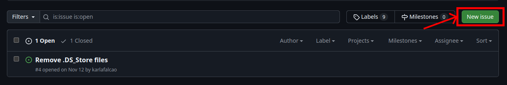

# How to Create an Issue

Issues are the best way to report bugs, request new features, or start a discussion around potential changes. Before creating a new issue, make sure to:
- Check if the issue already exists.
- Provide as much relevant detail as possible.

## Steps to Create an Issue

1. **Go to the "Issues" tab:**
   - Navigate to the original repository's GitHub page.
   - Click on the **"Issues"** tab at the top.

   

2. **Click on "New Issue":**
   - On the Issues page, select **"New Issue"**.

   

> [!IMPORTANT]
> Follow the instructions and use the correct template, as defined below.

3. **Use the Issue Template:**
   - We have an issue template that helps maintainers and contributors understand the context of the issue.
   - Fill out the necessary sections to detail the problem, environment, and steps to reproduce.

4. **Submit the Issue:**
   - Review your issue to ensure it is clear and thorough.
   - Click **"Submit new issue"**.

## Issue Template

Use the following template when creating a new issue:

```md
### Summary
<!-- Provide a concise description of the issue.
E.g., "Button fails to respond when clicked on mobile devices." -->

### Steps to Reproduce
<!-- List the steps to replicate the problem:
1. Go to the main page
2. Click the 'Submit' button
3. Observe the console error
-->

### Expected Result
<!-- What did you expect to happen?
E.g., "Button should trigger form submission and display success message." -->

### Actual Result
<!-- What actually happened?
E.g., "Clicking the button triggers no response and logs an error in the console." -->

### Environment
<!-- Provide details about the environment:
- Operating System: (e.g., Ubuntu 20.04)
- Browser/Node version: (e.g., Chrome 91, Node 14)
- Branch/Commit: (e.g., main branch at commit abc123)
-->

### Additional Information
<!-- Any additional details or context that might help in diagnosing the issue:
- Screenshots
- Relevant logs
- Any temporary workarounds
-->