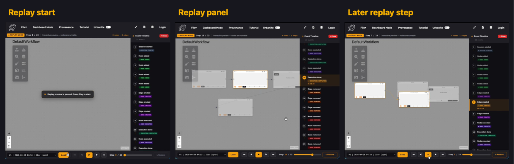
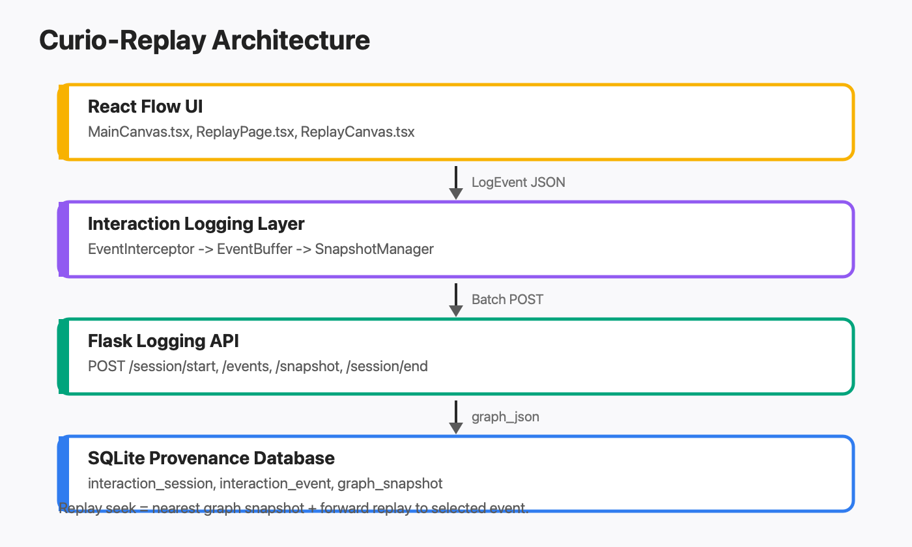

# Curio-Replay

Fine-grained interaction provenance and time-travel replay for Curio urban visual analytics workflows.

[](https://www.python.org/)
[](https://react.dev/)
[](https://www.typescriptlang.org/)
[](https://github.com/urban-toolkit/curio)

## Problem Statement

[Curio](https://github.com/urban-toolkit/curio) is a collaborative, dataflow-based framework for urban visual analytics. Curio records workflow-level provenance, but the final saved workflow does not fully explain the analyst's path: which nodes were added, connected, moved, executed, edited, or removed during exploration.

Curio-Replay adds interaction-level provenance and time-travel replay to Curio. It records fine-grained user actions in the visual workflow editor and reconstructs the workflow over time so analysts and collaborators can review, debug, and reproduce the exploration process.

| Problem | Impact |
|---|---|
| Lost interaction history | Intermediate workflow edits disappear once only the final state is saved. |
| Weak reproducibility | Collaborators cannot replay how a result was produced. |
| Hard debugging | It is difficult to identify which action introduced a broken or unexpected state. |

## Demo

### Video Walkthrough

[](https://youtu.be/o_u9zjbeAgc)

### Screenshots

Put the demo screenshots in `docs/assets/` with these exact filenames:

| File | What to put there |
|---|---|
| `docs/assets/teaser.png` | A 3-panel image: live canvas, replay panel open, and an earlier replay step. |
| `docs/assets/demo_thumbnail.png` | Screenshot from the best frame of the walkthrough video. |
| `docs/assets/architecture.png` | A diagram showing React UI -> logging layer -> Flask API -> SQLite provenance database. |
| `docs/assets/replay_panel.png` | Full-window replay screenshot with workflow nodes and the event timeline visible. |
| `docs/assets/event_timeline.png` | Cropped right-side event timeline with the active event highlighted. |
| `docs/assets/toolbar.png` | Cropped bottom replay toolbar with session selector, play controls, seek slider, and restore button. |
| `docs/assets/overhead_plot.png` | Evaluation plot generated from event-capture latency measurements. |

After adding the files, these images will render in the GitHub README:






## Dataset Access

No large external dataset is required to run the replay system. The main dataset is the interaction log generated while a user edits a Curio workflow.

Curio-Replay stores generated session data in Curio's local SQLite provenance database:

```text
.curio/provenance.db
```

The replay extension uses three interaction-provenance tables:

| Table | Purpose |
|---|---|
| `interaction_session` | Stores one row per analyst session. |
| `interaction_event` | Stores timestamped node, edge, parameter, and execution events. |
| `graph_snapshot` | Stores full graph snapshots used to make replay seeking efficient. |

If an external urban dataset is used for the final evaluation and cannot be redistributed, document it here:

```text
Dataset name: REPLACE_WITH_DATASET_NAME
Access URL: REPLACE_WITH_OFFICIAL_DOWNLOAD_OR_REQUEST_URL
License/terms: REPLACE_WITH_LICENSE_OR_TERMS
Local raw-data path: data/raw/
Processed sample path: data/sample/
```

If redistribution is allowed, place a small sample in `data/sample/` and include the processing script that recreates the processed data from the raw source.

## Setup

### Prerequisites

- Python 3.11+
- Node.js 18+
- npm 9+
- macOS, Linux, or Windows with WSL2

### Clone

```bash
git clone https://github.com/eaguilar02/curio.git
cd curio
```

### Python Environment

```bash
python3 -m venv venv
source venv/bin/activate
pip install -r requirements.txt
```

### Frontend Dependencies

```bash
cd utk_curio/frontend/urban-workflows
npm install
cd ../../..
```

Pinned dependency files:

| Ecosystem | File |
|---|---|
| Python | `requirements.txt` |
| JavaScript/TypeScript | `utk_curio/frontend/urban-workflows/package-lock.json` |

## How to Run

Start Curio from the repository root:

```bash
source venv/bin/activate
python curio.py start
```

Open:

```text
http://localhost:8080
```

Services:

| Service | URL |
|---|---|
| React frontend | `http://localhost:8080` |
| Flask backend | `http://localhost:5002` |
| Python sandbox | `http://localhost:2000` |

Stop the app:

```bash
python curio.py stop
```

## How to Reproduce Key Results

All evaluation scripts and outputs should live under:

```text
evaluation/
```

Use this workflow:

1. Start Curio.
2. Create or load a workflow.
3. Perform a replay session by adding nodes, connecting edges, changing parameters, executing nodes, and opening Replay.
4. Save or export the recorded session from `.curio/provenance.db`.
5. Run the evaluation scripts below.
6. Save logs, CSV files, configs, and plots under `evaluation/sample_sessions/results/`.

### Replay Fidelity

Goal: verify that replay reconstructs the same final graph state as the original session.

```bash
python evaluation/check_fidelity.py
```

Expected output:

```text
evaluation/sample_sessions/results/fidelity_log.txt
```

Report:

- number of sessions tested
- number of events per session
- replay load time
- final graph equality pass/fail

### Event Capture Overhead

Goal: measure event logging overhead.

1. Start Curio.
2. Open the browser console.
3. Run `evaluation/run_synthetic_events.js`.
4. Save the CSV output as:

```text
evaluation/sample_sessions/results/latency.csv
```

Generate the plot:

```bash
python evaluation/plot_overhead.py
```

Expected plot:

```text
docs/assets/overhead_plot.png
```

### Scalability

Goal: measure event counts, snapshot counts, snapshot sizes, and replay seek time after a larger stress-test session.

```bash
python evaluation/check_scalability.py
```

Expected output:

```text
evaluation/sample_sessions/results/scalability_log.txt
```

## Results Artifacts

Use this results layout:

```text
evaluation/
├── README.md
├── check_fidelity.py
├── check_scalability.py
├── load_sample_session.py
├── plot_overhead.py
├── run_synthetic_events.js
└── results/
    ├── fidelity_log.txt
    ├── scalability_log.txt
    ├── latency.csv
    ├── evaluation_config.json
    └── sample_session.json
```

Artifact provenance:

| Artifact | Produced by |
|---|---|
| `fidelity_log.txt` | `python evaluation/check_fidelity.py` |
| `scalability_log.txt` | `python evaluation/check_scalability.py` |
| `latency.csv` | Browser console run of `run_synthetic_events.js` |
| `overhead_plot.png` | `python evaluation/plot_overhead.py` |
| `sample_session.json` | Export from `.curio/provenance.db` using `load_sample_session.py` or an export helper. |

## Project Structure

```text
curio/
├── README.md
├── requirements.txt
├── docs/
│   └── assets/
│       ├── teaser.png
│       ├── demo_thumbnail.png
│       ├── architecture.png
│       ├── replay_panel.png
│       ├── event_timeline.png
│       ├── toolbar.png
│       └── overhead_plot.png
├── evaluation/
│   ├── README.md
│   ├── check_fidelity.py
│   ├── check_scalability.py
│   ├── load_sample_session.py
│   ├── plot_overhead.py
│   ├── run_synthetic_events.js
│   └── sample_sessions/
│       └── results/
├── utk_curio/
│   ├── backend/
│   │   ├── db_migration.py
│   │   └── app/api/logging_routes.py
│   └── frontend/
│       └── urban-workflows/
│           ├── package.json
│           ├── package-lock.json
│           └── src/
│               ├── logging/
│               ├── replay/
│               └── components/replay/
└── tests/
```

## Key Modules

| Module | Role |
|---|---|
| `utk_curio/backend/db_migration.py` | Creates or updates the SQLite tables used for interaction provenance. |
| `utk_curio/backend/app/api/logging_routes.py` | Backend API routes for session lifecycle, event logging, and graph snapshots. |
| `utk_curio/frontend/urban-workflows/src/logging/LoggingContext.tsx` | Manages the frontend logging session lifecycle. |
| `utk_curio/frontend/urban-workflows/src/logging/EventBuffer.ts` | Buffers and batches captured interaction events. |
| `utk_curio/frontend/urban-workflows/src/logging/EventInterceptor.ts` | Central capture point for user interaction events. |
| `utk_curio/frontend/urban-workflows/src/logging/SnapshotManager.ts` | Stores periodic graph snapshots for efficient replay. |
| `utk_curio/frontend/urban-workflows/src/replay/ReplayEngine.ts` | Reconstructs graph state from events and snapshots. |
| `utk_curio/frontend/urban-workflows/src/components/replay/ReplayPage.tsx` | Replay page wrapper and session-loading UI. |
| `utk_curio/frontend/urban-workflows/src/components/replay/ReplayCanvas.tsx` | Read-only replay canvas and event timeline. |
| `utk_curio/frontend/urban-workflows/src/components/replay/ReplayControls.tsx` | Playback buttons, seek slider, step counter, and restore control. |

## Final Checklist

- Replace dataset placeholders if an external dataset is used.
- Add screenshots to `docs/assets/` using the exact filenames listed above.
- Complete the evaluation scripts in `evaluation/`.
- Save evaluation logs and CSV files under `evaluation/sample_sessions/results/`.
- Generate `docs/assets/overhead_plot.png` from `latency.csv`.
- Verify setup from a fresh clone.
- Commit `README.md`, `requirements.txt`, `utk_curio/frontend/urban-workflows/package-lock.json`, demo assets, and evaluation artifacts.

## Citation

This project builds on Curio:

```bibtex
@ARTICLE{moreira2025curio,
  author={Moreira, Gustavo and Hosseini, Maryam and Veiga, Carolina and Alexandre, Lucas and Colaninno, Nicola and de Oliveira, Daniel and Ferreira, Nivan and Lage, Marcos and Miranda, Fabio},
  journal={IEEE Transactions on Visualization and Computer Graphics},
  title={Curio: A Dataflow-Based Framework for Collaborative Urban Visual Analytics},
  year={2025},
  volume={31},
  number={1},
  pages={1224-1234},
  doi={10.1109/TVCG.2024.3456353}
}
```
