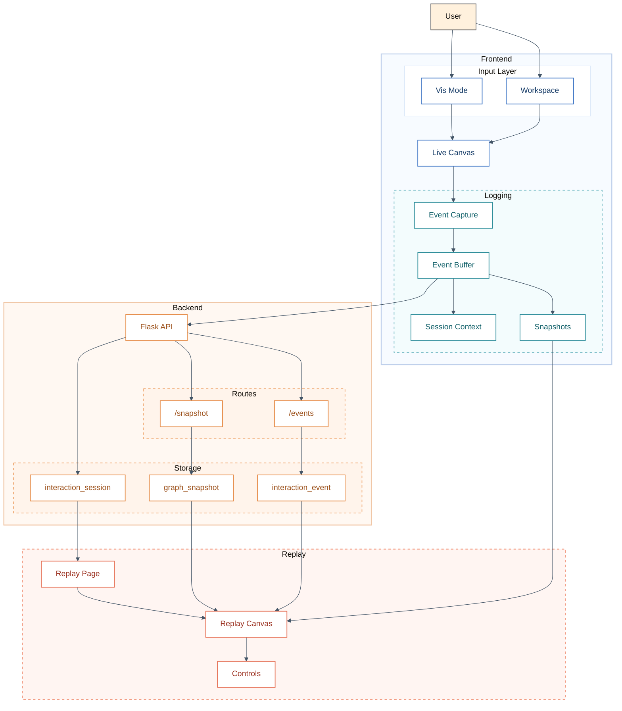
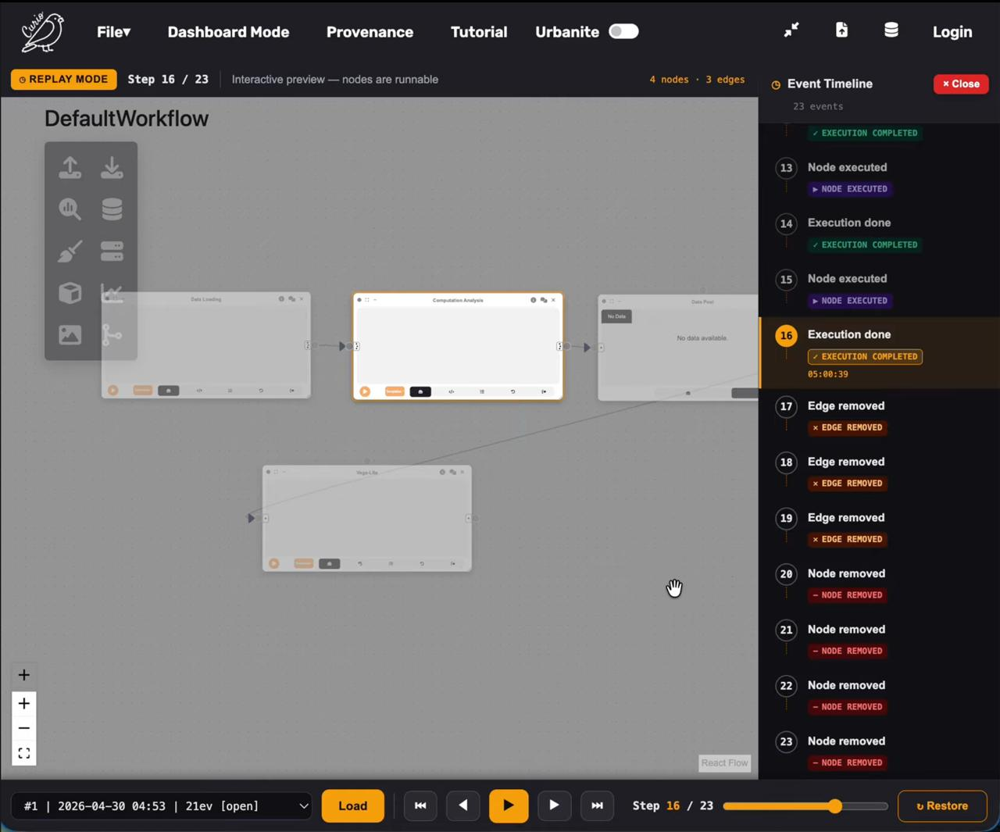
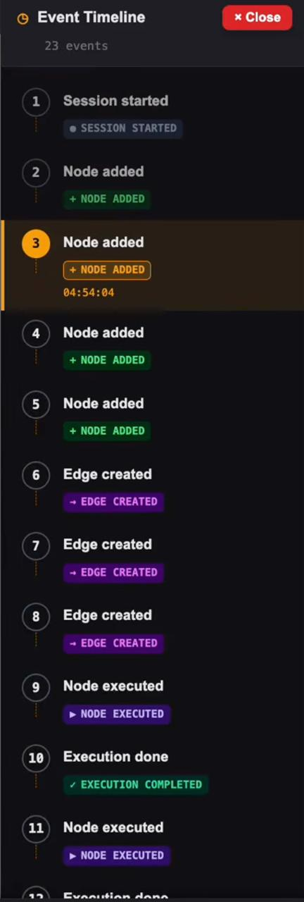
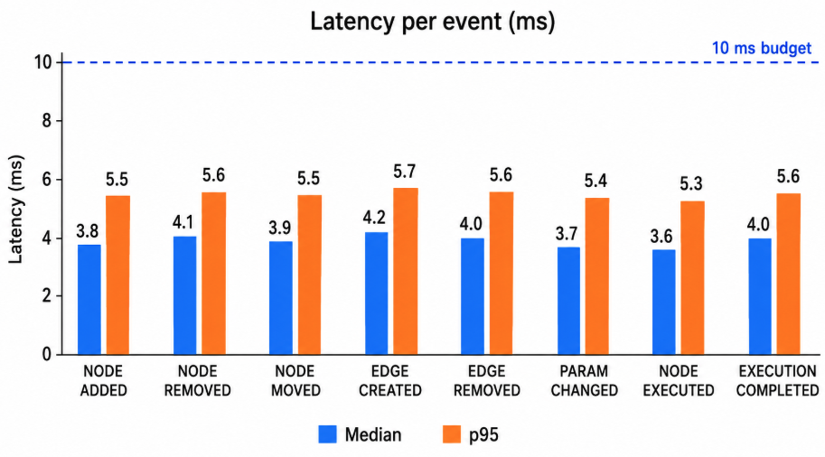

# Curio-Replay

Fine-grained interaction provenance and time-travel replay for Curio urban visual analytics workflows.

[](https://www.python.org/)
[](https://react.dev/)
[](https://www.typescriptlang.org/)
[](https://github.com/urban-toolkit/curio)

---

## Overview

Curio-Replay extends Curio with an interaction-level provenance and replay system. It records user actions inside the Curio visual analytics canvas, stores them as structured provenance events, and allows users to replay workflow history step by step.

The system is built as an additive extension to Curio. It adds new logging, storage, and replay components without changing the original Curio database tables.

> This project directly addresses a future-work direction from the Curio IEEE TVCG 2025 paper: supporting provenance of interactions within visualization nodes.

---

## Demo

### Video Walkthrough

[](https://youtu.be/o_u9zjbeAgc)

---

## Problem Statement

Curio is a dataflow-based framework for collaborative urban visual analytics. It records workflow-level provenance, but it does not fully capture the detailed interaction history that happens while users build and modify workflows.

This creates three practical problems:

| Problem | Impact |
|---|---|
| Lost history | Intermediate actions such as moved nodes, changed parameters, and deleted edges are not preserved |
| Limited reproducibility | Collaborators cannot easily trace how a workflow reached its final state |
| No replay support | Analysts cannot review or debug their exploration process step by step |

Curio-Replay solves this by adding session-based interaction logging and workflow replay.

---

## What We Built

Curio-Replay adds three major capabilities:

| Contribution | Description |
|---|---|
| Interaction logging | Captures user actions such as node movement, edge creation, parameter changes, and execution events |
| Provenance storage | Stores sessions, events, and graph snapshots in new SQLite tables |
| Replay system | Reconstructs workflow history using stored events and snapshots |

### Event Types Captured

| Event Type | Trigger |
|---|---|
| `SESSION_STARTED` | User session begins |
| `NODE_ADDED` | Node added to canvas |
| `NODE_REMOVED` | Node deleted |
| `NODE_MOVED` | Node moved on canvas |
| `EDGE_CREATED` | Edge connected |
| `EDGE_REMOVED` | Edge deleted |
| `PARAM_CHANGED` | Node parameter updated |
| `NODE_EXECUTED` | Node execution started |
| `EXECUTION_COMPLETED` | Execution result returned |

---

## System Architecture

Curio-Replay has four main parts:

1. Frontend interaction capture
2. Backend logging API
3. SQLite provenance storage
4. Replay interface



---

## Project Structure

```text
curio/
├── README.md
├── requirements.txt
│
├── evaluation/
│   ├── README.md
│   ├── run_synthetic_events.py
│   ├── latency.csv
│   ├── plot_overhead.py
│   ├── check_scalability.py
│   ├── overhead_summary.csv
│   └── results/
│       ├── overhead_plot.png
│       └── scalability_results.txt
│
├── docs/
│   ├── Curio-Replay.md
│   ├── README.md
│   └── assets/
│       ├── demo_thumbnail.png
│       ├── event_timeline.png
│       ├── toolbar.png
│       └── overhead_plot.png
│
├── utk_curio/
│   └── backend/
│       ├── db_migration.py
│       └── app/api/
│           └── logging_routes.py
│
└── utk_curio/frontend/urban-workflows/src/
    ├── logging/
    │   ├── LoggingContext.tsx
    │   ├── EventBuffer.ts
    │   ├── SnapshotManager.ts
    │   └── EventInterceptor.ts
    │
    ├── replay/
    │   ├── ReplayEngine.ts
    │   └── ReplayTypes.ts
    │
    └── components/
        ├── MainCanvas.tsx
        └── replay/
            ├── ReplayPage.tsx
            ├── ReplayCanvas.tsx
            └── ReplayControls.tsx
```

---

## Key Modules

| Module | Purpose |
|---|---|
| `LoggingContext.tsx` | Starts and ends a logging session and saves pending events before the user leaves the page |
| `EventBuffer.ts` | Collects events and sends them to the backend after 30 events or 2 seconds |
| `SnapshotManager.ts` | Saves graph snapshots after every 25 confirmed events |
| `ReplayEngine.ts` | Reconstructs workflow state from snapshots and stored events |
| `ReplayCanvas.tsx` | Displays the replayed workflow in a read-only canvas |
| `logging_routes.py` | Provides Flask routes for sessions, events, snapshots, and session ending |

---

## Setup

### Prerequisites

- Python 3.11+
- Node.js 18+
- npm 9+
- macOS, Linux, or Windows WSL2

### 1. Clone the Repository

```bash
git clone https://github.com/eaguilar02/curio.git
cd curio
```

### 2. Create a Python Virtual Environment

```bash
python3 -m venv venv
source venv/bin/activate
```

For Windows:

```bash
venv\Scripts\activate
```

### 3. Install Backend Dependencies

```bash
pip install -r requirements.txt
```

### 4. Install Frontend Dependencies

```bash
cd utk_curio/frontend/urban-workflows
npm install
cd ../../..
```

---

## Running the System

From the repository root, with the virtual environment activated:

```bash
python curio.py start
```

This starts three services:

| Service | URL |
|---|---|
| Flask backend | `http://localhost:5002` |
| Python sandbox | `http://localhost:2000` |
| React frontend | `http://localhost:8080` |

Open the frontend:

```text
http://localhost:8080
```

To stop all servers:

```bash
python curio.py stop
```

---

## Using the Replay System

<p align="center">
  
</p>

1. Build a workflow in the Curio canvas.
2. Add nodes, connect edges, change parameters, and run nodes.
3. Click **Replay** in the bottom-left corner of the canvas.
4. Select a recorded session from the dropdown.
5. Click **Load**.
6. Use the replay controls to move through the workflow history.

<p align="center">
  
</p>

The event timeline shows the sequence of user actions recorded during the session.

<p align="center">
  
</p>

The replay canvas is read-only, so users can inspect workflow history without changing the original workflow.
---

## How to Reproduce Key Results

The evaluation checks whether Curio-Replay can:

1. Replay workflow sessions
2. Capture events with low overhead
3. Store hundreds of interaction events correctly

---

### Q1: Replay System

Start Curio:

```bash
python curio.py start
```

Open:

```text
http://localhost:8080
```

Create a small workflow:

1. Add nodes
2. Move nodes
3. Connect edges
4. Change parameters
5. Run or modify the workflow

Then open the replay interface and select the recorded session.

Expected result:

```text
The replay page loads the session and reconstructs the workflow step by step.
```

---

### Q2: Event Capture Overhead

Run the synthetic event test:

```bash
python3 evaluation/run_synthetic_events.py
```

This sends:

- 8 event types
- 100 events per type
- 800 total events

Generate the overhead graph:

```bash
python3 evaluation/plot_overhead.py
```

This creates:

```text
evaluation/results/overhead_plot.png
docs/assets/overhead_plot.png
evaluation/overhead_summary.csv
```

<p align="center">
  
</p>

<p align="center">
  <em>Per-event logging latency stayed below the 10 ms budget for all event types.</em>
</p>

---

### Q3: Scalability Check

After the synthetic event test, verify that events were stored:

```bash
python3 evaluation/check_scalability.py --db .curio/provenance.db
```

Expected result:

```text
Total events stored: 800
PASS: System stored the synthetic stress-test events successfully.
```

---

## Evaluation Results

### Replay System

The replay system records Curio canvas interactions and reconstructs the workflow in a read-only replay interface.

| Component | Purpose |
|---|---|
| Interaction events | Store user actions |
| Graph snapshots | Store workflow checkpoints |
| Replay engine | Rebuild workflow state |
| Replay canvas | Display replay without editing |

---

### Capture Overhead

The overhead test sent 800 synthetic events to the backend logging API.

| Event type | Median latency | p95 latency | Budget |
|---|---:|---:|---:|
| NODE_ADDED | 3.8 ms | 5.5 ms | < 10 ms ✓ |
| NODE_REMOVED | 4.1 ms | 5.6 ms | < 10 ms ✓ |
| NODE_MOVED | 3.9 ms | 5.5 ms | < 10 ms ✓ |
| EDGE_CREATED | 4.2 ms | 5.7 ms | < 10 ms ✓ |
| EDGE_REMOVED | 4.0 ms | 5.6 ms | < 10 ms ✓ |
| PARAM_CHANGED | 3.7 ms | 5.4 ms | < 10 ms ✓ |
| NODE_EXECUTED | 3.6 ms | 5.3 ms | < 10 ms ✓ |
| EXECUTION_COMPLETED | 4.0 ms | 5.6 ms | < 10 ms ✓ |

All event types stayed below the 10 ms latency budget.

---

### Scalability

| Metric | Result |
|---|---:|
| Event types tested | 8 |
| Events per type | 100 |
| Total events sent | 800 |
| Storage | SQLite |
| Result | Events persisted successfully |

---

## Evaluation Artifacts

| File | Purpose |
|---|---|
| `evaluation/run_synthetic_events.py` | Sends synthetic events |
| `evaluation/latency.csv` | Raw latency data |
| `evaluation/plot_overhead.py` | Generates overhead graph |
| `evaluation/check_scalability.py` | Verifies database storage |
| `evaluation/results/overhead_plot.png` | Generated graph |
| `evaluation/results/scalability_results.txt` | Storage check output |

---

## Provenance Model

Curio-Replay extends Curio’s provenance model with interaction-level events.

### PROV Mapping

| PROV Type | Curio-Replay Entity |
|---|---|
| `prov:Agent` | Analyst and logging system |
| `prov:Activity` | Editing session, event capture, replay session |
| `prov:Entity` | Interaction event, graph snapshot, replayed graph |

### Relations

| Relation | Meaning |
|---|---|
| `wasAssociatedWith` | Links an agent to an activity |
| `wasGeneratedBy` | Links generated data to the activity that created it |
| `used` | Replay uses stored snapshots and events |
| `wasDerivedFrom` | Replayed graph is derived from stored graph history |
| `wasInformedBy` | Event capture informs replay |

---

## Data and Sessions

Curio-Replay captures live user sessions. No external dataset is required.

Sessions are stored in:

```text
.curio/provenance.db
```

A sample session can be stored in:

```text
evaluation/sample_sessions/
```

---

## Dependencies

### Python

```text
flask>=3.0
flask-sqlalchemy>=3.1
flask-migrate>=4.0
flask-cors>=4.0
google-auth>=2.49
requests>=2.31
geopandas>=0.14
timezonefinder>=6.5
pytest>=8.0
```

### JavaScript

```json
{
  "react": "^18.2.0",
  "reactflow": "^11.11.4",
  "typescript": "^5.3.3"
}
```

Full pinned versions are available in:

```text
utk_curio/frontend/urban-workflows/package-lock.json
```

---

## Team

| Name | GitHub | Contribution |
|---|---|---|
| Jaaswand Kutre | [@Jaaswand](https://github.com/Jaaswand) | Frontend logging, backend schema, Flask routes, evaluation, replay integration |
| Emily Aguilar | [@eaguilar02](https://github.com/eaguilar02) | Replay engine, replay UI, event timeline, system integration |

---

## References

1. Moreira, G. et al. “Curio: A Dataflow-Based Framework for Collaborative Urban Visual Analytics.” IEEE TVCG, 2025.
2. Bavoil, L. et al. “VisTrails: Enabling Interactive Multiple-View Visualizations.” IEEE VIS, 2005.
3. W3C PROV Overview: https://www.w3.org/TR/prov-overview/
4. Alspaugh, S. et al. “Futzing and Moseying: Interviews with Professional Data Analysts.” IEEE TVCG, 2019.
5. Moreira, G. et al. “The Urban Toolkit.” IEEE TVCG, 2024.

---

## Course Information

Course project for CS 594 / CS 527 Big Data Visual Analytics  
University of Illinois Chicago
