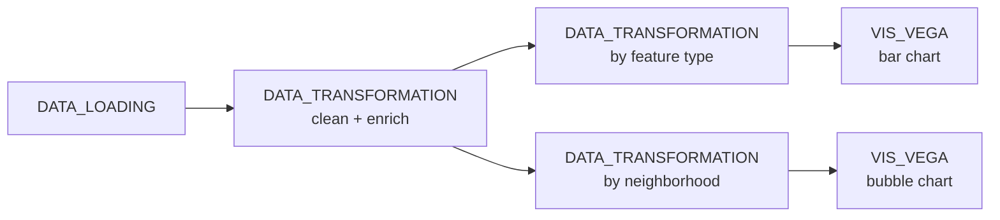

# Example: Multiple Vega-Lite views from chained transforms

This example demonstrates how a single `DATA_LOADING` source can be cleaned once, then forked into two parallel `DATA_TRANSFORMATION` nodes that feed two independent Vega-Lite views. The use case is sidewalk accessibility data from [Project Sidewalk](https://sidewalk-chicago.cs.washington.edu/api): we load a GeoJSON of labelled accessibility issues, derive an agreement ratio + severity tier, then summarise the data both *by feature type* (bar chart) and *by neighborhood* (bubble chart).

## Pipeline overview



## Data

[04-labels.json.zip](data/04-labels.json.zip) — Project Sidewalk's labelled accessibility features export (originally from [the Project Sidewalk API](https://sidewalk-chicago.cs.washington.edu/api)).

Paths in the code below are relative to the directory you launched Curio from — run `curio start` from the repo root.

## Step 1: Load the accessibility GeoJSON (`DATA_LOADING`)

Read the zipped GeoJSON straight into a `GeoDataFrame`. The `metadata.name` keeps the table name stable downstream.

```python
import geopandas as gpd

gdf = gpd.read_file('zip://docs/examples/data/04-labels.json.zip!04-labels.json')

gdf.metadata = {
    'name': 'accessibility_features'
}

return gdf
```

## Step 2: Clean and enrich (`DATA_TRANSFORMATION`)

This single transform is the shared root for both downstream branches. It selects the relevant columns, derives an `agreement_ratio` from the agree / disagree counts, bins `severity` into a four-level ordinal `severity_level`, and ensures the GeoDataFrame is in EPSG:4326 so any later spatial step has a known CRS.

```python
import pandas as pd
import geopandas as gpd
import numpy as np

gdf = arg

processed_gdf = gdf[['label_type', 'severity', 'neighborhood', 'geometry', 'agree_count', 'disagree_count']]

processed_gdf['agreement_ratio'] = processed_gdf['agree_count'] / (processed_gdf['agree_count'] + processed_gdf['disagree_count'])

severity_bins = [0, 1, 2, 3, 5]
severity_labels = ['Low', 'Medium', 'High', 'Critical']
processed_gdf['severity_level'] = pd.cut(
    processed_gdf['severity'],
    bins=severity_bins,
    labels=severity_labels,
    include_lowest=True
)

if processed_gdf.crs is None:
    processed_gdf = processed_gdf.set_crs("EPSG:4326")
else:
    processed_gdf = processed_gdf.to_crs("EPSG:4326")

processed_gdf['thematic'] = processed_gdf['severity']

processed_gdf.metadata = {
    'name': 'accessibility_analysis'
}

return processed_gdf
```

## Step 3: Aggregate by feature type (`DATA_TRANSFORMATION`)

The first branch groups the cleaned features by `label_type` and computes the count, mean severity, and mean agreement per group. The output table is named `feature_stats` so the Vega-Lite spec can reference it by name.

```python
import pandas as pd
import numpy as np

gdf = arg

feature_stats = gdf.groupby('label_type').agg(
    count=('label_type', 'count'),
    avg_severity=('severity', 'mean'),
    avg_agreement=('agreement_ratio', 'mean')
).reset_index()

feature_stats = feature_stats.fillna(0)

for col in ['avg_severity', 'avg_agreement']:
    feature_stats[col] = feature_stats[col].astype(float)

feature_stats.metadata = {
    'name': 'feature_stats'
}

return feature_stats
```

## Step 4: Aggregate by neighborhood (`DATA_TRANSFORMATION`)

The second branch is structurally identical to Step 3, but groups by `neighborhood`. Keeping the two aggregations as separate nodes (rather than computing both inside one node and unpacking downstream) lets each Vega-Lite view declare a clean named source and makes the fork explicit on the canvas.

```python
import pandas as pd
import numpy as np

gdf = arg

neighborhood_stats = gdf.groupby('neighborhood').agg(
    count=('label_type', 'count'),
    avg_severity=('severity', 'mean'),
    avg_agreement=('agreement_ratio', 'mean')
).reset_index()

neighborhood_stats = neighborhood_stats.fillna(0)

for col in ['avg_severity', 'avg_agreement']:
    neighborhood_stats[col] = neighborhood_stats[col].astype(float)

neighborhood_stats.metadata = {
    'name': 'neighborhood_stats'
}

return neighborhood_stats
```

## Step 5: Bar chart by feature type (`VIS_VEGA`)

Bars encode the issue count per feature type, coloured by mean severity. The data source name (`feature_stats`) matches the upstream metadata so Curio routes the table automatically.

```json
{
  "$schema": "https://vega.github.io/schema/vega-lite/v6.json",
  "data": {"name": "feature_stats"},
  "mark": "bar",
  "encoding": {
    "x": {"field": "label_type", "type": "nominal", "title": "Feature Type"},
    "y": {"field": "count", "type": "quantitative", "title": "Number of Features"},
    "color": {
      "field": "avg_severity",
      "type": "quantitative",
      "title": "Average Severity",
      "scale": {"scheme": "viridis"}
    },
    "tooltip": [
      {"field": "label_type", "type": "nominal", "title": "Feature Type"},
      {"field": "count", "type": "quantitative", "title": "Count"},
      {"field": "avg_severity", "type": "quantitative", "title": "Avg Severity", "format": ".2f"},
      {"field": "avg_agreement", "type": "quantitative", "title": "Avg Agreement", "format": ".2f"}
    ]
  }
}
```

## Step 6: Bubble chart by neighborhood (`VIS_VEGA`)

Neighborhoods sit on the y-axis (sorted by count, descending) so the long category labels read horizontally without crowding. Circles are sized by count and coloured by mean severity, so neighborhoods with many high-severity issues pop visually.

```json
{
  "$schema": "https://vega.github.io/schema/vega-lite/v6.json",
  "height": {"step": 14},
  "data": {"name": "neighborhood_stats"},
  "mark": "circle",
  "encoding": {
    "x": {"field": "count", "type": "quantitative", "title": "Number of Features"},
    "y": {"field": "neighborhood", "type": "nominal", "sort": "-x", "title": "Neighborhood",
          "axis": {"labelLimit": 200}},
    "size": {
      "field": "count",
      "type": "quantitative",
      "title": "Number of Features",
      "scale": {"range": [50, 500]}
    },
    "color": {
      "field": "avg_severity",
      "type": "quantitative",
      "title": "Average Severity",
      "scale": {"scheme": "viridis"}
    },
    "tooltip": [
      {"field": "neighborhood", "type": "nominal", "title": "Neighborhood"},
      {"field": "count", "type": "quantitative", "title": "Count"},
      {"field": "avg_severity", "type": "quantitative", "title": "Avg Severity", "format": ".2f"},
      {"field": "avg_agreement", "type": "quantitative", "title": "Avg Agreement", "format": ".2f"}
    ]
  }
}
```

## Final result

The two views read from the same cleaned root but answer different questions: the bar chart calls out which kinds of accessibility issues dominate citywide, while the bubble chart points to the neighborhoods carrying the worst combination of count and severity. Adding more aggregation branches (e.g. by month, by survey wave) is just one more `DATA_TRANSFORMATION` + `VIS_VEGA` pair off the same root.
