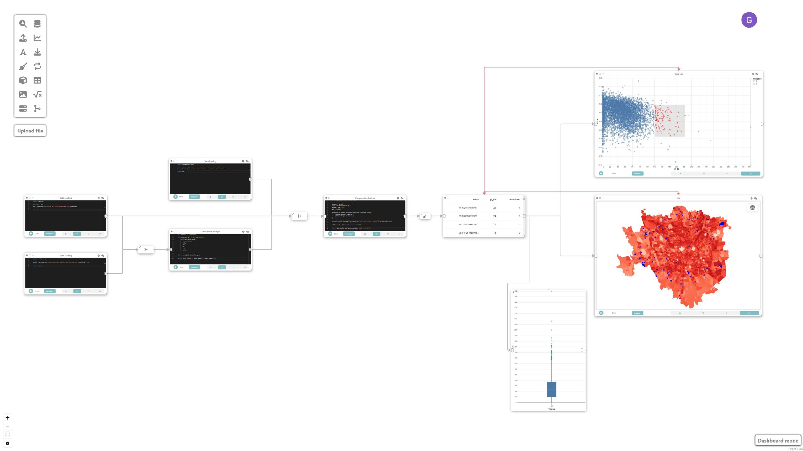
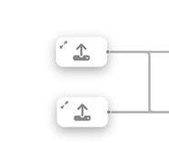
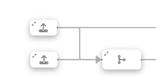
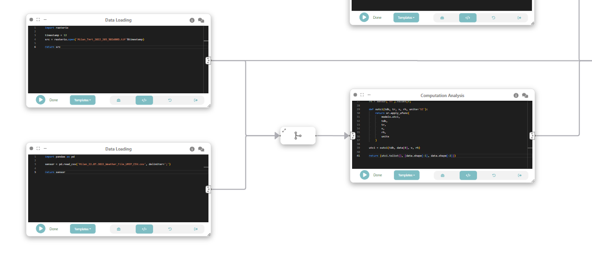
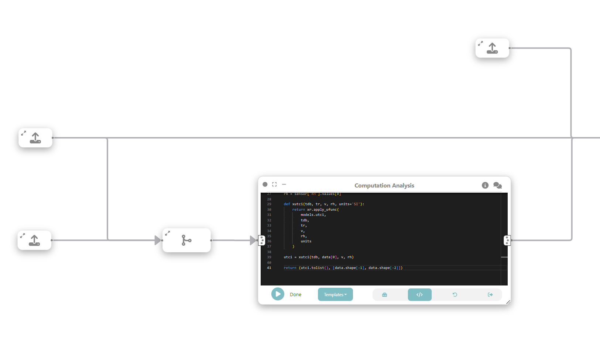
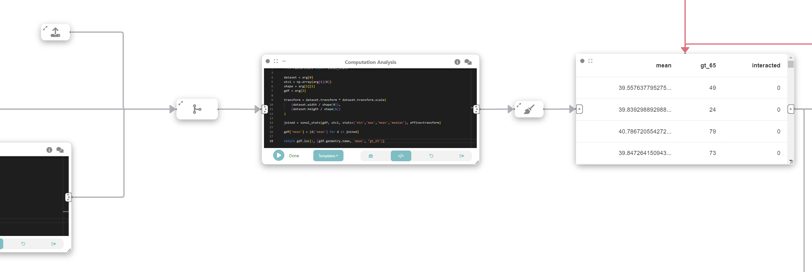
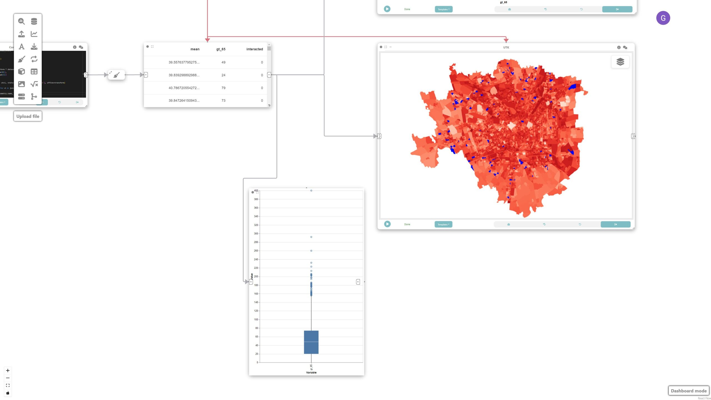
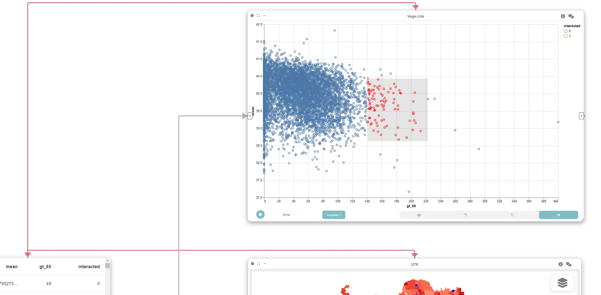
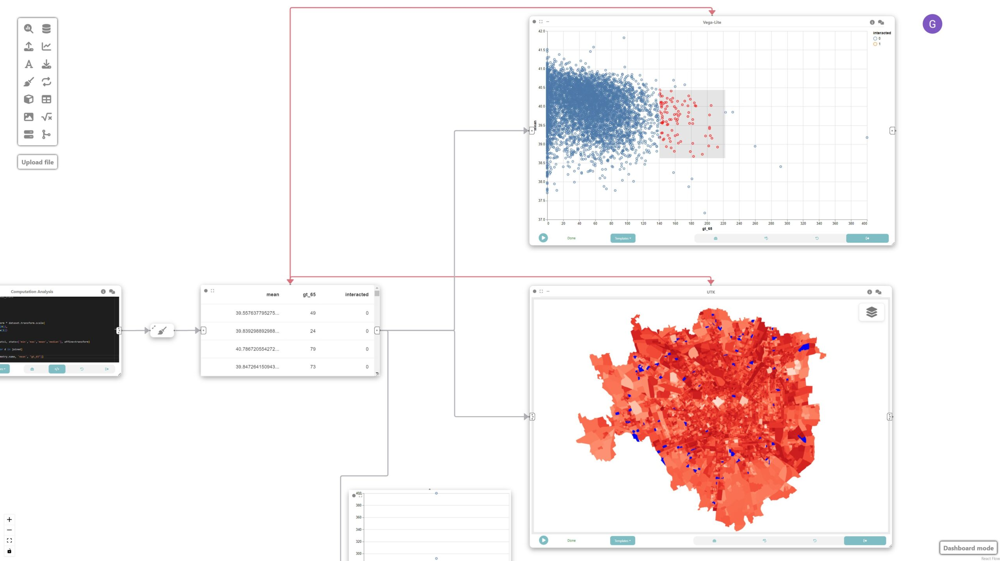

# Example: Visual analytics of heterogeneous data

In this example, we will explore how Curio can facilitate visual 
analytics of heterogeneous data by integrating various data sources such
 as raster data, sensor data, and geospatial data to analyze and 
visualize urban microclimate in Milan. Here is the overview of the 
entire dataflow pipeline:



Before you begin, please familiarize yourself with Curio’s main concepts and functionalities by reading our [usage guide](https://github.com/urban-toolkit/curio/blob/main/docs/USAGE.md).

The data for this tutorial can be found [here](https://drive.google.com/drive/folders/1-cncKF-omB0av98WzKApKtyJTrgvfa0P?usp=sharing). All file paths assume the data folder was unzipped into the same directory you’re running Curio from.

For completeness, we also include the template code in each dataflow step.

This example uses the following libraries:

```bash
pip install xarray==2025.6.1 pythermalcomfort==3.6.1 rasterstats==0.20.0
```

## Step 1: **Load high-resolution mean radiant temperature data**

The icons on the left-hand side can be used to instantiate different 
nodes, including data loading nodes. Let’s start by instantiating a data
 loading node and changing its view to Code. Then, we load the 
high-resolution mean radiant temperature data:

```python
import rasterio
timestamp = 12
src = rasterio.open(f'Milan_Tmrt_2022_203_{timestamp:02d}00D.tif')

return src
```


## Step 2: Loading meteorological data

Using a Data loading /  file node, we load air temperature (Td), wind
 speed (Wind) and relative humidity (RH) data from ERA5 hourly 
meteorological dataset.

```python
import pandas as pd
sensor = pd.read_csv('Milan_22.07.2022_Weather_File_UMEP_CSV.csv', delimiter=';')
return sensor
```



## Step 2.5: Merging raster and meteorological data

As an intermediate step, let’s merge the dataflow from Step 1 and 2.



## Step 3: Compute universal thermal climate index (UTCI)

In this step, we want to compute Universal Thermal Climate Index (UTCI)), a human biometeorology parameter to assess human well-being in the outdoor environment. The UTCI computation takes raster data as input, processes it, and produces another raster dataset as output. This output contains the UTCI values for each corresponding location in the grid.

To do that, we connect the loaded data (raster and tabular) with a custom analysis & modeling node that computes the UTCI.


```python
# Step 4 — Compute UTCI (replace entire cell)

import numpy as np
from pythermalcomfort import models
from rasterio.warp import Resampling


src = arg[0]
sensor = arg[1]

timestamp = 12

upscale_factor = 0.25
dataset = src
data = dataset.read(
    out_shape=(
        dataset.count,
        int(dataset.height * upscale_factor),
        int(dataset.width * upscale_factor),
    ),
    resampling=Resampling.nearest,
    masked=True,
)
data = data.astype(float)
data.data[data.data == src.nodatavals[0]] = np.nan

sensor_filtered = sensor[sensor["it"] == timestamp]
tdb = float(sensor_filtered["Td"].values[0])
v = float(sensor_filtered["Wind"].values[0])
rh = float(sensor_filtered["RH"].values[0])

# pythermalcomfort returns a UTCI result object; extract numeric grid explicitly
utci_result = models.utci(tdb=tdb, tr=data[0], v=v, rh=rh, units="SI")
utci_grid = np.asarray(getattr(utci_result, "utci", utci_result), dtype=float)

# Ensure 2D array for rasterstats
if utci_grid.ndim == 3 and utci_grid.shape[0] == 1:
    utci_grid = utci_grid[0]
if utci_grid.ndim != 2:
    raise ValueError(f"UTCI must be 2D, got shape={utci_grid.shape}, ndim={utci_grid.ndim}")

utci_list = utci_grid.tolist()
utci_shape = [utci_grid.shape[1], utci_grid.shape[0]]  # [width, height]

return (utci_list, utci_shape)
```

## Step 4: Loading sociodemographic data

To study the relationship between UTCI and vulnerable populations, we create a new data node that loads sociodemographic data for populations older than 65 at neighborhood level.



```python
import geopandas as gpd
gdf = gpd.read_file('R03_21-11_WGS84_P_SocioDemographics_MILANO_Selected.shp')
return gdf
```

## Step 5: Merge data

Now, we want to spatially join the UTCI data in the raster format with the socio-demographic data loaded in the previous step. To do that, we create another analysis & modeling node, and run the following:



```python
# Step 5 — Zonal Statistics

from rasterstats import zonal_stats
import numpy as np

dataset = arg[0]
utci_list = arg[1][0]
utci_shape = arg[1][1]
gdf = arg[2]

utci = np.asarray(utci_list, dtype=float)
shape = utci_shape

transform = dataset.transform * dataset.transform.scale(
    (dataset.width / shape[0]),
    (dataset.height / shape[1]),
)

# Avoid nodata warning and make nodata explicit
nodata_value = -999.0
utci_for_stats = np.where(np.isnan(utci), nodata_value, utci)

joined = zonal_stats(
    gdf,
    utci_for_stats,
    stats=["min", "max", "mean", "median"],
    affine=transform,
    nodata=nodata_value,
)

gdf["mean"] = [d["mean"] for d in joined]
result = gdf.loc[:, [gdf.geometry.name, "mean", "gt_65"]]


return result
```

We then filter the resulting gdf to only those with mean UTCI higher than zero. Let’s create a new data cleaning node connected to the previous node and store the result on a data node:

```python
import geopandas as gpd

gdf = arg

filtered_gdf = gdf.set_crs(32632)
filtered_gdf = filtered_gdf.to_crs(3395)

filtered_gdf = filtered_gdf[filtered_gdf['mean']>0]

filtered_gdf.metadata = {
   'name': 'census'
}

return filtered_gdf
```

## Step 6: Create a map visualization

We can visualize the result of the previous operations by adding a UTK map. The grammar for the map is automatically populated once it receives an input from a previous box.



## Step 7: Create a linked scatterplot

In this step, we create a linked scatterplot through a Vega-Lite node connected to the output of the data node in Step 5.



```json
{
 "$schema": "https://vega.github.io/schema/vega-lite/v5.json",
 "params": [
   {"name": "clickSelect", "select": "interval"}
 ],
 "mark": {
   "type": "point",
   "cursor": "pointer"
 },
 "encoding": {
   "x": {"field": "gt_65", "type": "quantitative"},
   "y": {"field": "mean", "type": "quantitative", "scale": {"domain": [37, 42]}},
   "fillOpacity": {
     "condition": {"param": "clickSelect", "value": 1},
     "value": 0.3
   },
   "color": {
     "field": "interacted",
     "type": "nominal",
     "condition": {"test": "datum.interacted === '1'", "value": "red", "else": "blue"}
   }
 },
 "config": {
   "scale": {
     "bandPaddingInner": 0.2
   }
 }
}
```

## Step 8: Create a linked boxplot

To create a box plot, we first create a “Data Cleaning” node (connected to data node of Step 5) to filter out all attributes we are not interested and only keep the “greater than 65”.


```python
gdf = arg
return gdf.loc[:, ["gt_65"]]
```

Finally, we create a Vega-Lite node connected to the data cleaning node:

```json
{
 "$schema": "https://vega.github.io/schema/vega-lite/v5.json",
 "transform": [
   {
     "fold": ["gt_65"],
     "as": ["Variable", "Value"]
   }
 ],
 "mark": {
   "type": "boxplot",
   "size": 60
 },
 "encoding": {
   "x": {"field": "Variable", "type": "nominal", "title": "Variable"},
   "y": {"field": "Value", "type": "quantitative", "title": "Value"}
 }
}
```

## Step 9: Link map and scatterplot

The map, scatterplot, and boxplot are linked through interaction edges (red ones) connected to the data node, allowing for the analysis of outliers of concern, i.e., regions that have a large population of older adults and high UTCI.



## Final result

This example demonstrates how Curio can be used for visual analytics involving heterogeneous data sources. By integrating raster, tabular, and geospatial data, we can conduct comprehensive analyses of urban microclimate and visualize the results effectively. The linkage between different types of data and interactive visualization enables a deeper understanding of the relationships and potential areas of concern.
