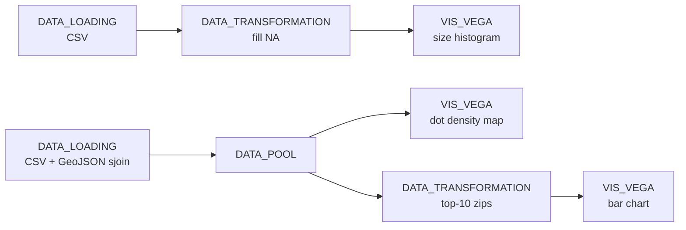

# Example: Spatial density + zip-code aggregation in Vega-Lite

This example shows how to fan out a single spatially-joined dataset to multiple Vega-Lite views via a `DATA_POOL`. The data is Chicago's [green-roofs inventory](data/10-green_roofs.csv): we load the raw CSV, join each rooftop point with the city's neighborhood polygons, then read the same joined table from a histogram (size distribution), a dot density map, and a top-N bar chart.

## Pipeline overview



## Data

[10-green_roofs.csv](data/10-green_roofs.csv) (rooftop inventory) and [chicago.geojson](data/chicago.geojson) (zip-coded neighborhood polygons).

Paths in the code below are relative to the directory you launched Curio from — run `curio start` from the repo root.

## Step 1: Load the green-roofs CSV (`DATA_LOADING`)

```python
import pandas as pd

df = pd.read_csv("docs/examples/data/10-green_roofs.csv")
return df
```

## Step 2: Fill missing values (`DATA_TRANSFORMATION`)

A trivial cleanup pass so the histogram in Step 3 is not skewed by `NaN` rows.

```python
import pandas as pd

df = arg
df.fillna(0, inplace=True)
return df
```

## Step 3: Roof-size histogram (`VIS_VEGA`)

A log-binned histogram of `TOTAL_ROOF_SQFT`, useful because rooftop sizes span several orders of magnitude.

```json
{
  "$schema": "https://vega.github.io/schema/vega-lite/v6.json",
  "description": "Histogram of total roof size (log-scaled)",
  "data": {"name": "data"},
  "transform": [
    {"filter": "datum.TOTAL_ROOF_SQFT > 0"},
    {"calculate": "log(datum.TOTAL_ROOF_SQFT) / log(10)", "as": "log_roof_size"}
  ],
  "mark": "bar",
  "encoding": {
    "x": {
      "field": "log_roof_size",
      "bin": {"maxbins": 30},
      "axis": {
        "title": "Total Roof Size (sqft)",
        "values": [3, 4, 5, 6],
        "labelExpr": "'10^' + datum.value"
      }
    },
    "y": {
      "aggregate": "count",
      "type": "quantitative",
      "axis": {"title": "Number of Buildings"}
    }
  }
}
```

## Step 4: Spatial join with neighborhood polygons (`DATA_LOADING`)

A second loading node reads the rooftop CSV again, projects the lat/lon columns into a GeoDataFrame, and `sjoin`s it with Chicago's zip-coded polygons. The result is then trimmed to just the columns the downstream views actually use, and the geometry column is dropped — that lets the `DATA_POOL` serialize a small plain DataFrame instead of the full GeoDataFrame plus the unused string-typed columns the GeoJSON contributes (`objectid`, `shape_area`, `shape_len`).

```python
import geopandas as gpd
import pandas as pd
from shapely.geometry import Point

green_roofs_df = pd.read_csv('docs/examples/data/10-green_roofs.csv')
geometry = [Point(xy) for xy in zip(green_roofs_df['LONGITUDE'], green_roofs_df['LATITUDE'])]
green_roofs_df = gpd.GeoDataFrame(green_roofs_df, geometry=geometry, crs=4326)

chicago = gpd.read_file('docs/examples/data/chicago.geojson')
joined = gpd.sjoin(green_roofs_df, chicago, predicate='within')

return pd.DataFrame(joined[['LONGITUDE', 'LATITUDE', 'VEGETATED_SQFT', 'TOTAL_ROOF_SQFT', 'zip']])
```

## Step 5: Fan out the joined dataset (`DATA_POOL`)

The pool keeps the joined table in shared memory so the next two views can read it without re-running the spatial join.

## Step 6: Dot density map (`VIS_VEGA`)

Each circle is one rooftop, sized by vegetated area, plotted in lat/lon with bound zoom and pan.

```json
{
  "$schema": "https://vega.github.io/schema/vega-lite/v6.json",
  "description": "Dot density of green-roof locations",
  "width": 500,
  "height": 600,
  "title": "Green Roof Locations in Chicago",
  "mark": "circle",
  "params": [
    {"name": "grid", "select": "interval", "bind": "scales"}
  ],
  "encoding": {
    "x": {
      "field": "LONGITUDE",
      "type": "quantitative",
      "scale": {"domain": [-88.0, -87.5]},
      "axis": {"title": "Longitude"}
    },
    "y": {
      "field": "LATITUDE",
      "type": "quantitative",
      "scale": {"domain": [41.6, 42.1]},
      "axis": {"title": "Latitude"}
    },
    "size": {
      "field": "VEGETATED_SQFT",
      "type": "quantitative",
      "legend": {"title": "Vegetated Sqft"}
    },
    "tooltip": [
      {"field": "VEGETATED_SQFT", "type": "quantitative"},
      {"field": "TOTAL_ROOF_SQFT", "type": "quantitative"},
      {"field": "zip", "type": "nominal"}
    ]
  },
  "config": {"view": {"stroke": "transparent"}}
}
```

## Step 7: Top-10 zips by vegetated area (`DATA_TRANSFORMATION`)

The third branch off the pool reduces the joined table down to the ten zip codes with the most vegetated rooftop area.

```python
joined = arg

top_10_largest = (joined.groupby('zip')['VEGETATED_SQFT']
    .sum()
    .reset_index()
    .sort_values(by='VEGETATED_SQFT', ascending=False)
    .head(10))

return top_10_largest
```

## Step 8: Top-10 bar chart (`VIS_VEGA`)

```json
{
  "$schema": "https://vega.github.io/schema/vega-lite/v6.json",
  "description": "Top 10 zips by green-roof area",
  "width": 400,
  "height": 200,
  "params": [
    {"name": "zip_select", "select": {"type": "point", "fields": ["zip"], "toggle": "event.shiftKey"}}
  ],
  "mark": {"type": "bar", "stroke": "black", "color": "green"},
  "encoding": {
    "x": {
      "field": "VEGETATED_SQFT",
      "type": "quantitative",
      "axis": {
        "title": "Total Vegetated Roof Size (sqft)",
        "values": [100000, 250000, 500000, 1000000],
        "format": ",d"
      }
    },
    "y": {
      "field": "zip",
      "type": "nominal",
      "sort": "-x",
      "axis": {"title": "Zip Code"}
    },
    "color": {"field": "zip", "type": "nominal", "scale": {"scheme": "category20"}},
    "opacity": {
      "condition": {"param": "zip_select", "value": 1},
      "value": 0.3
    },
    "tooltip": [
      {"field": "zip", "type": "nominal"},
      {"field": "VEGETATED_SQFT", "type": "quantitative"}
    ]
  }
}
```

## Final result

The histogram answers "how big is a typical green roof?", the dot density map answers "where are they?", and the bar chart answers "which zips lead?". Because the three views fan out from a `DATA_POOL`, the spatial join only runs once — and adding a fourth view (e.g. a chart of installations by year) is one more node off the pool, not a re-join.
