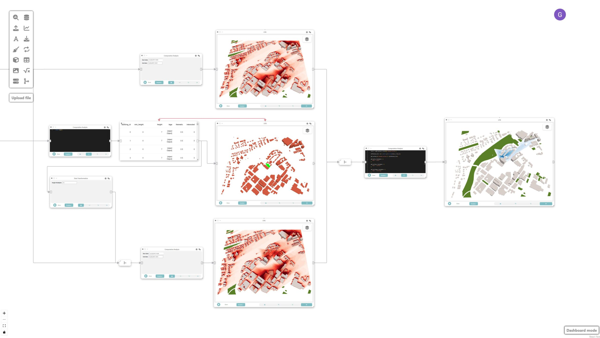
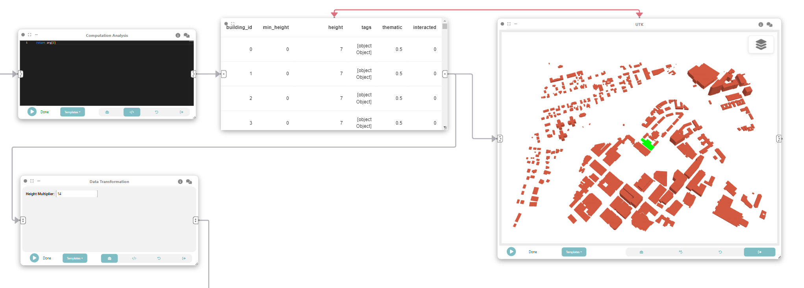
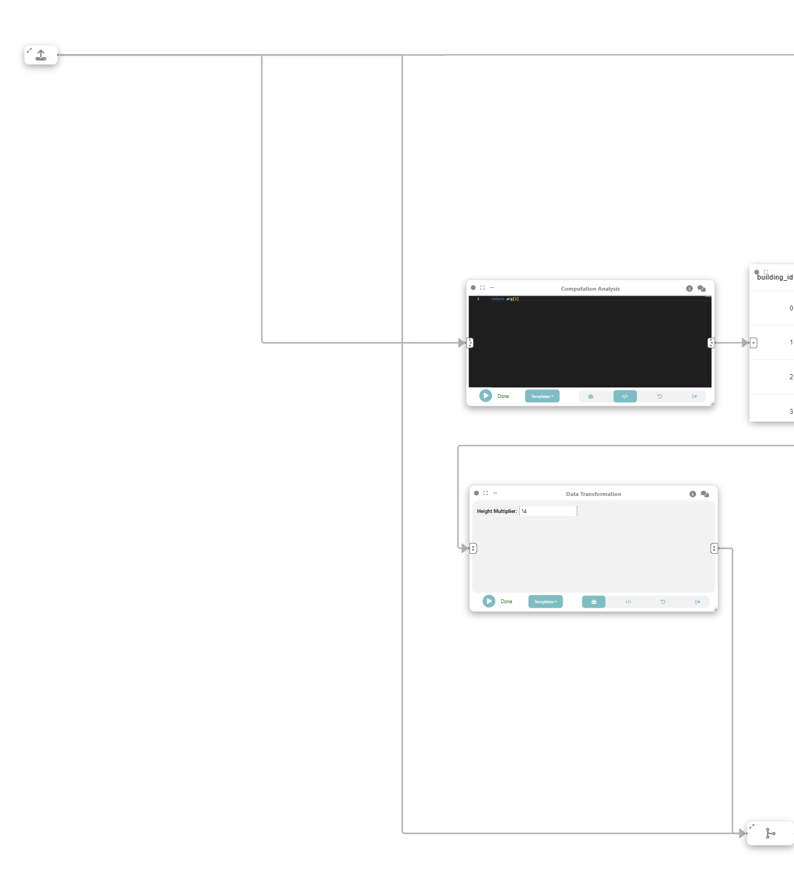
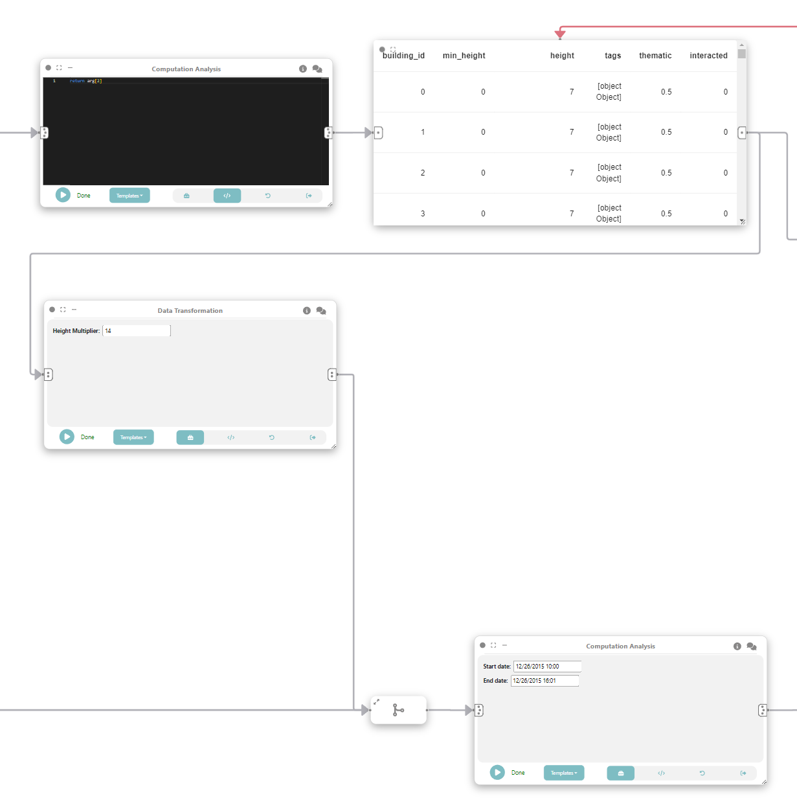
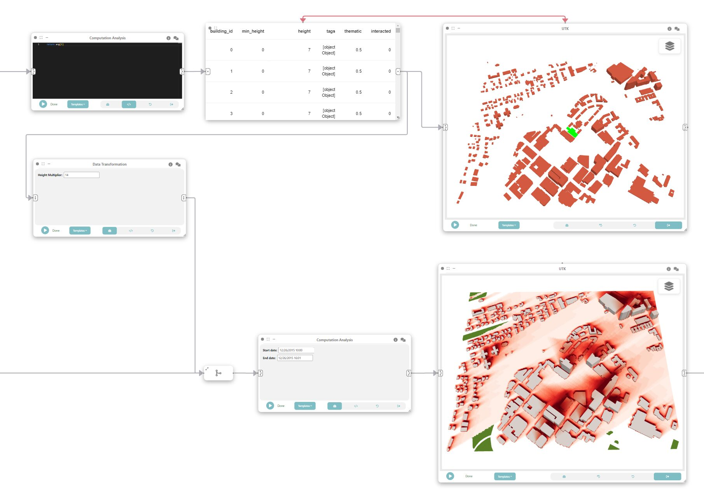
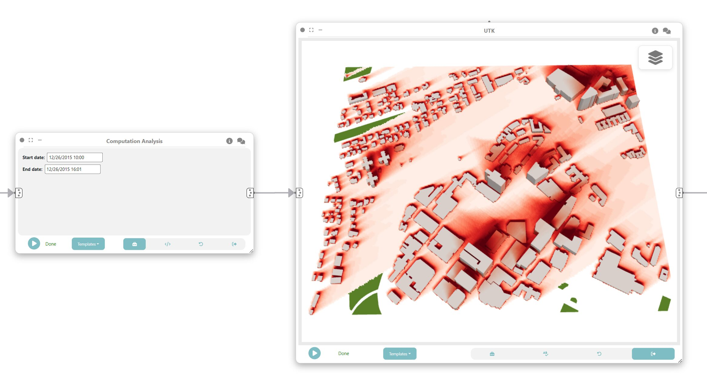
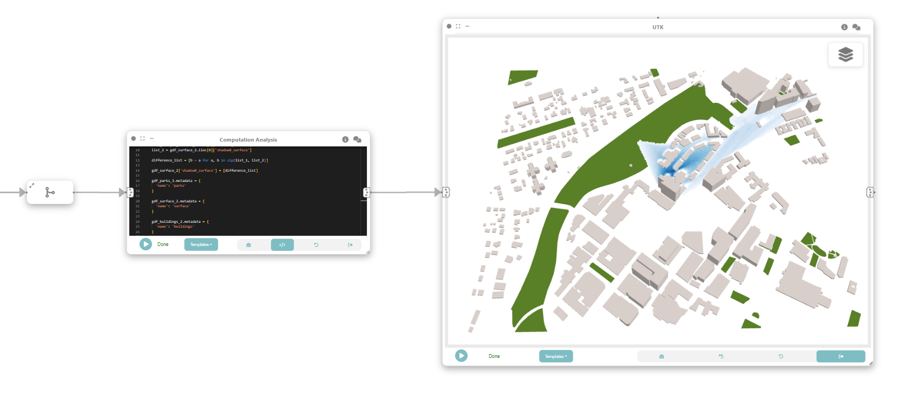

# Example: What-if scenarios with shadow data

In this example, we will explore how Curio can be used to create a dataflow that computes the shadow impact from proposed buildings in Boston. It is possible to compute the shadow impact of the proposed building over different times and seasons to support evidence-based environmental impact analysis. Here is the overview of the whole dataflow pipeline:



Before you begin, please familiarize yourself with Curio’s main concepts and functionalities by reading our [usage guide](https://github.com/urban-toolkit/curio/blob/main/docs/USAGE.md).

For completeness, we also include the template code in each dataflow step.

## Step 1: Loading physical layers

We want our final map to have layers representing water, parks, and buildings. The icons on the left-hand side can be used to instantiate different nodes, including data loading nodes. Let’s start by using UTK’s Python API to download the necessary data. Change the node view to load and run the following code:

```python
# load box
import utk

uc = utk.OSM.load([42.336844, -71.113459, 42.345559, -71.099216], layers=[{'name':'buildings', 'args': {'sizeCells': 5}}, {'name':'surface', 'args': {'sizeCells': 5}}, 'parks'])

# buildings
gdf_buildings = uc.layers['gdf']['sections'][0]
gdf_buildings['thematic'] = 0.5
gdf_buildings.metadata = {
 'name': 'buildings'
}

#surface
json_surface = uc.layers['json'][1]
gdf_surface = uc.layers['gdf']['objects'][1]
gdf_surface.metadata = {
 'name': 'surface'
}

#parks
json_parks = uc.layers['json'][2]
gdf_parks = uc.layers['gdf']['objects'][2]
gdf_parks.metadata = {
 'name': 'parks'
}

return (json_surface, json_parks, gdf_buildings, gdf_surface, gdf_parks)
```

## Step 1.5: Getting only the buildings

From the composed output we want to get the GeoDataframe representing the buildings. That is why we need this intermediate step. Instantiate a “Computation Analysis” node, connect the output of the previous node to the input of the current and change the view to code and run the following code:

```python
return arg[2]
```

Finally store the output in a data node.


## Step 2: UTK for interactions

Now we can add an UTK node instance that will receive the output of the previous data node and be used to change the height of the buildings. After connecting the nodes, change interaction mode to “PICKING” and run UTK.


## Step 3: Changing building height

Let’s now create a “Data Transformation” node and connect it to the same data node that feeds UTK in Step 2. To goal is to detect which buildings were interacted with and change its height. Change the view to “Code” and execute:

```python
gdf = arg

gdf.loc[gdf['interacted'] == '1', 'height'] *= [!! Height Multiplier$INPUT_VALUE$14 !!]

gdf.metadata = {
 'name': 'buildings'
}

return gdf
```

The Marker ``[!! Height Multiplier$INPUT_VALUE$14 !!]`` exposes a widget to control a height multiplier.



## Step 3.5: Merging flows

As an intermediate step we will use a “Merge” node to unify the flow from Step 1 and Step 3.



## Shadow simulation (after height modification)

We can now add another “Computation Analysis” node to do shadow simulation based on the buildings Dataframe. To do that we connect the node to the merge of Step 3.5. Bear in mind that a NVIDIA GPU is needed. And execute the following code:

```python
import utk

json_surface = arg[0][0]
gdf_surface = arg[0][3]
json_parks = arg[0][1]
gdf_parks = arg[0][4]

gdf_buildings = arg[1]

json_layers = [json_surface]
# buildings json layer
gdf_buildings = gdf_buildings.set_crs('4326')
mesh = utk.OSM.mesh_from_buildings_gdf(gdf_buildings, 5)['data']

json_buildings = {
   'id': 'buildings',
   'type': 'BUILDINGS_LAYER',
   'renderStyle': ['SMOOTH_COLOR_MAP_TEX'],
   'styleKey': 'building',
   'data': mesh
}

json_layers.append(json_buildings)

shadow = utk.data.shadow(json_layers, [[[!! Start date$INPUT_TEXT$12/26/2015 10:00 !!], [!! End date$INPUT_TEXT$12/26/2015 16:01 !!]]])

thematic_layers = shadow.get_shadow_by_layer()

building_index = -1
current_building_id = -1

values_per_row = []

for index, row in gdf_buildings.iterrows():
   if(row['building_id'] != current_building_id):
       current_building_id = row['building_id']
       building_index += 1

   values_per_row.append(thematic_layers['shadow0_buildings']['values'][building_index])

gdf_buildings["shadow0_buildings"] = values_per_row

gdf_buildings.metadata = {
 'name': 'buildings'
}

values_per_row = []

for index, row in gdf_surface.iterrows():
   values_per_row.append(thematic_layers['shadow0_surface']['values'][index])

gdf_surface["shadow0_surface"] = values_per_row
gdf_surface["surface_id"] = 0 # surface is a single big bounding box

gdf_surface.metadata = {
 'name': 'surface'
}

return (gdf_surface, gdf_parks, gdf_buildings)
```

The Markers ``[!! Start date$INPUT_TEXT$12/26/2015 10:00 !!]`` and ``[!! End date$INPUT_TEXT$12/26/2015 16:01 !!]`` expose a widget to control the start and end date on the shadow simulation.



## Step 5: Visualizing shadows

To visualize the result of the simulation we can add an UTK node and connect to the output of Step 4. Don’t forget to run the UTK node.



## Step 6: Shadow simulation (before height modification)

Now, we repeat what was done in Step 4 but to simulate the shadows for the dataset before the height modification. To do that, add a “Computation Analysis” node, connect it to the output of Step 1, and execute the following code:

```python
import utk

json_surface = arg[0]
json_parks = arg[1]
gdf_buildings = arg[2]
gdf_surface = arg[3]
gdf_parks = arg[4]

json_layers = [json_surface]

# buildings json layer
gdf_buildings = gdf_buildings.set_crs('4326')
mesh = utk.OSM.mesh_from_buildings_gdf(gdf_buildings, 5)['data']

json_buildings = {
   'id': 'buildings',
   'type': 'BUILDINGS_LAYER',
   'renderStyle': ['SMOOTH_COLOR_MAP_TEX'],
   'styleKey': 'building',
   'data': mesh
}

json_layers.append(json_buildings)

shadow = utk.data.shadow(json_layers, [[[!! Start date$INPUT_TEXT$12/26/2015 10:00 !!], [!! End date$INPUT_TEXT$12/26/2015 16:01 !!]]])

thematic_layers = shadow.get_shadow_by_layer()

building_index = -1
current_building_id = -1

values_per_row = []

for index, row in gdf_buildings.iterrows():
   if(row['building_id'] != current_building_id):
       current_building_id = row['building_id']
       building_index += 1

   values_per_row.append(thematic_layers['shadow0_buildings']['values'][building_index])

gdf_buildings["shadow0_buildings"] = values_per_row

gdf_buildings.metadata = {
 'name': 'buildings'
}

values_per_row = []

for index, row in gdf_surface.iterrows():
   values_per_row.append(thematic_layers['shadow0_surface']['values'][index])

gdf_surface["shadow0_surface"] = values_per_row
gdf_surface["surface_id"] = 0 # surface is a single big bounding box

gdf_surface.metadata = {
 'name': 'surface'
}

return (gdf_surface, gdf_parks, gdf_buildings)
```

## Step 7: Visualizing shadows

Similar to Step 5, create a UTK node to visualize the shadows simulated on Step 6.



## Step 7.5: Merging the what-if flow

To see the difference between the shadows calculated on Step 4 and 6 we have to merge the data flow of Steps 5 and 7.


## Step 8: What-if scenario

To create the what-if scenario we can calculate the difference between the shadow calculated for the buildings before and after modifying the heights. Create a “Computation Analysis” node connected to the output of Step 7.5 and execute the following code:

```python
gdf_surface_1 = arg[0][0]
gdf_buildings_1 = arg[0][2]

gdf_surface_2 = arg[1][0]
gdf_buildings_2 = arg[1][2]

gdf_parks_3 = arg[0][1]

list_1 = gdf_surface_1.iloc[0]['shadow0_surface']
list_2 = gdf_surface_2.iloc[0]['shadow0_surface']

difference_list = [b - a for a, b in zip(list_1, list_2)]

gdf_surface_2['shadow0_surface'] = [difference_list]

gdf_parks_3.metadata = {
 'name': 'parks'
}

gdf_surface_2.metadata = {
 'name': 'surface'
}

gdf_buildings_2.metadata = {
 'name': 'buildings'
}

return (gdf_parks_3, gdf_surface_2, gdf_buildings_2)
```


## Step 9: Visualizing what-if scenario

Finally, to visualize the result, we can add a UTK node connected to Step 8.


