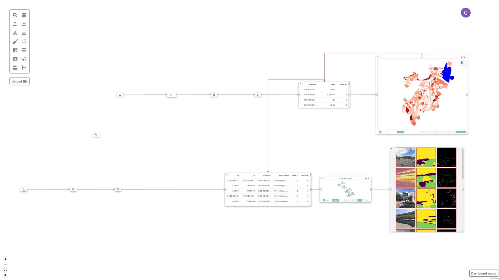
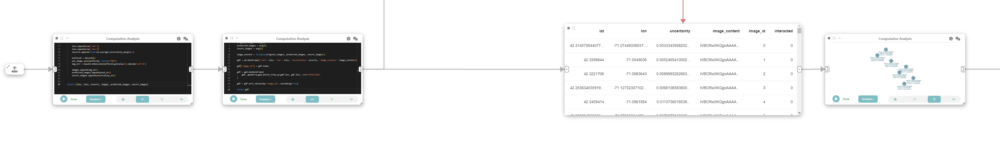
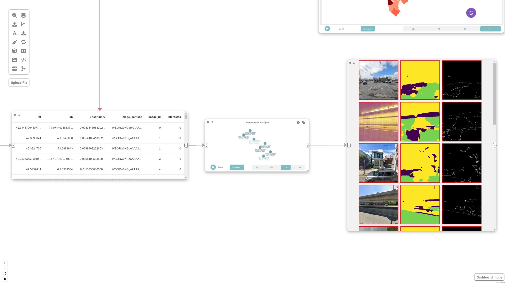
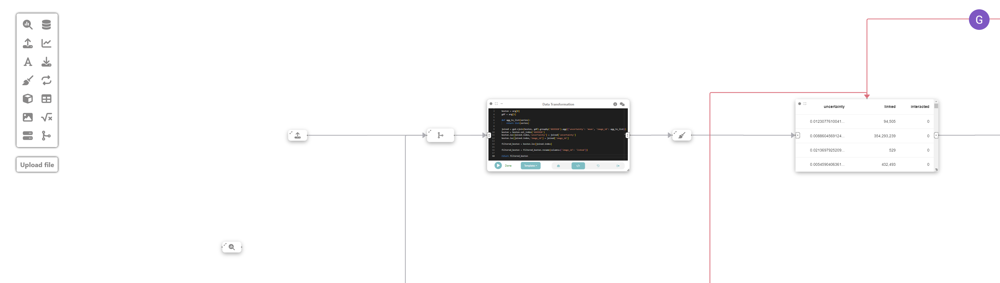
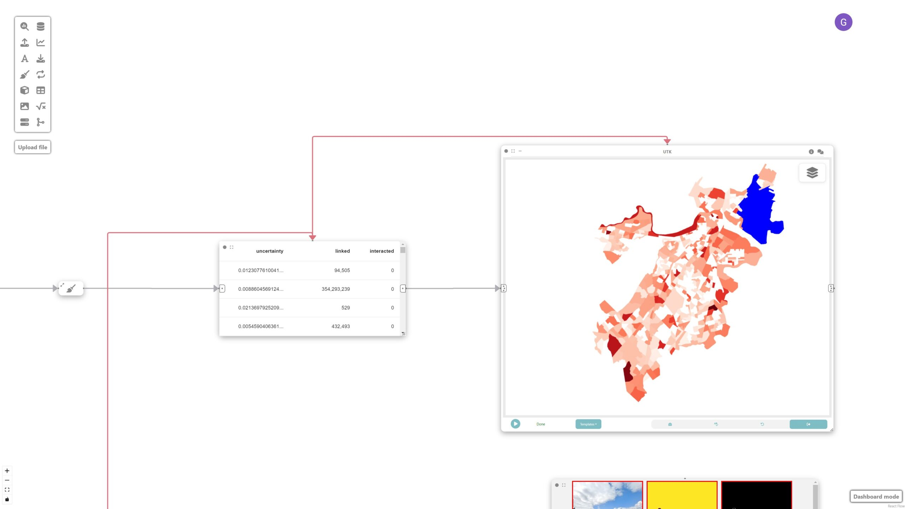

# Example: Expert-in-the-loop urban accessibility analyses

In this example, we are going to learn how Curio can facilitate expert-in-the-loop inspection of a computer vision model for sidewalk surface material classification. Here is the overview of the whole dataflow pipeline:



Before you begin, please familiarize yourself with Curio’s main concepts and functionalities by reading our [usage guide](https://github.com/urban-toolkit/curio/blob/main/docs/USAGE.md).

The data for this tutorial can be found [here](https://drive.google.com/drive/folders/1-cncKF-omB0av98WzKApKtyJTrgvfa0P?usp=sharing).

For completeness, we also include the template code in each dataflow step.

## Step 0: Initializing Curio

In order to run this tutorial, make sure you satisfy the requirements from [CitySurfaces](https://github.com/VIDA-NYU/city-surfaces?tab=readme-ov-file#installing-prerequisites).

After initializing Curio, you will see a blank canvas.

## Step  1: Loading the model training node

The icons on the left-hand side of the interface can be used to instantiate different nodes, including analysis & modeling nodes. Let’s start by instantiating an Analysis & Modeling node and changing its view to Code. Then, we set up the training procedure for our model.

For simplicity, we are not loading the exact segmentation model used in CitySurfaces since it is a resource-intensive model. Instead, we use a lighter version for demonstration purposes:

After hitting run, the Python return will output train_model() for the next node. Curio’s provenance feature allows the expert to analyze several versions of their training procedure.

```python
# computation analysis - clear

import os
from PIL import Image
from torch.utils.data import Dataset, DataLoader
from albumentations.pytorch import ToTensorV2
from cityscapesscripts.helpers.labels import trainId2label as t2l
import segmentation_models_pytorch as smp
from torch import nn, optim

import albumentations as A  
import torch
import glob
import numpy as np

IMG_DIR = './dataset/city-surfaces'
IMAGE_WIDTH   = 320  
IMAGE_HEIGHT  = 320
BATCH_SIZE    = 8
NUM_CLASSES   = 3 # 10
LEARNING_RATE = 0.002
DEVICE  = "cuda" # if torch.cuda.is_available() else "cpu"

class SegmentationDataset(Dataset):
    def __init__(self, img_dir, transform=None):
        self.img_dir  = img_dir
        self.transform  = transform
        self.images = glob.glob('%s/*.png'%(self.img_dir))

    def __len__(self):
        return len(self.images)

    def __getitem__(self, index):
        img_path    = self.images[index]
        mask_path   = self.images[index].replace('images','annotations')
        image       = np.array(Image.open(img_path).convert("RGB"), dtype=np.float32) / 255.0
        y           = np.array(Image.open(mask_path).convert("L"))
        y = y - 1
        y[y==0]=0 # concrete
        y[y==1]=0 # bricks
        y[y==2]=0 # granite
        y[y==3]=0 # asphalt
        y[y==4]=0 # mixed
        y[y==5]=1 # road
        y[y==6]=2 # background
        y[y==7]=0
        y[y==8]=0
        y[y==9]=0

        if self.transform is not None:
            augmentations = self.transform(image=image, mask=y)
            image   = augmentations["image"].to(torch.float32)
            y       = augmentations["mask"].type(torch.LongTensor)

        return image, y

train_transform = A.Compose(
    [
        A.Resize(height=IMAGE_HEIGHT, width=IMAGE_WIDTH),
        A.ColorJitter(p=0.2),
        A.HorizontalFlip(p=0.5),
        ToTensorV2(),
    ],
)

val_transform = A.Compose(
    [
        A.Resize(height=IMAGE_HEIGHT, width=IMAGE_WIDTH),
        ToTensorV2(),
    ],
)

def get_loaders(img_dir, batch_size, train_transform, val_transform):

    train_ds     = SegmentationDataset(IMG_DIR+'//train//images//' , transform=train_transform)

    train_loader = DataLoader(train_ds, batch_size=batch_size, shuffle=True)

    val_ds       = SegmentationDataset(IMG_DIR+'//val//images//', transform=val_transform)

    val_loader   = DataLoader(val_ds, batch_size=batch_size, shuffle=True)

    return train_loader, val_loader

train_loader, val_loader = get_loaders(IMG_DIR, BATCH_SIZE, train_transform, val_transform)

def check_accuracy(loader, model, device="cuda"):
    num_correct = 0
    num_pixels  = 0
    dice_score  = 0
    iou_score   = 0
    model.eval()

    with torch.no_grad():
        for image, mask in loader:
            image = image.to(device)
            mask  = mask.to(device)
            predictions = model(image)
            pred_labels = torch.argmax(predictions, dim=1)

            cpred_labels = pred_labels.cpu().detach().numpy()
            cmask = mask.cpu().detach().numpy()
            cciou_score = 0
            ccnum_correct = 0
            ccnum_pixels = 0
            intersection_per_class = np.zeros(NUM_CLASSES)
            union_per_class = np.zeros(NUM_CLASSES)
            for class_idx in range(NUM_CLASSES):
                ccpred_labels = cpred_labels==class_idx
                ccmask = cmask==class_idx

                intersection = np.logical_and(ccpred_labels, ccmask)
                union = np.logical_or(ccpred_labels, ccmask)
                intersection_per_class[class_idx] = np.sum(intersection)
                union_per_class[class_idx] = np.sum(union)

            iou_per_class = intersection_per_class / (union_per_class + 1e-10)
            iou_score += np.mean(iou_per_class)
    model.train()


model = smp.Unet(encoder_name='efficientnet-b3', in_channels=3, classes=NUM_CLASSES, activation='softmax2d').to(DEVICE)
loss_fn = nn.CrossEntropyLoss(ignore_index=255)
optimizer = optim.Adam(model.parameters(), lr=LEARNING_RATE)

NUM_EPOCHS    = 10

def train_fn(loader, model, optimizer, loss_fn):

    for batch_idx, (image, mask) in enumerate(loader):
        image   = image.to(device=DEVICE)
        mask    = mask.to(device=DEVICE)

        # forward
        predictions = model(image)
        loss = loss_fn(predictions, mask)

        # backward
        model.zero_grad()
        loss.backward()
        optimizer.step()

for epoch in range(NUM_EPOCHS):

    train_fn(train_loader, model, optimizer, loss_fn)

    # check accuracy
    check_accuracy(val_loader, model, device=DEVICE)
    # break

torch.save(model.state_dict(), 'model.pth')

return "Model saved in model.pth"
```

## Step 2: Creating the Boston physical layer

Next, we create a Data Loading node and change its view to Code. We load a sample of 100 unlabeled, unseen images.

```python
python
import pandas as pd
df = pd.read_csv('./dataset/gsv/boston_gsv.csv', names=['status','id','lat','lon'])
sample = df[df['status']=='OK'].sample(100, random_state=42)
return sample
```

## Step 3: Computing prediction uncertainty

Now, we create an Analysis & Modeling node to calculate the prediction uncertainty of the model on the new set of unseen data and connect it to the previous node. The goal is to measure the difference between the two highest prediction probabilities in the softmax layer.



```python
import torch
import segmentation_models_pytorch as smp
import numpy as np
import matplotlib.pyplot as plt
from PIL import Image
from io import BytesIO
import base64

sample = arg

def compute_uncertainty(predictions):
   sorted_probs = np.sort(predictions, axis=1)
   highest_prob = sorted_probs[:, -1, :, :]  # Highest probability for each pixel
   second_highest_prob = sorted_probs[:, -2, :, :]  # Second highest probability
   uncertainty_margin = highest_prob - second_highest_prob
   return 1.0-uncertainty_margin

model = smp.Unet(encoder_name='efficientnet-b3', in_channels=3, classes=6, activation='softmax2d').to('cuda')
model.load_state_dict(torch.load('model.pth'))

color_map = {
   0: (68, 1, 84, 255),
   1: (64, 67, 135, 255),
   2: (41, 120, 142, 255),
   3: (34, 167, 132, 255),
   4: (121, 209, 81, 255),
   5: (253, 231, 36, 255),
}

lats = []
lons = []
uncerts = []
images = []
predicted_images = []
uncert_images = []
for index, row in sample.iterrows():
   image_path = image_path = './dataset/gsv/boston/%s_left.jpg'%row['id']

   pil_image = Image.open(image_path).convert("RGB").resize((320,320))

   image = np.array(pil_image, dtype=np.float32) / 255.0
   predictions = model(torch.from_numpy(image.reshape(1,320,320,3)).permute((0,3,1,2)).to('cuda'))

   pred_labels = torch.argmax(predictions, dim=1)
   pred_array = pred_labels.cpu().numpy()
   pred_array = pred_array.reshape((320, 320))
   pred_pil = Image.new("RGB", (pred_array.shape[1], pred_array.shape[0]))
   for i in range(pred_array.shape[0]):
       for j in range(pred_array.shape[1]):
           pred_pil.putpixel((j, i), color_map[pred_array[i, j]])

   # pred_array = np.uint8((pred_array/2) * 255)
   # pred_array = np.transpose(pred_array, (1, 2, 0))
   # pred_array = np.squeeze(pred_array, axis=2)
   # pred_pil = Image.fromarray(pred_array)

   buffered = BytesIO()
   pred_pil.save(buffered, format="PNG")
   pred_str = base64.b64encode(buffered.getvalue()).decode('utf-8')

   uncertainty_margin = compute_uncertainty(predictions.cpu().detach().numpy())

   uncertainty_array = np.uint8(uncertainty_margin * 255)
   uncertainty_array = np.transpose(uncertainty_array, (1, 2, 0))
   uncertainty_array = np.squeeze(uncertainty_array, axis=2)
   uncertainty_pil = Image.fromarray(uncertainty_array)

   buffered = BytesIO()
   uncertainty_pil.save(buffered, format="PNG")
   uncertainty_str = base64.b64encode(buffered.getvalue()).decode('utf-8')

   lats.append(row['lat'])
   lons.append(row['lon'])
   uncerts.append(float(np.average(uncertainty_margin)))

   buffered = BytesIO()
   pil_image.save(buffered, format="PNG")
   img_str = base64.b64encode(buffered.getvalue()).decode('utf-8')

   images.append(img_str)
   predicted_images.append(pred_str)
   uncert_images.append(uncertainty_str)

return (lats, lons, uncerts, images, predicted_images, uncert_images)
```

Now, let’s connect this node to a new computation analysis node and create a GeoDataFrame and connect it to a data node, where each image and its associated uncertainty will be represented as a geospatial point feature.

```
import geopandas as gpd

lats = arg[0]
lons = arg[1]
uncerts = arg[2]
original_images = arg[3]
predicted_images = arg[4]
uncert_images = arg[5]

image_content = list(zip(original_images, predicted_images, uncert_images))

gdf = pd.DataFrame({'lat': lats, 'lon': lons, 'uncertainty': uncerts, 'image_content': image_content})

gdf['image_id'] = gdf.index

gdf = gpd.GeoDataFrame(
   gdf, geometry=gpd.points_from_xy(gdf.lon, gdf.lat), crs="EPSG:4326"
)

gdf = gdf.sort_values(by='image_id', ascending=True)

return gdf
```

## Step 4: Filtering most uncertain images

We then filter the most uncertain images by connecting a “Computation Analysis” node to the previous data node.

```python
df = pd.DataFrame(arg.drop(columns=arg.geometry.name))
df = df[df['interacted'] == '1']
df = df.sort_values(by='uncertainty', ascending=False)
return df.head(20)
```

## Step 5: Visualizing the images

Finally, we visualize the images by simply adding an image node.



## Step 6: Loading neighborhood data

Next, we create a Data Loading node and change its view to Code. We load the physical layer describing neighborhoods in Boston:

```python
import geopandas as gpd
# Load neighborhood data
boston = gpd.read_file('Census2020_BlockGroups.shp').to_crs('EPSG:4326')
return boston
```

## Step 7: Merging the data

We now merge the uncertainty data from Step 5 with the neighborhood data in Step 3, to help us determine the optimal neighborhood from which to sample our next set of images. 



To do that, we create a new computation analysis node, and change its view to code, and run the following:

```python
import geopandas as gpd

boston = arg[0]
gdf = arg[1]

def agg_to_list(series):
   return list(series)

joined = gpd.sjoin(boston, gdf).groupby('GEOID20').agg({'uncertainty': 'mean', 'image_id': agg_to_list})
boston = boston.set_index('GEOID20')
boston.loc[joined.index,'uncertainty'] = joined['uncertainty']
boston.loc[joined.index,'image_id'] = joined['image_id']

filtered_boston = boston.loc[joined.index]

filtered_boston = filtered_boston.rename(columns={'image_id': 'linked'})

return filtered_boston
```

Now, let’s clean the ``filtered_boston`` GeoDataFrame by creating a new data cleaning node and connecting it to the previous one. 

```python
import geopandas as gpd

filtered_boston = arg

filtered_boston = filtered_boston.loc[:, [filtered_boston.geometry.name, 'uncertainty', 'linked']]

filtered_boston = filtered_boston.set_crs(4326)
filtered_boston = filtered_boston.to_crs(3395)

filtered_boston.metadata = {
   'name': 'boston'
}

return filtered_boston
```

## Step 8: Visualizing prediction uncertainty

In this step, we want to create a spatial map showing the distribution of prediction uncertainties over neighborhoods of Boston.



To achieve that, let’s create a data node and a UTK visualization node connected to the neighborhood data node. UTK’s grammar is automatically populated once an input is received.

## Step 9: Analyzing and identifying shortcomings

These nodes are then used to identify potential shortcomings with the model that require new labeled data. The sorted mosaic of images helps identify patterns of failures where the model had the most difficulty classifying. This signals the need for sampling more images with similar light/shadow and built environment conditions:


## Final result

The final visualization shows the prediction uncertainties overlaid on the map of Boston’s neighborhoods, facilitating a more targeted approach to image labeling. Given that dense labeling of images is an expensive endeavor, Curio facilitates a more targeted approach, in which conditions are identified and can be used as a guide for labeling.
