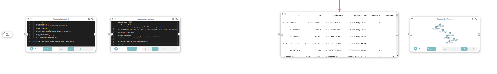
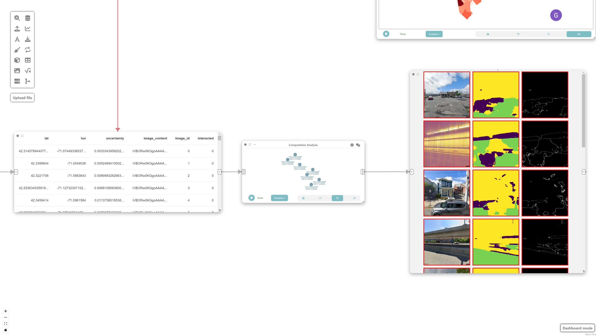
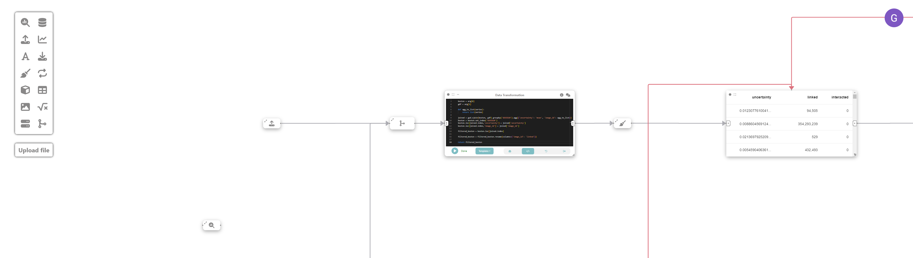
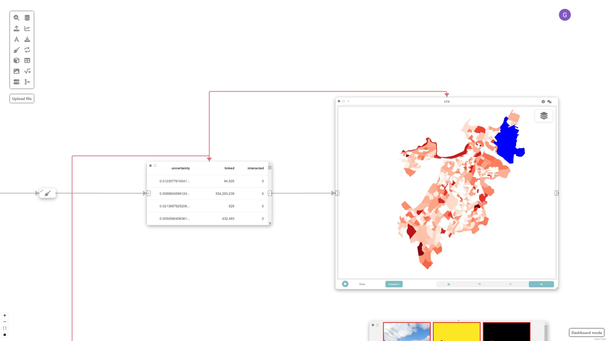
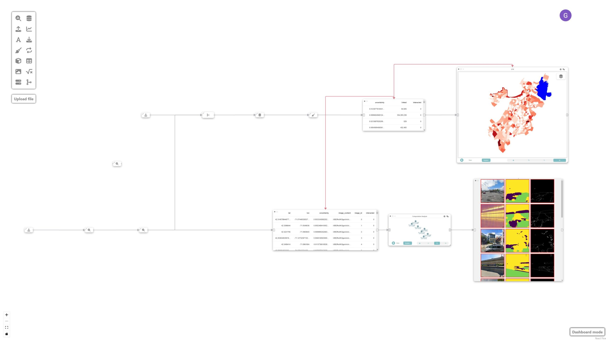

# Example: Expert-in-the-loop urban accessibility analyses

In this example, we are going to learn how Curio can facilitate expert-in-the-loop inspection of a computer vision model for sidewalk surface material classification. Here is the overview of the whole dataflow pipeline:


Before you begin, please familiarize yourself with Curio’s main concepts and functionalities by reading our [usage guide](https://github.com/urban-toolkit/curio/blob/main/docs/USAGE.md).

The data for this tutorial can be found [here](https://drive.google.com/drive/folders/1-cncKF-omB0av98WzKApKtyJTrgvfa0P?usp=sharing).

For completeness, we also include the template code in each dataflow step.

## Step 0: Initializing Curio

In order to run this tutorial you need to:

1. Clone the [CitySurfaces](https://github.com/VIDA-NYU/city-surfaces) repository into the same folder you use as **Curio launch directory** (`CURIO_LAUNCH_CWD`), as a subdirectory named `city-surfaces/`. That folder must contain upstream `[config.py](https://github.com/VIDA-NYU/city-surfaces/blob/main/config.py)` and the `network/` package (the code uses `from config import cfg`). If you use another path, set the environment variable `CITYSURFACES_DIR` to the **absolute** path of the clone before starting Curio and the sandbox server.
2. Install the following Python packages in the Curio conda environment:

```bash
# PyTorch with CUDA support (adjust the index URL for your CUDA version)
pip install torch torchvision --index-url https://download.pytorch.org/whl/cu124

# CitySurfaces framework dependencies (opencv provides cv2, required by city-surfaces/utils/misc.py)
pip install runx==0.0.6 pyyaml coolname tabulate tensorboardX opencv-python-headless==4.9.0.80
```

1. Download the pretrained CitySurfaces weights from their [Google Drive](https://drive.google.com/drive/folders/1W5STd9JmVZkAsSN3TidOMMrv7aZtR-4_?usp=sharing) and place them under `data/dataset/CitySurfaces_weights/`. You will need at least:
  - `block_c_10classes.pth` (10-class segmentation model)
  - `hrnetv2_w48_imagenet_pretrained.pth` (ImageNet backbone)
2. Download the tutorial data from [here](https://drive.google.com/drive/folders/1-cncKF-omB0av98WzKApKtyJTrgvfa0P?usp=sharing) and place it under `data/`.

**Full list of required packages** (beyond base Curio dependencies):


| Package                  | Version        | Purpose                                                                                                                         |
| ------------------------ | -------------- | ------------------------------------------------------------------------------------------------------------------------------- |
| `torch`                  | >=2.6.0 (CUDA) | Deep learning inference                                                                                                         |
| `torchvision`            | >=0.21.0       | Image transforms                                                                                                                |
| `runx`                   | 0.0.6          | CitySurfaces config framework                                                                                                   |
| `pyyaml`                 | >=5.1.1        | YAML parsing (runx dep)                                                                                                         |
| `coolname`               | >=1.1.0        | Name generation (runx dep)                                                                                                      |
| `tabulate`               | >=0.8.3        | Table formatting (runx dep)                                                                                                     |
| `tensorboardX`           | >=1.4          | Logging (runx dep)                                                                                                              |
| `opencv-python-headless` | 4.9.0.80       | OpenCV (`cv2`), used by CitySurfaces `utils/misc.py`                                                                            |
| `numpy`                  | 1.26.x         | Array operations; use numpy 1.x alongside pandas 2.2 / geopandas (newer OpenCV wheels may upgrade numpy to 2.x and break those) |
| `pandas`                 | >=2.2          | DataFrames                                                                                                                      |
| `geopandas`              | >=1.0          | Geospatial DataFrames                                                                                                           |
| `Pillow`                 | >=10.2         | Image loading                                                                                                                   |


After initializing Curio, you will see a blank canvas.

## Step  1: Loading the pretrained model

The icons on the left-hand side of the interface can be used to instantiate different nodes, including analysis & modeling nodes. Let’s start by instantiating an Analysis & Modeling node and changing its view to Code. Then, we load a pretrained CitySurfaces segmentation model.

### Option 1: Train Images (If you would like to train a raw model)

For simplicity, we are not loading the exact segmentation model used in CitySurfaces since it is a resource-intensive model. Instead, we use a lighter version for demonstration purposes:

After hitting run, the Python return will output train_model() for the next node. Curio’s provenance feature allows the expert to analyze several versions of their training procedure.

```python
# computation analysis - clear

import os
from PIL import Image
from torch.utils.data import Dataset, DataLoader
from albumentations.pytorch import ToTensorV2
from cityscapesscripts.helpers.labels import trainId2label as t2l
import segmentation_models_pytorch as smp
from torch import nn, optim

import albumentations as A  
import torch
import glob
import numpy as np

IMG_DIR = '../data/dataset/city-surfaces'
IMAGE_WIDTH   = 320  
IMAGE_HEIGHT  = 320
BATCH_SIZE    = 8
NUM_CLASSES   = 3 # 10
LEARNING_RATE = 0.002
DEVICE  = "cuda" # if torch.cuda.is_available() else "cpu"

class SegmentationDataset(Dataset):
    def __init__(self, img_dir, transform=None):
        self.img_dir  = img_dir
        self.transform  = transform
        self.images = glob.glob('%s/*.png'%(self.img_dir))

    def __len__(self):
        return len(self.images)

    def __getitem__(self, index):
        img_path    = self.images[index]
        mask_path   = self.images[index].replace('images','annotations')
        image       = np.array(Image.open(img_path).convert("RGB"), dtype=np.float32) / 255.0
        y           = np.array(Image.open(mask_path).convert("L"))
        y = y - 1
        y[y==0]=0 # concrete
        y[y==1]=0 # bricks
        y[y==2]=0 # granite
        y[y==3]=0 # asphalt
        y[y==4]=0 # mixed
        y[y==5]=1 # road
        y[y==6]=2 # background
        y[y==7]=0
        y[y==8]=0
        y[y==9]=0

        if self.transform is not None:
            augmentations = self.transform(image=image, mask=y)
            image   = augmentations["image"].to(torch.float32)
            y       = augmentations["mask"].type(torch.LongTensor)

        return image, y

train_transform = A.Compose(
    [
        A.Resize(height=IMAGE_HEIGHT, width=IMAGE_WIDTH),
        A.ColorJitter(p=0.2),
        A.HorizontalFlip(p=0.5),
        ToTensorV2(),
    ],
)

val_transform = A.Compose(
    [
        A.Resize(height=IMAGE_HEIGHT, width=IMAGE_WIDTH),
        ToTensorV2(),
    ],
)

def get_loaders(img_dir, batch_size, train_transform, val_transform):

    train_ds     = SegmentationDataset(IMG_DIR+'//train//images//' , transform=train_transform)

    train_loader = DataLoader(train_ds, batch_size=batch_size, shuffle=True)

    val_ds       = SegmentationDataset(IMG_DIR+'//val//images//', transform=val_transform)

    val_loader   = DataLoader(val_ds, batch_size=batch_size, shuffle=True)

    return train_loader, val_loader

train_loader, val_loader = get_loaders(IMG_DIR, BATCH_SIZE, train_transform, val_transform)

def check_accuracy(loader, model, device="cuda"):
    num_correct = 0
    num_pixels  = 0
    dice_score  = 0
    iou_score   = 0
    model.eval()

    with torch.no_grad():
        for image, mask in loader:
            image = image.to(device)
            mask  = mask.to(device)
            predictions = model(image)
            pred_labels = torch.argmax(predictions, dim=1)

            cpred_labels = pred_labels.cpu().detach().numpy()
            cmask = mask.cpu().detach().numpy()
            cciou_score = 0
            ccnum_correct = 0
            ccnum_pixels = 0
            intersection_per_class = np.zeros(NUM_CLASSES)
            union_per_class = np.zeros(NUM_CLASSES)
            for class_idx in range(NUM_CLASSES):
                ccpred_labels = cpred_labels==class_idx
                ccmask = cmask==class_idx

                intersection = np.logical_and(ccpred_labels, ccmask)
                union = np.logical_or(ccpred_labels, ccmask)
                intersection_per_class[class_idx] = np.sum(intersection)
                union_per_class[class_idx] = np.sum(union)

            iou_per_class = intersection_per_class / (union_per_class + 1e-10)
            iou_score += np.mean(iou_per_class)
    model.train()


model = smp.Unet(encoder_name='efficientnet-b3', in_channels=3, classes=NUM_CLASSES, activation='softmax2d').to(DEVICE)
loss_fn = nn.CrossEntropyLoss(ignore_index=255)
optimizer = optim.Adam(model.parameters(), lr=LEARNING_RATE)

NUM_EPOCHS    = 10

def train_fn(loader, model, optimizer, loss_fn):

    for batch_idx, (image, mask) in enumerate(loader):
        image   = image.to(device=DEVICE)
        mask    = mask.to(device=DEVICE)

        # forward
        predictions = model(image)
        loss = loss_fn(predictions, mask)

        # backward
        model.zero_grad()
        loss.backward()
        optimizer.step()

for epoch in range(NUM_EPOCHS):

    train_fn(train_loader, model, optimizer, loss_fn)

    # check accuracy
    check_accuracy(val_loader, model, device=DEVICE)
    # break

torch.save(model.state_dict(), 'model.pth')

return "Model saved in model.pth"
```

### Option 2: Pretrained weights (if you have the pretrained weights)
We use the pretrained weights from [CitySurfaces](https://github.com/VIDA-NYU/city-surfaces), which classifies 10 sidewalk surface material classes. The weights can be downloaded from their [Google Drive](https://drive.google.com/drive/folders/1W5STd9JmVZkAsSN3TidOMMrv7aZtR-4_?usp=sharing) and should be placed under `data/dataset/CitySurfaces_weights/`.

After hitting run, the loaded model will be available for the next steps. Curio’s provenance feature allows the expert to track different model versions.

```python
# computation analysis - clear

import sys
import os
import re
import torch

_ROOT = os.getcwd()
_CANDIDATES = [
    os.environ.get("CITYSURFACES_DIR"),
    os.path.join(_ROOT, "city-surfaces"),
    os.path.join(_ROOT, "CitySurfaces"),
]
CITYSURFACES_DIR = None
for _p in _CANDIDATES:
    if _p and os.path.isfile(os.path.join(_p, "config.py")):
        CITYSURFACES_DIR = os.path.abspath(_p)
        break
if CITYSURFACES_DIR is None:
    raise FileNotFoundError(
        "CitySurfaces repo not found (need config.py). Clone "
        "https://github.com/VIDA-NYU/city-surfaces into ./city-surfaces/ under "
        f"your Curio launch directory, or set CITYSURFACES_DIR. cwd={_ROOT!r}"
    )
sys.path.insert(0, CITYSURFACES_DIR)

# CitySurfaces calls logx.msg() during model init; runx requires initialize() first (normally done in val.py main).
import tempfile
from runx.logx import logx
_log_dir = os.path.join(tempfile.gettempdir(), "curio_citysurfaces_runx")
logx.initialize(logdir=_log_dir, tensorboard=False, hparams={}, global_rank=0)

WEIGHTS_DIR = './data/dataset/CitySurfaces_weights'
WEIGHTS_FILE = os.path.join(WEIGHTS_DIR, 'block_c_10classes.pth')
NUM_CLASSES = 10
DEVICE = "cuda"

from config import cfg
cfg.immutable(False)
cfg.DATASET.NUM_CLASSES = NUM_CLASSES
cfg.MODEL.BNFUNC = torch.nn.BatchNorm2d
cfg.MODEL.HRNET_CHECKPOINT = os.path.join(WEIGHTS_DIR, 'hrnetv2_w48_imagenet_pretrained.pth')
cfg.OPTIONS.INIT_DECODER = False
# val.py sets this via assert_and_infer_cfg(); required for network/mynn.py interpolate branches
_m = re.match(r'^([0-9]+\.[0-9]+)', torch.__version__)
cfg.OPTIONS.TORCH_VERSION = float(_m.group(1)) if _m else 2.0
cfg.immutable(True)

from network.ocrnet import HRNet_Mscale

model = HRNet_Mscale(num_classes=NUM_CLASSES, criterion=None).to(DEVICE)

# PyTorch 2.6+ defaults weights_only=True; CitySurfaces checkpoints need False (trusted local files).
checkpoint = torch.load(WEIGHTS_FILE, map_location=DEVICE, weights_only=False)
state_dict = checkpoint.get('state_dict', checkpoint)

model_state = model.state_dict()
new_state = {}
for k in model_state:
    if k in state_dict and model_state[k].size() == state_dict[k].size():
        new_state[k] = state_dict[k]
    elif 'module.' + k in state_dict and model_state[k].size() == state_dict['module.' + k].size():
        new_state[k] = state_dict['module.' + k]

model_state.update(new_state)
model.load_state_dict(model_state)
model.eval()

return "Pretrained CitySurfaces model loaded (10 classes)"
```

## Step 2: Creating the Boston physical layer

Next, we create a Data Loading node and change its view to Code. We load a sample of 100 unlabeled, unseen images.

```python
python
import pandas as pd
df = pd.read_csv('./data/dataset/gsv/boston_gsv.csv', names=['status','id','lat','lon'])
sample = df[df['status']=='OK'].sample(100, random_state=42)
return sample
```

## Step 3: Computing prediction uncertainty

Now, we create an Analysis & Modeling node to calculate the prediction uncertainty of the model on the new set of unseen data and connect it to the previous node. The goal is to measure the difference between the two highest prediction probabilities in the softmax layer.



```python


import sys
import os
import re
import torch
import torch.nn.functional as F
import numpy as np
from PIL import Image
from io import BytesIO
import base64

sample = arg


def compute_uncertainty(predictions):
   sorted_probs = np.sort(predictions, axis=1)
   highest_prob = sorted_probs[:, -1, :, :]  # Highest probability for each pixel
   second_highest_prob = sorted_probs[:, -2, :, :]  # Second highest probability
   uncertainty_margin = highest_prob - second_highest_prob
   return 1.0 - uncertainty_margin

# begin - pretrained code
_ROOT = os.getcwd()
_CANDIDATES = [
    os.environ.get("CITYSURFACES_DIR"),
    os.path.join(_ROOT, "city-surfaces"),
    os.path.join(_ROOT, "CitySurfaces"),
]
CITYSURFACES_DIR = None
for _p in _CANDIDATES:
    if _p and os.path.isfile(os.path.join(_p, "config.py")):
        CITYSURFACES_DIR = os.path.abspath(_p)
        break
if CITYSURFACES_DIR is None:
    raise FileNotFoundError(
        "CitySurfaces repo not found (need config.py). Clone "
        "https://github.com/VIDA-NYU/city-surfaces into ./city-surfaces/ under "
        f"your Curio launch directory, or set CITYSURFACES_DIR. cwd={_ROOT!r}"
    )
sys.path.insert(0, CITYSURFACES_DIR)

import tempfile
from runx.logx import logx
_log_dir = os.path.join(tempfile.gettempdir(), "curio_citysurfaces_runx")
logx.initialize(logdir=_log_dir, tensorboard=False, hparams={}, global_rank=0)

WEIGHTS_DIR = './data/dataset/CitySurfaces_weights'
WEIGHTS_FILE = os.path.join(WEIGHTS_DIR, 'block_c_10classes.pth')
NUM_CLASSES = 10
DEVICE = 'cuda'
IMAGE_SIZE = 320

from config import cfg
cfg.immutable(False)
cfg.DATASET.NUM_CLASSES = NUM_CLASSES
cfg.MODEL.BNFUNC = torch.nn.BatchNorm2d
cfg.MODEL.HRNET_CHECKPOINT = os.path.join(WEIGHTS_DIR, 'hrnetv2_w48_imagenet_pretrained.pth')
cfg.OPTIONS.INIT_DECODER = False
_m = re.match(r'^([0-9]+\.[0-9]+)', torch.__version__)
cfg.OPTIONS.TORCH_VERSION = float(_m.group(1)) if _m else 2.0
cfg.immutable(True)

from network.ocrnet import HRNet_Mscale
model = HRNet_Mscale(num_classes=NUM_CLASSES, criterion=None).to(DEVICE)

checkpoint = torch.load(WEIGHTS_FILE, map_location=DEVICE, weights_only=False)
state_dict = checkpoint.get('state_dict', checkpoint)
model_state = model.state_dict()
new_state = {}
for k in model_state:
    if k in state_dict and model_state[k].size() == state_dict[k].size():
        new_state[k] = state_dict[k]
    elif 'module.' + k in state_dict and model_state[k].size() == state_dict['module.' + k].size():
        new_state[k] = state_dict['module.' + k]
model_state.update(new_state)
model.load_state_dict(model_state)
model.eval()

MEAN = torch.tensor([0.485, 0.456, 0.406]).view(1, 3, 1, 1).to(DEVICE)
STD = torch.tensor([0.229, 0.224, 0.225]).view(1, 3, 1, 1).to(DEVICE)

color_map = {
   0: (255, 127, 14),    # concrete
   1: (43, 160, 43),     # bricks
   2: (31, 119, 179),    # granite
   3: (153, 153, 153),   # asphalt
   4: (214, 39, 40),     # mixed
   5: (54, 54, 54),      # road
   6: (0, 0, 0),         # background
   7: (138, 0, 138),     # granite block-stone
   8: (240, 110, 170),   # hexagonal
   9: (139, 109, 48),    # cobblestone
}
# end - pretrained code

# start - for trained model: uncomment this code and comment the pretrained code portion
# import segmentation_models_pytorch as smp

# model = smp.Unet(encoder_name='efficientnet-b3', in_channels=3, classes=6, activation='softmax2d').to('cuda')
# model.load_state_dict(torch.load('model.pth'))

# color_map = {
#    0: (68, 1, 84, 255),
#    1: (64, 67, 135, 255),
#    2: (41, 120, 142, 255),
#    3: (34, 167, 132, 255),
#    4: (121, 209, 81, 255),
#    5: (253, 231, 36, 255),
# }
# end - for trained model

lats = []
lons = []
uncerts = []
images = []
predicted_images = []
uncert_images = []
for index, row in sample.iterrows():
    image_path = './data/dataset/gsv/boston/%s_left.jpg' % row['id']

    pil_image = Image.open(image_path).convert("RGB").resize((IMAGE_SIZE, IMAGE_SIZE))

    image = np.array(pil_image, dtype=np.float32) / 255.0
    input_tensor = torch.from_numpy(image.reshape(1, IMAGE_SIZE, IMAGE_SIZE, 3)).permute((0, 3, 1, 2)).to(DEVICE)
    input_tensor = (input_tensor - MEAN) / STD

    with torch.no_grad():
       output = model({'images': input_tensor})
       logits = output['pred']
       predictions = F.softmax(logits, dim=1)
    # optional trained model code
    # image = np.array(pil_image, dtype=np.float32) / 255.0
    # predictions = model(torch.from_numpy(image.reshape(1,320,320,3)).permute((0,3,1,2)).to('cuda'))

    pred_labels = torch.argmax(predictions, dim=1)
    pred_array = pred_labels.cpu().numpy()
    pred_array = pred_array.reshape((IMAGE_SIZE, IMAGE_SIZE))
    pred_pil = Image.new("RGB", (pred_array.shape[1], pred_array.shape[0]))
    for i in range(pred_array.shape[0]):
       for j in range(pred_array.shape[1]):
           pred_pil.putpixel((j, i), color_map[pred_array[i, j]])

    # pred_array = np.uint8((pred_array/2) * 255)
    # pred_array = np.transpose(pred_array, (1, 2, 0))
    # pred_array = np.squeeze(pred_array, axis=2)
    # pred_pil = Image.fromarray(pred_array)

    buffered = BytesIO()
    pred_pil.save(buffered, format="PNG")
    pred_str = base64.b64encode(buffered.getvalue()).decode('utf-8')

    uncertainty_margin = compute_uncertainty(predictions.cpu().detach().numpy())

    uncertainty_array = np.uint8(uncertainty_margin * 255)
    uncertainty_array = np.transpose(uncertainty_array, (1, 2, 0))
    uncertainty_array = np.squeeze(uncertainty_array, axis=2)
    uncertainty_pil = Image.fromarray(uncertainty_array)

    buffered = BytesIO()
    uncertainty_pil.save(buffered, format="PNG")
    uncertainty_str = base64.b64encode(buffered.getvalue()).decode('utf-8')

    lats.append(row['lat'])
    lons.append(row['lon'])
    uncerts.append(float(np.average(uncertainty_margin)))

    buffered = BytesIO()
    pil_image.save(buffered, format="PNG")
    img_str = base64.b64encode(buffered.getvalue()).decode('utf-8')

    images.append(img_str)
    predicted_images.append(pred_str)
    uncert_images.append(uncertainty_str)

return (lats, lons, uncerts, images, predicted_images, uncert_images)
```

Now, let’s connect this node to a new computation analysis node and create a GeoDataFrame and connect it to a data node, where each image and its associated uncertainty will be represented as a geospatial point feature.

```
import geopandas as gpd

lats = arg[0]
lons = arg[1]
uncerts = arg[2]
original_images = arg[3]
predicted_images = arg[4]
uncert_images = arg[5]

image_content = list(zip(original_images, predicted_images, uncert_images))

gdf = pd.DataFrame({'lat': lats, 'lon': lons, 'uncertainty': uncerts, 'image_content': image_content})

gdf['image_id'] = gdf.index

gdf = gpd.GeoDataFrame(
    gdf, geometry=gpd.points_from_xy(gdf.lon, gdf.lat), crs="EPSG:4326"
)

gdf = gdf.sort_values(by='image_id', ascending=True)

return gdf
```

## Step 4: Filtering most uncertain images

We then filter the most uncertain images by connecting a “Computation Analysis” node to the previous data node.

```python
df = pd.DataFrame(arg.drop(columns=arg.geometry.name))
df = df[df['interacted'] == '1']
df = df.sort_values(by='uncertainty', ascending=False)
return df.head(20)
```

## Step 5: Visualizing the images

Connect an **Image** visualization node to the data that carries your thumbnails.

The Image box reads `**image_id`** and `**image_content**`:

- `**image_content**`: For each row, either one **raw base64** string (PNG bytes, no `data:` prefix) or a **list/tuple** of several base64 strings (e.g. original, prediction, uncertainty map). Each string becomes one thumbnail.
- `**interacted`**: Optional; use `'0'` or `'1'` per row so the UI can highlight selections (string or int is fine).

**GeoDataFrame vs DataFrame:** The frontend accepts both. GeoDataFrames are stored as GeoJSON; the Image adapter reads `image_id` and `image_content` from each feature’s **properties**. If you see an empty grid, rebuild the urban-workflows frontend after updating Curio, or add a Computation node that returns a plain `**pandas.DataFrame`** with only `image_id`, `image_content`, and optionally `interacted` (drop the geometry column).

Example: keep only the predicted segmentation for one thumbnail per row:

```python
import pandas as pd

gdf = arg
df = pd.DataFrame({
    'image_id': gdf['image_id'],
    'image_content': gdf['image_content'].apply(lambda z: z[1] if isinstance(z, (list, tuple)) else z),
    'interacted': gdf['interacted'] if 'interacted' in gdf.columns else '0',
})
return df
```



## Step 6: Loading neighborhood data

Next, we create a Data Loading node and change its view to Code. We load the physical layer describing neighborhoods in Boston:

```python
import geopandas as gpd
# Load neighborhood data
boston = gpd.read_file('./data/dataset/Census2020_BlockGroups.shp').to_crs('EPSG:4326')
return boston
```

## Step 7: Merging the data

We now merge the uncertainty data from Step 5 with the neighborhood data in Step 3, to help us determine the optimal neighborhood from which to sample our next set of images. 



To do that, we create a new computation analysis node, and change its view to code, and run the following:

```python
import geopandas as gpd

boston = arg[0]
gdf = arg[1]

def agg_to_list(series):
   return list(series)

joined = gpd.sjoin(boston, gdf).groupby('GEOID20').agg({'uncertainty': 'mean', 'image_id': agg_to_list})
boston = boston.set_index('GEOID20')
boston.loc[joined.index,'uncertainty'] = joined['uncertainty']
boston.loc[joined.index,'image_id'] = joined['image_id']

filtered_boston = boston.loc[joined.index]

filtered_boston = filtered_boston.rename(columns={'image_id': 'linked'})

return filtered_boston
```

Now, let’s clean the `filtered_boston` GeoDataFrame by creating a new data cleaning node and connecting it to the previous one. 

```python
import geopandas as gpd

filtered_boston = arg

filtered_boston = filtered_boston.loc[:, [filtered_boston.geometry.name, 'uncertainty', 'linked']]

filtered_boston = filtered_boston.set_crs(4326)
filtered_boston = filtered_boston.to_crs(3395)

filtered_boston.metadata = {
   'name': 'boston'
}

return filtered_boston
```

## Step 8: Visualizing prediction uncertainty

In this step, we want to create a spatial map showing the distribution of prediction uncertainties over neighborhoods of Boston.



To achieve that, let’s create a data node and a UTK visualization node connected to the neighborhood data node. UTK’s grammar is automatically populated once an input is received.

## Step 9: Analyzing and identifying shortcomings

These nodes are then used to identify potential shortcomings with the model that require new labeled data. The sorted mosaic of images helps identify patterns of failures where the model had the most difficulty classifying. This signals the need for sampling more images with similar light/shadow and built environment conditions:



## Final result

The final visualization shows the prediction uncertainties overlaid on the map of Boston’s neighborhoods, facilitating a more targeted approach to image labeling. Given that dense labeling of images is an expensive endeavor, Curio facilitates a more targeted approach, in which conditions are identified and can be used as a guide for labeling.