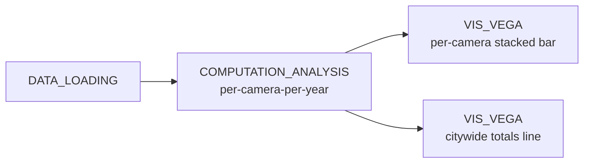

# Example: Temporal aggregation feeding linked Vega-Lite charts

This example demonstrates how a single time-aggregated table can feed two different Vega-Lite views — a per-camera stacked bar chart and a city-wide totals line chart — both reading from the same `COMPUTATION_ANALYSIS` output. The use case is Chicago's [speed-camera violations dataset](data/07-speed_camera_violations.zip): we group violations per camera per year, keep the top five offenders, and visualise both the per-camera breakdown and the year-over-year total.

## Pipeline overview



## Data

[07-speed_camera_violations.zip](data/07-speed_camera_violations.zip) — Chicago's open-data export of speed-camera violations.

Paths in the code below are relative to the directory you launched Curio from — run `curio start` from the repo root.

## Step 1: Load the violations CSV (`DATA_LOADING`)

Read the zipped CSV. Three trims at the source matter for runtime: `usecols` keeps only the five columns downstream actually reads; `parse_dates` parses `VIOLATION DATE` once instead of per-row; converting `CAMERA ID` to a `category` cuts the in-memory size of the resulting DataFrame from ~130 MB (400k rows × 9 cols of mostly strings) to ~16 MB. Without these the inter-node serialization can time out the frontend.

```python
import pandas as pd

df = pd.read_csv(
    'docs/examples/data/07-speed_camera_violations.zip',
    usecols=['CAMERA ID', 'VIOLATION DATE', 'VIOLATIONS', 'LATITUDE', 'LONGITUDE'],
    parse_dates=['VIOLATION DATE'], date_format='%m/%d/%Y',
)
df.dropna(inplace=True)
df['CAMERA ID'] = df['CAMERA ID'].astype('category')
return df
```

## Step 2: Per-camera-per-year aggregation (`COMPUTATION_ANALYSIS`)

Parse the date, derive a `Year` column, sum violations per camera per year, then narrow to the five cameras with the highest cumulative violations. The mean lat/lon per camera is merged in so the same table could later be used to plot the cameras on a map.

```python
import pandas as pd

df = arg
df['Year'] = df['VIOLATION DATE'].dt.year

yr_sum = (df.groupby(['CAMERA ID', 'Year'], observed=True)['VIOLATIONS']
    .sum()
    .reset_index()
    .rename(columns={'VIOLATIONS': 'total_violations'}))

top_ids = (df.groupby('CAMERA ID', observed=True)['VIOLATIONS']
    .sum()
    .sort_values(ascending=False)
    .head(5)
    .index
    .tolist())

yr_sum = yr_sum[yr_sum['CAMERA ID'].isin(top_ids)]

camera_pos = (df.groupby('CAMERA ID', observed=True)[['LATITUDE', 'LONGITUDE']]
    .mean()
    .reset_index())

yr_sum = yr_sum.merge(camera_pos, on='CAMERA ID')

return yr_sum
```

## Step 3: Per-camera stacked bar chart (`VIS_VEGA`)

The first view stacks violations by camera within each year so individual offenders stand out.

```json
{
  "$schema": "https://vega.github.io/schema/vega-lite/v6.json",
  "data": {"name": "table"},
  "width": 320,
  "height": 260,
  "config": {"bar": {"continuousBandSize": 18}},
  "mark": {"type": "bar"},
  "encoding": {
    "x": {"field": "Year", "type": "quantitative", "title": "Year"},
    "y": {
      "aggregate": "sum",
      "field": "total_violations",
      "type": "quantitative",
      "title": "Total Violations"
    },
    "color": {
      "field": "CAMERA ID",
      "type": "nominal",
      "legend": {"title": "Camera ID"}
    }
  }
}
```

## Step 4: Citywide totals line chart (`VIS_VEGA`)

The second view sums across the same five cameras to show the year-over-year trend.

```json
{
  "$schema": "https://vega.github.io/schema/vega-lite/v6.json",
  "data": {"name": "table"},
  "width": 320,
  "height": 260,
  "transform": [
    {
      "aggregate": [{"op": "sum", "field": "total_violations", "as": "total"}],
      "groupby": ["Year"]
    },
    {"sort": {"field": "Year"}}
  ],
  "mark": {"type": "line", "point": true},
  "encoding": {
    "x": {"field": "Year", "type": "quantitative", "title": "Year"},
    "y": {"field": "total", "type": "quantitative", "title": "Total Violations"}
  }
}
```

## Final result

The two views share an upstream table without recomputing it: the bar chart answers "*which* cameras drive each year's totals?", while the line chart answers "is the total trending up or down?". Adding a third view (e.g. a map of the five cameras using their merged lat/lon columns) is just one more node off the same `COMPUTATION_ANALYSIS` output.
