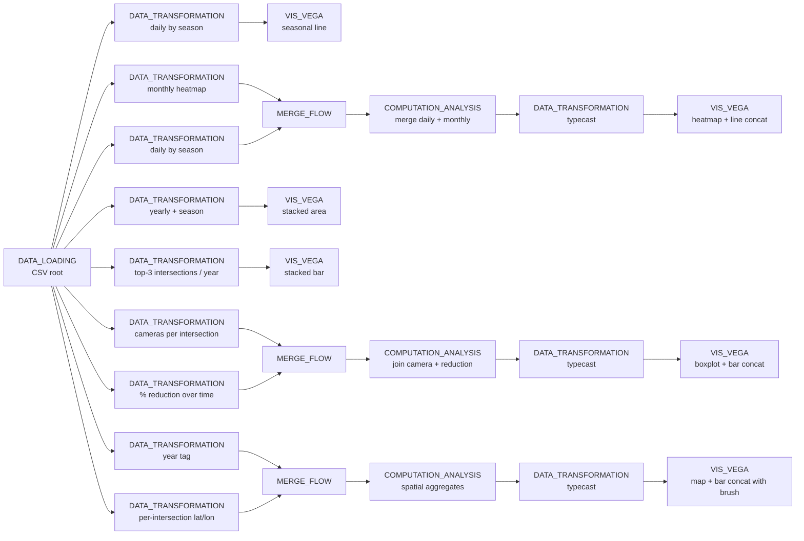

# Example: Multiple dataflows joined into one Vega-Lite dashboard

This example shows how several independent dataflows — each loading from the same source CSV and reducing it differently — can be joined back together via `MERGE_FLOW` and `COMPUTATION_ANALYSIS` to drive coordinated Vega-Lite views. The use case is Chicago's [red-light-violation dataset](data/08-red_light_violations.zip): six dataflow branches answer six analytical questions (seasonal trend, monthly heatmap, stacked area by season, top intersections, camera-count distribution, and spatial map), all reading from a single root `DATA_LOADING` node.

This example is intentionally large; the markdown shows the *shape* of each branch and one representative Vega-Lite spec per branch. The full set of 24 nodes is in [04-vega-lite-multi-flow-dashboard.json](04-vega-lite-multi-flow-dashboard.json).

## Pipeline overview



## Data

[08-red_light_violations.zip](data/08-red_light_violations.zip) — Chicago's open-data export of red-light camera violations.

Paths in the code below are relative to the directory you launched Curio from — run `curio start` from the repo root.

## Step 1: Load the violations CSV (`DATA_LOADING`)

Every branch starts here. The same loaded DataFrame is fed into every downstream transformation; Curio reuses the result rather than re-reading the file once per branch.

```python
import pandas as pd

df = pd.read_csv("docs/examples/data/08-red_light_violations.zip")
return df
```

## Branch A: Seasonal trend over time (`DATA_TRANSFORMATION` → `VIS_VEGA`)

Parse the date, derive month / year / season, then sum violations per day and tag each day with its season.

```python
import pandas as pd

df = arg.copy()
df['VIOLATION DATE'] = pd.to_datetime(df['VIOLATION DATE'])
df['Year']  = df['VIOLATION DATE'].dt.year
df['Month'] = df['VIOLATION DATE'].dt.month

def assign_season(month):
    if month in [12, 1, 2]: return "Winter"
    if month in [3, 4, 5]:  return "Spring"
    if month in [6, 7, 8]:  return "Summer"
    return "Fall"

df['Season'] = df['Month'].apply(assign_season)
df_trend = df.groupby(['VIOLATION DATE', 'Year', 'Season'])['VIOLATIONS'].sum().reset_index()
df_trend['VIOLATION DATE'] = df_trend['VIOLATION DATE'].astype(str)
return pd.DataFrame(df_trend)
```

A single line chart of daily totals coloured by season makes the seasonal pattern jump out:

```json
{
  "$schema": "https://vega.github.io/schema/vega-lite/v6.json",
  "width": 750, "height": 400,
  "title": "Seasonal Violation Trend (Daily)",
  "mark": {"type": "line", "point": true},
  "encoding": {
    "x": {"field": "VIOLATION DATE", "type": "temporal", "title": "Date"},
    "y": {"field": "VIOLATIONS", "type": "quantitative", "title": "Violations"},
    "color": {
      "field": "Season",
      "type": "nominal",
      "scale": {"domain": ["Winter","Spring","Summer","Fall"], "range": ["#1f77b4","#2ca02c","#ff7f0e","#9467bd"]}
    }
  }
}
```

## Branch B: Monthly heatmap + linked daily trend (`MERGE_FLOW` → concat view)

A second `DATA_TRANSFORMATION` aggregates by `(Year, Month)` for the heatmap. It is then merged with the Branch A daily-by-season output through a `MERGE_FLOW` and a `COMPUTATION_ANALYSIS` node, producing a unified table with both daily and yearly fields. The Vega-Lite spec is an `hconcat` of a heatmap (left) and a line chart (right) where clicking a year cell on the heatmap filters the line chart through a Vega-Lite `param`:

```json
{
  "params": [{"name": "yearFilter", "select": {"type": "point", "fields": ["Year"], "on": "click"}}],
  "hconcat": [
    {"mark": "rect", "encoding": {"x": {"field": "Month"}, "y": {"field": "Year"}, "color": {"aggregate": "sum", "field": "Yearly Total"}}},
    {"transform": [{"filter": "yearFilter.Year == null || datum.Year == yearFilter.Year"}],
     "mark": "line", "encoding": {"x": {"field": "VIOLATION DATE", "type": "temporal"}, "y": {"field": "Daily Violations"}}}
  ]
}
```

## Branch C: Stacked area by season+year (`DATA_TRANSFORMATION` → `VIS_VEGA`)

A standalone branch that aggregates totals by `(Year, Season)` and renders a stacked area chart — useful for spotting year-over-year shifts in seasonal mix.

## Branch D: Top-3 intersections per year (`DATA_TRANSFORMATION` → `VIS_VEGA`)

Group by `(INTERSECTION, Year)`, rank within each year, and keep rank ≤ 3. Render as a stacked bar chart so the same intersection appearing across multiple years is immediately visible.

## Branch E: Camera count vs. compliance (`MERGE_FLOW` → concat view)

Two `DATA_TRANSFORMATION` nodes feed a `MERGE_FLOW`: the first counts unique cameras per intersection and bins them into `1 / 2 / 3 / 4+`; the second computes the percent reduction in violations between each intersection's first and last year. After a merge + cleanup pass the result drives an `hconcat` of a boxplot (violation distribution per camera-count bin) and a per-intersection bar chart (percent reduction), wired together through a `cameraFilter` param so picking a bin filters the bar chart.

## Branch F: Spatial brush ↔ top-N bar (`MERGE_FLOW` → concat view)

The final branch aggregates violations per `(INTERSECTION, LATITUDE, LONGITUDE)`, joins with a year-tagged copy of the data through `MERGE_FLOW` + `COMPUTATION_ANALYSIS`, and renders an `hconcat` of a circle map (left) and a bar chart of the top 15 intersections (right). A Vega-Lite `interval` selection on the map filters the bar chart in real time:

```json
{
  "hconcat": [
    {
      "params": [{"name": "spatialBrush", "select": {"type": "interval", "encodings": ["x", "y"]}}],
      "mark": "circle",
      "encoding": {
        "x": {"field": "LONGITUDE", "type": "quantitative"},
        "y": {"field": "LATITUDE",  "type": "quantitative"},
        "size": {"field": "TOTAL_VIOLATIONS"},
        "color": {"field": "CAMERA_BIN", "type": "nominal"}
      }
    },
    {
      "transform": [
        {"filter": {"param": "spatialBrush"}},
        {"window": [{"op": "rank", "as": "rank"}], "sort": [{"field": "TOTAL_VIOLATIONS", "order": "descending"}]},
        {"filter": "datum.rank <= 15"}
      ],
      "mark": "bar",
      "encoding": {
        "x": {"field": "TOTAL_VIOLATIONS", "type": "quantitative"},
        "y": {"field": "INTERSECTION", "type": "nominal", "sort": "-x"}
      }
    }
  ]
}
```

## Final result

Each branch answers a different question (when, where, who, how much, how does enforcement compare?) but they all read from the same root `DATA_LOADING` node. The `MERGE_FLOW` + `COMPUTATION_ANALYSIS` pattern is what lets Branches B / E / F join two independent reductions into a single coordinated view. Adding a new analytical question is one more branch off the root — the existing branches are unaffected.
