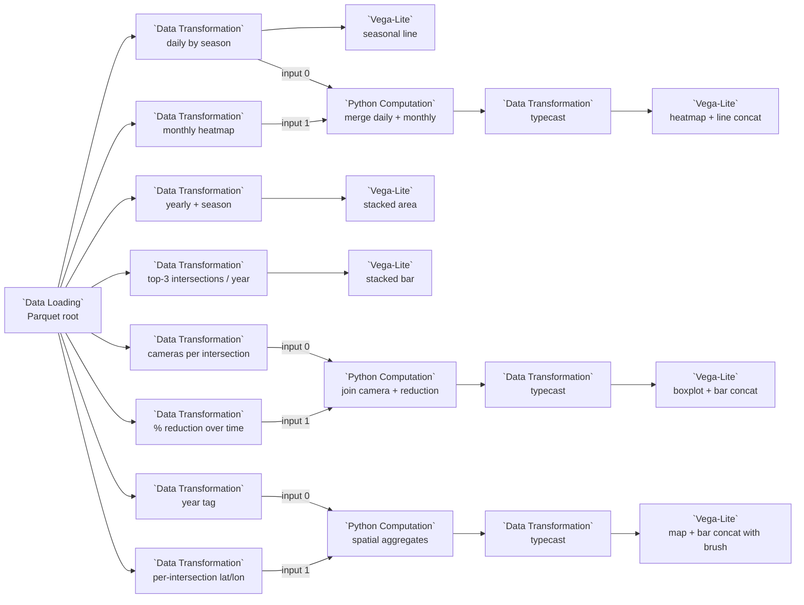

# Example: Multiple dataflows joined into one Vega-Lite dashboard

This example shows how several independent dataflows, each loading from the same source table and reducing it differently, can be joined back together by a `Python Computation` node with several inputs to drive coordinated Vega-Lite views. The use case is Chicago's red-light-violation dataset: six dataflow branches answer six analytical questions (seasonal trend, monthly heatmap, stacked area by season, top intersections, camera-count distribution, and spatial map), all reading from a single root `Data Loading` node.

This example is intentionally large; the markdown shows the *shape* of each branch and one representative Vega-Lite spec per branch. The full set of 21 nodes is in [04-vega-lite-multi-flow-dashboard.json](04-vega-lite-multi-flow-dashboard.json).

## Pipeline overview


```mermaid
flowchart LR
  L[`Data Loading`<br/>Parquet root]

  L --> A[`Data Transformation`<br/>daily by season] --> AV[`Vega-Lite`<br/>seasonal line]

  L --> B1[`Data Transformation`<br/>monthly heatmap]
  A -->|input 0| BC[`Python Computation`<br/>merge daily + monthly]
  B1 -->|input 1| BC --> BT[`Data Transformation`<br/>typecast] --> BV[`Vega-Lite`<br/>heatmap + line concat]

  L --> C[`Data Transformation`<br/>yearly + season] --> CV[`Vega-Lite`<br/>stacked area]

  L --> D[`Data Transformation`<br/>top-3 intersections / year] --> DV[`Vega-Lite`<br/>stacked bar]

  L --> E1[`Data Transformation`<br/>cameras per intersection]
  L --> E2[`Data Transformation`<br/>% reduction over time]
  E1 -->|input 0| EC[`Python Computation`<br/>join camera + reduction]
  E2 -->|input 1| EC --> ET[`Data Transformation`<br/>typecast] --> EV[`Vega-Lite`<br/>boxplot + bar concat]

  L --> F1[`Data Transformation`<br/>year tag]
  L --> F2[`Data Transformation`<br/>per-intersection lat/lon]
  F1 -->|input 0| FC[`Python Computation`<br/>spatial aggregates]
  F2 -->|input 1| FC --> FT[`Data Transformation`<br/>typecast] --> FV[`Vega-Lite`<br/>map + bar concat with brush]
```

## Data

This example reads its inputs from the [Data Catalog](../DATA-CATALOG.md). Each loader node
addresses a dataset by id via `curio_data_path("<id>")`, so the dataflow runs unchanged from a checkout, a Docker deployment or a `pip` install.

| Dataset | Id | Format | Size |
|---|---|---|---|
| Chicago Red-Light Violations | `data.cityofchicago.red-light-violations` | parquet | 354,418 rows |

The catalog dataset is a Parquet conversion of the original zipped export, so it loads faster
and takes less space in the repo while keeping every row. It ships in the committed catalog under
`datasets/` and is already added to this dataflow. Source: [Chicago Data Portal](https://data.cityofchicago.org/).

## Step 1: Load the violations table (`Data Loading`)

Every branch starts here. The same loaded DataFrame is fed into every downstream transformation; Curio reuses the result rather than re-reading the file once per branch.

```python
import pandas as pd

dataset_path = curio_data_path("data.cityofchicago.red-light-violations")
df = pd.read_parquet(dataset_path)
return df
```

## Branch A: Seasonal trend over time (`Data Transformation` → `Vega-Lite`)

Parse the date, derive month / year / season, then sum violations per day and tag each day with its season.

```python
import pandas as pd

df = arg.copy()
df['VIOLATION DATE'] = pd.to_datetime(df['VIOLATION DATE'])
df['Year'] = df['VIOLATION DATE'].dt.year
df['Month'] = df['VIOLATION DATE'].dt.month

def assign_season(month):
    if month in [12, 1, 2]:
        return "Winter"
    elif month in [3, 4, 5]:
        return "Spring"
    elif month in [6, 7, 8]:
        return "Summer"
    else:
        return "Fall"

df['Season'] = df['Month'].apply(assign_season)

df_trend = df.groupby(['VIOLATION DATE', 'Year', 'Season'])['VIOLATIONS'].sum().reset_index()
df_trend['VIOLATION DATE'] = df_trend['VIOLATION DATE'].astype(str)

return pd.DataFrame(df_trend)
```

A single line chart of daily totals coloured by season makes the seasonal pattern jump out:

```json
{
  "$schema": "https://vega.github.io/schema/vega-lite/v6.json",
  "width": 750, "height": 400,
  "title": "Seasonal Violation Trend (Daily)",
  "mark": {"type": "line", "point": true},
  "encoding": {
    "x": {"field": "VIOLATION DATE", "type": "temporal", "title": "Date"},
    "y": {"field": "VIOLATIONS", "type": "quantitative", "title": "Violations"},
    "color": {
      "field": "Season",
      "type": "nominal",
      "scale": {"domain": ["Winter","Spring","Summer","Fall"], "range": ["#1f77b4","#2ca02c","#ff7f0e","#9467bd"]}
    }
  }
}
```

## Branch B: Monthly heatmap + linked daily trend (two inputs → concat view)

A second `Data Transformation` aggregates by `(Year, Month)` for the heatmap. Both tables go into one `Python Computation` node: the Branch A daily-by-season output on its first input circle and the heatmap table on its second. Its code reads each through an input chip (see [Several inputs](../USAGE.md#several-inputs)) and produces a unified table with both daily and yearly fields:

```python
import pandas as pd

df_trend = pd.DataFrame([!! input 0 !!])
heatmap_data = pd.DataFrame([!! input 1 !!])

df_trend['VIOLATION DATE'] = pd.to_datetime(df_trend['VIOLATION DATE'])

summary = heatmap_data.groupby('Year')['VIOLATIONS'].sum().reset_index()

merged = df_trend.merge(summary, on='Year', how='left')

final = merged[['VIOLATION DATE', 'VIOLATIONS_x', 'Season', 'VIOLATIONS_y']]

final.columns = ['VIOLATION DATE', 'Daily Violations', 'Season', 'Yearly Total']

final['VIOLATION DATE'] = final['VIOLATION DATE'].astype(str)

array_data = final.to_dict(orient='records')

shape = [final.shape[0], final.shape[1]]

return pd.DataFrame(array_data)
```

After a typecast pass, the Vega-Lite spec is an `hconcat` of a heatmap (left) and a line chart (right) where clicking a year cell on the heatmap filters the line chart through a Vega-Lite `param`:

```json
{
  "hconcat": [
    {
      "params": [{"name": "yearFilter", "select": {"type": "point", "fields": ["Year"], "on": "click"}}],
      "mark": "rect",
      "encoding": {
        "x": {"field": "Month", "type": "ordinal"},
        "y": {"field": "Year", "type": "ordinal"},
        "color": {"aggregate": "sum", "field": "Yearly Total", "type": "quantitative"}
      }
    },
    {
      "transform": [{"filter": "yearFilter.Year == null || datum.Year == yearFilter.Year"}],
      "mark": "line",
      "encoding": {
        "x": {"field": "VIOLATION DATE", "type": "temporal"},
        "y": {"field": "Daily Violations", "type": "quantitative"},
        "color": {"field": "Season", "type": "nominal"}
      }
    }
  ]
}
```

## Branch C: Stacked area by season+year (`Data Transformation` → `Vega-Lite`)

A standalone branch that aggregates totals by `(Year, Season)` and renders a stacked area chart, useful for spotting year-over-year shifts in seasonal mix.

## Branch D: Top-3 intersections per year (`Data Transformation` → `Vega-Lite`)

Group by `(INTERSECTION, Year)`, rank within each year, and keep rank ≤ 3. Render as a stacked bar chart so the same intersection appearing across multiple years is immediately visible.

## Branch E: Camera count vs. compliance (two inputs → concat view)

Two `Data Transformation` nodes feed one `Python Computation` node: the first, on its first input circle, counts unique cameras per intersection and bins them into `1 / 2 / 3 / 4+`; the second, on its second circle, computes the percent reduction in violations between each intersection's first and last year. The node joins `[!! input 0 !!]` and `[!! input 1 !!]` on `INTERSECTION`, and after a cleanup pass the result drives an `hconcat` of a boxplot (violation distribution per camera-count bin) and a per-intersection bar chart (percent reduction), wired together through a `cameraFilter` param so picking a bin filters the bar chart:

```json
{
  "$schema": "https://vega.github.io/schema/vega-lite/v6.json",
  "params": [
    {
      "name": "cameraFilter",
      "bind": {
        "input": "select",
        "options": ["1", "2", "3", "4+"],
        "labels": ["1 Camera", "2 Cameras", "3 Cameras", "4+ Cameras"]
      }
    }
  ],
  "hconcat": [
    {
      "width": 500,
      "mark": "boxplot",
      "encoding": {
        "x": {
          "field": "CAMERA_BIN",
          "type": "nominal",
          "title": "Camera Count"
        },
        "y": {
          "field": "VIOLATIONS",
          "type": "quantitative",
          "title": "Violations"
        },
        "color": {
          "field": "CAMERA_BIN",
          "type": "nominal"
        }
      }
    },
    {
      "width": 500,
      "mark": {
        "type": "bar",
        "cursor": "pointer"
      },
      "transform": [
        { "filter": "cameraFilter == null || datum.CAMERA_BIN == cameraFilter" }
      ],
      "encoding": {
        "x": {
          "field": "Percent_Reduction",
          "type": "quantitative",
          "title": "Percent Reduction"
        },
        "y": {
          "field": "INTERSECTION",
          "type": "nominal",
          "sort": "-x",
          "title": "Intersection"
        },
        "color": {
          "field": "Percent_Reduction",
          "type": "quantitative",
          "scale": { "scheme": "blues" }
        }
      }
    }
  ]
}
```

## Branch F: Spatial brush ↔ top-N bar (two inputs → concat view)

The final branch feeds two `Data Transformation` outputs into one `Python Computation` node: a year-tagged copy of the data on its first input circle and the per-intersection totals on its second. The node aggregates `[!! input 0 !!]` per `(INTERSECTION, LATITUDE, LONGITUDE)` into total violations and a camera-count bin, and the branch renders an `hconcat` of a circle map (left) and a bar chart of the top 15 intersections (right). A Vega-Lite `interval` selection on the map filters the bar chart in real time:

```json
{
  "hconcat": [
    {
      "params": [{"name": "spatialBrush", "select": {"type": "interval", "encodings": ["x", "y"]}}],
      "mark": "circle",
      "encoding": {
        "x": {"field": "LONGITUDE", "type": "quantitative"},
        "y": {"field": "LATITUDE",  "type": "quantitative"},
        "size": {"field": "TOTAL_VIOLATIONS"},
        "color": {"field": "CAMERA_BIN", "type": "nominal"}
      }
    },
    {
      "transform": [
        {"filter": {"param": "spatialBrush"}},
        {"window": [{"op": "rank", "as": "rank"}], "sort": [{"field": "TOTAL_VIOLATIONS", "order": "descending"}]},
        {"filter": "datum.rank <= 15"}
      ],
      "mark": "bar",
      "encoding": {
        "x": {"field": "TOTAL_VIOLATIONS", "type": "quantitative"},
        "y": {"field": "INTERSECTION", "type": "nominal", "sort": "-x"}
      }
    }
  ]
}
```

## Final result

Each branch answers a different question (when, where, who, how much, how does enforcement compare?) but they all read from the same root `Data Loading` node. A `Python Computation` node with two inputs is what lets Branches B / E / F bring two independent reductions into a single coordinated view. Adding a new analytical question is one more branch off the root; the existing branches are unaffected.
