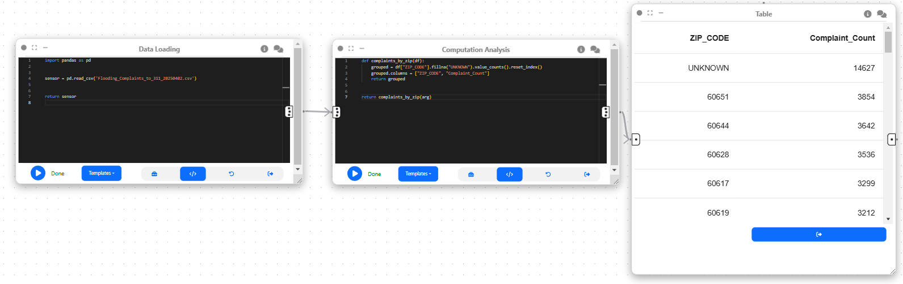
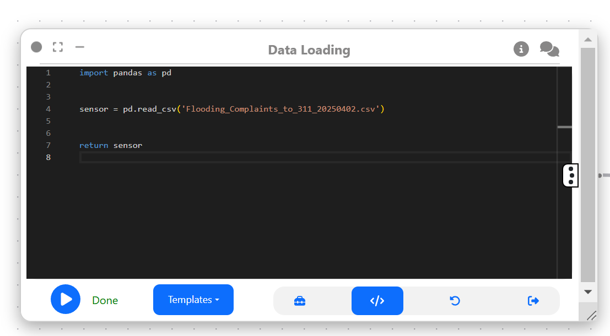
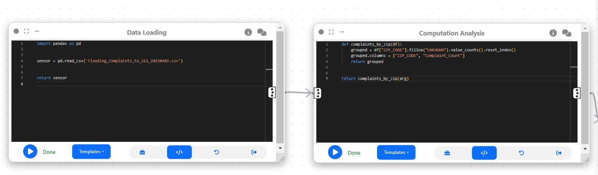

# Example: Flooding complaints By Zip code

Author: [Shaun Shannon](https://github.com/shaun-shannon)

In this example, we will explore how Curio can perform simple operations to compute the total number of flooding complaints ordered by Zip Code using Pandas. Here is the overview of the dataflow pipeline:



Before you begin, please familiarize yourself with Curio’s main concepts and functionalities by reading our [usage guide](https://github.com/urban-toolkit/curio/blob/main/docs/USAGE.md).

For completeness, we also include the template code in each dataflow step.

## Step 1: Load in the flooding complaints dataset

This example uses the [Flooding Complaints to 311](https://data.cityofchicago.org/Service-Requests/Flooding-Complaints-to-311/qrmr-m89j) dataset from the Chicago Data Portal. To get started with performing data analysis on the dataset, it needs to be imported into Curio. The best way to do that is to use a **Data Loading Node** to do so. The following code will complete this step:

```
import pandas as pd

sensor = pd.read_csv('Flooding_Complaints_to_311_20250402.csv')

return sensor
```



## Step 2: Performing computational analysis to find complaints per Zip code

Now that we loaded the dataset using the **Data Loading Node**, we can perform simple computational analyses using Curio's **Computational Analysis Node** to find the total number of complaints per zip code. Here is the code to do so:

```
def complaints_by_zip(df):

grouped = df["ZIP_CODE"].fillna("UNKNOWN").value_counts().reset_index()

grouped.columns = ["ZIP_CODE",  "Complaint_Count"]

return grouped

return complaints_by_zip(arg)
```



## Step 3: Display results using a table

In the last step, we performed computational analysis to get the total number of complaints per zip code. A possible way to see these types of results is using a table. We will connect the **Computational Analysis Node** with a **Data Pool** to display our results in Table format. You do not need to include any code in the **Data Pool**.


