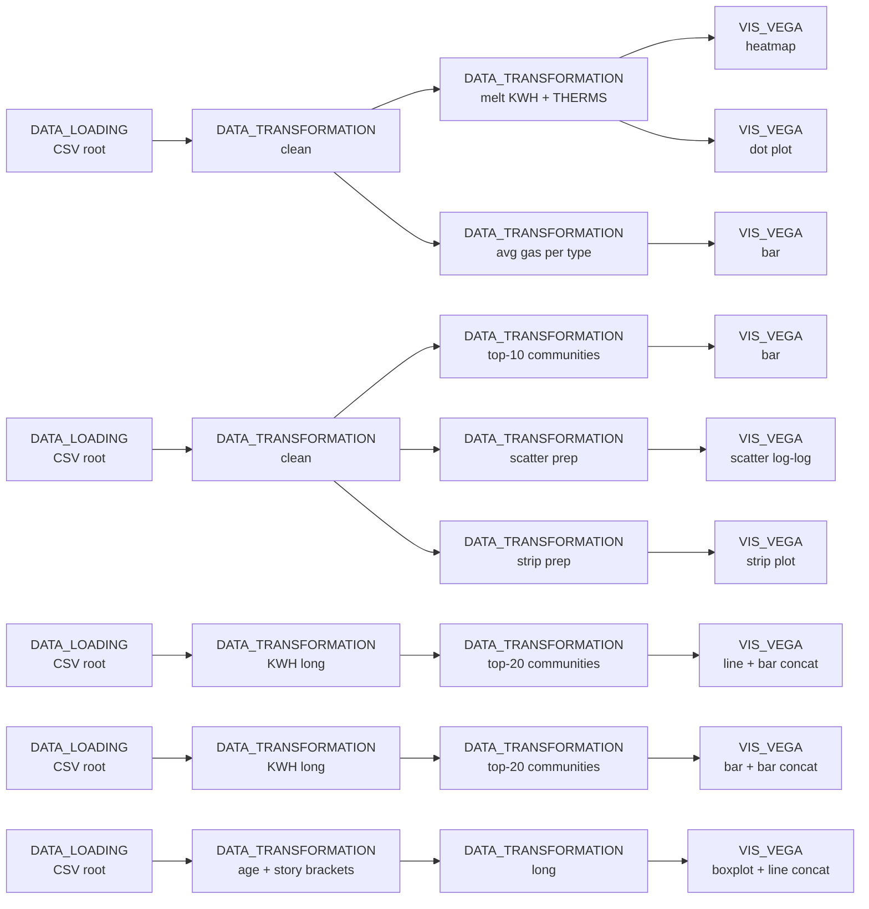

# Example: Faceted Vega-Lite drill-down across multiple axes

This example uses five independent dataflows to slice the same building-energy dataset along five orthogonal axes — building type, community area, monthly trend, monthly drill-down by community, and building age × stories. Each dataflow re-loads the source CSV (which Curio caches per file) and produces a focused Vega-Lite view, demonstrating how a large analytical question can be decomposed into small, independently runnable branches that the user can scrub interactively.

This example is intentionally large; the markdown shows the *shape* of each dataflow and one representative Vega-Lite spec per dataflow. The full set of 27 nodes is in [05-vega-lite-multi-view-drilldown.json](05-vega-lite-multi-view-drilldown.json).

## Pipeline overview



## Data

[11-energy_usage.csv](data/11-energy_usage.csv) — Chicago Energy Usage 2010 dataset.

Paths in the code below are relative to the directory you launched Curio from — run `curio start` from the repo root.

## Step 1: Energy split by building type (`DATA_LOADING` → `DATA_TRANSFORMATION` → `VIS_VEGA`)

Load the CSV → run a `clean()` step that drops missing rows, fills medians, removes IQR outliers, and standardises community names → `melt` electricity (KWH) and gas (THERMS) totals into a long format with a per-building-type percentage. Three views consume this:

- A **heatmap** with `BUILDING TYPE` × `ENERGY TYPE` cells coloured by total value (Vega-Lite `mark: "rect"`).
- A **dot plot** with the same axes but circles sized and coloured by value, useful for spotting outlier categories.
- A **bar chart** of average gas usage per building type (one more `DATA_TRANSFORMATION` off the cleaned root).

```json
{
  "$schema": "https://vega.github.io/schema/vega-lite/v6.json",
  "data": {"name": "energy_transformed_1"},
  "mark": "rect",
  "encoding": {
    "x": {"field": "BUILDING TYPE", "type": "nominal"},
    "y": {"field": "ENERGY TYPE",   "type": "nominal"},
    "color": {"field": "VALUE", "type": "quantitative", "scale": {"scheme": "viridis"}}
  },
  "title": "Energy Consumption Heatmap (KWH + THERMS)"
}
```

## Step 2: Community-level rank and scatter (`DATA_LOADING` → `DATA_TRANSFORMATION` → `VIS_VEGA`)

A second `DATA_LOADING` node re-reads the CSV (Curio caches the file read) and a fresh `DATA_TRANSFORMATION` cleans it, this time keeping `COMMUNITY AREA NAME`. Three branches off the cleaned table produce:

- The **top-10 communities** by average total energy use, rendered as a sorted bar chart.
- A log-log **scatter plot** of `TOTAL KWH` vs `TOTAL THERMS`, coloured by building type, to show whether high electricity consumers are also high gas consumers.
- A **strip plot** of `TOTAL THERMS` per building type (with a `< 500_000` filter to keep the axis readable).

## Step 3: Monthly KWH trend by community (`DATA_LOADING` → `DATA_TRANSFORMATION` → `VIS_VEGA`)

Reshape the dataset's wide monthly KWH columns (`KWH JANUARY 2010`, … `KWH DECEMBER 2010`) into long form, narrow to the top 20 communities by mean KWH, then render a `vconcat` of a line chart (one line per community, click to highlight via a `commPick` param) and a horizontal bar chart of the selected community's monthly average — a classic *focus + context* drill-down.

```json
{
  "params": [{"name": "commPick", "select": {"type": "point", "fields": ["COMMUNITY AREA NAME"]}}],
  "vconcat": [
    {"mark": "line",
     "encoding": {
       "x": {"field": "Month", "type": "nominal", "sort": ["JANUARY", "FEBRUARY", "..."]},
       "y": {"field": "KWH", "type": "quantitative"},
       "color": {"field": "COMMUNITY AREA NAME", "scale": {"scheme": "category20"}},
       "opacity": {"condition": {"param": "commPick", "value": 1}, "value": 0.2}
     }},
    {"transform": [{"filter": {"param": "commPick"}}], "mark": "bar", "encoding": {"y": {"field": "COMMUNITY AREA NAME"}, "x": {"aggregate": "mean", "field": "KWH"}}}
  ]
}
```

## Step 4: Monthly bar with brushable filter (`DATA_LOADING` → `DATA_TRANSFORMATION` → `VIS_VEGA`)

Same long-form reshape as Step 3, but the Vega-Lite spec is a different `vconcat`: a top monthly-average bar chart with an `interval` brush along `x`, and a bottom community bar chart filtered by the brush. Brushing months at the top reveals which communities dominate consumption *within those months*.

## Step 5: Energy use by building age × stories (`DATA_LOADING` → `DATA_TRANSFORMATION` → `VIS_VEGA`)

Load the CSV → categorise `AVERAGE STORIES` into `1 / 2 / 3-5 / 6-10 / 11+ stories` and `AVERAGE BUILDING AGE` into `0-20 / 21-40 / 41-60 / 61-80 / 81+ yrs` → reshape monthly KWH columns into long form. The view is a `vconcat` of a boxplot (Total KWH per age bracket) and a line chart (monthly KWH average per age bracket), both filtered by a `storySelect` dropdown bound to story brackets.

```json
{
  "params": [{"name": "storySelect", "bind": {"input": "select", "options": ["1 story", "2 stories", "3-5 stories", "6-10 stories", "11+ stories"]}, "value": "1 story"}],
  "vconcat": [
    {"transform": [{"filter": "datum['STORY BRACKET'] == storySelect"}],
     "mark": "boxplot",
     "encoding": {"x": {"field": "AGE BRACKET", "sort": ["0-20 yrs", "21-40 yrs", "..."]}, "y": {"field": "TOTAL KWH"}}},
    {"transform": [{"filter": "datum['STORY BRACKET'] == storySelect"}],
     "mark": {"type": "line", "point": true},
     "encoding": {"x": {"field": "Month"}, "y": {"aggregate": "mean", "field": "KWH"}, "color": {"field": "AGE BRACKET"}}}
  ]
}
```

## Final result

The five dataflows give the analyst five independent entry points into the same dataset. Because each is a self-contained branch, an analyst exploring building-age effects (Step 5) can re-run only that branch without disturbing the community-level views (Steps 2-4) — Curio's per-node caching means the source CSV reads only once per Python process. Adding a sixth axis (e.g. by ZIP code) is one more `DATA_LOADING` → `DATA_TRANSFORMATION` → `VIS_VEGA` chain, isolated from the others.
