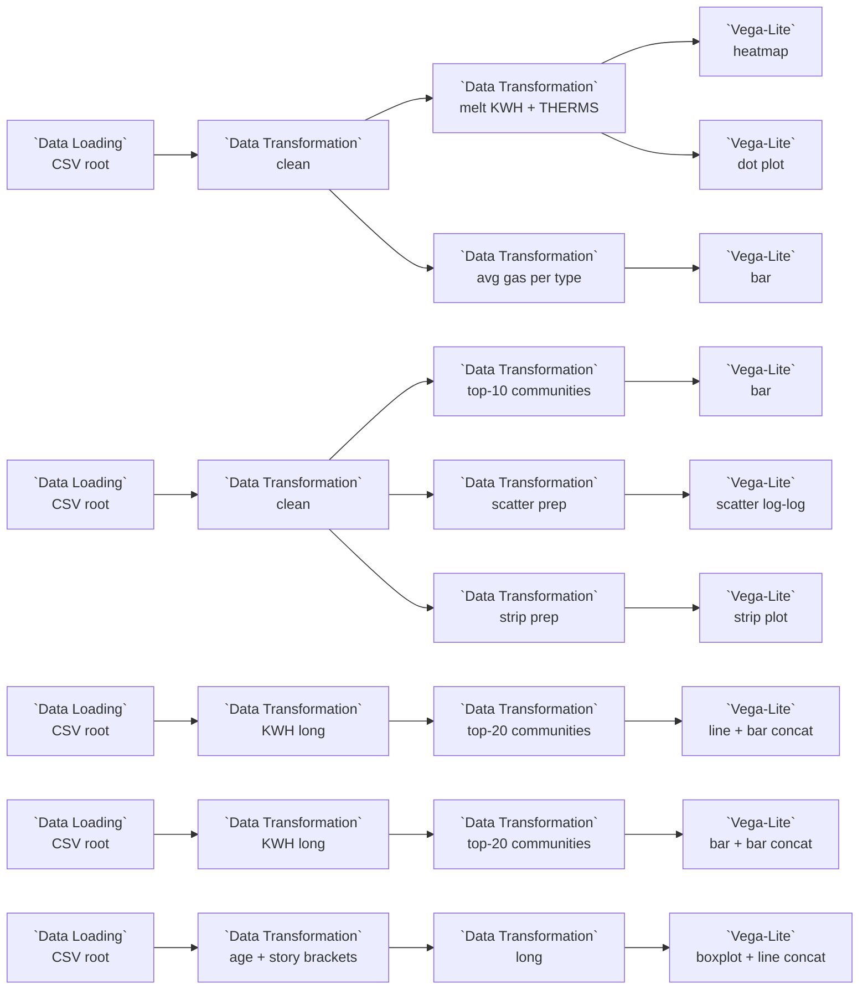

# Example: Faceted Vega-Lite drill-down across multiple axes

This example uses five independent dataflows to slice the same building-energy dataset along five orthogonal axes: building type, community area, monthly trend, monthly drill-down by community, and building age by stories. Each dataflow re-loads the source CSV (which Curio caches per file) and produces a focused Vega-Lite view, demonstrating how a large analytical question can be decomposed into small, independently runnable branches that the user can scrub interactively.

This example is intentionally large; the markdown shows the *shape* of each dataflow and one representative Vega-Lite spec per dataflow. The full set of 27 nodes is in [05-vega-lite-multi-view-drilldown.json](05-vega-lite-multi-view-drilldown.json).

## Pipeline overview


```mermaid
flowchart LR
  L1[`Data Loading`<br/>CSV root] --> C1[`Data Transformation`<br/>clean]
  C1 --> M1[`Data Transformation`<br/>melt KWH + THERMS] --> H1[`Vega-Lite`<br/>heatmap]
  M1 --> H2[`Vega-Lite`<br/>dot plot]
  C1 --> G1[`Data Transformation`<br/>avg gas per type] --> H3[`Vega-Lite`<br/>bar]

  L2[`Data Loading`<br/>CSV root] --> C2[`Data Transformation`<br/>clean] --> T2a[`Data Transformation`<br/>top-10 communities] --> V2a[`Vega-Lite`<br/>bar]
  C2 --> T2b[`Data Transformation`<br/>scatter prep] --> V2b[`Vega-Lite`<br/>scatter log-log]
  C2 --> T2c[`Data Transformation`<br/>strip prep] --> V2c[`Vega-Lite`<br/>strip plot]

  L3[`Data Loading`<br/>CSV root] --> C3[`Data Transformation`<br/>KWH long] --> T3[`Data Transformation`<br/>top-20 communities] --> V3[`Vega-Lite`<br/>line + bar concat]

  L4[`Data Loading`<br/>CSV root] --> C4[`Data Transformation`<br/>KWH long] --> T4[`Data Transformation`<br/>top-20 communities] --> V4[`Vega-Lite`<br/>bar + bar concat]

  L5[`Data Loading`<br/>CSV root] --> C5[`Data Transformation`<br/>age + story brackets] --> M5[`Data Transformation`<br/>long] --> V5[`Vega-Lite`<br/>boxplot + line concat]
```

## Data

This example reads its inputs from the [Data Catalog](../DATA-CATALOG.md). Each loader node
addresses a dataset by id via `curio_dataset_path("<id>")` rather than by a repo-relative path,
so the dataflow runs unchanged from a checkout, a Docker deployment or a `pip` install.

| Dataset | Id | Format | Size |
|---|---|---|---|
| Chicago Energy Usage 2010 | `data.cityofchicago.energy-usage-2010` | csv | 5,000 rows |

All five `Data Loading` nodes read the same dataset by id; it ships in the committed catalog under
`datasets/` and is already added to this dataflow. Source: [Chicago Data Portal](https://data.cityofchicago.org/).

## Step 1: Energy split by building type (`Data Loading` → `Data Transformation` → `Vega-Lite`)

Load the CSV → run a `clean()` step that drops missing rows, fills medians, removes IQR outliers, and standardises community names → `melt` electricity (KWH) and gas (THERMS) totals into a long format with a per-building-type percentage. Three views consume this:

- A **heatmap** with `BUILDING TYPE` × `ENERGY TYPE` cells coloured by total value (Vega-Lite `mark: "rect"`).
- A **dot plot** with the same axes but circles sized and coloured by value, useful for spotting outlier categories.
- A **bar chart** of average gas usage per building type (one more `Data Transformation` off the cleaned root).

```json
{
  "$schema": "https://vega.github.io/schema/vega-lite/v6.json",
  "data": {"name": "energy_transformed_1"},
  "mark": "rect",
  "encoding": {
    "x": {"field": "BUILDING TYPE", "type": "nominal"},
    "y": {"field": "ENERGY TYPE",   "type": "nominal"},
    "color": {"field": "VALUE", "type": "quantitative", "scale": {"scheme": "viridis"}}
  },
  "title": "Energy Consumption Heatmap (KWH + THERMS)"
}
```

## Step 2: Community-level rank and scatter (`Data Loading` → `Data Transformation` → `Vega-Lite`)

A second `Data Loading` node re-reads the CSV (Curio caches the file read) and a fresh `Data Transformation` cleans it, this time keeping `COMMUNITY AREA NAME`. Three branches off the cleaned table produce:

- The **top-10 communities** by average total energy use, rendered as a sorted bar chart.
- A log-log **scatter plot** of `TOTAL KWH` vs `TOTAL THERMS`, coloured by building type, to show whether high electricity consumers are also high gas consumers.
- A **strip plot** of `TOTAL THERMS` per building type (with a `< 500_000` filter to keep the axis readable).

## Step 3: Monthly KWH trend by community (`Data Loading` → `Data Transformation` → `Vega-Lite`)

Reshape the dataset's wide monthly KWH columns (`KWH JANUARY 2010`, … `KWH DECEMBER 2010`) into long form, narrow to the top 20 communities by mean KWH, then render a `vconcat` of a line chart (one line per community, click to highlight via a `commPick` param) and a horizontal bar chart of the selected community's monthly average, a classic *focus + context* drill-down.

```json
{
  "$schema": "https://vega.github.io/schema/vega-lite/v6.json",
  "params": [
    {
      "name": "commPick",
      "select": {
        "type": "point",
        "fields": ["COMMUNITY AREA NAME"]
      }
    }
  ],
  "vconcat": [
    {
      "title": "Click on a Line to Highlight a Community",
      "width": 650,
      "height": 400,
      "mark": {
        "type": "line",
        "interpolate": "monotone"
      },
      "encoding": {
        "x": {
          "field": "Month",
          "type": "nominal",
          "sort": [
            "JANUARY",
            "FEBRUARY",
            "MARCH",
            "APRIL",
            "MAY",
            "JUNE",
            "JULY",
            "AUGUST",
            "SEPTEMBER",
            "OCTOBER",
            "NOVEMBER",
            "DECEMBER"
          ],
          "axis": { "labelAngle": 45 }
        },
        "y": {
          "field": "KWH",
          "type": "quantitative",
          "title": "Total KWH",
          "scale": { "zero": false }
        },
        "color": {
          "field": "COMMUNITY AREA NAME",
          "type": "nominal",
          "scale": { "scheme": "category20" },
          "legend": { "columns": 2 }
        },
        "opacity": {
          "condition": { "param": "commPick", "value": 1 },
          "value": 0.2
        },
        "tooltip": [
          { "field": "COMMUNITY AREA NAME", "title": "Community" },
          { "field": "Month" },
          { "field": "KWH", "format": ",.0f" }
        ]
      }
    },
    {
      "title": "Average KWH of Selected Community",
      "width": 650,
      "height": 300,
      "mark": "bar",
      "encoding": {
        "y": {
          "field": "COMMUNITY AREA NAME",
          "type": "nominal",
          "sort": "-x"
        },
        "x": {
          "aggregate": "mean",
          "field": "KWH",
          "type": "quantitative",
          "title": "Avg KWH"
        },
        "color": {
          "field": "COMMUNITY AREA NAME",
          "type": "nominal"
        }
      },
      "transform": [{ "filter": { "param": "commPick" } }]
    }
  ]
}
```

## Step 4: Monthly bar with brushable filter (`Data Loading` → `Data Transformation` → `Vega-Lite`)

Same long-form reshape as Step 3, but the Vega-Lite spec is a different `vconcat`: a top monthly-average bar chart with an `interval` brush along `x`, and a bottom community bar chart filtered by the brush. Brushing months at the top reveals which communities dominate consumption *within those months*.

## Step 5: Energy use by building age × stories (`Data Loading` → `Data Transformation` → `Vega-Lite`)

Load the CSV → categorise `AVERAGE STORIES` into `1 / 2 / 3-5 / 6-10 / 11+ stories` and `AVERAGE BUILDING AGE` into `0-20 / 21-40 / 41-60 / 61-80 / 81+ yrs` → reshape monthly KWH columns into long form. The view is a `vconcat` of a boxplot (Total KWH per age bracket) and a line chart (monthly KWH average per age bracket), both filtered by a `storySelect` dropdown bound to story brackets.

```json
{
  "$schema": "https://vega.github.io/schema/vega-lite/v6.json",
  "params": [
    {
      "name": "storySelect",
      "bind": {
        "input": "select",
        "options": [
          "1 story",
          "2 stories",
          "3-5 stories",
          "6-10 stories",
          "11+ stories"
        ]
      },
      "value": "1 story"
    }
  ],
  "vconcat": [
    {
      "width": 600,
      "title": {
        "text": "Distribution of Total KWH by Age (Box Plot)",
        "align": "center"
      },
      "transform": [{ "filter": "datum['STORY BRACKET'] == storySelect" }],
      "mark": "boxplot",
      "encoding": {
        "x": {
          "field": "AGE BRACKET",
          "type": "nominal",
          "sort": ["0-20 yrs", "21-40 yrs", "41-60 yrs", "61-80 yrs", "81+ yrs"]
        },
        "y": {
          "field": "TOTAL KWH",
          "type": "quantitative",
          "title": "Total KWH"
        },
        "color": {
          "field": "AGE BRACKET",
          "type": "nominal",
          "legend": {
            "orient": "right",
            "anchor": "middle",
            "direction": "vertical"
          }
        },
        "tooltip": [{ "field": "AGE BRACKET" }, { "field": "TOTAL KWH" }]
      }
    },
    {
      "width": 600,
      "title": {
        "text": "Monthly Avg KWH Trend by Age (for Selected Stories)",
        "align": "center"
      },
      "transform": [{ "filter": "datum['STORY BRACKET'] == storySelect" }],
      "mark": { "type": "line", "point": true },
      "encoding": {
        "x": {
          "field": "Month",
          "type": "ordinal",
          "sort": [
            "JANUARY",
            "FEBRUARY",
            "MARCH",
            "APRIL",
            "MAY",
            "JUNE",
            "JULY",
            "AUGUST",
            "SEPTEMBER",
            "OCTOBER",
            "NOVEMBER",
            "DECEMBER"
          ]
        },
        "y": {
          "aggregate": "mean",
          "field": "KWH",
          "type": "quantitative",
          "title": "Avg Monthly KWH"
        },
        "color": {
          "field": "AGE BRACKET",
          "type": "nominal",
          "legend": {
            "orient": "right",
            "anchor": "middle",
            "direction": "vertical"
          }
        },
        "tooltip": [
          { "field": "Month" },
          { "aggregate": "mean", "field": "KWH" },
          { "field": "AGE BRACKET" }
        ]
      }
    }
  ],
  "config": {
    "concat": { "align": "center" }
  }
}
```

## Final result

The five dataflows give the analyst five independent entry points into the same dataset. Because each is a self-contained branch, an analyst exploring building-age effects (Step 5) can re-run only that branch without disturbing the community-level views (Steps 2-4), because Curio's per-node caching means the source CSV reads only once per Python process. Adding a sixth axis (e.g. by ZIP code) is one more `Data Loading` → `Data Transformation` → `Vega-Lite` chain, isolated from the others.
