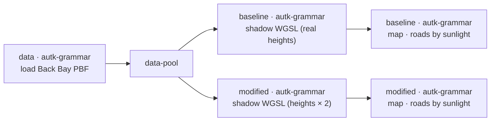

# Example: What-if shadow study with Autark

This example reuses the per-road sunlight shader from
[Example 7](07-autark-gpu-shader.md) and runs it twice — once with each Back Bay building's real
OSM height as the shadow caster, and once with every building's height **doubled** inside the
shadow loop. Two side-by-side maps then render the roads coloured by accumulated June-solstice
sunlight, so the visual diff is the loss of road sunlight when every building gets twice as tall.

> [!NOTE]
> **WebGPU required**
> Autark relies on WebGPU. Run this example in a Chromium-based browser (Chrome / Edge) on a machine
> with a working GPU stack. `navigator.gpu` must be available.

## Pipeline overview



A single `data` node loads the PBF once and fans out through a `data-pool` to two parallel
shader branches. The two branches are identical except for one WGSL line — the modified branch
multiplies each building's height by `2.0` before computing its shadow.

## Data

`docs/examples/data/back_bay.osm.pbf` — OSM extract for Boston's Back Bay (regenerate with
`scripts/build_example_pbfs.py`). The data node requests the layers the shader needs:
`surface`, `parks`, `water`, `roads`, and `buildings`. Anything missing from the PBF is skipped
quietly; everything present materialises in EPSG:3395 (metric), which is what the shadow math
expects. The downstream compute and map nodes reference these layers by name (`table_osm_roads`,
`table_osm_buildings`) — the named-layer case of
[Referencing Upstream Data in Autark Nodes](../ARCHITECTURE.md#referencing-upstream-data-in-autark-nodes).

```json
"data": [{
  "type": "osm",
  "pbfFileUrl": "docs/examples/data/back_bay.osm.pbf",
  "queryArea": { "geocodeArea": "Boston", "areas": ["Back Bay"] },
  "outputTableName": "table_osm",
  "autoLoadLayers": {
    "layers": ["surface", "parks", "water", "roads", "buildings"],
    "dropOsmTable": true
  }
}]
```

## Compute (baseline and modified)

Both compute nodes share the same spec — only the `wglsFunction` body differs by a single line.
The shader iterates `batched` over every building (so the building ring and height are packed as
uniform arrays the WGSL can loop over once per dispatch), and runs per road segment:

```json
"compute": [{
  "dataRef": "table_osm_roads",
  "attributes":       { "seg": "geometry.coordinates" },
  "attributeMatrices":{ "seg": { "rows": "auto", "cols": 2 } },
  "uniforms": {
    "bld_height": {
      "fromFeature": {
        "layer": "table_osm_buildings",
        "iterate": "batched",
        "path": "properties.height",
        "required": true
      }
    },
    "doy": 172
  },
  "uniformMatrices": {
    "ring": {
      "fromFeature": {
        "layer": "table_osm_buildings",
        "iterate": "batched",
        "path": "geometry.coordinates.0"
      },
      "cols": 2
    }
  },
  "outputColumnName": "sunlight",
  "wglsFunction": [ "...solar-time + AABB shadow projection; see Example 7 for the full body..." ]
}]
```

For each road segment, for every daylight hour on the June solstice (`doy = 172`), the shader
projects every building's footprint AABB along the sun direction by `shadow_len = height / tan(alt)`
and checks whether the road segment intersects that shadow rectangle. If no building shades the
segment for that hour, the segment earns 60 minutes of sunlight. Boston coordinates: `lat_rad = 0.7393`
(≈ 42.36 °N), `lon_loc = -71.06`.

### The single-line difference

Inside the per-building shadow loop:

| Branch    | WGSL line for the casting height       |
| --------- | -------------------------------------- |
| Baseline  | `let height = bld_height[bi];`         |
| Modified  | `let height = 2.0 * bld_height[bi];`   |

Doubling `height` doubles `shadow_len` for that hour, so the modified branch's shadows project
roughly twice as far down-sun.

## Render

Both maps render the full layer stack with roads as the colour-map / pick layer, coloured by the
shader's `sunlight` output column. They use identical layout so the user can compare the two
scenarios side by side:

```json
"map": { "layerRefs": [
  { "dataRef": "table_osm_surface" },
  { "dataRef": "table_osm_parks" },
  { "dataRef": "table_osm_water" },
  { "dataRef": "table_osm_buildings" },
  { "dataRef": "table_osm_roads",
    "isPick": true, "isColorMap": true,
    "getFnv": "sunlight", "getFnvType": "quantitative", "defaultFnv": 0 }
]}
```

## Final result

Two maps of Back Bay's road network, coloured by minutes of June-solstice sunlight. The baseline
shows today's shadow conditions; the modified map shows the same network under a "what-if every
building were twice as tall" world. Streets near tall structures lose the most sunlight in the
modified scenario — that delta is the point of the comparison.
