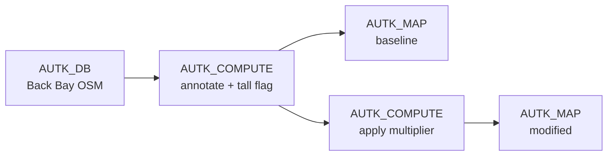

# Example: What-if shadow study with Autark

In this example, we walk through a what-if dataflow that flags "tall" buildings in Boston's Back Bay (footprint area > 200 m²), raises their heights by a fixed multiplier, and renders the modified scenario side-by-side with the baseline. The dataflow runs entirely in the browser through Curio's Autark integration. Building **height** is used as a what-if proxy that's directly visible on the rendered map — replace the multiplier compute step with a WebGPU shadow shader (see [Example 7](07-autark-gpu-shader.md)) when you want a full shadow study.

!!! note "WebGPU required"
    Autark relies on WebGPU. Run this example in a Chromium-based browser (Chrome / Edge) on a machine with a working GPU stack. `navigator.gpu` must be available.

For completeness, we include the template code in each dataflow step.

## Pipeline overview



## Step 1: Loading physical layers (`AUTK_DB`)

Instantiate an `AUTK_DB` node and load the buildings, surface, and parks for Boston's Back Bay neighborhood via the Overpass API. Autark's spatial database materializes each layer in EPSG:3395 and exposes it as a regular GeoJSON `FeatureCollection`.

```javascript
import { AutkSpatialDb } from '@urban-toolkit/autk-db';

const db = new AutkSpatialDb();
await db.init();

await db.loadOsm({
    queryArea: { geocodeArea: 'Boston', areas: ['Back Bay'] },
    outputTableName: 'table_osm',
    autoLoadLayers: {
        coordinateFormat: 'EPSG:3395',
        layers: ['buildings', 'surface', 'parks'],
        dropOsmTable: true,
    },
});

const layers = [];
for (const layer of db.getLayerTables()) {
    layers.push({
        name: layer.name,
        type: layer.type,
        geojson: await db.getLayer(layer.name),
    });
}
return layers;
```

## Step 2: Annotate buildings with area, baseline height, and a "tall" flag (`AUTK_COMPUTE`)

The next node walks each building feature, adds a numeric `area` (m²) computed from the polygon ring, parses the OSM `height` tag into two fields (`baselineHeight` for the original value, `height` as a working copy), and sets a boolean `tall = area > 800` flag that the multiplier step uses to pick the what-if subset.

```javascript
const ringArea = (ring) => {
    if (!ring || ring.length < 3) return 0;
    const ox = ring[0][0], oy = ring[0][1];
    let s = 0;
    for (let i = 0; i < ring.length; i++) {
        const j = (i + 1) % ring.length;
        const x1 = ring[i][0] - ox, y1 = ring[i][1] - oy;
        const x2 = ring[j][0] - ox, y2 = ring[j][1] - oy;
        s += x1 * y2 - x2 * y1;
    }
    return Math.abs(s) / 2;
};
const featureArea = (geom) => {
    if (!geom) return null;
    if (geom.type === 'Polygon') return ringArea(geom.coordinates[0]);
    if (geom.type === 'MultiPolygon') return geom.coordinates.reduce((s, p) => s + ringArea(p[0]), 0);
    if (geom.type === 'GeometryCollection') return (geom.geometries || []).reduce((s, g) => s + (featureArea(g) || 0), 0);
    return null;
};
const parseHeight = (h) => {
    if (h == null) return null;
    if (typeof h === 'number') return Number.isFinite(h) ? h : null;
    const m = String(h).match(/-?\d+(?:\.\d+)?/);
    return m ? parseFloat(m[0]) : null;
};
const TALL_AREA_THRESHOLD = 200;

return arg.map(layer => {
    if (layer.name !== 'table_osm_buildings') return layer;
    const features = layer.geojson.features.map(f => {
        const baseline = parseHeight(f.properties?.height) ?? 10;
        const a = featureArea(f.geometry);
        return {
            ...f,
            properties: {
                ...f.properties,
                area: a,
                baselineHeight: baseline,
                height: baseline,
                tall: a != null && a > TALL_AREA_THRESHOLD,
            },
        };
    });
    return { ...layer, geojson: { ...layer.geojson, features } };
});
```

The annotated layer array is forwarded directly to two consumers — the baseline map (Step 3) and the multiplier compute (Step 4). Autark compute outputs fan out via additional edges from the same node, so no intermediate pool node is needed for this autk-only chain.

## Step 3: Baseline view (`AUTK_MAP`)

Connect the annotate output to an `AUTK_MAP` node. Color the buildings by their original `baselineHeight` so this view stays fixed and can sit next to the modified map for visual comparison.

```javascript
const map = new AutkMap(container);
await map.init();

for (const layer of arg) {
    map.loadCollection(layer.name, { collection: layer.geojson, type: layer.type });
}

const buildings = arg.find(l => l.name === 'table_osm_buildings').geojson;
map.updateRenderInfo('table_osm_buildings', { isColorMap: true });
map.updateThematic('table_osm_buildings', { collection: buildings, property: 'properties.baselineHeight' });
map.draw();
return map;
```

## Step 4: Apply the height multiplier (`AUTK_COMPUTE`)

Add a second `AUTK_COMPUTE` node connected to the annotate output. Buildings flagged as `tall` get their height multiplied; everything else keeps its baseline. The per-building `heightDelta` (modified − baseline) is stashed on the feature for downstream inspection, even though the current pipeline only renders the absolute `height`. The multiplier is hard-coded — edit the constant and re-run to explore different what-if intensities.

```javascript
const MULTIPLIER = 3.0;

return arg.map(layer => {
    if (layer.name !== 'table_osm_buildings') return layer;
    const features = layer.geojson.features.map(f => {
        const baseline = f.properties?.baselineHeight ?? 10;
        const isTall = f.properties?.tall === true;
        const newHeight = isTall ? baseline * MULTIPLIER : baseline;
        return {
            ...f,
            properties: {
                ...f.properties,
                height: newHeight,
                heightDelta: newHeight - baseline,
            },
        };
    });
    return { ...layer, geojson: { ...layer.geojson, features } };
});
```

## Step 5: Modified-scenario view (`AUTK_MAP`)

Render the multiplier output as a second map, colored by the new `height`. This is the "after" view in the comparison.

```javascript
const map = new AutkMap(container);
await map.init();

for (const layer of arg) {
    map.loadCollection(layer.name, { collection: layer.geojson, type: layer.type });
}

const buildings = arg.find(l => l.name === 'table_osm_buildings').geojson;
map.updateRenderInfo('table_osm_buildings', { isColorMap: true });
map.updateThematic('table_osm_buildings', { collection: buildings, property: 'properties.height' });
map.draw();
return map;
```

## Final result

The two maps form a side-by-side what-if comparison: the baseline view stays fixed on `baselineHeight`, while the modified view shows the multiplier's effect on `height` — tall buildings stand out in proportion to how much the multiplier raised them, and everything else acts as the unchanged reference. Adjust the `TALL_AREA_THRESHOLD` constant in Step 2 or the `MULTIPLIER` constant in Step 4 to explore different scenarios. Swapping the multiplier compute node for a [WebGPU shadow shader](07-autark-gpu-shader.md) extends this same topology into a full shadow-impact study.
