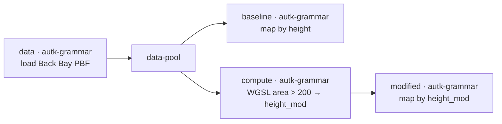

# Example: What-if shadow study with Autark

In this example we walk through a what-if dataflow that flags "tall" buildings in Boston's Back Bay
(footprint area > 200 m²), raises their heights by a fixed multiplier, and renders the modified scenario
side-by-side with the baseline. The pipeline is split into a modular `autk-grammar` chain so that the
heavy work happens only on the branch that needs it: the **baseline** branch is render-only — no compute —
and the **modified** branch is the one that runs the GPU shader. Building **height** is the what-if proxy
that's directly visible on the rendered map.

> [!NOTE]
> **WebGPU required**
> Autark relies on WebGPU. Run this example in a Chromium-based browser (Chrome / Edge) on a machine
> with a working GPU stack. `navigator.gpu` must be available.

## Pipeline overview



A single `data` node loads the PBF once and fans out through a `data-pool` to two branches: the baseline
map renders straight from the loaded layers (no compute), while the modified branch runs a GPU compute
and feeds a second map. Place the two maps side by side to compare the scenarios.

## Data

`docs/examples/data/back_bay.osm.pbf` — OSM extract for Boston's Back Bay (regenerate with
`scripts/build_example_pbfs.py`).

## Step 1: Load physical layers from a PBF (`data` node)

The `data` node loads Back Bay's buildings, surface, and parks from the local PBF — DuckDB-WASM parses it
in the browser, so there's no Overpass call at run time. autk-db materializes the layers in EPSG:3395
(metric), which is what the footprint-area math in Step 3 assumes.

```json
"data": [{
  "type": "osm",
  "pbfFileUrl": "docs/examples/data/back_bay.osm.pbf",
  "queryArea": { "geocodeArea": "Boston", "areas": ["Back Bay"] },
  "outputTableName": "table_osm",
  "autoLoadLayers": { "layers": ["surface", "parks", "buildings"], "dropOsmTable": true }
}]
```

## Step 2: Fan out through a `data-pool`

The data-pool sits between the loader and the two consumers, so the PBF is loaded once and the resulting
`table_osm_*` layers are available to both branches without re-parsing.

## Step 3: Baseline render (`map` node — no compute)

The baseline branch is just a `map` block. It renders the loaded layers and colours buildings by their
original `height` column. There is no compute on this branch — that's the point of splitting the pipeline.

```json
"map": { "layerRefs": [
  { "dataRef": "table_osm_surface" },
  { "dataRef": "table_osm_parks" },
  { "dataRef": "table_osm_buildings", "getFnv": "height", "getFnvType": "quantitative", "defaultFnv": 10 }
]}
```

## Step 4: GPU footprint-area criterion + multiplier (`compute` node, modified branch only)

The modified branch's `compute` block binds each building's **outer ring** as a per-feature matrix
(`attributes.ring` = `geometry.coordinates.0`, `attributeMatrices.ring`) and the `height` attribute, then
runs a WGSL shoelace sum to get the footprint **area** in m². Buildings over 200 m² get `height × 3`;
everything else keeps its height. The result is written to the `height_mod` output column.

```json
"compute": [{
  "dataRef": "table_osm_buildings",
  "attributes": { "ring": "geometry.coordinates.0", "h": "height" },
  "attributeMatrices": { "ring": { "rows": "auto", "cols": 2 } },
  "outputColumnName": "height_mod",
  "wglsFunction": "... shoelace area over the ring; if area > 200 return h*3 else h ..."
}]
```

The WGSL walks the ring vertices (`ring[i*2]`, `ring[i*2+1]`) accumulating the signed cross-products, halves
the absolute sum for the area, and applies the multiplier. The full body lives in the example JSON.

## Step 5: Modified render (`map` node, coloured by the computed column)

The second `map` node sits at the end of the compute branch and colours buildings by `compute.height_mod`.
Surface and parks render underneath for context, same as the baseline.

```json
"map": { "layerRefs": [
  { "dataRef": "table_osm_surface" },
  { "dataRef": "table_osm_parks" },
  { "dataRef": "table_osm_buildings", "getFnv": "compute.height_mod", "getFnvType": "quantitative", "defaultFnv": 10 }
]}
```

## Final result

Two maps of Back Bay: the baseline coloured by original height and the modified scenario with footprints
larger than 200 m² raised 3×. Because only the modified branch runs the shader, swapping the WGSL (e.g.
for the full shadow shader from [Example 7](07-autark-gpu-shader.md)) only touches that one node — the
shared `data` load and the baseline render stay untouched.
