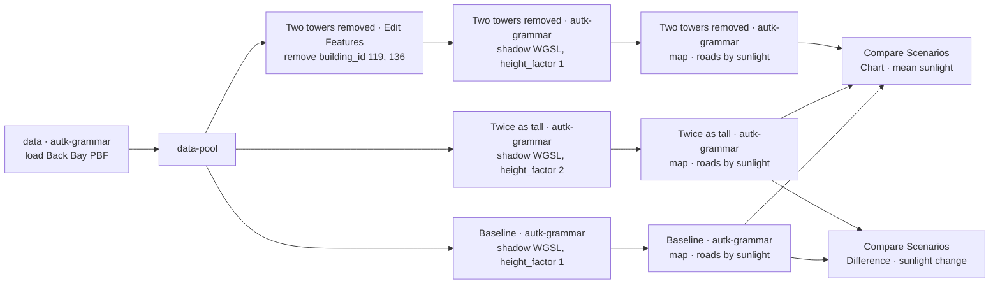

# Example: What-if shadow study with Autark

This example runs the per-road sunlight shader from [Example 7](07-autark-gpu-shader.md) in three
scenarios over Boston's Back Bay: **Baseline**, with every building at its real OSM height,
**Twice as tall**, with every building's height doubled, and **Two towers removed**, with two
towers taken out: 200 Clarendon, the tallest, and Raffles. The height factor is a widget on the
shadow step, and the towers are removed by an Edit Features node. Two Compare Scenarios nodes compare them: a chart of each
scenario's mean road sunlight on the June solstice, and a map of the sunlight each road loses when
the buildings get twice as tall.

> [!NOTE]
> **WebGPU required**
> Autark relies on WebGPU. Run this example in a Chromium-based browser (Chrome / Edge) on a machine
> with a working GPU stack. `navigator.gpu` must be available.

## Pipeline overview


```mermaid
flowchart LR
  D["data · autk-grammar<br/>load Back Bay PBF"]
  P["data-pool"]
  BC["Baseline · autk-grammar<br/>shadow WGSL, height_factor 1"]
  BM["Baseline · autk-grammar<br/>map · roads by sunlight"]
  MC["Twice as tall · autk-grammar<br/>shadow WGSL, height_factor 2"]
  MM["Twice as tall · autk-grammar<br/>map · roads by sunlight"]
  TE["Two towers removed · Edit Features<br/>remove building_id 119, 136"]
  TC["Two towers removed · autk-grammar<br/>shadow WGSL, height_factor 1"]
  TM["Two towers removed · autk-grammar<br/>map · roads by sunlight"]
  CC["Compare Scenarios<br/>Chart · mean sunlight"]
  CD["Compare Scenarios<br/>Difference · sunlight change"]
  D --> P
  P --> BC --> BM
  P --> MC --> MM
  P --> TE --> TC --> TM
  BM --> CC
  MM --> CC
  TM --> CC
  BM --> CD
  MM --> CD
```

A single `data` node loads the PBF once, and a `data-pool` hands its layers to every scenario.
The loader and the pool are the scenarios' fixed context: they sit outside all three, and all three
read them. Each scenario's nodes are its levers: the shadow step and its map, and in Two towers
removed the Edit Features node before them. In Twice as tall and in Two towers removed the shadow
step and the map are copies of their Baseline twins and name them, so the scenarios' levers are
paired when they are compared.

## Data

`docs/examples/data/back_bay.osm.pbf` is an OSM extract for Boston's Back Bay (regenerate with
`scripts/build_example_pbfs.py`). The data node requests the layers the shader needs:
`surface`, `parks`, `water`, `roads`, and `buildings`. Anything missing from the PBF is skipped
quietly; everything present materialises in EPSG:3395 (metric), which is what the shadow math
expects. The downstream compute and map nodes reference these layers by name (`table_osm_roads`,
`table_osm_buildings`), the named-layer case of
[Referencing Upstream Data in Autark Nodes](../ARCHITECTURE.md#referencing-upstream-data-in-autark-nodes).

```json
"data": [{
  "type": "osm",
  "pbfFileUrl": "docs/examples/data/back_bay.osm.pbf",
  "queryArea": { "geocodeArea": "Boston", "areas": ["Back Bay"] },
  "outputTableName": "table_osm",
  "autoLoadLayers": {
    "layers": ["surface", "parks", "water", "roads", "buildings"]
  }
}]
```

## Scenarios

| Scenario | Colour | Its nodes | height_factor |
| --- | --- | --- | --- |
| Baseline | blue | Shadow study, Roads by sunlight | 1 |
| Twice as tall | orange | copies of the two, each naming its twin | 2 |
| Two towers removed | green | Edit Features, then copies of the two | 1 |

The **Scenarios** panel (View > Show scenarios) lists the three, with the data pool as the fixed
context each one reads. Collapse them and press **Run All**: each scenario is one box, the loader
and the pool run once for all three, and each box shows its outcome once it is done. Double-click a
box to expand it in place.

## Removing two towers

In Two towers removed, an Edit Features node sits between the pool and the shadow step. It edits
the `table_osm_buildings` layer, picked in its **Layer** menu, and hands on the other four layers as
they came. Its edit list holds one edit, made by double-clicking the two towers on its map and
pressing **Remove**: 200 Clarendon (240.8 m) and Raffles (136 m), matched on their `building_id`.
Its code is written from that list:

```python
# Edit Features writes this code from its edit list: each edit, in the
# order it was made, on the features whose key is one of its ids. It is
# written again when the list changes.
return curio_edit_features(input_0, [
    {"op": "remove", "ids": [119, 136]},
], key="building_id", layer="table_osm_buildings")
```

A building's parts share its `building_id`, so the edit removes every part of both towers: 200
Clarendon's four and Raffles' three.

## The shadow step and its widget

Both shadow steps hold the same spec. The shader iterates `batched` over every building (so the
building ring and height are packed as uniform arrays the WGSL can loop over once per dispatch),
and runs per road segment. The height factor reaches the shader as a uniform: the spec places the
node's `height_factor` widget as `[!! height_factor !!]`, which a run replaces with the widget's
value.

```json
"compute": [{
  "dataRef": "table_osm_roads",
  "attributes":       { "seg": "geometry.coordinates" },
  "attributeMatrices":{ "seg": { "rows": "auto", "cols": 2 } },
  "uniforms": {
    "bld_height": {
      "fromFeature": {
        "layer": "table_osm_buildings",
        "iterate": "batched",
        "path": "properties.height",
        "required": true
      }
    },
    "doy": 172,
    "height_factor": [!! height_factor !!]
  },
  "uniformMatrices": {
    "ring": {
      "fromFeature": {
        "layer": "table_osm_buildings",
        "iterate": "batched",
        "path": "geometry.coordinates.0"
      },
      "cols": 2
    }
  },
  "outputColumnName": "sunlight",
  "wglsFunction": [ "...solar-time + AABB shadow projection; see Example 7 for the full body..." ]
}]
```

The widget is a slider in each shadow step's **Widgets** tab: `height_factor`, labelled Height
factor, from 0.5 to 4 in steps of 0.5, default 1. Baseline keeps the default, and Twice as tall
sets it to 2. Inside the per-building shadow loop the factor scales each building's height:

```text
let height = height_factor * bld_height[bi];
```

For each road segment, for every daylight hour on the June solstice (`doy = 172`), the shader
projects every building's footprint AABB along the sun direction by `shadow_len = height / tan(alt)`
and checks whether the road segment intersects that shadow rectangle. If no building shades the
segment for that hour, the segment earns 60 minutes of sunlight. Boston coordinates: `lat_rad = 0.7393`
(≈ 42.36 °N), `lon_loc = -71.06`. A factor of 2 doubles `shadow_len`, so Twice as tall's shadows
reach twice as far down-sun.

## Render

Each scenario's map renders the full layer stack with roads as the colour-map / pick layer,
coloured by the shader's `sunlight` output column:

```json
"map": { "layerRefs": [
  { "dataRef": "table_osm_surface" },
  { "dataRef": "table_osm_parks" },
  { "dataRef": "table_osm_water" },
  { "dataRef": "table_osm_buildings" },
  { "dataRef": "table_osm_roads",
    "isPick": true, "isColorMap": true,
    "getFnv": "sunlight", "getFnvType": "quantitative", "defaultFnv": 0,
    "legendTitle": "Sunlight (minutes)" }
]}
```

## Comparing the scenarios

Both Compare Scenarios nodes take Baseline's map on their first input and Twice as tall's on
their second, and Mean sunlight takes Two towers removed's on its third, so each input is labelled
by its scenario. A map hands on the layers its shadow step computed, all five of them, so each
node's **Layer** menu is set to `table_osm_roads`: the roads, with their `sunlight`. Their code is
written for them.

**Mean sunlight** is in Chart: it stacks the three scenarios' roads into one table under a
`scenario` and a `scenario_name` column, and draws a bar for each scenario's mean `sunlight`, in
the scenarios' colours. Its **What differs** tab lists two levers: the shadow step, whose
`height_factor` is 1 in Baseline, 2 in Twice as tall and 1 in Two towers removed, and the Edit
Features node, only in Two towers removed, with its edit, Remove building_id 119, 136. The maps
are alike. It warns about nothing, since the three scenarios read the same pool.

**Sunlight change** is in Difference:

```python
# Compare Scenarios writes this code from its inputs: input 1 minus input 0,
# each under the id and the name of its scenario. It is written again when
# they change.
return curio_difference_scenarios([
    ("s-baseline", "Baseline", [!! input_0 !!]),
    ("s-twice", "Twice as tall", [!! input_1 !!]),
], layer="table_osm_roads")
```

The roads carry no `osm_id` or `building_id`, so Difference matches them by their shapes: both
scenarios read the same roads from the pool. Each road holds Twice as tall's sunlight minus
Baseline's, in `sunlight` and in the `compute` values the shadow step writes, and `change` says
whether it changed. The map colours the roads by that difference, from the largest loss (dark
purple) to no change (yellow).

## Final result

Three maps of Back Bay's road network, coloured by minutes of June-solstice sunlight, one per
scenario; a bar chart where Twice as tall has the lowest mean road sunlight and Two towers removed
the highest; and a map of the sunlight each road loses in Twice as tall, which is zero wherever no
taller building's shadow reaches it.
