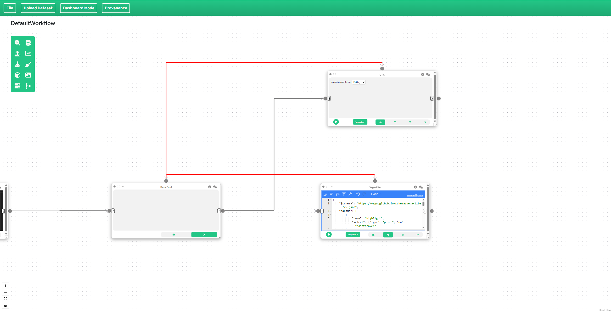

# Example: Adding interaction between Vega-Lite and Autark

This example covers a simple interaction between a Vega-Lite plot and an Autark map view. It uses the [Project Sidewalk](https://projectsidewalk.org) sample data available [here](data/interaction.zip).

!!! note "WebGPU required"
    Autark relies on WebGPU. Run this example in a Chromium-based browser (Chrome / Edge) on a machine with a working GPU stack.

## Step 1: Loading data

Once you have downloaded the [datasets](data/interaction.zip), upload them into Curio using the **Upload Dataset** functionality.

## Step 2: Connecting the Autark map to the Vega-Lite plot

To link the `AUTK_MAP` node with a Vega-Lite plot, route both views from the same Data Pool and add data + interaction edges as in the image below:



Select "Picking" as the interaction for the `AUTK_MAP` node. Both nodes are populated with pre-defined code; the linked interaction only works when both views share the same Data Pool upstream.

The map node renders neighborhood polygons coloured by their accessibility score:

```javascript
// 'arg' is the neighborhood GeoJSON (EPSG:3395) coming from the
// upstream Data Pool.
const collection = arg?.features ? arg : (Array.isArray(arg) ? (arg[0]?.geojson ?? arg[0]) : arg);
const LAYER = 'neighborhood';

const map = new AutkMap(container);
await map.init();

map.loadCollection(LAYER, { collection, type: 'polygon' });
map.updateRenderInfo(LAYER, { isPick: true, isColorMap: true });
map.updateThematic(LAYER, { collection, property: 'properties.accessibility' });
map.draw();
return map;
```

You can download a JSON specification with this example [here](dataflows/Interaction_Vega_Autark.json).
