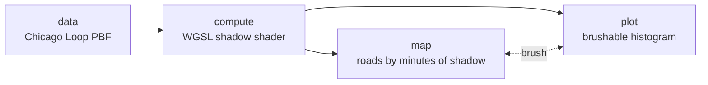

# Example: Per-feature GPU shader with Autark

In this example a single `autk-grammar` node runs a WGSL shadow-accumulation shader on the GPU and renders
the result as a thematic map linked to a brushable histogram. The driving question: *how many minutes of
shadow does one Chicago Loop building cast onto each surrounding road segment over the course of a June
day?* The shader answers it per road segment in one GPU pass. The `data`, `compute`, `map`, and `plot`
blocks that used to be four separate nodes now live in a single UrbanSpec.

It is a translation of the upstream Autark shadow use case at
[github.com/urban-toolkit/autark/tree/main/usecases/src/shadows](https://github.com/urban-toolkit/autark/tree/main/usecases/src/shadows).

> [!NOTE]
> **WebGPU required**
> Autark relies on WebGPU. Run this example in a Chromium-based browser (Chrome / Edge) on a machine
> with a working GPU stack.

## Pipeline overview



All four blocks belong to one `autk-grammar` node: `data` loads OSM from a local PBF, `compute` runs the
shader and writes a `shadow` column onto every road, and `map` / `plot` render the result with a linked
brush.

## Data

`docs/examples/data/chicago_loop.osm.pbf` — OSM extract for the Chicago Loop (regenerate with
`scripts/build_example_pbfs.py`).

## Step 1: Load OSM from a PBF (`data`)

The `data` block loads the Chicago Loop layers from `docs/examples/data/chicago_loop.osm.pbf` — DuckDB-WASM
parses the PBF in the browser, so there is no Overpass call at run time. autk-db materializes the layers in
EPSG:3395 (metric), which is what the shader's geometry math assumes.

```json
"data": [{
  "type": "osm",
  "pbfFileUrl": "docs/examples/data/chicago_loop.osm.pbf",
  "queryArea": { "geocodeArea": "Chicago", "areas": ["Loop"] },
  "outputTableName": "table_osm",
  "autoLoadLayers": { "layers": ["surface", "parks", "water", "roads", "buildings"], "dropOsmTable": true }
}]
```

## Step 2: GPU shadow shader (`compute`)

The `compute` block binds each road's geometry as a per-feature matrix (`attributes.seg` =
`geometry.coordinates`, `attributeMatrices.seg`), the casting building's footprint as a
`uniformMatrices.ring`, and passes `bld_height` and `doy` (172 = June solstice) as `uniforms`. The WGSL
walks daylight hours 07:00–19:00, projects the footprint into shadow-aligned coordinates to form an
oriented box per hour, tests every road segment against it, and accumulates 60 minutes per hit into the
single `shadow` output column.

```json
"compute": [{
  "dataRef": "table_osm_roads",
  "attributes": { "seg": "geometry.coordinates" },
  "attributeMatrices": { "seg": { "rows": "auto", "cols": 2 } },
  "uniforms": { "bld_height": 81, "doy": 172 },
  "uniformMatrices": { "ring": { "data": [[-9755494.1, 5115958.66], "..."], "cols": 2 } },
  "outputColumnName": "shadow",
  "wglsFunction": "... the full shadow shader ..."
}]
```

A declarative spec can't run JavaScript to pick "the first building," so the casting building's outer ring
is supplied directly as `uniformMatrices.ring` (a representative Loop building, in EPSG:3395) with its
`bld_height`. Swap those to cast from a different building; set `uniforms.doy` to `265` (September) or
`355` (December) to change the season. The full WGSL body lives in the example JSON.

## Step 3: Thematic map (`map`)

The `map` block renders the full layer stack and colours roads by `compute.shadow`. Unshaded roads paint at
the low end of the colour ramp, so they stay visible as context around the building's shadow path. `isPick`
turns on selection so the histogram brush can highlight matching segments.

```json
"map": { "layerRefs": [
  { "dataRef": "table_osm_surface" },
  { "dataRef": "table_osm_parks" },
  { "dataRef": "table_osm_water" },
  { "dataRef": "table_osm_buildings" },
  { "dataRef": "table_osm_roads", "isPick": true, "getFnv": "compute.shadow", "getFnvType": "quantitative", "defaultFnv": 0 }
]}
```

## Step 4: Brushable histogram (`plot`)

The `plot` block bins `compute.shadow` into a 13-bucket histogram and links back to the road layer via
`mapRef`, so brushing the chart (`brushX`) highlights the matching road segments on the map.

```json
"plot": {
  "dataRef": "table_osm_roads", "mark": "bar", "axis": ["compute.shadow", "@transform"],
  "title": "Minutes of shadow per Chicago Loop road segment",
  "transform": { "preset": "binning-1d", "options": { "bins": 13 } },
  "events": ["brushX"], "mapRef": "table_osm_roads"
}
```

## Going further

The upstream Autark example layers on more capability — picking-driven recompute against any clicked
building, monthly variants, and ground-truth baselines from a CSV: see
[main.ts](https://github.com/urban-toolkit/autark/blob/main/usecases/src/shadows/main.ts) and
[shadow.wgsl](https://github.com/urban-toolkit/autark/blob/main/usecases/src/shadows/shadow.wgsl) upstream.
