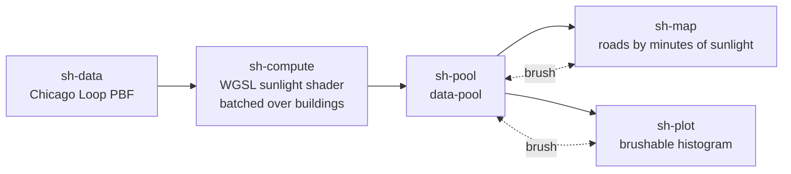

# Example: Per-feature GPU shader with Autark

In this example an `autk-grammar` chain runs a WGSL sunlight-accumulation shader on the GPU and renders
the result as a thematic map linked to a brushable histogram. The driving question: *how many minutes of
sunlight does each Chicago Loop road segment receive over the course of a June day, given the shadows
cast by every building around it?* The shader answers it per road segment in **one** GPU dispatch — it
loops over all buildings inside WGSL so each daylight hour earns 60 minutes only when no building shades
the road. The `data`, `compute`, `map`, and `plot` blocks live in five connected nodes wired through a
`data-pool` so brush selections on the histogram light up matching roads on the map.

It is a translation of the upstream Autark shadow use case at
[github.com/urban-toolkit/autark/tree/main/usecases/src/shadows](https://github.com/urban-toolkit/autark/tree/main/usecases/src/shadows).

> [!NOTE]
> **WebGPU required**
> Autark relies on WebGPU. Run this example in a Chromium-based browser (Chrome / Edge) on a machine
> with a working GPU stack.

## Pipeline overview



`sh-data` loads OSM from a local PBF and emits the layers as a `{path, dataType}` artifact. `sh-compute`
runs the sunlight shader in a single dispatch and writes a `sunlight` column onto every road. `sh-pool`
fans the augmented layers out to the renderers; the Interaction edges back from `sh-map` / `sh-plot`
route brushes through the pool to the matching roads.

## Data

`docs/examples/data/chicago_loop.osm.pbf` — OSM extract for the Chicago Loop (regenerate with
`scripts/build_example_pbfs.py`).

## Step 1: Load OSM from a PBF (`sh-data`)

The `data` block loads the Chicago Loop layers from `docs/examples/data/chicago_loop.osm.pbf` — DuckDB-WASM
parses the PBF in the browser, so there is no Overpass call at run time. autk-db materializes the layers in
EPSG:3395 (metric), which is what the shader's geometry math assumes. The downstream compute and render
nodes reference these layers by name (`table_osm_roads`, `table_osm_buildings`) — the named-layer case of
[Referencing Upstream Data in Autark Nodes](../ARCHITECTURE.md#referencing-upstream-data-in-autark-nodes).

```json
"data": [{
  "type": "osm",
  "pbfFileUrl": "docs/examples/data/chicago_loop.osm.pbf",
  "queryArea": { "geocodeArea": "Chicago", "areas": ["Loop"] },
  "outputTableName": "table_osm",
  "autoLoadLayers": { "layers": ["surface", "parks", "water", "roads", "buildings"], "dropOsmTable": true }
}]
```

## Step 2: Batched GPU sunlight shader (`sh-compute`)

The `compute` block binds each road's geometry as a per-feature matrix (`attributes.seg` =
`geometry.coordinates`, `attributeMatrices.seg`) and pulls every building's footprint and height from the
upstream `table_osm_buildings` layer via a `fromFeature` directive with `iterate: "batched"`. The runtime
packs each building's **AABB** (4 corners × 2 floats = 8 f32 per building) into a flat array exposed as
`uniformArrays.ring`, packs the height array as `uniformArrays.bld_height`, and runs the shader **once** —
not once per building. A `num_features` uniform tells the WGSL how many buildings are in the pack.
`required: true` on `bld_height` tells the runtime to drop any OSM building that has no `properties.height`
tag rather than substitute a synthetic default and over-extrude its shadow.

```json
"compute": [{
  "dataRef": "table_osm_roads",
  "attributes": { "seg": "geometry.coordinates" },
  "attributeMatrices": { "seg": { "rows": "auto", "cols": 2 } },
  "uniforms": {
    "bld_height": {
      "fromFeature": {
        "layer": "table_osm_buildings",
        "iterate": "batched",
        "path": "properties.height",
        "required": true
      }
    },
    "doy": 172
  },
  "uniformMatrices": {
    "ring": {
      "fromFeature": { "layer": "table_osm_buildings", "iterate": "batched", "path": "geometry.coordinates.0" },
      "cols": 2
    }
  },
  "outputColumnName": "sunlight",
  "wglsFunction": "... the batched sunlight shader ..."
}]
```

### `iterate: "batched"` vs `"all"`

Two iteration modes are supported on the same `fromFeature` shape:

- `"all"` — the runtime dispatches `ComputeGpgpu.run()` once per source feature and **sums** the per-run
  output columns. Trivial to write but it scales linearly in dispatch count and overcounts when multiple
  source features affect the same target row (e.g. two buildings shading the same road at noon both add 60).
- `"batched"` — the runtime stacks every source feature's values into uniform arrays and dispatches
  exactly once. The WGSL is responsible for looping over `num_features` and combining contributions
  however the analysis requires (here: per-hour union of shadows → boolean "any shadow", then accumulate
  sunlight only when none). One dispatch, correct semantics, ~100× faster on Loop-scale data.

For the sunlight question, `"batched"` is the right mode — the shader needs to answer "is *any* building
shading this road right now" per hour, which is a union the runtime can't compute by post-summation.

### AABB simplification & feature cap

Each batched matrix entry is reduced to a per-source AABB before being packed (4 corners × 2 floats = 8
f32 per source feature), not the full polygon outline. Full outlines on Chicago-Loop-scale data exceed
WebGPU's 64 KB uniform buffer cap on DX12; AABBs fit ~2 KB per 1000 buildings and project to a conservative
shadow envelope (correct for axis-aligned buildings, a slight over-estimate for rotated/irregular ones).

The runtime also caps the source feature count at **1500** to stay well under the uniform buffer limit. If
the source layer has more, the excess is dropped (in source order) with a console warning. Combined with
the `required: true` filter on `bld_height`, the surviving features are the OSM buildings that both have a
tagged height and fit in the cap — the ones whose shadows actually matter for the analysis.

### Shader sketch

The WGSL the example ships is (formatted):

```wgsl
let dec_rad = -0.40928 * cos(2.0 * pi / 365.0 * (doy + 10.0));
let ax = seg[0u]; let ay = seg[1u];
let bx = seg[2u]; let by = seg[3u];

var sunlight: f32 = 0.0;
for (var hour = 7i; hour <= 19i; hour++) {
    // solar altitude/azimuth for this hour in Chicago, June solstice
    let alt_rad = asin(clamp(sin_alt, -1.0, 1.0));
    if alt_rad <= 0.0 { continue; }  // sun below horizon

    let az_rad = atan2(...);
    let sdx = -sin(az_rad); let sdy = -cos(az_rad);  // shadow direction
    let perp_x = sdy; let perp_y = -sdx;             // perpendicular axis

    // project this road segment's endpoints into the (perp, shadow) basis
    let au = ax * perp_x + ay * perp_y; let av = ax * sdx + ay * sdy;
    let bu = bx * perp_x + by * perp_y; let bv = bx * sdx + by * sdy;

    let n_buildings: u32 = u32(num_features);
    var any_hit = false;
    for (var bi = 0u; bi < n_buildings; bi++) {
        let height     = bld_height[bi];
        let shadow_len = height / tan(alt_rad);
        let base       = bi * 8u;   // 4 AABB corners × 2 floats per building

        // project the four AABB corners into the (perp, shadow) basis and take
        // the min/max along each axis to get this building's projected bbox
        var u_lo = 1e30; var u_hi = -1e30;
        var v_lo = 1e30; var v_hi = -1e30;
        for (var ci = 0u; ci < 4u; ci++) {
            let rx = ring[base + ci * 2u];
            let ry = ring[base + ci * 2u + 1u];
            // ... update bbox ...
        }
        let v_hi_shadow = v_hi + shadow_len;

        // endpoint / segment intersection check against the bbox
        var hit = false;
        // ... if au/bu/av/bv inside [u_lo..u_hi, v_lo..v_hi_shadow], hit = true ...

        if hit { any_hit = true; break; }
    }
    if !any_hit { sunlight += 60.0; }
}
return sunlight;
```

Set `uniforms.doy` to `265` (September) or `355` (December) to change the season.

## Step 3: Thematic map (`sh-map`)

The `map` block renders the full layer stack and colours roads by `sunlight`. The runtime lifts the compute
output to both `properties.compute.sunlight` and top-level `properties.sunlight`, so `getFnv: "sunlight"`
resolves directly. `isPick` turns on selection so the pool can route the histogram brush back to matching
segments; `isColorMap` shows the colour ramp at load.

```json
"map": { "layerRefs": [
  { "dataRef": "table_osm_surface" },
  { "dataRef": "table_osm_parks" },
  { "dataRef": "table_osm_water" },
  { "dataRef": "table_osm_buildings" },
  { "dataRef": "table_osm_roads", "isPick": true, "isColorMap": true,
    "getFnv": "sunlight", "getFnvType": "quantitative", "defaultFnv": 0 }
]}
```

## Step 4: Brushable histogram (`sh-plot`)

The `plot` block bins `sunlight` into a 13-bucket histogram (0–780 minutes is the physical range). Brushing
the chart (`brushX`) fires an `autk_selection` carrying the plot's `dataRef` as its `layerRef`; the pool's
multi-layer routing applies the brush to roads only, leaving surface/parks/water/buildings untouched, and
re-emits the wrapper so the map highlights the matching roads.

```json
"plot": {
  "dataRef": "table_osm_roads", "mark": "bar", "axis": ["sunlight", "@transform"],
  "title": "Minutes of sunlight per Chicago Loop road segment",
  "transform": { "preset": "binning-1d", "options": { "bins": 13 } },
  "events": ["brushX"]
}
```

## Going further

The upstream Autark example layers on more capability — picking-driven recompute against any clicked
building, monthly variants, and ground-truth baselines from a CSV: see
[main.ts](https://github.com/urban-toolkit/autark/blob/main/usecases/src/shadows/main.ts) and
[shadow.wgsl](https://github.com/urban-toolkit/autark/blob/main/usecases/src/shadows/shadow.wgsl) upstream.
