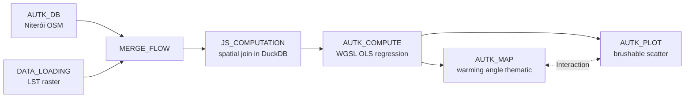

# Example: Per-feature spatial join + GPU regression with Autark

This example combines OSM road geometry with a 24-band land-surface-temperature (LST) raster to estimate the per-road warming trend over Niterói (2001–2024). The dataflow demonstrates three Curio capabilities working together: a `JS_COMPUTATION` node running a DuckDB spatial join, an `AUTK_COMPUTE` node executing a per-feature OLS regression in a WGSL shader, and an `AUTK_PLOT` brushable scatterplot linked to an `AUTK_MAP` via an Interaction edge.

It is a Curio port of the upstream Autark use case at [github.com/urban-toolkit/autark/tree/main/usecases/src/niteroi](https://github.com/urban-toolkit/autark/tree/main/usecases/src/niteroi).

!!! note "WebGPU required"
    Autark relies on WebGPU. Run this example in a Chromium-based browser (Chrome / Edge) on a machine with a working GPU stack.

!!! note "Network access required"
    Step 1 (`AUTK_DB`) hits the Overpass API and Step 2 (`DATA_LOADING`) downloads a 24-band GeoTIFF from `https://raw.githubusercontent.com/urban-toolkit/autark/main/usecases/public/data/niteroi_lst_verao_2001_2024.tif` (~10 MB, 120 s timeout). Both must be reachable when the dataflow runs. If the GeoTIFF download fails, the example breaks at Step 4 with an opaque base64-decoding error — check `Step 2`'s logs first.

## Pipeline overview



The fork after `niteroi-compute` is what makes the linked-views story work: the **map** consumes the full layer stack (so unaffected roads remain visible as context), while the **scatterplot** consumes the same roads layer as a flat collection so it can plot baseline LST against warming angle. The Interaction edge between map and scatter wires bidirectional brushing.

The example pulls its raster from a public URL on the upstream Autark repository, so no entry in `docs/examples/data/` is needed.

## Step 1: Load OSM (`AUTK_DB`)

The DB node fetches Niterói surface, parks, water, and roads via the Overpass API and emits each as an Autark layer object. Layers are returned in EPSG:4326 here so the downstream `JS_COMPUTATION` can re-ingest them through `loadCustomLayer` (which assumes WGS84 input) before reprojecting to a metric CRS for the spatial join.

```javascript
import { AutkSpatialDb } from '@urban-toolkit/autk-db';

const db = new AutkSpatialDb();
await db.init();

await db.loadOsm({
    queryArea: { geocodeArea: 'Rio de Janeiro', areas: ['Niterói'] },
    outputTableName: 'table_osm',
    autoLoadLayers: {
        coordinateFormat: 'EPSG:4326',
        layers: ['surface', 'parks', 'water', 'roads'],
        dropOsmTable: true,
    },
});

const layers = [];
for (const layer of db.getLayerTables()) {
    layers.push({ name: layer.name, type: layer.type, geojson: await db.getLayer(layer.name) });
}
return layers;
```

## Step 2: Reference the LST raster (`DATA_LOADING`)

The Python data-loading node fetches the 24-band yearly LST GeoTIFF (one band per year, 2001–2024) and embeds the bytes as base64 inside a single-row GeoDataFrame. Wrapping the raster this way lets the `JS_COMPUTATION` step downstream reuse the bytes without a second HTTP request — important because the raster is large and the spatial join needs a clean `ArrayBuffer`, not a URL.

```python
import base64
import requests
import geopandas as gpd
from shapely.geometry import Point

url = 'https://raw.githubusercontent.com/urban-toolkit/autark/main/usecases/public/data/niteroi_lst_verao_2001_2024.tif'
resp = requests.get(url, timeout=120)
resp.raise_for_status()
geotiff_b64 = base64.b64encode(resp.content).decode('ascii')

gdf = gpd.GeoDataFrame(
    {'geotiff_b64': [geotiff_b64], 'band_count': [24]},
    geometry=[Point(0, 0)],
    crs='EPSG:4326',
)
return gdf
```

## Step 3: Bundle the two upstreams (`MERGE_FLOW`)

The merge node has no code of its own — it simply exposes its two upstream inputs to the next node as `arg[0]` (OSM layer array) and `arg[1]` (single-row raster FeatureCollection).

## Step 4: Spatial join in DuckDB (`JS_COMPUTATION`)

This is where the heavy lifting happens. The node spins up its own `AutkSpatialDb` instance, re-ingests the four OSM layers in EPSG:3395 (so `NEAR` distances are metric), decodes the embedded GeoTIFF into an `ArrayBuffer`, and ingests it as a raster table. It then runs a spatial join that — for every road segment — averages each of the 24 LST bands within a 1 km buffer, and finally reshapes the per-band averages into a single `lst_timeseries` array per road. The output replaces the roads layer in the array, with the new `lst` raster appended for use as a basemap downstream.

```javascript
import { AutkSpatialDb } from '@urban-toolkit/autk-db';

const [osmLayers, rasterFc] = arg;
if (!Array.isArray(osmLayers)) throw new Error('osm layers missing from upstream');
const geotiffB64 = rasterFc?.features?.[0]?.properties?.geotiff_b64;
if (!geotiffB64) throw new Error('geotiff_b64 missing from upstream raster row');

const nodeBuf = Buffer.from(geotiffB64, 'base64');
const geotiffArrayBuffer = nodeBuf.buffer.slice(
    nodeBuf.byteOffset,
    nodeBuf.byteOffset + nodeBuf.byteLength,
);

const BAND_COUNT = 24;

const db = new AutkSpatialDb();
await db.init();

for (const layer of osmLayers) {
    await db.loadCustomLayer({
        geojsonObject: layer.geojson,
        outputTableName: layer.name,
        coordinateFormat: 'EPSG:3395',
        layerType: layer.type,
    });
}

await db.loadGeoTiff({
    geotiffArrayBuffer,
    outputTableName: 'lst',
    sourceCrs: 'EPSG:4326',
    coordinateFormat: 'EPSG:3395',
});

await db.spatialQuery({
    tableRootName: 'table_osm_roads',
    tableJoinName: 'lst',
    spatialPredicate: 'NEAR',
    nearDistance: 1000,
    output: { type: 'MODIFY_ROOT' },
    joinType: 'LEFT',
    groupBy: {
        selectColumns: Array.from({ length: BAND_COUNT }, (_, i) => ({
            tableName: 'lst',
            column: `band_${i + 1}`,
            aggregateFn: 'avg',
            aggregateFnResultColumnName: `band_${i + 1}`,
        })),
    },
});

const bandSelects = Array.from({ length: BAND_COUNT }, (_, i) =>
    `COALESCE(json_extract(properties, '$.sjoin.avg.band_${i + 1}')::DOUBLE, 0)`
).join(', ');

await db.rawQuery({
    query: `
        SELECT
            geometry,
            json_merge_patch(
                COALESCE(CAST(properties AS JSON), '{}'::JSON),
                json_object('lst_timeseries', [${bandSelects}])
            ) AS properties
        FROM table_osm_roads
    `,
    output: { type: 'CREATE_TABLE', tableName: 'table_osm_roads', source: 'osm', tableType: 'roads' },
});

const layers = [];
for (const layer of osmLayers) {
    layers.push({ name: layer.name, type: layer.type, geojson: await db.getLayer(layer.name) });
}
layers.push({ name: 'lst', type: 'raster', geojson: await db.getGeoTiffLayer('lst') });

return layers;
```

EPSG:3395 is the deliberate choice here — `NEAR` distances need a metric CRS, and EPSG:3395 is what Autark's map tiles already expect, so no further reprojection is needed downstream.

## Step 5: Per-road OLS regression on the GPU (`AUTK_COMPUTE`)

The compute node runs a WGSL shader that, for every road feature, takes its 24-element `lst_timeseries` and computes an ordinary-least-squares regression. The shader emits two values per feature: the regression intercept (baseline LST) and `atan(slope)` in degrees (the warming angle, easier to read than a raw slope). The shader body mirrors the upstream Autark reference at [usecases/src/niteroi/lst-regression-shader.ts](https://github.com/urban-toolkit/autark/blob/main/usecases/src/niteroi/lst-regression-shader.ts).

After the shader runs, the timeseries values are reshaped into `{timestamp, value}` objects so any downstream timeseries chart can use year strings as bucket keys.

```javascript
const roads = arg.find(l => l.name === 'table_osm_roads')?.geojson;
if (!roads) throw new Error('roads layer missing from upstream');

const BAND_COUNT = 24;
const START_YEAR = 2001;

const wgslBody = `
  var n = f32(bands_length);
  var sum_x  = 0.0;
  var sum_y  = 0.0;
  var sum_xy = 0.0;
  var sum_x2 = 0.0;

  for (var i = 0u; i < bands_length; i++) {
    let x   = f32(i);
    let y   = bands[i];
    sum_x  += x;
    sum_y  += y;
    sum_xy += x * y;
    sum_x2 += x * x;
  }

  let denom = n * sum_x2 - sum_x * sum_x;
  var slope     = 0.0;
  var intercept = 0.0;
  if (denom != 0.0) {
    slope     = (n * sum_xy - sum_x * sum_y) / denom;
    intercept = (sum_y - slope * sum_x) / n;
  }

  var out: OutputArray;
  out[0] = atan(slope) * (180.0 / 3.14159265358979);
  out[1] = intercept;
  return out;
`;

const compute = new ComputeGpgpu();
let computedRoads = await compute.run({
    collection: roads,
    variableMapping: { bands: 'lst_timeseries' },
    attributeArrays: { bands: BAND_COUNT },
    outputColumns: ['angle', 'intercept'],
    wgslBody,
});

computedRoads = {
    ...computedRoads,
    features: computedRoads.features.map(f => ({
        ...f,
        properties: {
            ...f.properties,
            lst_timeseries: ((f.properties?.lst_timeseries ?? [])).map((v, i) => ({
                timestamp: String(START_YEAR + i),
                value: v,
            })),
        },
    })),
};

return arg.map(l => l.name === 'table_osm_roads'
    ? { ...l, geojson: computedRoads }
    : l);
```

## Step 6: Thematic map (`AUTK_MAP`)

The map node loads the full layer stack, hides the `lst` raster from the picking layer (`isSkip: true`) but keeps it visible underneath at 65 % opacity, and colours roads thematically by the regression's `compute.angle` output.

```javascript
const map = new AutkMap(container);
await map.init();
for (const layer of arg) {
    map.loadCollection(layer.name, { collection: layer.geojson, type: layer.type });
}
map.updateRenderInfo('lst', { isSkip: true, opacity: 0.65 });
map.updateRenderInfo('table_osm_roads', { isPick: true, isColorMap: true });
map.updateThematic('table_osm_roads', {
    collection: arg.find(l => l.name === 'table_osm_roads').geojson,
    property: 'properties.compute.angle',
});
map.draw();
return map;
```

## Step 7: Brushable scatterplot (`AUTK_PLOT`)

The scatterplot pulls the same roads layer and plots the regression intercept (baseline LST, °C) against the warming angle. `events: ['brush']` enables the brushable selection that ties back to the map through the Interaction edge.

```javascript
const roads = arg.find(l => l.name === 'table_osm_roads')?.geojson ?? arg[0]?.geojson;
return new AutkPlot(container, {
    type: 'scatterplot',
    collection: roads,
    attributes: { axis: ['compute.intercept', 'compute.angle'] },
    labels: { axis: ['Baseline LST (°C)', 'Warming angle (°)'], title: 'LST regression' },
    tickFormats: ['.1~f', '.3~f'],
    width: 600,
    height: 380,
    events: ['brush'],
});
```

## Going further

The end result is a coupled view in which the map shows *where* warming has been most pronounced and the scatterplot shows *which roads* fall at the extremes; brushing either surface highlights the same segments in the other. The pattern generalizes well: swap the OLS shader for any per-feature reduction (anomaly score, autocorrelation, classifier output) and the same map ↔ plot topology still works. The upstream Autark example at [usecases/src/niteroi](https://github.com/urban-toolkit/autark/tree/main/usecases/src/niteroi) also demonstrates per-month variants and ground-truth baselines — natural next steps once the regression view is clear.
