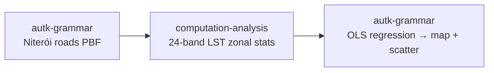

# Example: Per-feature spatial join + GPU regression with Autark

This example combines OSM road geometry with a 24-band land-surface-temperature (LST) raster to estimate
the per-road warming trend over Niterói (2001–2024). It demonstrates the grammar and Python working
together: an `autk-grammar` node loads roads from a local PBF, a Python `computation-analysis` node samples
the raster to build each road's yearly LST series, and a second `autk-grammar` node fits a per-feature OLS
regression on the GPU and renders a thematic map linked to a brushable scatterplot.

It is a Curio port of the upstream Autark use case at
[github.com/urban-toolkit/autark/tree/main/usecases/src/niteroi](https://github.com/urban-toolkit/autark/tree/main/usecases/src/niteroi).

> [!NOTE]
> **WebGPU required**
> Autark relies on WebGPU. Run this example in a Chromium-based browser (Chrome / Edge) on a machine
> with a working GPU stack.

> [!NOTE]
> **Network access required**
> Step 2 downloads a 24-band GeoTIFF (~10 MB) from
> `https://raw.githubusercontent.com/urban-toolkit/autark/main/usecases/public/data/niteroi_lst_verao_2001_2024.tif`.
> It must be reachable when the dataflow runs.

## Pipeline overview



The one step the grammar can't express — sampling a raster — stays in Python; OSM loading, the regression,
and the linked views all live in the grammar.

## Data

`docs/examples/data/niteroi.osm.pbf` — OSM road extract for Niterói (regenerate with
`scripts/build_example_pbfs.py`). The 24-band LST raster is fetched at run time from the upstream Autark
repo (Step 2).

## Step 1: Load roads from a PBF (`autk-grammar`, data-only)

A grammar node with only a `data` block loads Niterói's roads (plus surface/parks/water) from the local PBF
in EPSG:3395 and emits the layer array downstream — no `map`/`plot`, so it acts as a pure data source.

```json
"data": [{
  "type": "osm",
  "pbfFileUrl": "docs/examples/data/niteroi.osm.pbf",
  "queryArea": { "geocodeArea": "Rio de Janeiro", "areas": ["Niterói"] },
  "outputTableName": "table_osm",
  "autoLoadLayers": { "layers": ["surface", "parks", "water", "roads"], "dropOsmTable": true }
}]
```

## Step 2: Sample the LST raster (`computation-analysis`)

The Python node receives the layer array, fetches the 24-band LST GeoTIFF, buffers each road by 1 km in a
metric CRS, and uses `rasterstats.zonal_stats` per band to attach each road's per-year mean LST as an
`lst_timeseries` array. (This is the raster step the grammar has no data source for.)

```python
import requests, numpy as np, geopandas as gpd
from rasterio.io import MemoryFile
from rasterstats import zonal_stats

roads = gpd.GeoDataFrame.from_features(
    next(l for l in arg if l["name"] == "table_osm_roads")["geojson"]["features"]
).set_crs("EPSG:3395", allow_override=True)

url = "https://raw.githubusercontent.com/urban-toolkit/autark/main/usecases/public/data/niteroi_lst_verao_2001_2024.tif"
with MemoryFile(requests.get(url, timeout=180).content) as mf, mf.open() as src:
    buf = gpd.GeoSeries(roads.geometry.buffer(1000), crs="EPSG:3395").to_crs(src.crs)
    series = [[] for _ in range(len(buf))]
    for b in range(1, src.count + 1):
        for i, s in enumerate(zonal_stats(buf, src.read(b).astype("float64"),
                                          affine=src.transform, stats="mean", nodata=src.nodata)):
            series[i].append(float(s["mean"]) if s["mean"] is not None else 0.0)

roads["lst_timeseries"] = series
roads.metadata = {"name": "niteroi_roads_lst"}
return roads
```

## Step 3: Per-road OLS regression + linked views (`autk-grammar`)

The roads (now carrying `lst_timeseries`) are auto-injected into the final grammar node as the `upstream`
source. Its `compute` block binds each road's 24-year series as a per-feature array
(`attributes.bands` = `lst_timeseries`, `attributeArrays.bands` = 24) and runs the original OLS WGSL,
emitting two columns — `angle` (warming angle, degrees) and `intercept`. The `map` colours roads by
`compute.angle`; the `plot` is a brushable `intercept`-vs-`angle` scatter linked back via `mapRef`.

```json
"compute": [{
  "dataRef": "upstream",
  "attributes": { "bands": "lst_timeseries" },
  "attributeArrays": { "bands": 24 },
  "outputColumns": ["angle", "intercept"],
  "wglsFunction": "... OLS slope/intercept over the 24 bands; angle = atan(slope) in degrees ..."
}],
"map": { "layerRefs": [
  { "dataRef": "upstream", "isPick": true, "getFnv": "compute.angle", "getFnvType": "quantitative", "defaultFnv": 0 }
]},
"plot": { "dataRef": "upstream", "mark": "scatter", "axis": ["compute.intercept", "compute.angle"],
          "title": "LST regression — warming angle vs baseline (Niterói roads)", "events": ["brush"], "mapRef": "upstream" }
```

## Going further

The upstream Autark use case adds per-month variants and a richer raster pipeline; see
[github.com/urban-toolkit/autark/tree/main/usecases/src/niteroi](https://github.com/urban-toolkit/autark/tree/main/usecases/src/niteroi).
