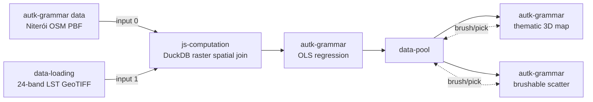

# Example: Per-feature spatial join + GPU regression with Autark

This example combines OSM road geometry with a 24-band land-surface-temperature (LST) raster to estimate
the per-road warming trend over Niterói (2001 to 2024). It mixes the Autark grammar with imperative JS/Python
nodes: an `autk-grammar` **data** node loads roads from a local PBF, a Python node loads the raster, a JS
DuckDB node spatially joins per-band LST averages onto each road, and a second `autk-grammar` node fits a
per-feature OLS regression on the GPU and feeds a thematic map + brushable scatter linked through a Data Pool.

It is a Curio port of the upstream Autark use case at
[github.com/urban-toolkit/autark/tree/main/usecases/src/niteroi](https://github.com/urban-toolkit/autark/tree/main/usecases/src/niteroi).

> [!NOTE]
> **WebGPU required**
> Autark relies on WebGPU. Run this example in a Chromium-based browser (Chrome / Edge) on a machine
> with a working GPU stack.

## Pipeline overview


```mermaid
flowchart LR
  OSM[autk-grammar data<br/>Niterói OSM PBF] -->|input 0| JOIN[js-computation<br/>DuckDB raster spatial join]
  RASTER[data-loading<br/>24-band LST GeoTIFF] -->|input 1| JOIN
  JOIN --> OLS[autk-grammar<br/>OLS regression]
  OLS --> POOL[data-pool]
  POOL --> MAP[autk-grammar<br/>thematic 3D map]
  POOL --> PLOT[autk-grammar<br/>brushable scatter]
  POOL <-. brush/pick .-> MAP
  POOL <-. brush/pick .-> PLOT
```

The one step the grammar can't express, sampling a raster, stays in a JS DuckDB node; the regression and
the linked views live in the grammar, and the Data Pool fans the result out to both views and routes brush
selections back.

## Data

`docs/examples/data/niteroi.osm.pbf` is an OSM extract for Niterói (regenerate with
`scripts/build_example_pbfs.py`). `docs/examples/data/niteroi_lst_verao_2001_2024.tif` is the 24-band LST
raster, from the upstream Autark repo.

## Step 1: Load OSM layers from a PBF (`autk-grammar`, data block)

A grammar node with only a `data` block loads Niterói's surface, parks, water, and roads from the local PBF.

```json
"data": [{
  "type": "osm",
  "pbfFileUrl": "docs/examples/data/niteroi.osm.pbf",
  "queryArea": { "geocodeArea": "Rio de Janeiro", "areas": ["Niterói"] },
  "outputTableName": "table_osm",
  "autoLoadLayers": { "layers": ["surface", "parks", "water", "roads"] }
}]
```

The data-only grammar node persists the layer array (`table_osm_surface` / `_parks` / `_water` / `_roads`)
to the backend and emits a DuckDB reference. The downstream `js-computation` join receives it as the plain
`[{ name, type, geojson }]` array, and the Curio sandbox resolves the reference automatically before the join's
code reads it as `[!! input_0 !!]`, so no manual fetch is needed. Downstream autark nodes reference these layers by name
(`"dataRef": "table_osm_roads"`), the named-layer case of
[Referencing Upstream Data in Autark Nodes](../ARCHITECTURE.md#referencing-upstream-data-in-autark-nodes).

## Step 2: Reference the LST raster (`data-loading`)

A Python node reads the bundled 24-band LST GeoTIFF and embeds the bytes as base64 inside a single-row
GeoDataFrame, so the join node can load them.

```python
import base64
import geopandas as gpd
from shapely.geometry import Point

# Read the bundled Niteroi land surface temperature raster (24 yearly
# bands, 2001-2024) and embed the bytes as base64 inside a single-row
# GeoDataFrame so the downstream join can reuse them without refetching.
# Vendored from urban-toolkit/autark (usecases/public/data) so the
# example runs offline and deterministically.
with open('docs/examples/data/niteroi_lst_verao_2001_2024.tif', 'rb') as f:
    geotiff_b64 = base64.b64encode(f.read()).decode('ascii')

gdf = gpd.GeoDataFrame(
    {'geotiff_b64': [geotiff_b64], 'band_count': [24]},
    geometry=[Point(0, 0)],
    crs='EPSG:4326',
)
return gdf
```

Both branches go straight into the join node: the OSM layer array on its first input circle and the raster
row on its second. Its code reads them as `[!! input_0 !!]` and `[!! input_1 !!]` (see
[Several inputs](../USAGE.md#several-inputs)).

## Step 3: Spatial join LST → roads (`js-computation`, DuckDB)

The join node re-ingests each OSM layer into DuckDB, with its coordinates on a 1 cm grid so autk-db can clip it
to the surface again. It loads the raster with `loadGeoTiff`, turns each raster cell into a point at its center
carrying the cell's 24 values, and runs a `NEAR` `spatialQuery` to average each band over the cells within 1 km of
every road segment. A final `rawQuery` reshapes the per-band averages into a single `lst_timeseries` array per road
and re-emits the layer stack (all in EPSG:3395) for a consistent CRS across surface/parks/water/roads.

```js
const osmLayers = [!! input_0 !!];
const rasterFc = [!! input_1 !!];
// … rasterFc's geotiff_b64 is decoded into geotiffArrayBuffer …
for (const layer of osmLayers)
  await db.loadGeojson({ geojsonObject: snapLayer(layer.geojson), outputTableName: layer.name, coordinateFormat: 'EPSG:3395', layerType: layer.type });
await db.loadGeoTiff({ geotiffArrayBuffer, outputTableName: 'lst', coordinateFormat: 'EPSG:4326' });
// … getRaster('lst') becomes one point per cell, loaded as the `lst_cells` points layer …
await db.spatialQuery({
  tableRootName: 'table_osm_roads', tableJoinName: 'lst_cells', near: { distance: 1000 },
  groupBy: Array.from({ length: 24 }, (_, i) => ({ column: `band_${i + 1}`, aggregateFn: 'avg' })),
});
// … rawQuery packs the 24 band averages into properties.lst_timeseries …
```

## Step 4: Per-road OLS regression (`autk-grammar`)

The grammar `compute` block binds each road's 24-year series as a per-feature array
(`attributes.bands` = `lst_timeseries`, `attributeArrays.bands` = 24) and runs the OLS WGSL shader, emitting
two columns: `angle` (warming angle, degrees) and `intercept`. It references the roads layer by its real
name so the surface/parks/water context layers pass through untouched.

```json
"compute": [{
  "dataRef": "table_osm_roads",
  "attributes": { "bands": "lst_timeseries" },
  "attributeArrays": { "bands": 24 },
  "outputColumns": ["angle", "intercept"],
  "wglsFunction": "... OLS slope/intercept over the 24 bands; angle = atan(slope) in degrees ..."
}]
```

## Step 5: Linked map + scatter through a Data Pool

The compute output flows into a **`data-pool`** node, which fans the augmented layer stack out to two
`autk-grammar` views and routes brush/pick selections between them (`Interaction` edges `pool→map` and
`pool→plot`). The `map` renders the full stack and colours roads by `angle`; the `plot` is a brushable
`intercept`-vs-`angle` scatter, and brushing it highlights the matching roads on the 3D map.

```json
"map": { "layerRefs": [
  { "dataRef": "table_osm_surface" }, { "dataRef": "table_osm_parks" }, { "dataRef": "table_osm_water" },
  { "dataRef": "table_osm_roads", "isPick": true, "isColorMap": true, "getFnv": "angle", "getFnvType": "quantitative", "defaultFnv": 0,
    "legendTitle": "Warming angle (°)" }
]}

"plot": { "dataRef": "table_osm_roads", "mark": "scatter", "axis": ["intercept", "angle"],
          "title": "LST regression, warming angle vs baseline (Niterói roads)", "events": ["brush"] }
```

## Going further

The upstream Autark use case adds per-month variants and a richer raster pipeline; see
[github.com/urban-toolkit/autark/tree/main/usecases/src/niteroi](https://github.com/urban-toolkit/autark/tree/main/usecases/src/niteroi).
