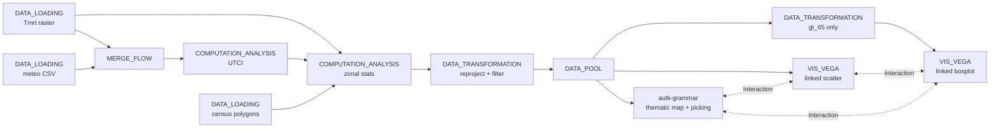

# Example: Heterogeneous data + cross-grammar linked views

This example combines three different data sources — a high-resolution thermal raster, a tabular meteorological feed, and a sociodemographic GeoDataFrame — into a single pipeline that derives the Universal Thermal Climate Index (UTCI) per Milan census tract, and then renders the result through coordinated `autk-grammar` map, Vega-Lite scatter, and Vega-Lite boxplot views with cross-grammar Interaction edges. The use case is heat exposure of older adults in Milan; the framework story is that Curio's `MERGE_FLOW` and `DATA_POOL` let you fan a heterogeneous join out to multiple linked views regardless of the visualization grammar.

> [!NOTE]
> **WebGPU required**
> The `autk-grammar` map step in this dataflow needs WebGPU. Run this example in a Chromium-based browser (Chrome / Edge) on a machine with a working GPU stack.

## Pipeline overview



## Data

- [09-milan_mrt.tif](data/09-milan_mrt.tif) — 2022 mean radiant temperature raster (Milan, July 22, noon). Pre-downsampled by 4× per dimension and float16-quantized so the file fits in the repo; UTCI precision (~0.06 °C in this range) is unaffected.
- [09-milan_weather.csv](data/09-milan_weather.csv) — hourly ERA5 weather (Td, Wind, RH) for the same day.
- [09-milan_census.geojson](data/09-milan_census.geojson) — Milan census polygons, trimmed to the `gt_65` (population over 65) column.

Original sources: Milan thermal raster from the [Curio team's bundled tutorial Drive](https://drive.google.com/drive/folders/1-cncKF-omB0av98WzKApKtyJTrgvfa0P?usp=sharing); census polygons from ISTAT.

Paths in the code below are relative to the directory you launched Curio from — run `curio start` from the repo root.

## Step 1: Load the mean radiant temperature raster (`DATA_LOADING`)

Read the GeoTIFF directly with `rasterio` and hand the dataset object downstream.

```python
import rasterio
src = rasterio.open('docs/examples/data/09-milan_mrt.tif')
return src
```

## Step 2: Load the meteorological CSV (`DATA_LOADING`)

The hourly ERA5 file gives air temperature (Td), wind speed (Wind), and relative humidity (RH) per hour `it`. The downstream UTCI step picks the row matching the raster's noon timestamp.

```python
import pandas as pd
sensor = pd.read_csv('docs/examples/data/09-milan_weather.csv', delimiter=';')
return sensor
```

## Step 3: Bundle the raster and meteo inputs (`MERGE_FLOW`)

The merge node has no code of its own; it exposes the raster as `arg[0]` and the meteo DataFrame as `arg[1]` to the next compute node.

## Step 4: Compute UTCI on the raster grid (`COMPUTATION_ANALYSIS`)

Read the noon weather row and call `pythermalcomfort.models.utci` to produce a UTCI value per pixel. Two non-obvious details in this node:

- `data.filled(np.nan)` collapses the rasterio MaskedArray to a plain float array with NaN for nodata, regardless of the raster's nodata sentinel.
- `limit_inputs=False` keeps UTCI valid when `tr − tdb > 30` (common at noon in Milan, where MRT is regularly 60–70 °C while air temperature stays around 30 °C). With the default `limit_inputs=True`, those pixels would silently come back as NaN and the map would render half-empty.

The output is the UTCI grid as a list-of-lists plus its `[width, height]` shape, packaged as a tuple so the downstream zonal-stats node can rebuild the array.

```python
import numpy as np
from pythermalcomfort import models
from rasterio.warp import Resampling

src    = arg[0]
sensor = arg[1]
timestamp = 12

# Bundled raster is already at the working resolution; no further downsample needed.
upscale_factor = 1.0
data = src.read(
    out_shape=(src.count, int(src.height * upscale_factor), int(src.width * upscale_factor)),
    resampling=Resampling.nearest,
    masked=True,
)
data = data.astype(float).filled(np.nan)

sensor_filtered = sensor[sensor["it"] == timestamp]
tdb = float(sensor_filtered["Td"].values[0])
v   = float(sensor_filtered["Wind"].values[0])
rh  = float(sensor_filtered["RH"].values[0])

utci_result = models.utci(tdb=tdb, tr=data[0], v=v, rh=rh, units="SI", limit_inputs=False)
utci_grid = np.asarray(getattr(utci_result, "utci", utci_result), dtype=float)

if utci_grid.ndim == 3 and utci_grid.shape[0] == 1:
    utci_grid = utci_grid[0]

utci_list  = utci_grid.tolist()
utci_shape = [utci_grid.shape[1], utci_grid.shape[0]]

return (utci_list, utci_shape)
```

## Step 5: Load census polygons (`DATA_LOADING`)

A separate branch loads the sociodemographic GeoJSON that carries the `gt_65` column (the count of residents older than 65 per polygon).

```python
import geopandas as gpd
gdf = gpd.read_file('docs/examples/data/09-milan_census.geojson')
return gdf
```

## Step 6: Spatially join UTCI into census polygons (`COMPUTATION_ANALYSIS`)

Receive the original raster (for its CRS / transform), the UTCI tuple from Step 4, and the census polygons from Step 5. Run `rasterstats.zonal_stats` to compute per-polygon UTCI statistics and attach the mean to each polygon.

```python
from rasterstats import zonal_stats
import numpy as np

dataset    = arg[0]
utci_list  = arg[1][0]
utci_shape = arg[1][1]
gdf        = arg[2]

utci      = np.asarray(utci_list, dtype=float)
transform = dataset.transform * dataset.transform.scale(
    (dataset.width / utci_shape[0]),
    (dataset.height / utci_shape[1]),
)

nodata_value   = -999.0
utci_for_stats = np.where(np.isnan(utci), nodata_value, utci)

joined = zonal_stats(
    gdf, utci_for_stats,
    stats=["min", "max", "mean", "median"],
    affine=transform, nodata=nodata_value,
)

gdf["mean"] = [d["mean"] for d in joined]
return gdf.loc[:, [gdf.geometry.name, "mean", "gt_65"]]
```

## Step 7: Reproject and filter (`DATA_TRANSFORMATION`)

Drop polygons with non-positive UTCI and reproject to EPSG:3395 so the `autk-grammar` map downstream sees the CRS its tile pipeline expects. The `metadata.name` keeps the table referenceable as `census` throughout the rest of the dataflow.

Note the assignment goes through ``__dict__['metadata']`` instead of plain attribute syntax: pandas emits a `UserWarning` when setting an unknown attribute on a sliced DataFrame, and curio's sandbox treats any non-empty stderr as a node failure during e2e. Curio reads `.metadata` back through `getattr`, so both write paths work — but only the dict path stays warning-free.

```python
import geopandas as gpd

gdf = arg
filtered_gdf = gdf.set_crs(32632)
filtered_gdf = filtered_gdf.to_crs(3395)
filtered_gdf = filtered_gdf[filtered_gdf['mean'] > 0]
filtered_gdf.__dict__['metadata'] = {'name': 'census'}
return filtered_gdf
```

## Step 8: Fan out via DATA_POOL (`DATA_POOL`)

The pool keeps the joined `census` table in shared memory so the next three views can read it without re-running the spatial join.

## Step 9: Thematic map of UTCI (`autk-grammar`)

The map is an `autk-grammar` node with just a `map` block. The census polygons routed in from the Data
Pool are auto-injected as the `upstream` source; the layer is coloured by the UTCI `mean` column and
picking is enabled so the linked scatterplot can highlight selected tracts. No JavaScript and no explicit
data block — the grammar reads the upstream GeoDataFrame directly.

```json
{
  "map": {
    "layerRefs": [
      { "dataRef": "upstream", "getFnv": "mean", "getFnvType": "quantitative", "defaultFnv": 0, "isPick": true }
    ]
  }
}
```

`getFnv: "mean"` resolves to `properties.mean` (the per-tract UTCI). Picking (`isPick`) flips the
`interacted` flag through the pool, which the Vega scatter and boxplot consume on the next propagation
cycle.

## Step 10: Linked scatterplot — UTCI vs. older adults (`VIS_VEGA`)

A Vega-Lite scatter of `gt_65` vs `mean` UTCI. The interval selection on this view, combined with the Interaction edges added in Step 12, marks each polygon as `interacted` so the map can re-render with the selected tracts highlighted.

```json
{
  "$schema": "https://vega.github.io/schema/vega-lite/v6.json",
  "params": [{"name": "clickSelect", "select": "interval"}],
  "mark": {"type": "point", "cursor": "pointer"},
  "encoding": {
    "x": {"field": "gt_65", "type": "quantitative"},
    "y": {"field": "mean",  "type": "quantitative", "scale": {"domain": [37, 42]}},
    "fillOpacity": {"condition": {"param": "clickSelect", "value": 1}, "value": 0.3},
    "color": {
      "field": "interacted", "type": "nominal",
      "condition": {"test": "datum.interacted === '1'", "value": "red", "else": "blue"}
    }
  }
}
```

## Step 11: Linked boxplot of older-adult population (`VIS_VEGA`)

Add a `DATA_TRANSFORMATION` node that drops everything but `gt_65`, then a Vega-Lite boxplot reading from it. This view summarises the distribution of older-adult counts independent of UTCI; with the Interaction edges from Step 12 wired up, brushing on the map or scatter narrows the boxplot to the selected polygons.

```python
gdf = arg
return gdf.loc[:, ["gt_65"]]
```

```json
{
  "$schema": "https://vega.github.io/schema/vega-lite/v6.json",
  "transform": [{"fold": ["gt_65"], "as": ["Variable", "Value"]}],
  "mark": {"type": "boxplot", "size": 60},
  "encoding": {
    "x": {"field": "Variable", "type": "nominal", "title": "Variable"},
    "y": {"field": "Value",    "type": "quantitative", "title": "Value"}
  }
}
```

## Step 12: Wire the linked interaction (Interaction edges)

Connect the `autk-grammar` map, `VIS_VEGA` (scatter), and `VIS_VEGA` (boxplot) to the shared `DATA_POOL` with edges of `type: "Interaction"`. Brushing in any one view propagates an `interacted` flag through the census table the pool holds; the other views re-style by reading that column on the next propagation cycle. This is the cross-grammar piece — the same Interaction wiring works between Vega-Lite and Autark views without either side knowing about the other.

This example wires two pool-anchored Interaction edges:

- `DATA_POOL ↔ autk-grammar` — double-clicking a polygon in the map flips its row's `interacted` flag in the pool, which the Vega scatter and boxplot consume.
- `VIS_VEGA` (scatter) `↔ DATA_POOL` — brushing a region of the scatter writes the matching rows' `interacted` flag in the pool, which the grammar map consumes through its `map:picking` interaction.

## Final result

The map answers "where is heat exposure worst?", the scatter answers "is heat correlated with where older adults live?", and the boxplot anchors the older-adult distribution for context. Brushing any one view updates the others through the Interaction edges, regardless of whether the view is rendered through Vega-Lite or Autark. The pattern generalizes: any heterogeneous merge → fan-out via `DATA_POOL` → mixed Autark + Vega-Lite views with Interaction edges, and you get coordinated cross-grammar exploration for free.
