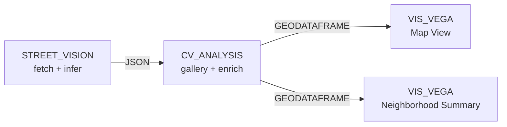

# Example: Street-level computer vision in a Curio dataflow

This example uses two computation nodes — `STREET_VISION` and `CV_ANALYSIS` — to fetch Google Street View imagery for a Chicago bounding box, run a Cityscapes-pretrained segmentation model over each image, enrich the per-image class ratios with neighborhood polygons, and fan the result out to two coordinated Vega-Lite views. The use case is the Lincoln Park greenery question from the project paper: *which Chicago neighborhoods have the highest visible vegetation in street-level imagery?*

The pipeline is data-acquisition-heavy on the left (real network calls, real model inference) and visualization-heavy on the right (two parallel Vega-Lite views fed from one geodataframe). The split between the two custom nodes mirrors the standard Curio pattern: one node owns the long-running inference job, the other owns the user-facing gallery, enrichment, and downstream push.

!!! note "External service required"
    The `STREET_VISION` node calls a companion FastAPI backend on `http://localhost:8001` (proxied by Curio's Flask backend through `/api/streetvision/*`). The backend hosts the HuggingFace model loader, the Street View fetcher, and the spatial-enrichment endpoints. Source and setup instructions are in the [Street Vision project README](https://github.com/ManeeshJupalle/Street-Level-Vision-Analytics-Node-for-Curio). A `GOOGLE_MAPS_API_KEY` is required to fetch real imagery; the same backend exposes a folder source for local image testing without the key.

## Pipeline overview



## Data

No file inputs — the `STREET_VISION` node fetches imagery directly from the Google Street View Static API at runtime. The neighborhood basemap (98 Chicago community-area polygons) is bundled with the FastAPI backend and served at `/api/streetvision/data/basemap/chicago_neighborhoods.geojson`.

## Step 1: Configure and run the inference (`STREET_VISION`)

Open the node's panel and fill in three blocks:

1. **Model** — search HuggingFace for a Cityscapes segmentation checkpoint (e.g. `nvidia/segformer-b2-finetuned-cityscapes-1024-1024`) and pick it. The node also accepts YOLOv8 detection checkpoints from the `ultralytics/*` namespace; the descriptor's input port is a JSON channel so the downstream node can branch on `model_type`.
2. **Place** — type a place name (e.g. `Lincoln Park, Chicago`) and the node geocodes via Nominatim to a bounding box. *Check Coverage* hits the Google Metadata API at a 16-point grid sample to estimate panorama availability without burning Static API quota.
3. **Classes** — pick from the Cityscapes-19 suggestions (`vegetation`, `road`, `building`, `sidewalk`, …) or paste a custom comma-separated list. The list is forwarded to the inference service, which filters and renormalises class ratios server-side.

Click **Run Analysis**. The node creates a job on the FastAPI backend, polls `/api/streetvision/latest` every 2 seconds for progress, and emits a JSON payload downstream once the job reports `status === 'completed'`:

```jsonc
{
  "type": "street_vision_results",
  "job_id": "ca5e8809-…",
  "model_type": "segmentation",
  "total_images": 20,
  "results": [
    {
      "image_id": "2PGbI7…",
      "image_url": "https://maps.googleapis.com/maps/api/streetview?pano=…",
      "latitude": 41.9251,
      "longitude": -87.6492,
      "class_ratios": { "road": 0.26, "building": 0.68, "vegetation": 0.04, "fence": 0.00 }
    }
    /* … */
  ]
}
```

## Step 2: Inspect and push downstream (`CV_ANALYSIS`)

The `CV_ANALYSIS` node consumes the JSON payload from its input port and renders an inline gallery — one card per image, each showing the source thumbnail and the top three classes by ratio (or the object-count breakdown if the upstream model was a detector). Clicking a card opens an inspector with the segmentation overlay rendered against the Cityscapes palette so a reviewer can spot-check the model's classification by eye.

When you click **Push Downstream**, the node:

1. Builds a `FeatureCollection` from the per-image lat/lon and class ratios (one `Point` feature per image).
2. Calls `POST /api/streetvision/data/basemap/enrich_with_neighborhoods` to attach a `neighborhood_name` to each point via an `STRtree`-indexed point-in-polygon join and to compute per-neighborhood aggregates (image count, dominant class, dominant percentage, top-3 class frequencies).
3. Emits the enriched `FeatureCollection` on its output port as `{ data, dataType: 'geodataframe' }`. Both Vega-Lite views consume this shape directly.

`CV_ANALYSIS` also marks its own `output.code = 'success'` after the push so a downstream `Play` (which walks the ancestor chain re-running anything not in `'success'` state) doesn't re-trigger it.

## Step 3: Render the Map View (`VIS_VEGA`)

Open the Vega-Lite node's grammar editor, click **Templates**, and pick **Street Vision — Map View**. The template (registered with the node descriptor) renders two layers in one composition:

- A polygon layer (`lookup`-joined back to the basemap GeoJSON loaded by URL) shaded by `nbhd_dominant_class` and `nbhd_dominant_pct`.
- A point layer of the per-image dominant class, sized small enough to read against the polygon fill.

Click **Play** to compile. The node calls our `applyGrammar`, which:

1. Reads `data.input` (the geodataframe pushed by `CV_ANALYSIS`).
2. Parses the features into Vega values, injecting `__row_index__` for cross-grammar interactions.
3. Compiles the Vega-Lite spec, injects `data.values`, mounts a Vega `View`, and renders.

## Step 4: Render the Neighborhood Summary (`VIS_VEGA`)

Add a second `VIS_VEGA` node, wire it to the same `CV_ANALYSIS` output, and load the **Street Vision — Neighborhood Summary** template. This is a horizontal bar chart of `nbhd_image_count` by `neighborhood_name`, coloured by `nbhd_dominant_class` using the same Cityscapes palette as the map. Side-by-side with the map, it makes the dominant-class story legible without leaning on the map's small-multiple density.

## What you should see

With Lincoln Park as the bounding box and `nvidia/segformer-b2-finetuned-cityscapes-1024-1024` as the model:

- ~20 panoramas fetched (governed by the FastAPI backend's `DEMO_BATCH_CAP` — raise it in `backend/config.py` for a real run).
- The map renders the four sampled community areas (Lincoln Park, Lake View, Old Town, Sheffield & DePaul) with `vegetation` dominating in Lincoln Park and Lake View, `building` dominating in Old Town and Sheffield.
- The bar chart corroborates: Lincoln Park is the densest row, coloured green; Old Town is shorter, coloured orange.

## Caveats

- **Demo-mode batch cap.** The FastAPI backend defaults to a 20-image cap to keep the demo cheap and reproducible. The provided `evaluation/performance_benchmarks/results.json` reports a single per-image latency (~0.30 s for SegFormer-B2 on a 4-core CPU) rather than a scaling curve — three of four benchmark runs collapsed to the same effective batch size because of the cap. Lifting the cap is a one-line change.
- **Network failures.** Google Street View occasionally returns 0-byte responses for a valid pano ID. The backend treats anything under 5 KB as a no-image and skips it; the node reports the surviving count.
- **Model coverage.** The frontend assumes Cityscapes classes when rendering overlays. A non-Cityscapes segmentation model will still run, but the colour palette will fall back to a deterministic hash of the class name.
