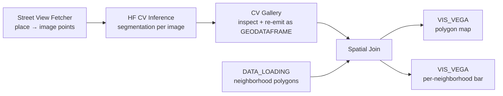

# Example: Street-level computer vision

This example pulls Google Street View imagery for a chosen neighborhood, runs a HuggingFace segmentation model on every panorama, tags each result with the city neighborhood it falls in via a spatial join, and renders the output as a polygon-shaded map + a per-neighborhood bar chart. The use case is *urban greenery audits* — see which neighborhoods are visually leafy vs. paved — but the same pipeline works for any per-pixel class you can find a model for (sidewalks, traffic signs, advertising, building facade material, …).

This example doubles as the worked example in [EXTENDING.md](../EXTENDING.md) — if you're a developer reading code, the manifest entries, behavior hooks, and Flask blueprint that ship these nodes are walked through there.

> [!NOTE]
> **Setup required**
> Install the **Street Vision** package from Curio's `/catalog` page; the first install pip-installs the package's ML stack (`torch`, `transformers`, `ultralytics`, `huggingface_hub`) declared in its manifest — a ~3 GB download on a cold env. Have a Google Maps API key ready to paste into the Street View Fetcher node (the key lives in the node UI for the current session only — never written to disk or saved with the dataflow). The Spatial Join node is built-in and needs no separate install.

## Pipeline overview



Four nodes do the work plus two `VIS_VEGA` views consume the output. The split is deliberate: each node is independently useful (Spatial Join works for any spatial workflow, not just CV), and the imagery + inference are decoupled so you can swap one without touching the other.

## Origin

Originally contributed by [@ManeeshJupalle](https://github.com/ManeeshJupalle) in [PR #120](https://github.com/urban-toolkit/curio/pull/120) as a CS 524 university project. The original PR shipped two monolithic nodes (`STREET_VISION`, `CV_ANALYSIS`) talking to a companion FastAPI service in a separate repo; the merged version decomposes them into the three reusable nodes used here, ports the FastAPI service inside Curio's Flask backend, and adds a generic `Spatial Join` node to `curio.builtin@1`.

The defaults baked into [`10-street-vision-cv-analysis.json`](10-street-vision-cv-analysis.json) (bbox, recommended model, class list) reproduce the **Chicago Greenery case study** from the original project's evaluation:
- bbox: `[-87.66, 41.91, -87.62, 41.94]` (Lincoln Park)
- model: `nvidia/segformer-b2-finetuned-cityscapes-1024-1024`
- classes: `vegetation, road, building, sidewalk, sky`

## Step 1: Fetch Street View imagery (`Street View Fetcher`)

Type a place name and click **Verify Coverage** to geocode it and ask Google how many panoramas exist in the bounding box. Adjust the limit (default 20, max 200), then click **Fetch Images**. The node emits a GEODATAFRAME of point features:

```json
{
  "type": "FeatureCollection",
  "features": [
    {
      "type": "Feature",
      "geometry": {"type": "Point", "coordinates": [-87.6478, 41.9211]},
      "properties": {
        "image_id": "CAoSL...",
        "pano_id":  "CAoSL...",
        "image_url": "https://maps.googleapis.com/maps/api/streetview?...",
        "latitude": 41.9211,
        "longitude": -87.6478
      }
    },
    ...
  ]
}
```

Suggested place for first-run: `Lincoln Park, Chicago`.

## Step 2: Run segmentation (`HF CV Inference`)

Wire the Fetcher's output into the Inference node. Inside the node:

1. **Task** — pick `Segmentation` (or `Detection` for YOLO).
2. **Model** — the search defaults to `cityscapes`; leave "auto-pick top match" enabled or click a specific entry. For greenery audits a SegFormer-Cityscapes checkpoint works well (e.g. `nvidia/segformer-b0-finetuned-cityscapes-512-1024`).
3. **Target Classes** — click `vegetation` (and optionally `building`, `road`, `sky`). You can also drop a CSV via the `+ Import CSV` link.
4. Click **Run Inference**. Progress is polled every 2 seconds; expect ~10–60 seconds per image on CPU, faster with a GPU.

The output is per-image JSON with class ratios, lat/lon, and a stable `image_id`.

## Step 3: Inspect results (`CV Gallery`)

Wire Inference → CV Gallery. The gallery shows thumbnails with top-3 class breakdowns; click any tile for an inspect view with side-by-side source / segmentation-overlay tabs. The "Aggregate Stats" tab summarizes the run.

Click **▶ Push to Downstream** to emit the same data as a GEODATAFRAME-shaped FeatureCollection — each feature's `properties` now flatten the class ratios into individual columns plus `dominant_class` and `dominant_pct` columns useful for downstream visualization.

## Step 4: Load neighborhood polygons (`DATA_LOADING`)

For Chicago, the city publishes a [Boundaries — Neighborhoods](https://data.cityofchicago.org/Facilities-Geographic-Boundaries/Boundaries-Neighborhoods/bbvr-jsnu) GeoJSON. Any FeatureCollection works as long as each Polygon feature carries a string property to use as the tag.

```python
import geopandas as gpd
gdf = gpd.read_file('chicago_neighborhoods.geojson')
return gdf
```

## Step 5: Tag each image with its neighborhood (`Spatial Join`)

The Spatial Join node (built-in, in `curio.builtin@1`) renders as a small icon-only block — just like Merge Flow — with two distinct input handles on the left edge: **points** (top, blue dot) and **polygons** (bottom, green dot). Wire the CV Gallery output to the points handle and the polygons output (from Step 4) to the polygons handle.

The node hardcodes the polygon tag column to `properties.name`. The Chicago neighborhoods file uses `pri_neigh`, the NYC boroughs file uses `BoroName`, etc., so insert a `Data Transformation` node between Data Loading and Spatial Join to rename the relevant property to `name`:

```python
# Rename Chicago's `pri_neigh` to `name` so Spatial Join picks it up.
gdf = arg.rename(columns={'pri_neigh': 'name'})
return gdf
```

The node emits the input points augmented with:

- `neighborhood_name` — the matching polygon's tag value, or null for points outside every polygon.
- `nbhd_dominant_class` / `nbhd_dominant_pct` / `nbhd_image_count` — per-polygon roll-ups projected back onto every member point so a Vega-Lite `lookup` can read them directly.

## Step 6: Map view (`VIS_VEGA`)

Wire Spatial Join → a VIS_VEGA node and paste this spec. Mercator projection, polygons colored by their dominant detected class, points overlaid as a sanity check.

```json
{
  "$schema": "https://vega.github.io/schema/vega-lite/v6.json",
  "width": 600,
  "height": 600,
  "projection": {"type": "mercator"},
  "layer": [
    {
      "data": {"name": "table"},
      "transform": [{"filter": "datum.geometry != null"}],
      "mark": {"type": "geoshape", "stroke": "#888", "strokeWidth": 0.4},
      "encoding": {
        "color": {
          "field": "properties.nbhd_dominant_class",
          "type": "nominal",
          "scale": {
            "domain": ["road","sidewalk","building","vegetation","sky","car"],
            "range":  ["#4A90D9","#8B5CF6","#2ECC71","#F5A623","#3498DB","#2C3E50"]
          },
          "legend": {"title": "Dominant class"}
        },
        "tooltip": [
          {"field": "properties.neighborhood_name", "title": "neighborhood"},
          {"field": "properties.nbhd_dominant_class", "title": "dominant"},
          {"field": "properties.nbhd_dominant_pct",   "title": "avg %"}
        ]
      }
    }
  ]
}
```

## Step 7: Per-neighborhood bar chart (`VIS_VEGA`)

A second `VIS_VEGA` wired off the same Spatial Join output:

```json
{
  "$schema": "https://vega.github.io/schema/vega-lite/v6.json",
  "width": 400,
  "height": {"step": 16},
  "data": {"name": "table"},
  "transform": [
    {"filter": "datum.properties.neighborhood_name != null"},
    {
      "aggregate": [{"op": "count", "as": "image_count"}],
      "groupby": ["properties.neighborhood_name", "properties.dominant_class"]
    }
  ],
  "mark": "bar",
  "encoding": {
    "y": {"field": "properties.neighborhood_name", "type": "nominal", "sort": "-x", "title": null},
    "x": {"field": "image_count", "type": "quantitative", "title": "images"},
    "color": {
      "field": "properties.dominant_class",
      "type": "nominal",
      "scale": {
        "domain": ["road","sidewalk","building","vegetation","sky","car"],
        "range":  ["#4A90D9","#8B5CF6","#2ECC71","#F5A623","#3498DB","#2C3E50"]
      }
    }
  }
}
```

## Expected output

For a Lincoln Park run with the SegFormer-Cityscapes model and `vegetation` as the target class, the map polygon for Lincoln Park is colored vegetation-yellow (≈25–35% average vegetation pixels), while a denser downtown neighborhood like the Loop comes in road-blue or building-green. The bar chart shows image counts per neighborhood with each bar segmented by the modal dominant class.

## Limitations

- **Jobs don't survive a backend restart.** Inference state is in-memory; restart loses any in-flight job. Re-run.
- **Cost.** Street View Static API requests are billed past Google's free tier. The Fetcher node caps requests at 200; default 20.
- **CPU inference is slow.** A single SegFormer pass per panorama takes a few seconds on CPU; a 20-image run lands around 1–2 minutes. With a GPU it's near-realtime.
- **The neighborhood `name` property is per-dataset.** Chicago uses `pri_neigh`, NYC uses `BoroName`, a generic FeatureCollection uses `name`. Set this in the Spatial Join node's "Polygon name property" field; default is `name`.
