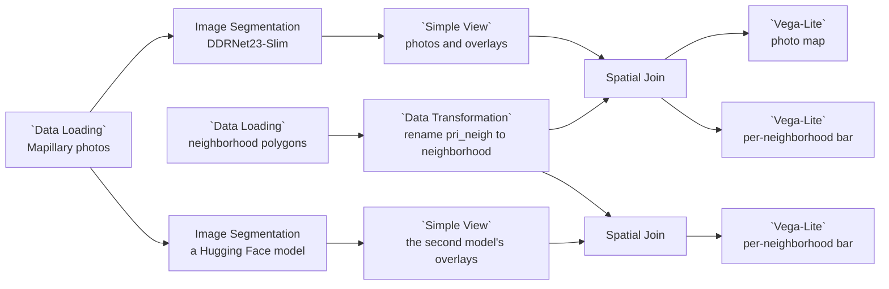

# Example: Street-level computer vision

This example labels every pixel of 40 Mapillary street photos taken around Lincoln Park in Chicago, tags each photo with the neighborhood it was taken in, and draws what dominates each neighborhood's streets as a map of the photos and a bar chart. The use case is *urban greenery audits*, showing which streets are leafy and which are paved, but the same pipeline works for any class a segmentation model labels: sidewalks, traffic signs, building facades, and so on.

It runs two routes over the same photos. Route 1 uses **DDRNet23-Slim**, the model that ships with Curio, and needs no network. Route 2 uses a model you add from Hugging Face.

> [!NOTE]
> **Setup required**
> The example declares the **Street Vision** package, which Curio installs when you open it; the package brings `onnxruntime`. The photos and DDRNet23-Slim ship with Curio, so route 1 runs as it opens. Route 2 needs a model from the Discovery Catalog: see [Step 6](#step-6-a-second-model-from-hugging-face).

## Pipeline overview


```mermaid
flowchart LR
  P[`Data Loading`<br/>Mapillary photos]
  S1[Image Segmentation<br/>DDRNet23-Slim]
  G1[`Simple View`<br/>photos and overlays]
  L[`Data Loading`<br/>neighborhood polygons]
  T[`Data Transformation`<br/>rename pri_neigh to neighborhood]
  S2[Image Segmentation<br/>a Hugging Face model]
  G2[`Simple View`<br/>the second model's overlays]

  P --> S1 --> G1 --> SJ1[Spatial Join]
  %% Simple View passes its input straight through, so the join sees the same frame.
  L --> T --> SJ1
  SJ1 --> V1[`Vega-Lite`<br/>photo map]
  SJ1 --> V2[`Vega-Lite`<br/>per-neighborhood bar]
  P --> S2 --> G2 --> SJ2[Spatial Join]
  T --> SJ2
  SJ2 --> V3[`Vega-Lite`<br/>per-neighborhood bar]
```

## Origin

Originally contributed by [@ManeeshJupalle](https://github.com/ManeeshJupalle) in [PR #120](https://github.com/urban-toolkit/curio/pull/120) as a CS 524 university project, which audited greenery in the same Lincoln Park box, `[-87.66, 41.91, -87.62, 41.94]`.

## Step 1: Load the photos (`Data Loading`)

The Data Catalog ships 40 Mapillary panoramas from that box as `data.curio.mapillary-sample`, each with its photographer (`creator`), capture time, heading and place. Mapillary photos are licensed CC BY-SA 4.0, so a figure made from them credits each photo's `creator`.

```python
photos = curio_load_collection("data.curio.mapillary-sample")

return photos
```

`curio_load_collection` gives one row per photo, with a `path` the next node reads and a `thumbnail` that Simple View draws.

## Step 2: Label every pixel (`Image Segmentation`)

The node comes from the Street Vision package. Its code names a model in the Model Catalog and the classes to report:

```python
"""Label every pixel of each image with a Model Catalog model.

The input is a collection's rows, each with a ``path``, as a Data Loading
node gives them for street-level images from the Data or Discovery Catalog.
To use another model, drag it from the Model Catalog onto this node.

``classes`` are the model's labels to report; each becomes a
``<class>_pct`` column, its share of the image's pixels in percent. ``None``
reports every label.
``dominant_class`` and ``dominant_pct`` name the one of them covering most,
and ``overlay_url`` shows the image tinted by class.
"""

model = curio_load_model("model.curio.ddrnet23-slim")
classes = ["vegetation", "terrain", "sky", "road", "sidewalk", "building"]

return curio_segment(arg, model, classes)
```

Each row comes back with the results first: `dominant_class` and `dominant_pct`, then `vegetation_pct`, `terrain_pct` and the other classes asked for, each as a share of all the photo's pixels, then `overlay_url` and `segment_error` (empty unless the photo could not be read). Every input column follows, so the photo keeps its place and its credit.

DDRNet23-Slim labels the 19 Cityscapes classes; the Model Catalog's page for it lists them. A class the model does not label stops the node with a message naming the ones it has.

## Step 3: Inspect results (`Simple View`)

Wire Image Segmentation → `Simple View`. It is a built-in node with no configuration: each photo is a card showing the photo beside its overlay, captioned with the dominant class and the first class shares.

`Simple View` picks the image columns itself. It looks for the familiar names first (`image_url`, `overlay_url`, `image_content`, `image`, `thumbnail`) and otherwise sniffs the values, so any frame with pictures in it displays without being told which column holds them. When a frame has more than one image column, an **Image column** selector appears; leave it on `all` to compare photo against overlay, or pin it to `overlay_url` to study the masks on their own.

Clicking a card emits its row index as a selection, which a connected `Data Pool` picks up. `Simple View` passes its input straight through, so the Spatial Join downstream receives the same frame Image Segmentation emitted.

## Step 4: Load and prepare neighborhood polygons (`Data Loading`, `Data Transformation`)

The Data Catalog ships Chicago's [Boundaries, Neighborhoods](https://data.cityofchicago.org/d/y6yq-dbs2) layer as `data.cityofchicago.neighborhoods` (98 polygons named in `pri_neigh`). Any FeatureCollection works as long as each Polygon feature carries a string property to use as the tag.

```python
import geopandas as gpd

# Chicago official neighborhoods boundary (98 polygons, `pri_neigh` names),
# vendored in the Data Catalog so this example runs offline. Any polygon
# FeatureCollection with a string name property works here.
gdf = curio_load_data("data.cityofchicago.neighborhoods")

# __dict__, not plain assignment: pandas warns about creating a column via
# a new attribute name, and that warning lands in this node's output with
# an absolute site-packages path. NOT gdf.attrs, and do not just delete the
# line: the sandbox reads this name (sandbox/util/parsers.py) and both of
# those drop it silently from the emitted FeatureCollection.
gdf.__dict__["metadata"] = {"name": "chicago_neighborhoods"}
return gdf
```

The Spatial Join node tags each point with the polygon column you pick in its body. The Chicago neighborhoods file calls it `pri_neigh`; this example renames it to `neighborhood` with a `Data Transformation` node, and both Spatial Join nodes tag with `neighborhood`. Not `name`: every photo row already has one, its file name, and the join never overwrites a column the points carry.

```python
# Spatial Join tags each photo with the polygon column its body names,
# `neighborhood` here. Chicago's file calls it `pri_neigh`. Not `name`: a
# photo already has one, its file name.
import geopandas as gpd

gdf = arg.rename(columns={"pri_neigh": "neighborhood"})
# __dict__, not plain assignment: pandas warns about creating a column via
# a new attribute name, and that warning lands in this node's output with
# an absolute site-packages path. NOT gdf.attrs, and do not just delete the
# line: the sandbox reads this name (sandbox/util/parsers.py) and both of
# those drop it silently from the emitted FeatureCollection.
gdf.__dict__["metadata"] = {"name": "chicago_neighborhoods"}
return gdf
```

## Step 5: Tag each photo and chart it (`Spatial Join`, `Vega-Lite`)

The Spatial Join node (built-in, in `curio.builtin@1`) has two input handles on its left edge, each a hollow ring that fills in once wired: **points** (the upper, blue one) and **polygons** (the lower, green one). Wire the `Simple View` output to the points handle and the `Data Transformation` output to the polygons handle, and type `neighborhood` in its **Tag each point with this polygon column** field.

The node emits the input points augmented with:

- `neighborhood`: the matching polygon's `neighborhood`, or null for points outside every polygon.
- `neighborhood_point_count`: how many photos fell in the same neighborhood.
- `neighborhood_dominant_class` / `neighborhood_dominant_pct`: per-neighborhood roll-ups of the photos' dominant class, projected back onto every member point so a Vega-Lite spec can colour by them directly.

A `Vega-Lite` node wired to the join maps the photos, each colored by the dominant class of its neighborhood:

```json
{
  "$schema": "https://vega.github.io/schema/vega-lite/v6.json",
  "width": 600,
  "height": 600,
  "projection": {"type": "mercator"},
  "layer": [
    {
      "transform": [{"filter": "datum.geometry != null"}],
      "mark": {"type": "geoshape", "stroke": "#888", "strokeWidth": 0.4},
      "encoding": {
        "color": {
          "field": "neighborhood_dominant_class",
          "type": "nominal",
          "scale": {
            "domain": ["road","sidewalk","building","vegetation","sky","terrain"],
            "range":  ["#4A90D9","#8B5CF6","#2ECC71","#F5A623","#3498DB","#2C3E50"]
          },
          "legend": {"title": "Dominant class"}
        },
        "tooltip": [
          {"field": "neighborhood", "title": "neighborhood"},
          {"field": "neighborhood_dominant_class", "title": "dominant"},
          {"field": "neighborhood_dominant_pct",   "title": "avg %"}
        ]
      }
    }
  ]
}
```

A second `Vega-Lite` off the same join counts photos per neighborhood, each bar split by dominant class:

```json
{
  "$schema": "https://vega.github.io/schema/vega-lite/v6.json",
  "width": 400,
  "height": {"step": 16},
  "transform": [
    {"filter": "datum.neighborhood != null"},
    {
      "aggregate": [{"op": "count", "as": "image_count"}],
      "groupby": ["neighborhood", "dominant_class"]
    }
  ],
  "mark": "bar",
  "encoding": {
    "y": {"field": "neighborhood", "type": "nominal", "sort": "-x", "title": null},
    "x": {"field": "image_count", "type": "quantitative", "title": "images"},
    "color": {
      "field": "dominant_class",
      "type": "nominal",
      "scale": {
        "domain": ["road","sidewalk","building","vegetation","sky","terrain"],
        "range":  ["#4A90D9","#8B5CF6","#2ECC71","#F5A623","#3498DB","#2C3E50"]
      }
    }
  }
}
```

## Step 6: A second model from Hugging Face

The second Image Segmentation node runs on the same photos and reports every class its model names:

```python
"""The same photos, with a model from Hugging Face.

Add one in the Discovery Catalog (Hugging Face models, for example
openmmlab/upernet-convnext-tiny), then drag it from the Model Catalog onto
this node. Until then it runs DDRNet23-Slim, the model that ships with Curio.
"""

model = curio_load_model("model.curio.ddrnet23-slim")
classes = None  # every class the model names

return curio_segment(arg, model, classes)
```

To give it a model of its own:

1. Open the **Discovery Catalog** and choose **Hugging Face models**. It lists image segmentation models Curio can run.
2. Find a model, for example `openmmlab/upernet-convnext-tiny` (ADE20K's 150 classes, MIT license), and click **Add to Model Catalog**. Curio downloads it, and installs `torch` and `transformers` when the model needs them.
3. Back on the canvas, open **Model Catalog** in the left Tools panel and drag the model onto this node. Its `curio_load_model(...)` line now names the new model.
4. Run the node. The `Simple View`, Spatial Join and bar chart after it show the new model's classes.

The bar chart for this route names no colours, so it draws whatever classes the model reports. A model trained on other scenes labels other things: ADE20K says `tree` and `grass` where Cityscapes says `vegetation`.

## Use your own area

The sample is a fixed set of photos. To take photos of another place from Mapillary:

1. Get a Mapillary access token: sign in at [mapillary.com/dashboard/developers](https://www.mapillary.com/dashboard/developers), register an application, and copy its **Client Token** (it starts with `MLY|`).
2. Open **API Settings** in the page header. Under **Discovery Catalog**, find the **Mapillary access token** row, paste the token, and click **Save**. The row then reads *(saved - leave blank to keep)*, and the Mapillary card in the Discovery Catalog reads **Token set**.
3. Open the **Discovery Catalog**, choose **Mapillary**, and click **Download** on **Street-level images**.
4. Set the **Area**: a place, coordinates or a dataset's extent give the box to take photos from, of at most 25 km². Choose how many photos with **Most images**, and how large with **Size**. Photos are taken from across the box, newest first.
5. Click **Download**. The photos land in the Data Catalog as a collection of their own, each with its creator.
6. In the example's first node, replace `data.curio.mapillary-sample` with the new collection's id (drag the collection from the Data Catalog onto the node to do it), and run the dataflow.

For another city, swap the neighborhood polygons in Step 4 for that city's, and rename its name column to `neighborhood` in the `Data Transformation`: NYC's boroughs file calls it `BoroName`.

## Expected output

On the sample, route 1 finds road the dominant class in the most photos, then sky, building and vegetation. Vegetation covers about 15% of a photo's pixels on average and up to about 35%, most in Sheffield & DePaul. Most photos fall in Lincoln Park (27), the rest in Sheffield & DePaul, Lake View and Old Town, so the bar chart has four bars with Lincoln Park's the longest.

## Limitations

- **Models run on the CPU.** DDRNet23-Slim takes a fraction of a second per photo; a large Hugging Face model can take several seconds.
