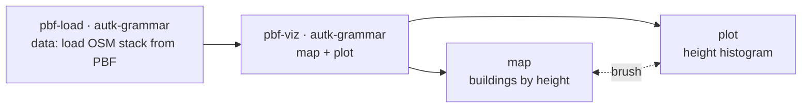

# Example: Loading OSM layers from a PBF with Autark

This example splits **loading** from **visualization** across two `autk-grammar` nodes. The first loads the
Lower Manhattan (Battery Park City + Financial District) OSM layer stack from a local `.pbf` file and emits
it; the second renders the stack on a WebGPU map, colours buildings by height, and links a brushable
height histogram. OSM parsing happens entirely in the browser via DuckDB-WASM — no Overpass call at run
time.

> [!NOTE]
> **WebGPU required**
> Autark relies on WebGPU. Run this example in a Chromium-based browser (Chrome / Edge) on a machine
> with a working GPU stack.

## Pipeline overview



The loader is a grammar node with only a `data` block, so it emits its tables as a layer array. The
visualization node receives those layers as named upstream sources (`table_osm_surface`,
`table_osm_buildings`, …) and references them directly in its `map` and `plot` blocks. This is the
named-layer case of Autark's two upstream-referencing mechanisms — see
[Referencing Upstream Data in Autark Nodes](../ARCHITECTURE.md#referencing-upstream-data-in-autark-nodes).

## Data

`docs/examples/data/lower_mnt.osm.pbf` — pre-extracted OpenStreetMap extract for Lower Manhattan
(regenerate with `scripts/build_example_pbfs.py`).

## Step 1: Load the OSM layer stack from a PBF (`pbf-load`)

The `data` block points `pbfFileUrl` at `docs/examples/data/lower_mnt.osm.pbf` — the same
`CURIO_LAUNCH_CWD`-relative path a Python node would read from disk. The behavior prepends
`BACKEND_URL` + `/file/` at run time, the backend serves the raw bytes from
`GET /file/docs/examples/data/lower_mnt.osm.pbf`, and DuckDB-WASM parses the PBF in the browser. With no
`map`/`plot` block, the node emits its five layer tables downstream as a layer array.

```json
"data": [{
  "type": "osm",
  "pbfFileUrl": "docs/examples/data/lower_mnt.osm.pbf",
  "queryArea": { "geocodeArea": "New York", "areas": ["Battery Park City", "Financial District"] },
  "outputTableName": "table_osm",
  "autoLoadLayers": { "layers": ["surface", "parks", "water", "roads", "buildings"], "dropOsmTable": true }
}]
```

## Step 2: Thematic map + brushable histogram (`pbf-viz`)

The visualization node has no `data` block of its own — the upstream layers arrive under their own names
(`table_osm_surface`, `table_osm_parks`, `table_osm_water`, `table_osm_roads`, `table_osm_buildings`). The
`map` block renders the full stack with buildings coloured by `height` and pickable; the `plot` block adds
a brushable building-height histogram linked back to the buildings layer via `mapRef`.

```json
"map": { "layerRefs": [
  { "dataRef": "table_osm_surface" },
  { "dataRef": "table_osm_parks" },
  { "dataRef": "table_osm_water" },
  { "dataRef": "table_osm_buildings", "isPick": true, "getFnv": "height", "getFnvType": "quantitative", "defaultFnv": 10 },
  { "dataRef": "table_osm_roads" }
]},
"plot": {
  "dataRef": "table_osm_buildings", "mark": "bar", "axis": ["height", "@transform"],
  "title": "Lower Manhattan building heights (m)",
  "transform": { "preset": "binning-1d", "options": { "bins": 12 } },
  "events": ["brushX"], "mapRef": "table_osm_buildings"
}
```

## Final result

A single WebGPU map of Lower Manhattan: the full OSM layer stack — surface, parks, water, roads, and
buildings — with buildings coloured by `height` and a brushable height histogram linked back to them via
`mapRef`. Because loading and visualization live in two separate `autk-grammar` nodes, the emitted layer
array can feed other downstream maps or plots without re-parsing the PBF.
