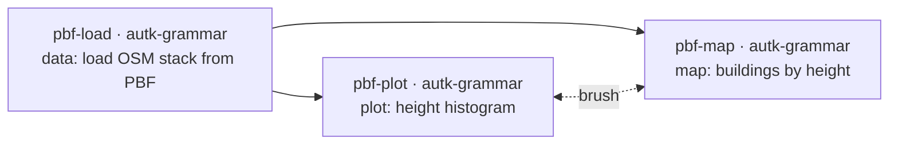

# Example: Loading OSM layers from a PBF with Autark

This example splits **loading** from **visualization** across three `autk-grammar` nodes. The first loads the
Lower Manhattan (Battery Park City + Financial District) OSM layer stack from a local `.pbf` file and emits
it; the second draws a brushable building-height histogram, and the third draws the stack on a WebGPU map
with buildings coloured by height. An interaction edge links the two views, so brushing the histogram
highlights the buildings it covers on the map. The extract is a local file, so no Overpass call is made at
run time.

> [!NOTE]
> **WebGPU required**
> Autark relies on WebGPU. Run this example in a Chromium-based browser (Chrome / Edge) on a machine
> with a working GPU stack.

## Pipeline overview


```mermaid
flowchart LR
  L[pbf-load · autk-grammar<br/>data: load OSM stack from PBF] --> P[pbf-plot · autk-grammar<br/>plot: height histogram]
  L --> M[pbf-map · autk-grammar<br/>map: buildings by height]
  P <-. brush .-> M
```

The loader is a grammar node with only a `data` block, so it emits its tables as a layer array. The
histogram and the map each receive those layers as named upstream sources (`table_osm_surface`,
`table_osm_buildings`, …) and reference them directly in their `plot` and `map` blocks. This is the
named-layer case of Autark's two upstream-referencing mechanisms; see
[Referencing Upstream Data in Autark Nodes](../ARCHITECTURE.md#referencing-upstream-data-in-autark-nodes).

An Autark node draws one view, a map or a plot, so the histogram and the map are two nodes, joined by an
interaction edge (see [Linking charts](../USAGE.md#linking-charts)).

## Data

`docs/examples/data/lower_mnt.osm.pbf` is a pre-extracted OpenStreetMap extract for Lower Manhattan
(regenerate with `scripts/build_example_pbfs.py`).

## Step 1: Load the OSM layer stack from a PBF (`pbf-load`)

The `data` block points `pbfFileUrl` at `docs/examples/data/lower_mnt.osm.pbf`, the same
path a Python node would read from disk. The behavior prepends
`BACKEND_URL` + `/file/` at run time, the backend serves the raw bytes from
`GET /file/docs/examples/data/lower_mnt.osm.pbf`, and autk-db parses the PBF in Curio's sandbox. With no
`map`/`plot` block, the node emits its five layer tables downstream as a layer array.

```json
"data": [{
  "type": "osm",
  "pbfFileUrl": "docs/examples/data/lower_mnt.osm.pbf",
  "queryArea": { "geocodeArea": "New York", "areas": ["Battery Park City", "Financial District"] },
  "outputTableName": "table_osm",
  "autoLoadLayers": { "layers": ["surface", "parks", "water", "roads", "buildings"] }
}]
```

## Step 2: Brushable height histogram (`pbf-plot`)

The histogram node has no `data` block of its own; it reads `table_osm_buildings` from the upstream layers.
Its `plot` block bins the buildings' `height` into twelve bins (an empty bin draws no bar), and `brushX` lets
you brush a range of the bars.

```json
"plot": {
  "dataRef": "table_osm_buildings", "mark": "bar", "axis": ["height", "@transform"],
  "title": "Lower Manhattan building heights (m)",
  "transform": { "preset": "binning-1d", "options": { "bins": 12 } },
  "events": ["brushX"]
}
```

## Step 3: Thematic map (`pbf-map`)

The map node reads the same upstream layers (`table_osm_surface`, `table_osm_parks`, `table_osm_water`,
`table_osm_roads`, `table_osm_buildings`) and renders the full stack with buildings coloured by `height`
and pickable.

```json
"map": { "layerRefs": [
  { "dataRef": "table_osm_surface" },
  { "dataRef": "table_osm_parks" },
  { "dataRef": "table_osm_water" },
  { "dataRef": "table_osm_buildings", "isPick": true, "getFnv": "height", "getFnvType": "quantitative", "defaultFnv": 10,
    "legendTitle": "Building height (m)" },
  { "dataRef": "table_osm_roads" }
]}
```

## Step 4: Link the histogram to the map

An interaction edge joins the two nodes directly, with no Data Pool between them. A brush on the histogram
selects the buildings in the brushed bars, and the map highlights them. Both nodes read the same buildings
table from `pbf-load`, so a selection names the same rows in each.

## Final result

A brushable histogram of building heights beside a WebGPU map of Lower Manhattan: the full OSM layer stack
of surface, parks, water, roads, and buildings, with buildings coloured by `height`. Brushing the histogram
highlights the buildings it covers on the map. Because loading and visualization live in separate
`autk-grammar` nodes, the emitted layer array can feed other downstream maps or plots without re-parsing
the PBF.
