# Example: Visual analytics of building energy usage

Authors: Adam Shaar, Anurag Reddy, Sathvika K., Aakash Kolli

In this example, we will explore how Curio can be used to analyze and visualize building energy consumption in Chicago. By integrating and transforming energy usage data, we will analyze how electricity and gas consumption varies across building types, neighborhoods, time periods, and building characteristics such as age and height.

Here is the overview of the entire dataflow pipeline:


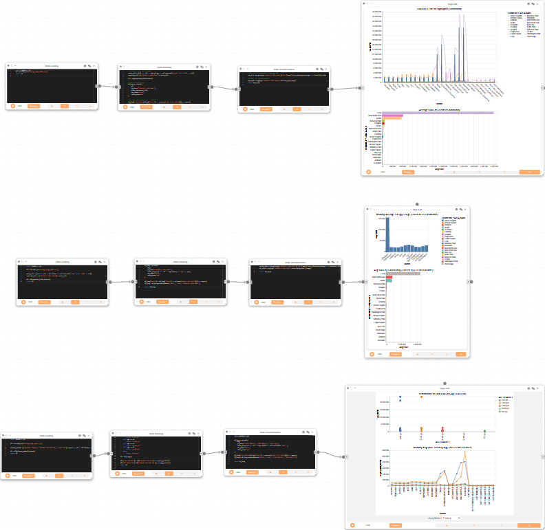

Before you begin, please familiarize yourself with Curio’s main concepts and functionalities by reading our [usage guide](https://github.com/urban-toolkit/curio/blob/main/docs/USAGE.md).

The data for this tutorial can be found [here](data/Energy_Usage_5000.csv).

For completeness, we also include the template code in each dataflow step.

## Step 1: Dataflow to load and clean building energy data


We begin by creating a Data Loading node to import the building energy usage dataset. This step reads the CSV file and selects relevant columns for further analysis.

```python
import pandas as pd

# Load the CSV directly
df = pd.read_csv("Energy_Usage_5000.csv")

# Select relevant columns and clean missing values
grouped_data = df[["BUILDING TYPE", "TOTAL KWH", "TOTAL THERMS"]].dropna()

# Return cleaned DataFrame
return grouped_data
```


Next, we create a Data Cleaning node and connect it to the previous node. This node removes outliers, fills missing values, and standardizes key columns for analysis.

```python
def remove_outliers(df, column):
    Q1 = df[column].quantile(0.25)
    Q3 = df[column].quantile(0.75)
    IQR = Q3 - Q1
    return df[(df[column] >= Q1 - 1.5 * IQR) & (df[column] <= Q3 + 1.5 * IQR)]

def clean(df):
    # Drop only if columns exist
    required_cols = ['CENSUS BLOCK', 'BUILDING TYPE', 'BUILDING_SUBTYPE']
    drop_cols = [col for col in required_cols if col in df.columns]

    df_cleaned = df.dropna(subset=drop_cols).copy()

    # Standard KWH/THERM fill
    kwh_columns = [col for col in df.columns if 'KWH' in col and '2010' in col and 'SQFT' not in col]
    therm_columns = [col for col in df.columns if 'THERM' in col and '2010' in col and 'SQFT' not in col]
    df_cleaned[kwh_columns] = df_cleaned[kwh_columns].fillna(df_cleaned[kwh_columns].median())
    df_cleaned[therm_columns] = df_cleaned[therm_columns].fillna(df_cleaned[therm_columns].median())

    for col in [
        'TOTAL KWH', 'TOTAL THERMS',
        'OCCUPIED UNITS PERCENTAGE', 'OCCUPIED UNITS',
        'RENTER-OCCUPIED HOUSING UNITS'
    ]:
        if col in df_cleaned.columns:
            df_cleaned[col] = df_cleaned[col].fillna(df_cleaned[col].median())

    df_cleaned['ELECTRICITY ACCOUNTS'] = pd.to_numeric(df_cleaned.get('ELECTRICITY ACCOUNTS'), errors='coerce')
    df_cleaned['GAS ACCOUNTS'] = pd.to_numeric(df_cleaned.get('GAS ACCOUNTS'), errors='coerce')
    df_cleaned['ELECTRICITY'] = df_cleaned['TOTAL KWH']
    df_cleaned['GAS'] = df_cleaned['TOTAL THERMS']

    df_cleaned = df_cleaned.loc[:, df_cleaned.isnull().mean() < 0.2]

    if 'TERM APRIL 2010' in df.columns:
        df.rename(columns={'TERM APRIL 2010': 'THERM APRIL 2010'}, inplace=True)

    # Standardize community names
    if 'COMMUNITY AREA NAME' in df_cleaned.columns:
        df_cleaned['COMMUNITY AREA NAME'] = df_cleaned['COMMUNITY AREA NAME'].str.strip().str.upper()
        df_cleaned['COMMUNITY AREA NAME'] = df_cleaned['COMMUNITY AREA NAME'].replace({
            "LAKEVIEW": "LAKE VIEW",
            "O'HARE": "OHARE"
        })

    # Ensure total columns are present
    if 'TOTAL KWH' in df_cleaned.columns:
        df_cleaned['TOTAL KWH'] = df_cleaned['TOTAL KWH'].fillna(df_cleaned['TOTAL KWH'].median())
    if 'TOTAL THERMS' in df_cleaned.columns:
        df_cleaned['TOTAL THERMS'] = df_cleaned['TOTAL THERMS'].fillna(df_cleaned['TOTAL THERMS'].median())

    if 'AVERAGE BUILDING AGE' in df_cleaned.columns:
        df_cleaned['DECADE BUILT'] = (2010 - df_cleaned['AVERAGE BUILDING AGE']) // 10 * 10

    df_cleaned = remove_outliers(df_cleaned, 'TOTAL KWH')
    df_cleaned = remove_outliers(df_cleaned, 'TOTAL THERMS')


    return df_cleaned


# Run cleaning and return
return clean(arg)
```

Now, we create a Data Transformation node and attach it to the Data Cleaning node. This node reshapes the data to compare electricity and gas usage across building types, and calculates the percentage contribution of each energy type.

```python
# Assume `arg` is the cleaned DataFrame from the previous card
import pandas as pd

energy_long = pd.melt(
    arg,
    id_vars='BUILDING TYPE',
    value_vars=['TOTAL KWH', 'TOTAL THERMS'],
    var_name='ENERGY TYPE',
    value_name='VALUE'
)

total_by_type = energy_long.groupby('BUILDING TYPE')['VALUE'].transform('sum')
energy_long['PERCENTAGE'] = (energy_long['VALUE'] / total_by_type) * 100

return energy_long
```


Next, we use a 2D Plot (Vega-Lite) node to create a heatmap showing the distribution of energy consumption by building type and energy type. This visualization helps us quickly identify which building types consume the most energy and the relative proportions of electricity and gas.

```json
{
  "$schema": "https://vega.github.io/schema/vega-lite/v5.json",
  "data": { "name": "energy_transformed_1" },
  "mark": "rect",
  "encoding": {
    "x": { "field": "BUILDING TYPE", "type": "nominal" },
    "y": { "field": "ENERGY TYPE", "type": "nominal" },
    "color": {
      "field": "VALUE",
      "type": "quantitative",
      "scale": { "scheme": "viridis" }
    },
    "tooltip": [
      { "field": "BUILDING TYPE" },
      { "field": "ENERGY TYPE" },
      { "field": "VALUE", "format": ".2f" },
      { "field": "PERCENTAGE", "format": ".1f" }
    ]
  },
  "title": "Energy Consumption Heatmap (KWH + THERMS)"
}
```

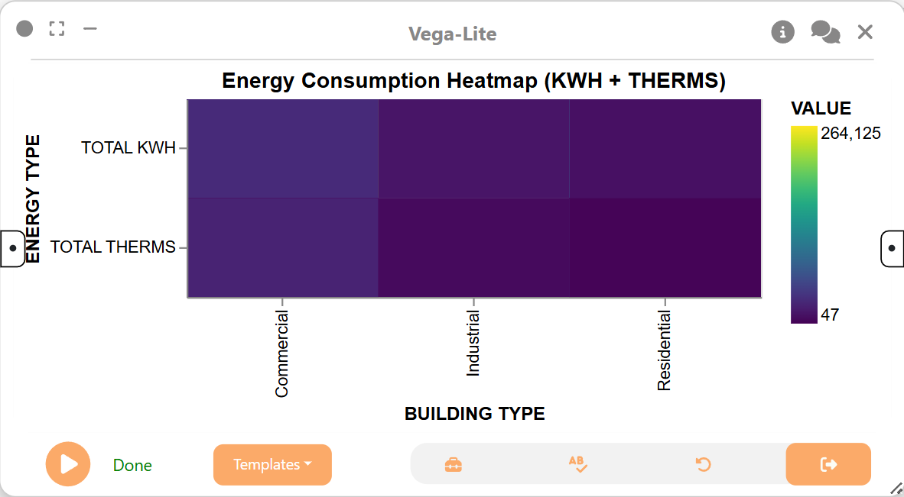

We then create another a 2D Plot (Vega-Lite) node to visualize the distribution of energy usage by building type and energy type as a dot plot. This provides another perspective on the data, highlighting the magnitude of usage for each category.

```json
{
  "$schema": "https://vega.github.io/schema/vega-lite/v5.json",
  "data": { "name": "energy_transformed_1" },
  "mark": "circle",
  "encoding": {
    "x": {
      "field": "BUILDING TYPE",
      "type": "nominal",
      "axis": { "labelAngle": -45 }
    },
    "y": { "field": "VALUE", "type": "quantitative" },
    "color": { "field": "ENERGY TYPE", "type": "nominal" },
    "size": { "field": "VALUE", "type": "quantitative" },
    "tooltip": [
      { "field": "BUILDING TYPE" },
      { "field": "ENERGY TYPE" },
      { "field": "VALUE", "format": ".2f" }
    ]
  },
  "title": "Dot Plot of Energy Usage by Building Type"
}
```


Next, we create another Data Transformation node and attach it to the same Data Cleaning node as before. This node calculates the average gas usage for each building type, which is useful for understanding which types of buildings are the largest consumers of gas.

```python
# Group by building type and compute average gas usage
df_avg_gas = arg.groupby("BUILDING TYPE")["TOTAL THERMS"].mean().reset_index()
df_avg_gas.rename(columns={"TOTAL THERMS": "AVG TOTAL THERMS"}, inplace=True)

return df_avg_gas
```

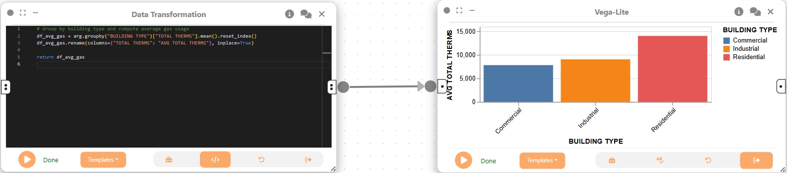

We then use a 2D Plot (Vega-Lite) node to create a bar chart visualizing the average gas usage by building type. This chart makes it easy to compare gas consumption across different building categories.

```json
{
  "$schema": "https://vega.github.io/schema/vega-lite/v5.json",
  "data": { "name": "avg_gas_by_building" },
  "mark": "bar",
  "encoding": {
    "x": {
      "field": "BUILDING TYPE",
      "type": "nominal",
      "axis": { "labelAngle": -45 }
    },
    "y": { "field": "AVG TOTAL THERMS", "type": "quantitative" },
    "tooltip": [
      { "field": "BUILDING TYPE" },
      { "field": "AVG TOTAL THERMS", "format": ".2f" }
    ],
    "color": { "field": "BUILDING TYPE", "type": "nominal" }
  }
}
```

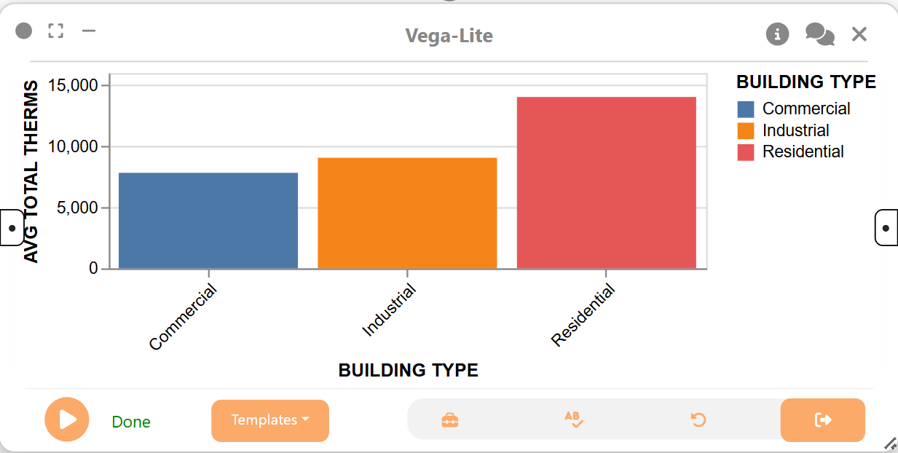

## Step 2: Dataflow to analyze community-level energy consumption and building type patterns

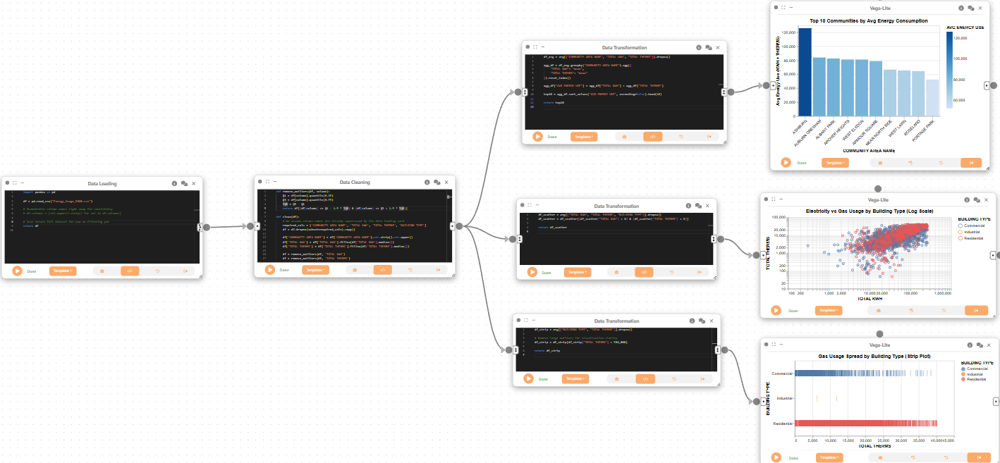

We create a Data Loading node to import the dataset for community-level analysis. This node loads the full dataset for further cleaning and aggregation.

```python
import pandas as pd

df = pd.read_csv("Energy_Usage_5000.csv")

# Standardize column names right away for consistency
df.columns = [col.upper().strip() for col in df.columns]

# Just return full dataset for now no filtering yet
return df
```

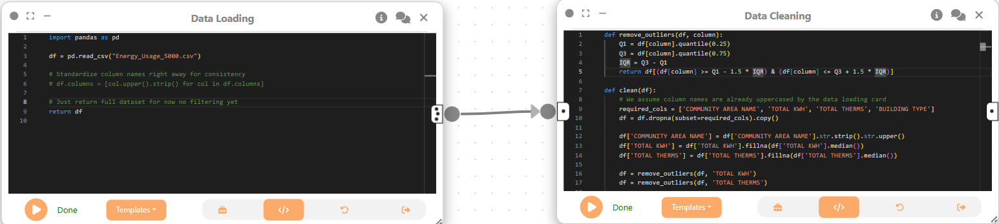

Next, we create a Data Cleaning node to remove missing values and outliers, and to standardize community names. This ensures the data is consistent and reliable for community-level comparisons.

```python
def remove_outliers(df, column):
    Q1 = df[column].quantile(0.25)
    Q3 = df[column].quantile(0.75)
    IQR = Q3 - Q1
    return df[(df[column] >= Q1 - 1.5 * IQR) & (df[column] <= Q3 + 1.5 * IQR)]

def clean(df):
    # We assume column names are already uppercased by the data loading card
    required_cols = ['COMMUNITY AREA NAME', 'TOTAL KWH', 'TOTAL THERMS', 'BUILDING TYPE']
    df = df.dropna(subset=required_cols).copy()

    df['COMMUNITY AREA NAME'] = df['COMMUNITY AREA NAME'].str.strip().str.upper()
    df['TOTAL KWH'] = df['TOTAL KWH'].fillna(df['TOTAL KWH'].median())
    df['TOTAL THERMS'] = df['TOTAL THERMS'].fillna(df['TOTAL THERMS'].median())

    df = remove_outliers(df, 'TOTAL KWH')
    df = remove_outliers(df, 'TOTAL THERMS')

    return df

return clean(arg)
```

Now, we create a Data Transformation node and attach it to the Data Cleaning node. This node computes the top 10 communities by average energy use, aggregating both electricity and gas consumption.

```python
df_avg = arg[["COMMUNITY AREA NAME", "TOTAL KWH", "TOTAL THERMS"]].dropna()

agg_df = df_avg.groupby("COMMUNITY AREA NAME").agg({
    "TOTAL KWH": "mean",
    "TOTAL THERMS": "mean"
}).reset_index()

agg_df["AVG ENERGY USE"] = agg_df["TOTAL KWH"] + agg_df["TOTAL THERMS"]

top10 = agg_df.sort_values("AVG ENERGY USE", ascending=False).head(10)

return top10
```


We then use a 2D Plot (Vega-Lite) node to create a bar chart of the top 10 communities by average energy consumption. This visualization highlights which communities have the highest energy demands.

```json
{
  "$schema": "https://vega.github.io/schema/vega-lite/v5.json",
  "data": { "name": "top10_avg_energy_by_community" },
  "mark": "bar",
  "encoding": {
    "x": {
      "field": "COMMUNITY AREA NAME",
      "type": "nominal",
      "sort": "-y",
      "axis": { "labelAngle": -45 }
    },
    "y": {
      "field": "AVG ENERGY USE",
      "type": "quantitative",
      "title": "Avg Energy Use (KWH + THERMS)"
    },
    "tooltip": [
      { "field": "COMMUNITY AREA NAME" },
      { "field": "AVG ENERGY USE", "format": ".2f" }
    ],
    "color": {
      "field": "AVG ENERGY USE",
      "type": "quantitative",
      "scale": { "scheme": "blues" }
    }
  },
  "title": "Top 10 Communities by Avg Energy Consumption"
}
```

Next, we create another Data Transformation node and attach it to the same Data Cleaning node. This node prepares the data for a scatter plot comparing electricity and gas usage by building type, filtering out any zero or missing values.

```python
df_scatter = arg[["TOTAL KWH", "TOTAL THERMS", "BUILDING TYPE"]].dropna()
df_scatter = df_scatter[(df_scatter["TOTAL KWH"] > 0) & (df_scatter["TOTAL THERMS"] > 0)]

return df_scatter
```

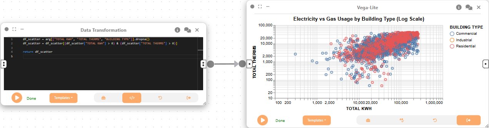

We then use a 2D Plot (Vega-Lite) node to create a scatter plot of electricity vs gas usage, colored by building type. This helps us explore the relationship between the two forms of energy consumption across building types.

```json
{
  "$schema": "https://vega.github.io/schema/vega-lite/v5.json",
  "data": { "name": "scatter_energy_usage" },
  "mark": "point",
  "encoding": {
    "x": {
      "field": "TOTAL KWH",
      "type": "quantitative",
      "scale": { "type": "log" }
    },
    "y": {
      "field": "TOTAL THERMS",
      "type": "quantitative",
      "scale": { "type": "log" }
    },
    "color": { "field": "BUILDING TYPE", "type": "nominal" },
    "tooltip": [
      { "field": "BUILDING TYPE" },
      { "field": "TOTAL KWH" },
      { "field": "TOTAL THERMS" }
    ]
  },
  "title": "Electricity vs Gas Usage by Building Type (Log Scale)"
}
```

Now, we create a third Data Transformation node and attach it to the same Data Cleaning node. This node prepares the data for a strip plot of gas usage by building type, removing large outliers for clarity.

```python
df_strip = arg[["BUILDING TYPE", "TOTAL THERMS"]].dropna()

# Remove large outliers for visualization clarity
df_strip = df_strip[df_strip["TOTAL THERMS"] < 500_000]

return df_strip
```

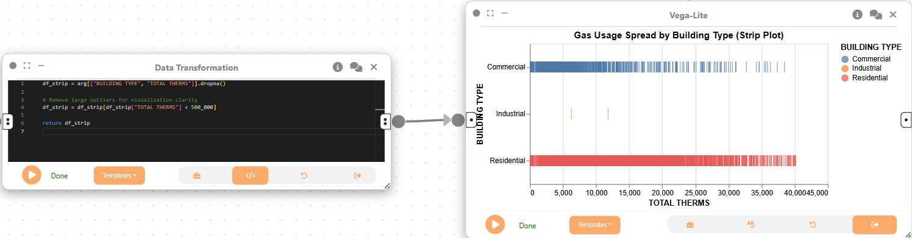

Finally, we use a 2D Plot (Vega-Lite) node to create a strip plot showing the spread of gas usage by building type. This visualization reveals the distribution and variability of gas consumption within each building category.

```json
{
  "$schema": "https://vega.github.io/schema/vega-lite/v5.json",
  "data": { "name": "df_strip" },
  "mark": "tick",
  "encoding": {
    "x": { "field": "TOTAL THERMS", "type": "quantitative" },
    "y": { "field": "BUILDING TYPE", "type": "nominal" },
    "color": { "field": "BUILDING TYPE", "type": "nominal" },
    "tooltip": [{ "field": "BUILDING TYPE" }, { "field": "TOTAL THERMS" }]
  },
  "title": "Gas Usage Spread by Building Type (Strip Plot)"
}
```

## Step 3: Dataflow to explore monthly electricity usage trends by community


We create a Data Loading node to

```python
import pandas as pd
df = pd.read_csv("Energy_Usage_5000../data/../data/.csv")
return df
```

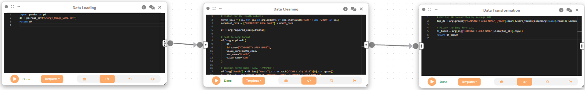

Next, we create a Data Cleaning node to reshape the data into a long format, extracting monthly KWH usage for each community. This step prepares the data for time series analysis.

```python
# Filter for KWH month columns
month_cols = [col for col in arg.columns if col.startswith("KWH ") and "2010" in col]
required_cols = ["COMMUNITY AREA NAME"] + month_cols

df = arg[required_cols].dropna()

# Melt to long format
df_long = pd.melt(
    df,
    id_vars=["COMMUNITY AREA NAME"],
    value_vars=month_cols,
    var_name="Month",
    value_name="KWH"
)

# Extract month name (e.g., "JANUARY")
df_long["Month"] = df_long["Month"].str.extract(r"KWH (.+?) 2010")[0].str.upper()
df_long = df_long.dropna(subset=["Month", "KWH", "COMMUNITY AREA NAME"])

return df_long
```

Now, we create a Data Transformation node and attach it to the Data Cleaning node. This node selects the top 20 communities by average KWH usage, focusing the analysis on the highest-consuming areas.

```python
# Get top 20 communities by average KWH
top_20 = arg.groupby("COMMUNITY AREA NAME")["KWH"].mean().sort_values(ascending=False).head(20).index

# Filter the long-form data
df_top20 = arg[arg["COMMUNITY AREA NAME"].isin(top_20)].copy()
return df_top20
```

Lastly, we use a 2D Plot (Vega-Lite) node to ...

```json
{
  "$schema": "https://vega.github.io/schema/vega-lite/v5.json",
  "params": [
    {
      "name": "commPick",
      "select": {
        "type": "point",
        "fields": ["COMMUNITY AREA NAME"]
      }
    }
  ],
  "vconcat": [
    {
      "title": "Click on a Line to Highlight a Community",
      "width": 650,
      "height": 400,
      "mark": {
        "type": "line",
        "interpolate": "monotone"
      },
      "encoding": {
        "x": {
          "field": "Month",
          "type": "nominal",
          "sort": [
            "JANUARY",
            "FEBRUARY",
            "MARCH",
            "APRIL",
            "MAY",
            "JUNE",
            "JULY",
            "AUGUST",
            "SEPTEMBER",
            "OCTOBER",
            "NOVEMBER",
            "DECEMBER"
          ],
          "axis": { "labelAngle": 45 }
        },
        "y": {
          "field": "KWH",
          "type": "quantitative",
          "title": "Total KWH",
          "scale": { "zero": false }
        },
        "color": {
          "field": "COMMUNITY AREA NAME",
          "type": "nominal",
          "scale": { "scheme": "category20" },
          "legend": { "columns": 2 }
        },
        "opacity": {
          "condition": { "param": "commPick", "value": 1 },
          "value": 0.2
        },
        "tooltip": [
          { "field": "COMMUNITY AREA NAME", "title": "Community" },
          { "field": "Month" },
          { "field": "KWH", "format": ",.0f" }
        ]
      }
    },
    {
      "title": "Average KWH of Selected Community",
      "width": 650,
      "height": 300,
      "mark": "bar",
      "encoding": {
        "y": {
          "field": "COMMUNITY AREA NAME",
          "type": "nominal",
          "sort": "-x"
        },
        "x": {
          "aggregate": "mean",
          "field": "KWH",
          "type": "quantitative",
          "title": "Avg KWH"
        },
        "color": {
          "field": "COMMUNITY AREA NAME",
          "type": "nominal"
        }
      },
      "transform": [{ "filter": { "param": "commPick" } }]
    }
  ]
}
```


## Step 4: Dataflow to analyze monthly energy usage by community and month

We create a Data Loading node to import the dataset, followed by a Data Cleaning node to reshape the data for monthly analysis by community. This prepares the data for interactive exploration of energy usage patterns over time.

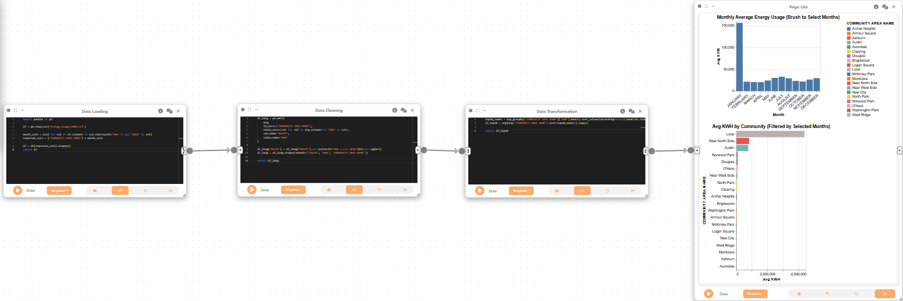

```python
import pandas as pd

df = pd.read_csv("Energy_Usage_5000../data/../data/.csv")

month_cols = [col for col in df.columns if col.startswith("KWH ") and "2010" in col]
required_cols = ["COMMUNITY AREA NAME"] + month_cols

df = df[required_cols].dropna()
return df
```


Next, we create a Data Cleaning node to convert the data to long format, extracting monthly KWH usage for each community. This step is essential for visualizing trends across months and communities.

```python
df_long = pd.melt(
    arg,
    id_vars=["COMMUNITY AREA NAME"],
    value_vars=[col for col in arg.columns if "KWH" in col],
    var_name="Month",
    value_name="KWH"
)

df_long["Month"] = df_long["Month"].str.extract(r"KWH (.+?) 2010")[0].str.upper()
df_long = df_long.dropna(subset=["Month", "KWH", "COMMUNITY AREA NAME"])

return df_long
```

Now, we create a Data Transformation node and attach it to the Data Cleaning node. This node selects the top 20 communities by average KWH usage, narrowing the focus to the most energy-intensive areas.

```python
top20_names = arg.groupby("COMMUNITY AREA NAME")["KWH"].mean().sort_values(ascending=False).head(20).index
df_top20 = arg[arg["COMMUNITY AREA NAME"].isin(top20_names)].copy()

return df_top20
```

Lastly, we use a 2D Plot (Vega-Lite) node to create an interactive bar chart showing average KWH by community, filtered by selected months. This enables dynamic exploration of how energy usage varies throughout the year.

```json
{
  "$schema": "https://vega.github.io/schema/vega-lite/v5.json",
  "vconcat": [
    {
      "title": "Monthly Average Energy Usage (Brush to Select Months)",
      "params": [
        {
          "name": "monthBrush",
          "select": {
            "type": "interval",
            "encodings": ["x"]
          }
        }
      ],
      "mark": "bar",
      "encoding": {
        "x": {
          "field": "Month",
          "type": "ordinal",
          "scale": {
            "domain": [
              "JANUARY",
              "FEBRUARY",
              "MARCH",
              "APRIL",
              "MAY",
              "JUNE",
              "JULY",
              "AUGUST",
              "SEPTEMBER",
              "OCTOBER",
              "NOVEMBER",
              "DECEMBER"
            ]
          },
          "axis": {
            "labelAngle": -40,
            "labelFontSize": 11
          }
        },
        "y": {
          "aggregate": "mean",
          "field": "KWH",
          "type": "quantitative",
          "title": "Avg KWH"
        },
        "tooltip": [
          { "field": "Month" },
          { "aggregate": "mean", "field": "KWH", "title": "Avg KWH" }
        ],
        "color": {
          "value": "#4C78A8"
        }
      }
    },
    {
      "title": "Avg KWH by Community (Filtered by Selected Months)",
      "transform": [
        {
          "filter": { "param": "monthBrush" }
        }
      ],
      "mark": "bar",
      "encoding": {
        "y": {
          "field": "COMMUNITY AREA NAME",
          "type": "nominal",
          "sort": "-x"
        },
        "x": {
          "aggregate": "mean",
          "field": "KWH",
          "type": "quantitative",
          "title": "Avg KWH"
        },
        "color": {
          "field": "COMMUNITY AREA NAME",
          "type": "nominal"
        },
        "tooltip": [
          { "field": "COMMUNITY AREA NAME" },
          { "aggregate": "mean", "field": "KWH", "title": "Avg KWH" }
        ]
      }
    }
  ]
}
```

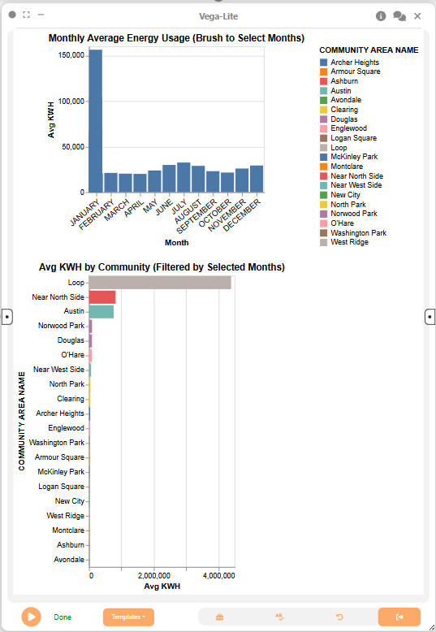

## Step 5: Dataflow to examine energy usage by building age and stories

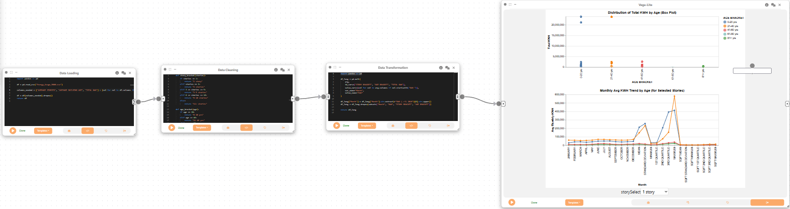

We create a Data Loading node to import the dataset, followed by a Data Cleaning node to categorize buildings by age and number of stories. This step enables analysis of how building characteristics relate to energy consumption.

```python
import pandas as pd

df = pd.read_csv("Energy_Usage_5000.csv")

columns_needed = ["AVERAGE STORIES", "AVERAGE BUILDING AGE", "TOTAL KWH"] + [col for col in df.columns if col.startswith("KWH ") and "2010" in col]

df = df[columns_needed].dropna()
return df
```

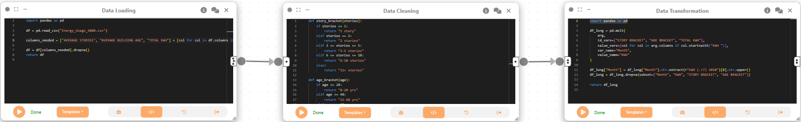

Next, we create a Data Cleaning node to create categorical brackets for building age and stories, making it easier to compare groups of buildings.

```python
def story_bracket(stories):
    if stories <= 1:
        return "1 story"
    elif stories == 2:
        return "2 stories"
    elif 3 <= stories <= 5:
        return "3-5 stories"
    elif 6 <= stories <= 10:
        return "6-10 stories"
    else:
        return "11+ stories"

def age_bracket(age):
    if age <= 20:
        return "0-20 yrs"
    elif age <= 40:
        return "21-40 yrs"
    elif age <= 60:
        return "41-60 yrs"
    elif age <= 80:
        return "61-80 yrs"
    else:
        return "81+ yrs"

df = arg.copy()

df["STORY BRACKET"] = df["AVERAGE STORIES"].apply(story_bracket)
df["AGE BRACKET"] = df["AVERAGE BUILDING AGE"].apply(age_bracket)
return df
```

Now, we create a Data Transformation node and attach it to the Data Cleaning node. This node reshapes the data for analysis by age and stories, preparing it for visualization.

```python
import pandas as pd

df_long = pd.melt(
    arg,
    id_vars=["STORY BRACKET", "AGE BRACKET", "TOTAL KWH"],
    value_vars=[col for col in arg.columns if col.startswith("KWH ")],
    var_name="Month",
    value_name="KWH"
)

df_long["Month"] = df_long["Month"].str.extract(r"KWH (.+?) 2010")[0].str.upper()
df_long = df_long.dropna(subset=["Month", "KWH", "STORY BRACKET", "AGE BRACKET"])

return df_long
```

Lastly, we use a 2D Plot (Vega-Lite) node to create a box plot and line chart showing the distribution and trends of KWH usage by building age and stories. These visualizations help us understand how energy consumption varies with building characteristics and over time.

```json
{
  "$schema": "https://vega.github.io/schema/vega-lite/v5.json",
  "params": [
    {
      "name": "storySelect",
      "bind": {
        "input": "select",
        "options": [
          "1 story",
          "2 stories",
          "3-5 stories",
          "6-10 stories",
          "11+ stories"
        ]
      },
      "value": "1 story"
    }
  ],
  "vconcat": [
    {
      "width": 600,
      "title": {
        "text": "Distribution of Total KWH by Age (Box Plot)",
        "align": "center"
      },
      "transform": [{ "filter": "datum['STORY BRACKET'] == storySelect" }],
      "mark": "boxplot",
      "encoding": {
        "x": {
          "field": "AGE BRACKET",
          "type": "nominal",
          "sort": ["0-20 yrs", "21-40 yrs", "41-60 yrs", "61-80 yrs", "81+ yrs"]
        },
        "y": {
          "field": "TOTAL KWH",
          "type": "quantitative",
          "title": "Total KWH"
        },
        "color": {
          "field": "AGE BRACKET",
          "type": "nominal",
          "legend": {
            "orient": "right",
            "anchor": "middle",
            "direction": "vertical"
          }
        },
        "tooltip": [{ "field": "AGE BRACKET" }, { "field": "TOTAL KWH" }]
      }
    },
    {
      "width": 600,
      "title": {
        "text": "Monthly Avg KWH Trend by Age (for Selected Stories)",
        "align": "center"
      },
      "transform": [{ "filter": "datum['STORY BRACKET'] == storySelect" }],
      "mark": { "type": "line", "point": true },
      "encoding": {
        "x": {
          "field": "Month",
          "type": "ordinal",
          "sort": [
            "JANUARY",
            "FEBRUARY",
            "MARCH",
            "APRIL",
            "MAY",
            "JUNE",
            "JULY",
            "AUGUST",
            "SEPTEMBER",
            "OCTOBER",
            "NOVEMBER",
            "DECEMBER"
          ]
        },
        "y": {
          "aggregate": "mean",
          "field": "KWH",
          "type": "quantitative",
          "title": "Avg Monthly KWH"
        },
        "color": {
          "field": "AGE BRACKET",
          "type": "nominal",
          "legend": {
            "orient": "right",
            "anchor": "middle",
            "direction": "vertical"
          }
        },
        "tooltip": [
          { "field": "Month" },
          { "aggregate": "mean", "field": "KWH" },
          { "field": "AGE BRACKET" }
        ]
      }
    }
  ],
  "config": {
    "concat": { "align": "center" }
  }
}
```


## Final result

This workflow uses interactive visualizations to explore electricity and gas consumption by building type, neighborhood, season, and building attributes:

1. Heatmaps and dot plots compare energy use across building types.
2. Bar, scatter, and strip plots rank neighborhoods and building types by energy demand.
3. Interactive line and bar charts show seasonal electricity use by community.
4. Monthly bar charts show changes in average electricity use by neighborhood over time.
5. Box plots and line charts relate energy use to building age and number of stories.

These visualizations show patterns and trends that can guide energy efficiency improvements. Curio’s modular framework allows users to combine multiple visualizations and datasets to build rich, interactive analyses of urban data.
