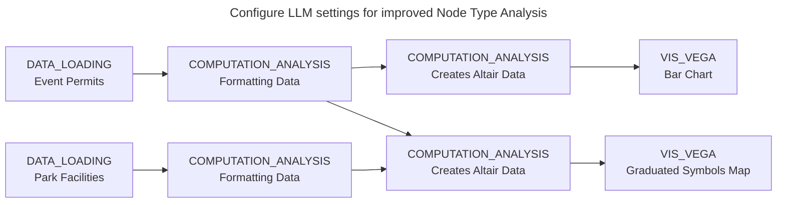

# Example: Conversions from Jupyter Notebook into Curio
This Example demonstrates the capabilities of the current Jupyter Notebook conversion system. The use case is Chicago's [Outdoor Event Permits](data/12-Event_Permits.csv) and [Park District Facilities](data/12-Chicago_Parks.csv) datasets. The sample [Jupyter Notebook](12-Parks.ipynb) will be used to merge both datasets and create a graduated symbols map displaying total event permits per park since 2012. A bar chart will also be created to illustrate the annual count of event permits granted by the City of Chicago since 2012. Subsequently, the notebook will then be imported into Curio to generate a reliable, fully executable dataflow.

## Pipeline overview


## Data
[12-Event_Permits.csv](data/12-Event_Permits.csv) - Chicago's open-data export of outdoor event permits requested through the Chicago Park District.

[12-Chicago_Parks.cdv](data/12-Chicago_Parks.csv) - Chicago's open-data export of facilities managed & maintained by the Chicago Park District as of November 4, 2016.

Paths in the code below are relative to the directory you launched Curio from. If you choose to ignore the optional LLM configuration step, run `curio start` from the repo root. Additionally, it is assumed that you already have Jupyter Notebook configured and ready to go. If not, then the Jupyter Notebook used in this example is located [here](12-Parks.ipynb).

## Optional LLM Configuration Step
For this step, you must run `curio start --auth` from the repo root.

Sign in into curio using a Username and Password of your choice. Once your inside the dashboard, locate the *__LLM Settings__* at the top right of your screen and click on it. After you finish entering your desired provider alongside your API key, click save and move on to the next step.

The main benefit of using the LLM is improved Node type inference. As of right now, every node that cannot be determined statically is assigned as a __COMPUTATION_ANALYSIS__ node. The LLM looks into these ambiguous nodes, and determines their actual type.

## Step 1: Load the *Event Permit* and *Chicago Parks* CSV's (Jupyter Notebook)

Read from the CSV files in order to store the required data for Event Permits and Chicago Park facilities. A key detail to consider is the specific URL used to load the data. Because the underlying data resides in Curio, loading requires using a path relative to this file's directory. Don't worry if errors are produced in Jupyter Notebook

__Code Cell 1__
```python
import pandas as pd

event_permits_url = "docs/examples/data/12-Event_Permits.csv"
event_permits = pd.read_csv(event_permits_url)
```

__Code Cell 2__
```python
park_facilities_url = "docs/examples/data/12-Chicago_Parks.csv"
park_facilities = pd.read_csv(park_facilities_url)
```

## Step 2: Clean and Transform the Data (Jupyter Notebook)
In order to create a graduated symbols map, the numbers inside `park_number` columns must be converted to numeric types and standardized as integers. This is to help prepare both data sets for a merge. Note that __Code Cell 3__ generates two separate DataFrames: event_permits_clean, which merges with __Code Cell 4's__ park_locations for spatial mapping, and event_permits_per_year, which is preserved to construct the annual bar chart.

__Code Cell 3__
```python
event_permits_clean = event_permits

event_permits_clean['reservation_start_date'] = pd.to_datetime(event_permits_clean['reservation_start_date'])
event_permits_clean['reservation_end_date'] = pd.to_datetime(event_permits_clean['reservation_end_date'])

event_permits_clean['park_number'] = pd.to_numeric(event_permits_clean['park_number'], errors='coerce')
event_permits_clean = event_permits_clean.dropna(subset=['park_number'])
event_permits_clean['park_number'] = event_permits_clean['park_number'].astype(int)

event_permits_clean = event_permits_clean.drop_duplicates()

event_permits_per_year = event_permits_clean.copy()
event_permits_per_year['event_year'] = event_permits_per_year['reservation_start_date'].dt.year
```

__Code Cell 4__
```python
park_facilities_clean = park_facilities.copy()

park_facilities_clean = park_facilities_clean[['park', 'park_no', 'facility_n', 'facility_t', 'x_coord', 'y_coord']]

park_facilities_clean = park_facilities_clean.rename(columns={
    'park_no': 'park_number',
    'facility_n': 'facility_name',
    'facility_t': 'facility_type',
    'x_coord': 'longitude',
    'y_coord': 'latitude',
})

for col in ['park_number', 'longitude', 'latitude']:
    park_facilities_clean[col] = pd.to_numeric(park_facilities_clean[col], errors='coerce')
park_facilities_clean = park_facilities_clean.dropna(subset=['park_number', 'longitude', 'latitude'])
park_facilities_clean['park_number'] = park_facilities_clean['park_number'].astype(int)

park_locations = (
    park_facilities_clean
    .groupby(['park_number', 'park'], as_index=False)[['longitude', 'latitude']]
    .mean()
)

park_locations.head(n = 5)
```

## Step 3: Create the Bar Chart (Jupyter Notebook)
Code Cell 5 groups event permit counts by event year in order to compute annual totals. This information is then used by Code Cell 6 to produce a Bar Chart of event permits per year. Note: For this step, you may need to pip install altair, as it is an external dependency.

__Code Cell 5__
```python
# Pre-aggregate: number of permits per year
events_by_year = (
    event_permits_per_year
    .groupby('event_year')
    .size()
    .reset_index(name='event_count')
    .sort_values('event_year')
)

events_by_year
```

__Code Cell 6__
```python
import altair as alt

year_chart = (
    alt.Chart(events_by_year)
    .mark_bar(color='#2c7fb8')
    .encode(
        x=alt.X('event_year:O', title='Year'),
        y=alt.Y('event_count:Q', title='Number of Event Permits'),
        tooltip=['event_year:O', 'event_count:Q']
    )
    .properties(
        width=600,
        height=400,
        title='Chicago Park District Outdoor Event Permits by Year'
    )
)

year_chart
```

## Step 4: Create the Graduated Symbols Map (Jupyter Notebook)
Group the event permits granted by location, and store it inside map_data. Code Cell 8 then uses this data to construct a multi-layered map, using Altair to render Chicago's city limits as a base layer and overlay interactive circle markers to visualize event density. Save the newly created notebook.

__Code Cell 7__
```python
import plotly.express as px

event_counts = (
    event_permits_clean
    .groupby('park_number')
    .size()
    .reset_index(name='event_count')
)

map_data = park_locations.merge(event_counts, on='park_number', how='inner')
```

__Code Cell 8__
```python
import altair as alt
import requests

alt.data_transformers.disable_max_rows()

chicago_boundary = requests.get("https://data.cityofchicago.org/resource/qqq8-j68g.geojson").json()


boundary_layer = (
    alt.Chart(alt.Data(values=chicago_boundary['features']))
    .mark_geoshape(fill='#eeeeee', stroke='#999999')
)

points_layer = (
    alt.Chart(map_data)
    .mark_circle(opacity=0.7)
    .encode(
        longitude='longitude:Q',
        latitude='latitude:Q',
        size=alt.Size('event_count:Q', scale=alt.Scale(range=[20, 2000]), title='Event Count'),
        color=alt.Color('event_count:Q', scale=alt.Scale(scheme='viridis'), title='Event Count'),
        tooltip=['park:N', 'event_count:Q']
    )
)

combined_chart = (
    (boundary_layer + points_layer)
    .project(type='mercator')
    .properties(
        width=600,
        height=600,
        title='Chicago Park District Outdoor Event Permits by Park'
    )
)

combined_chart
```

## Step 5: Import the Jupyter Notebook (Curio)
Go to the curio dashboard. On the top right, click on a button that says `Import Jupyter Notebook`. Select the Jupyter Notebook that was created in the previous steps and watch Curio automatically generate the workflow. If you configured the LLM in the optional step, allow extra time for your dataflow to load, as LLM requests typically take a few moments to process.

## Final result
You should see a completed dataflow inside of curio. Each code cell inside of Jupyter Notebook corresponds to a node inside of Curio. This example is also meant to demonstrate how the current converter handles different types of complexities. If a downstream Curio node receives multiple inputs, Curio inserts a MergeFlow node to merge the incoming sources before execution. If an upstream Curio node is required to return multiple distinct variables, it outputs a dictionary containing each required variable. If your notebook relies on external dependencies, Curio identifies them behind the scenes and handles the installation automatically, eliminating the need for manual setup. Features like these come together to create a remarkably flexible conversion system.

