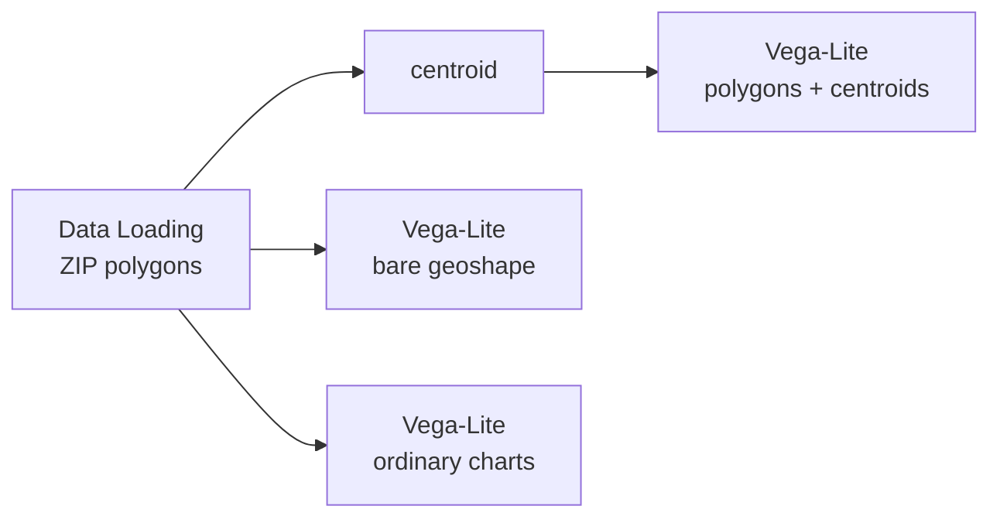

# Example: GeoDataFrame maps in Vega-Lite

Return a `GeoDataFrame` from a Python node, write `{"mark": "geoshape"}`, and you
get a map. There is no conversion step: no `shapely.geometry.mapping`, no manual
x/y centroid columns, no flattening the frame first.

One of four examples on drawing a `GeoDataFrame`:
[12](12-vega-lite-geodataframe-maps.md) the basics,
[13](13-vega-lite-geometry-columns.md) geometry columns,
[14](14-vega-lite-crs-and-geometry-types.md) coordinate systems and geometry types,
[15](15-vega-lite-spec-forms-and-catalogs.md) spec forms and data sources.

## Pipeline



## Data

Loaded from the [Data Catalog](../DATA-CATALOG.md) by id, so the dataflow runs
anywhere without editing paths.

| Dataset | Id | Format |
|---|---|---|
| Chicago Boundary (ZIP polygons) | `data.urbanlab.chicago-boundary` | geojson |

## Load it

```python
import geopandas as gpd

dataset_path = curio_dataset_path("data.urbanlab.chicago-boundary")
gdf = gpd.read_file(dataset_path)

return gdf
```

## Draw it

```json
{
  "$schema": "https://vega.github.io/schema/vega-lite/v6.json",
  "description": "ZIP polygons, drawn from a bare geoshape mark.",
  "data": {
    "name": "data"
  },
  "mark": "geoshape",
  "encoding": {
    "color": {
      "field": "zip",
      "type": "nominal",
      "legend": null
    }
  }
}
```

Two things are filled in for you: the `shape` encoding that points the mark at
your geometry column, and a `projection` fitted to your data. Write either
yourself and yours is kept.

Attribute columns keep their own names, so `"field": "zip"` works here exactly as
it would in a bar chart.

## Add a second geometry column

```python
gdf = arg

# A second geometry column. Centroids are taken in a projected CRS so they land
# in the right place, then brought back to lon/lat.
gdf["centroid"] = gdf.to_crs(3395).geometry.centroid.to_crs(4326)

return gdf
```

A frame can hold more than one geometry column, and each keeps its pandas name.
The map then draws them as two layers: polygons underneath, centroids on top.
Only the active geometry column is wired up for you, so the centroid layer names
its own with `"shape": {"field": "centroid", "type": "geojson"}`.

Points need no special mark. A `geoshape` draws them as small filled circles.

## Ordinary charts still work

The third view charts the same frame as bars and a scatter. Geometry is attached
only to specs that draw it, so non-map charts over a `GeoDataFrame` behave
exactly as they always have.

## Good to know

- Curio picks `mercator` for lon/lat data where plain Vega-Lite would use
  `equalEarth`, so add a `projection` if you paste one of these specs into
  another editor.
- Brushing an interval on a map does not propagate to a `Data Pool`. Point
  selection does.
