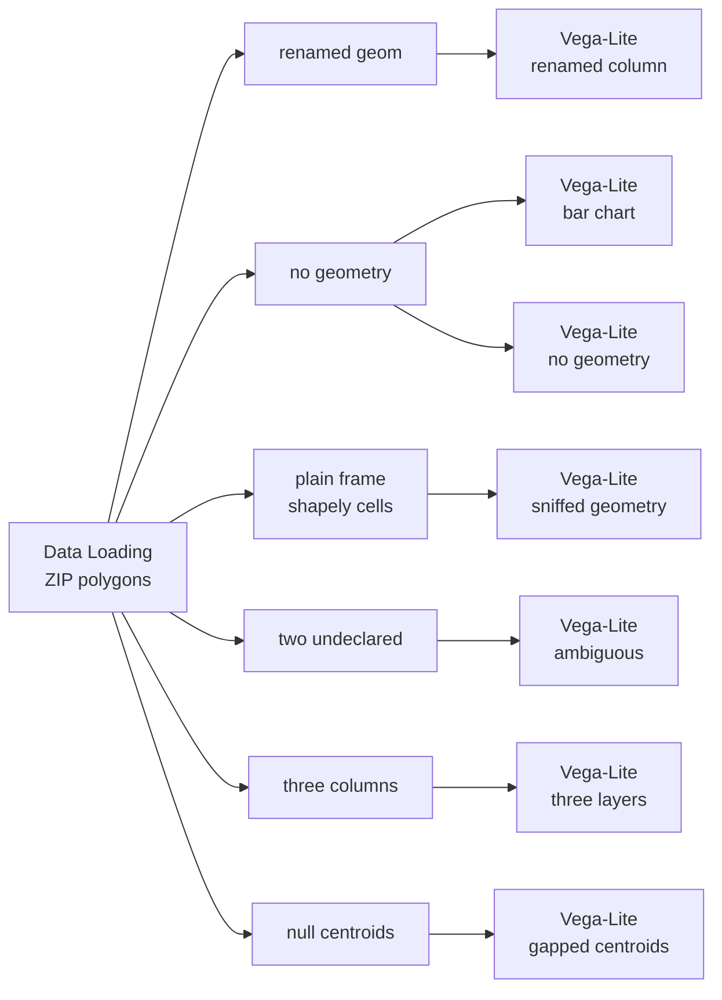

# Example: Geometry columns

Your geometry column can be called anything, you can have several at once, and
you can have none. This example shows what each of those looks like.

One of four examples on drawing a `GeoDataFrame`:
[12](12-vega-lite-geodataframe-maps.md) the basics,
[13](13-vega-lite-geometry-columns.md) geometry columns,
[14](14-vega-lite-crs-and-geometry-types.md) coordinate systems and geometry types,
[15](15-vega-lite-spec-forms-and-catalogs.md) spec forms and data sources.

## Pipeline



## Data

Loaded from the [Data Catalog](../DATA-CATALOG.md) by id, so the dataflow runs
anywhere without editing paths.

| Dataset | Id | Format |
|---|---|---|
| Chicago Boundary (ZIP polygons) | `data.urbanlab.chicago-boundary` | geojson |

## Any name works

```python
gdf = arg

# The active geometry is now called `geom`, and a plain string column takes the
# name `geometry`. Neither may shadow the other.
gdf = gdf.rename_geometry("geom")
gdf["geometry"] = gdf["zip"]

return gdf
```

The active geometry is now `geom`, and a plain string column has taken the name
`geometry`. Both survive: the map draws from `geom` and colours itself by the
string column. Nothing needs renaming to fit a convention.

## Several at once

```python
gdf = arg

gdf["centroid"] = gdf.to_crs(3395).geometry.centroid.to_crs(4326)
gdf["bbox"] = gdf.geometry.envelope

return gdf
```

Three geometry columns, drawn as three layers. The first gets the active column
automatically; `bbox` and `centroid` are named in their own layers. A secondary
column can be partly null, and those rows are simply skipped.

## Geometry without a GeoDataFrame

```python
gdf = arg

# `pd.DataFrame(gdf)` keeps the shapely objects but loses the GeoDataFrame type,
# so nothing declares which column is geometry.
return pd.DataFrame(gdf)
```

This is a plain `DataFrame` that happens to hold shapely objects. It still draws:
there is one geometry column, so Curio uses it. A frame with the geometry dropped
is ordinary tabular data and charts as bars.

## When it cannot tell

Two views here draw nothing on purpose, and say why in the node body rather than
leaving you with a blank chart:

- a `geoshape` over data with no geometry at all;
- a `geoshape` over a frame with two geometry columns and no `shape` encoding
  saying which to use. The message names the columns it found, so you can paste
  one in.
