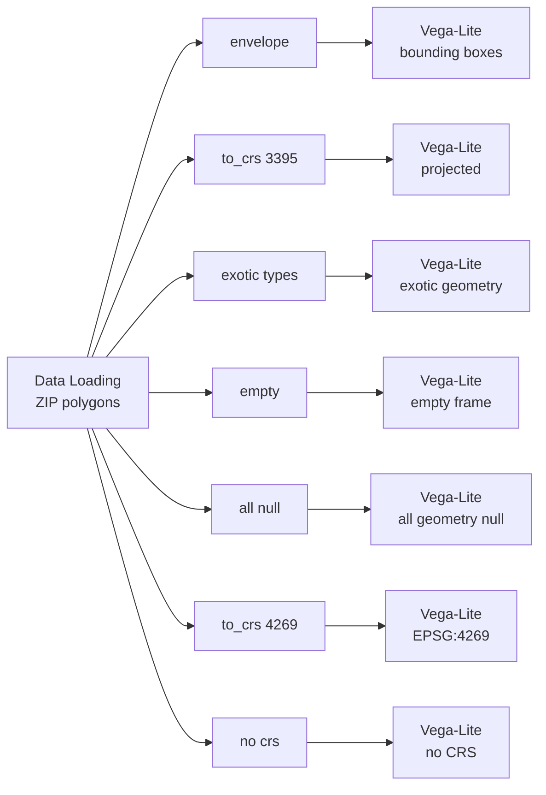

# Example: Coordinate systems and geometry types

Whatever coordinate system your frame is in, and whatever geometry it holds, the
same spec draws it. This example is the proof: eight frames, one `geoshape`.

One of four examples on drawing a `GeoDataFrame`:
[12](12-vega-lite-geodataframe-maps.md) the basics,
[13](13-vega-lite-geometry-columns.md) geometry columns,
[14](14-vega-lite-crs-and-geometry-types.md) coordinate systems and geometry types,
[15](15-vega-lite-spec-forms-and-catalogs.md) spec forms and data sources.

## Pipeline



## Data

Loaded from the [Data Catalog](../DATA-CATALOG.md) by id, so the dataflow runs
anywhere without editing paths.

| Dataset | Id | Format |
|---|---|---|
| Chicago Boundary (ZIP polygons) | `data.urbanlab.chicago-boundary` | geojson |

## Any coordinate system

```python
gdf = arg

return gdf.to_crs(3395)
```

Projected metres. The spec is unchanged from the lon/lat version: Curio reads the
CRS off the frame and fits the right projection to it. The same holds for a
geographic CRS that is not 4326, and for a frame carrying no CRS at all, both of
which are here too.

## Any geometry

```python
from shapely.geometry import (
    GeometryCollection,
    LineString,
    MultiPolygon,
    Point,
    Polygon,
)

gdf = arg
square = Polygon([(-87.8, 41.9), (-87.8, 42.0), (-87.7, 42.0), (-87.7, 41.9)])

return gpd.GeoDataFrame(
    {"kind": ["multipolygon", "collection", "point", "with_z", "missing", "line"]},
    geometry=[
        MultiPolygon([square, Polygon([(-87.6, 41.7), (-87.6, 41.8), (-87.5, 41.8)])]),
        GeometryCollection([square, Point(-87.65, 41.85)]),
        Point(-87.62, 41.88),
        Point(-87.63, 41.89, 30.0),
        None,
        LineString([(-87.7, 41.8), (-87.6, 41.9)]),
    ],
    crs=4326,
)
```

One column holding a MultiPolygon, a GeometryCollection, a Point, a Point with a
Z coordinate, a `None` and a LineString. All of them draw, and the missing one is
skipped rather than breaking the layer.

Derived geometry works the same way. Another view draws `gdf.envelope` as
bounding boxes over the ZIP polygons, straight from the column, with nothing in
the Python to prepare it.
