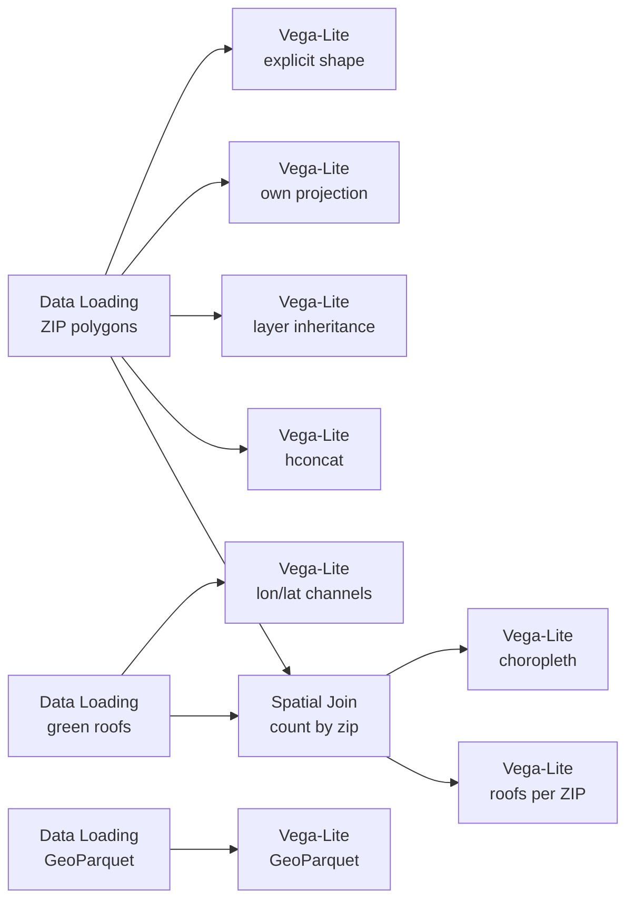

# Example: Spec forms and data sources

Anything you write in the spec yourself is kept, and it does not matter which
catalog format the data came from.

One of four examples on drawing a `GeoDataFrame`:
[12](12-vega-lite-geodataframe-maps.md) the basics,
[13](13-vega-lite-geometry-columns.md) geometry columns,
[14](14-vega-lite-crs-and-geometry-types.md) coordinate systems and geometry types,
[15](15-vega-lite-spec-forms-and-catalogs.md) spec forms and data sources.

## Pipeline



## Data

Loaded from the [Data Catalog](../DATA-CATALOG.md) by id, so the dataflow runs
anywhere without editing paths.

| Dataset | Id | Format |
|---|---|---|
| Chicago Boundary (ZIP polygons) | `data.urbanlab.chicago-boundary` | geojson |
| Chicago Green Roofs | `data.cityofchicago.green-roofs` | csv |
| Project Sidewalk labels | `data.projectsidewalk.chicago-labels` | parquet |

## Your spec wins

Curio fills in a `shape` encoding and a `projection` only when you have not
written them. Two views here write their own, one naming the geometry column
explicitly and one asking for `albersUsa`, and both come back untouched.

This holds inside `layer` and `hconcat` too, so a multi-view map composes the way
you would expect.

## Maps without geoshape

A `circle` mark with `longitude` and `latitude` channels is a map too, and gets
the same projection treatment as a `geoshape`. One view here plots the rooftop
points that way, sized by roof area, with no geometry column involved at all.

## Any catalog format

```python
import geopandas as gpd

dataset_path = curio_dataset_path("data.projectsidewalk.chicago-labels")
gdf = gpd.read_parquet(dataset_path)

return gdf[["label_type", "severity", "geometry"]].head(400)
```

GeoParquet, read with `gpd.read_parquet`. The spec is no different from the
geojson one.

The join is a node, not code. `Spatial Join` takes the green-roof points on
its upper, blue handle and the ZIP polygons on its lower, green handle, and
works out which
polygon each point falls in. Its two settings are which polygon column is the
tag (`name` by default; `zip` here) and what comes out: the points, each tagged
with that column under its own name, or, as here, the polygons, each with a
`point_count`. The polygons feed two views. A choropleth first:

```json
{
  "$schema": "https://vega.github.io/schema/vega-lite/v6.json",
  "description": "Green roofs per ZIP, as a choropleth of the Spatial Join's polygon output.",
  "mark": {
    "type": "geoshape",
    "stroke": "white",
    "strokeWidth": 0.5
  },
  "encoding": {
    "color": {
      "field": "point_count",
      "type": "quantitative",
      "title": "green roofs",
      "scale": {
        "scheme": "greens"
      }
    },
    "tooltip": [
      {
        "field": "zip",
        "title": "ZIP"
      },
      {
        "field": "point_count",
        "title": "green roofs"
      }
    ]
  }
}
```

Then the same rows as bars, the ZIPs with the most green roofs on top:

```json
{
  "$schema": "https://vega.github.io/schema/vega-lite/v6.json",
  "description": "Green roofs per ZIP, as bars over the same polygon output.",
  "transform": [
    {
      "filter": "datum.point_count > 0"
    }
  ],
  "mark": "bar",
  "encoding": {
    "y": {
      "field": "zip",
      "type": "nominal",
      "sort": "-x",
      "title": "ZIP"
    },
    "x": {
      "field": "point_count",
      "type": "quantitative",
      "title": "green roofs"
    },
    "tooltip": [
      {
        "field": "zip",
        "title": "ZIP"
      },
      {
        "field": "point_count",
        "title": "green roofs"
      }
    ]
  }
}
```

Nothing in either spec says where the geometry is or which column carries the
count: the join's output is a plain GeoDataFrame like any other input.
