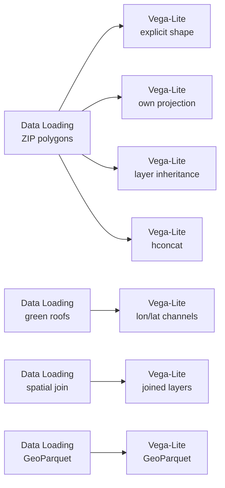

# Example: Spec forms and data sources

Anything you write in the spec yourself is kept, and it does not matter which
catalog format the data came from.

One of four examples on drawing a `GeoDataFrame`:
[12](12-vega-lite-geodataframe-maps.md) the basics,
[13](13-vega-lite-geometry-columns.md) geometry columns,
[14](14-vega-lite-crs-and-geometry-types.md) coordinate systems and geometry types,
[15](15-vega-lite-spec-forms-and-catalogs.md) spec forms and data sources.

## Pipeline



## Data

Loaded from the [Data Catalog](../DATA-CATALOG.md) by id, so the dataflow runs
anywhere without editing paths.

| Dataset | Id | Format |
|---|---|---|
| Chicago Boundary (ZIP polygons) | `data.urbanlab.chicago-boundary` | geojson |
| Chicago Green Roofs | `data.cityofchicago.green-roofs` | csv |
| Project Sidewalk labels | `data.projectsidewalk.chicago-labels` | parquet |

## Your spec wins

Curio fills in a `shape` encoding and a `projection` only when you have not
written them. Two views here write their own, one naming the geometry column
explicitly and one asking for `albersUsa`, and both come back untouched.

This holds inside `layer` and `hconcat` too, so a multi-view map composes the way
you would expect.

## Maps without geoshape

A `circle` mark with `longitude` and `latitude` channels is a map too, and gets
the same projection treatment as a `geoshape`. One view here plots the rooftop
points that way, sized by roof area, with no geometry column involved at all.

## Any catalog format

```python
import geopandas as gpd

dataset_path = curio_dataset_path("data.projectsidewalk.chicago-labels")
gdf = gpd.read_parquet(dataset_path)

return gdf[["label_type", "severity", "geometry"]].head(400)
```

GeoParquet, read with `gpd.read_parquet`. The spec is no different from the
geojson one.

```python
import geopandas as gpd
import pandas as pd
from shapely.geometry import Point

roofs = pd.read_csv(curio_dataset_path("data.cityofchicago.green-roofs"))
roofs = roofs.dropna(subset=["LONGITUDE", "LATITUDE"])
roofs = gpd.GeoDataFrame(
    roofs,
    geometry=[Point(xy) for xy in zip(roofs["LONGITUDE"], roofs["LATITUDE"])],
    crs=4326,
)

zips = gpd.read_file(curio_dataset_path("data.urbanlab.chicago-boundary"))
joined = gpd.sjoin(roofs, zips, predicate="within")

return joined[["zip", "TOTAL_ROOF_SQFT", "geometry"]]
```

A csv promoted to points and joined to the geojson polygons, then drawn as two
layers from the one frame.
