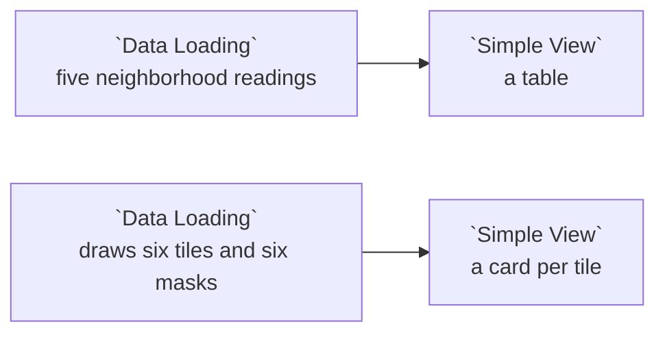

# Example: Simple View, tables and images

`Simple View` is the built-in node that shows you whatever reaches it, with no
spec to write and nothing to configure. This example runs two independent paths
into one so you can see both of the things it does: a frame with no pictures
becomes a table, and a frame that carries pictures becomes a card per row.

Everything here is generated in the node above each view, so the dataflow reads
no files, needs no Data Catalog entry and never touches the network.

## Pipeline overview



Two paths, four nodes, nothing shared between them. Run either node on the left
and the view beside it fills in.

## Path 1: a frame with no pictures

`Simple View` renders a table whenever nothing in the frame looks like an image.
That is the ordinary case, and it is what you get for almost every dataflow.

```python
# One of the two paths in this example. A plain table: nothing in this frame
# looks like a picture, so Simple View renders it as a table.
import pandas as pd

READINGS = [
    ("Lincoln Park", 2, 55.0, 21.0),
    ("The Loop", 2, 9.5, 74.0),
    ("Hyde Park", 2, 47.0, 33.5),
    ("Pilsen", 1, 22.0, 61.0),
    ("Rogers Park", 1, 38.5, 40.0),
]

return pd.DataFrame(
    READINGS,
    columns=["neighborhood", "tiles", "vegetation_pct", "paved_pct"],
)
```

Run it, and the view to its right lists the five rows and four columns. There is
nothing to set up: the node has no editor and no settings.

## Path 2: a frame that carries pictures

The second loader draws its own images with Pillow and puts them in the frame as
`data:` URIs, one column for the tile and one for its vegetation mask.

```python
# The other path. This node draws its own pictures, so the example needs no
# files and no network: Simple View shows whatever a frame carries, wherever
# the frame came from. Two image columns, so the cards put them side by side
# and the node offers an "Image column" picker.
import base64
import io

import pandas as pd
from PIL import Image, ImageDraw

# tile id, neighborhood, percent of the tile that reads as vegetation
TILES = [
    ("T-01", "Lincoln Park", 62),
    ("T-02", "Lincoln Park", 48),
    ("T-03", "The Loop", 12),
    ("T-04", "The Loop", 7),
    ("T-05", "Hyde Park", 39),
    ("T-06", "Hyde Park", 55),
]

WIDTH, HEIGHT = 96, 64


def as_data_uri(img):
    """A column of data: URIs needs no server and survives a save."""
    buffer = io.BytesIO()
    img.save(buffer, format="PNG")
    return "data:image/png;base64," + base64.b64encode(buffer.getvalue()).decode()


def tile_image(pct):
    """A stand-in aerial tile: the greener the band, the higher the reading."""
    img = Image.new("RGB", (WIDTH, HEIGHT), (203, 213, 225))
    draw = ImageDraw.Draw(img)
    band = round(HEIGHT * pct / 100)
    draw.rectangle([0, HEIGHT - band, WIDTH, HEIGHT], fill=(34, 139, 76))
    draw.line([0, HEIGHT // 2, WIDTH, HEIGHT // 2], fill=(148, 163, 184), width=3)
    return as_data_uri(img)


def mask_image(pct):
    """The same tile as a vegetation mask: the second picture on each card."""
    img = Image.new("RGB", (WIDTH, HEIGHT), (15, 23, 42))
    draw = ImageDraw.Draw(img)
    band = round(HEIGHT * pct / 100)
    draw.rectangle([0, HEIGHT - band, WIDTH, HEIGHT], fill=(74, 222, 128))
    return as_data_uri(img)


return pd.DataFrame(
    [
        {
            "tile_id": tile_id,
            "neighborhood": neighborhood,
            "vegetation_pct": pct,
            "image": tile_image(pct),
            "thumbnail": mask_image(pct),
        }
        for tile_id, neighborhood, pct in TILES
    ]
)
```

Run it, and the view beside it switches to a card per row: the pictures for that
row, then the values that describe it.

### How `Simple View` decides a column holds images

It checks the column names it knows first, in this order:

| Column | Holds |
|---|---|
| `image_content` | raw base64 bytes, with no `data:` prefix |
| `image_url` | a URL or a `data:` URI |
| `image` | a URL or a `data:` URI |
| `thumbnail` | a URL or a `data:` URI |
| `overlay_url` | a URL or a `data:` URI |

If a frame carries none of those, it falls back to reading the values: a column
whose cells are `data:` URIs, URLs ending in an image extension, or paths under
`/api/` is treated as images too. So a column you named something else still
works, and an id column that merely looks like base64 is left alone.

Both frame shapes are supported. A GeoDataFrame carrying an image property in
its features displays exactly like the DataFrame here.

### Two pictures per row

This frame has two image columns, so each card shows both side by side and the
node grows an **Image column** selector. Leave it on `all` to compare the tile
against its mask, or pin the node to one column. The choice is saved with the
dataflow, so a second `Simple View` wired to the same node can sit beside this
one showing only the masks.

A card is one row, so clicking a card selects that row. Wire a `Data Pool` in
with an interaction edge and the selection travels to it.

### Images the backend serves

A value that points at Curio's own backend, like
`/api/streetvision/inference/overlay/<id>`, is fetched with your session rather
than handed straight to the browser. Those routes resolve *which* user is asking
from the request, and an image tag cannot say. This example does not need that
path, but the Street Vision example relies on it to show segmentation overlays.

## Expected output

The top view is a five-row table of neighborhoods. The bottom view is six cards,
each with a grey-and-green tile beside a dark vegetation mask, captioned with the
tile id, its neighborhood and its vegetation percentage. The greener the band in
the tile, the taller the band in the mask.

## Limitations

- **The pictures are synthetic.** They are drawn in the node so the example is
  self-contained. Point the same column at real URLs and nothing else changes.
- **`data:` URIs travel with the frame.** Convenient for an example, but a large
  image column makes a heavy dataflow; prefer URLs for real data.
- **A card shows the first few columns** under its images. The table view is the
  one to use when you want every column of a wide frame.
