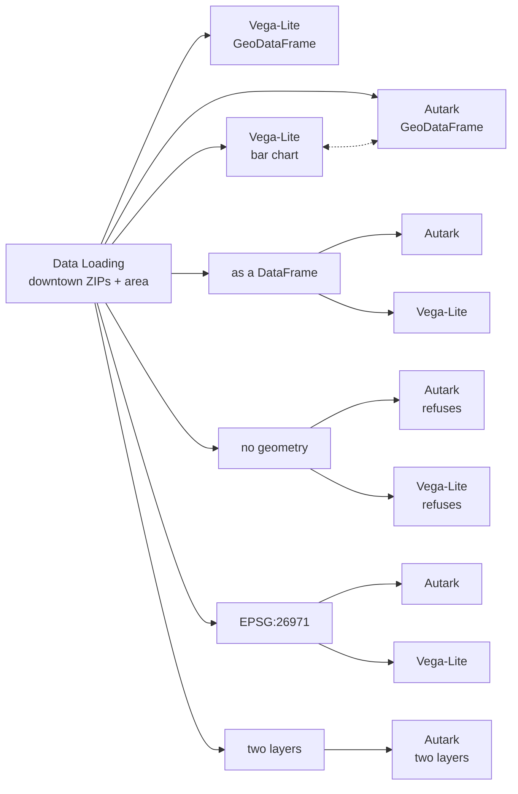

# Example: GeoDataFrame maps in Autark

Return a `GeoDataFrame` from a Python node, connect an `Autark` node, and you get
a map. Each input here feeds an Autark map and a Vega-Lite map side by side: the
two nodes read their input the same way, and refuse the same input for the same
reason.

## Pipeline



## Data

Loaded from the [Data Catalog](../DATA-CATALOG.md) by id, so the dataflow runs
anywhere without editing paths.

| Dataset | Id | Format |
|---|---|---|
| Chicago Boundary (ZIP polygons) | `data.utk.chicago-boundary` | geojson |

## Load it

```python
import geopandas as gpd

gdf = curio_load_data("data.utk.chicago-boundary")

# Downtown: the Loop and its neighbours.
downtown = ["60601", "60602", "60603", "60604", "60605",
            "60606", "60607", "60611", "60654", "60661"]
gdf = gdf[gdf["zip"].isin(downtown)]

# A number to colour by: each ZIP's area, measured in a projected CRS.
gdf["area_km2"] = (gdf.to_crs(26971).area / 1e6).round(2)

return gdf[["zip", "area_km2", "geometry"]]
```

## Draw it

The frame reaches the Autark document as the table `input_0`, written with the
input chip `[!! input 0 !!]`; the document writes no `data` entry for it.

```json
{
  "map": {
    "layerRefs": [
      {
        "dataRef": "[!! input 0 !!]",
        "getFnv": "area_km2",
        "getFnvType": "quantitative",
        "colorMapInterpolator": "interpolateViridis",
        "isPick": true
      }
    ]
  }
}
```

If the loader had already run when you dropped this node, that document would
have been written for you: a layer with a number is the second row of the
[starter ladder](../USAGE.md#the-starter-document). The Vega-Lite map beside it
is the first row of its own.

## A DataFrame with a geometry column

```python
import pandas as pd

# A plain DataFrame that still holds a column of shapely geometries.
return pd.DataFrame(arg)
```

Both nodes find the one column that holds geometries and draw it.

## A DataFrame without one

```python
import pandas as pd

# The attributes alone: nothing here can be drawn on a map.
return pd.DataFrame(arg.drop(columns="geometry"))
```

Both nodes draw nothing and say why in the node body: there is no geometry
column. The Autark node's error says what to change, and that it is the node
feeding it: return a `GeoDataFrame`.

## A projected CRS

```python
# The same frame in a projected CRS (Illinois East, in metres), declared.
return arg.to_crs(26971)
```

The Autark node reads the coordinates in the CRS the frame declares. A frame
with no CRS is read as longitude and latitude when its coordinates look like
them, and as EPSG:3395 otherwise.

## Two layers

```python
gdf = arg

# Two layers: the ZIP polygons, and a point at each one's centre.
centres = gdf.copy()
centres["geometry"] = gdf.to_crs(26971).centroid.to_crs(4326)

return gdf, centres
```

The two frames arrive on one input as two tables. Unnamed, they are named by
their position, `input_0` and `input_1`, and the document draws both:

```json
{
  "map": {
    "layerRefs": [
      { "dataRef": "input_0", "getFnv": "area_km2", "getFnvType": "quantitative", "colorMapInterpolator": "interpolateViridis" },
      { "dataRef": "input_1" }
    ]
  }
}
```

A Vega-Lite chart reads the two frames the same way, as the datasets `input_0`
and `input_1`.

## A chart linked to the map

The bar chart and the first Autark map are joined by an interaction edge, with no
Data Pool between them. Hover a bar and its ZIP lights up on the map; pick a ZIP
on the map and its bar turns red. Both read the loader's rows, so a selection
lands on the same row at either end, and neither view is redrawn for it. See
[Linking charts](../USAGE.md#linking-charts).

## Good to know

- An Autark map redraws on its own when new data reaches it, as a Vega-Lite
  chart does.
- An Autark map opens about 8 km across. Scroll to zoom out.
- A `data` section's `join` and `heatmap` sources cannot read the input; join it
  in a Python node instead.
