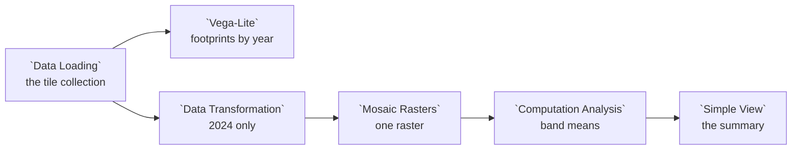

# Example: Storage: orthorectified imagery

A folder of drone tiles, one GeoTIFF per tile, in a subfolder per year:

```
orthos/
  2023/  tile_0001.tif  tile_0002.tif
  2024/  tile_0001.tif  tile_0002.tif
```

The example storage source declares it as one resource, and the Data Lake
Catalog adds it to the Data Catalog as one collection: an index with a row per
tile, while the tiles stay where they are.

```jsonc
{ "id": "orthos", "name": "Drone orthoimagery", "kind": "rasters",
  "path": "orthos/{year:int}/{tile}.tif" }
```

This example reads the committed copy of that collection, **Example drone
orthoimagery**, so it runs as it opens. Adding **Drone orthoimagery** from the
**Example storage** source gives you the same thing.

## Pipeline overview



## Load the collection

```python
collection = curio_collection("data.curio.storage-orthos")

return collection
```

The rows are a GeoDataFrame: each tile's footprint in EPSG:4326, and its
`year` and `tile` from the path, with `crs`, `transform`, `width`, `height`,
`bands` and `dtype` read from the file. `path` is where the tile can be
opened.

## Where the tiles fall

```json
{
  "$schema": "https://vega.github.io/schema/vega-lite/v6.json",
  "description": "Each tile's footprint, coloured by the year it was flown.",
  "mark": {
    "type": "geoshape",
    "stroke": "white",
    "strokeWidth": 1
  },
  "encoding": {
    "color": {
      "field": "year",
      "type": "nominal",
      "title": "Year"
    },
    "tooltip": [
      {
        "field": "tile",
        "type": "nominal"
      },
      {
        "field": "year",
        "type": "nominal"
      },
      {
        "field": "crs",
        "type": "nominal"
      }
    ]
  }
}
```

## One year's tiles as one raster

Filter to one year first, so every tile shares a grid:

```python
tiles = arg

return tiles[tiles["year"] == 2024]
```

**Mosaic Rasters**, from the `curio.media` package, joins the rows into one
virtual raster. It needs rows that agree on CRS, resolution, band count and
data type, and says which of those differs when they do not. Its output is a
RASTER, so the next node receives an open raster:

```python
import pandas as pd

mosaic = arg
pixels = mosaic.read()

return pd.DataFrame({
    "band": [f"band {i + 1}" for i in range(mosaic.count)],
    "mean": [round(float(band.mean()), 2) for band in pixels],
    "width": mosaic.width,
    "height": mosaic.height,
})
```

**Simple View** shows the three bands of the 64 by 32 pixel mosaic.
