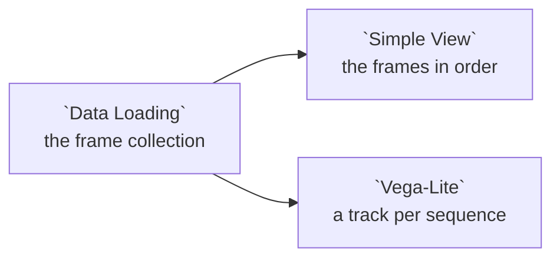

# Example: Storage: video frames

A folder of frames exported from a dashcam, one subfolder per day, with a
telemetry file that gives each frame a position:

```
dashcam/
  2024-05-01/  trip01_000001.jpg ... trip01_000006.jpg
               trip02_000001.jpg ... trip02_000004.jpg
               telemetry.csv
```

The example storage source declares the frames as one resource. The path names
the sequence and the frame number, `fps` turns a frame number into a time, and
`metadata` joins the telemetry onto each frame by its file name:

```jsonc
{ "id": "dashcam", "name": "Dashcam frames", "kind": "frames",
  "path": "dashcam/{date:date}/{sequence}_{frame:int}.jpg", "fps": 10,
  "metadata": { "path": "dashcam/{date:date}/telemetry.csv", "on": "file_name" } }
```

This example reads the committed copy of that collection, **Example dashcam
frames**. Adding **Dashcam frames** from the **Example storage** source gives
you the same thing.

## Pipeline overview



## Load the collection

```python
collection = curio_collection("data.curio.storage-dashcam")

return collection
```

One row per frame, ordered by `sequence` and `frame`. `t_s` is the frame's
offset in its sequence, `frame` over the declared 10 frames per second, and
`lat` and `lon` come from the telemetry.

## The frames in order

**Simple View** shows a card per frame, drawn from each row's `thumbnail`,
with the rest of the row beneath it.

## Where each sequence drove

```json
{
  "$schema": "https://vega.github.io/schema/vega-lite/v6.json",
  "description": "Each sequence's frames as a track, in frame order.",
  "layer": [
    {
      "mark": {
        "type": "line",
        "strokeWidth": 2
      },
      "encoding": {
        "longitude": {
          "field": "lon",
          "type": "quantitative"
        },
        "latitude": {
          "field": "lat",
          "type": "quantitative"
        },
        "detail": {
          "field": "sequence",
          "type": "nominal"
        },
        "order": {
          "field": "frame",
          "type": "quantitative"
        },
        "color": {
          "field": "sequence",
          "type": "nominal",
          "title": "Sequence"
        }
      }
    },
    {
      "mark": {
        "type": "circle",
        "size": 40
      },
      "encoding": {
        "longitude": {
          "field": "lon",
          "type": "quantitative"
        },
        "latitude": {
          "field": "lat",
          "type": "quantitative"
        },
        "color": {
          "field": "sequence",
          "type": "nominal"
        },
        "tooltip": [
          {
            "field": "sequence",
            "type": "nominal"
          },
          {
            "field": "frame",
            "type": "quantitative"
          },
          {
            "field": "t_s",
            "type": "quantitative",
            "title": "seconds"
          }
        ]
      }
    }
  ]
}
```
