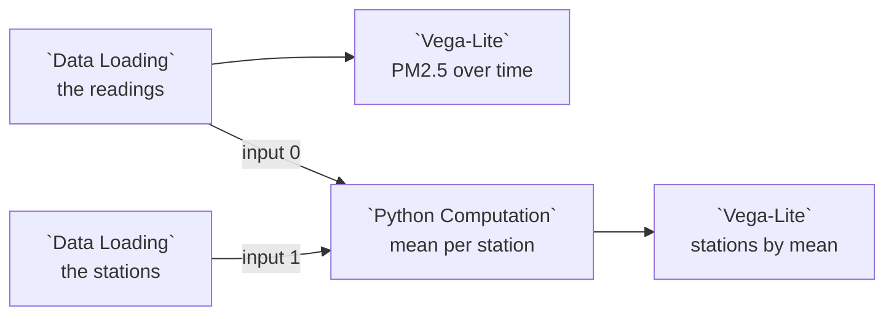

# Example: Storage: a folder of CSV files

A sensor network's logger writes one CSV file per sensor and day, and a
stations file beside them:

```
air-quality/
  sensor_A/  2024-01-01.csv  2024-01-02.csv  2024-01-03.csv
  sensor_B/  ...
  sensor_C/  ...
  stations.csv
```

The example storage source declares two resources. The readings take the
sensor and the day from the path; the stations file is one table:

```jsonc
{ "id": "air-quality", "name": "Air quality readings", "kind": "table",
  "format": "csv", "path": "air-quality/{sensor}/{day:date}.csv" },
{ "id": "stations", "name": "Sensor stations", "kind": "table",
  "format": "csv", "path": "air-quality/stations.csv" }
```

Adding the readings copies all nine files into one Parquet table, the rows of
every file under the columns of all of them, with `sensor`, `day` and
`source_file` added. The third day's files gained a `humidity` column, so the
earlier rows hold nothing there. This example reads the committed copies,
**Example air quality readings** and **Example air quality stations**.

## Pipeline overview



## Load the readings

```python
import pandas as pd
import geopandas as gpd

dataset_path = curio_data_path("data.curio.storage-air-quality")
try:
    df = gpd.read_parquet(dataset_path)
except Exception:
    df = pd.read_parquet(dataset_path)

return df
```

```json
{
  "$schema": "https://vega.github.io/schema/vega-lite/v6.json",
  "description": "PM2.5 over time, one line per sensor.",
  "mark": {
    "type": "line",
    "point": true
  },
  "encoding": {
    "x": {
      "field": "timestamp",
      "type": "temporal",
      "title": "Time",
      "scale": {
        "type": "utc"
      }
    },
    "y": {
      "field": "pm25",
      "type": "quantitative",
      "title": "PM2.5"
    },
    "color": {
      "field": "sensor",
      "type": "nominal",
      "title": "Sensor"
    }
  }
}
```

## Join them to the stations

```python
import pandas as pd

df = curio_load_data("data.curio.storage-stations")

return df
```

Both tables go into one **Python Computation** node, the readings on its first
input circle and the stations on its second, and its code reads each through an
input chip (see [Several inputs](../USAGE.md#several-inputs)):

```python
readings, stations = [!! input_0 !!], [!! input_1 !!]

means = readings.groupby("sensor", as_index=False)["pm25"].mean()
return stations.merge(means, on="sensor")
```

```json
{
  "$schema": "https://vega.github.io/schema/vega-lite/v6.json",
  "description": "Each station, sized by its mean PM2.5.",
  "mark": {
    "type": "circle",
    "opacity": 0.8
  },
  "encoding": {
    "longitude": {
      "field": "lon",
      "type": "quantitative"
    },
    "latitude": {
      "field": "lat",
      "type": "quantitative"
    },
    "size": {
      "field": "pm25",
      "type": "quantitative",
      "title": "Mean PM2.5"
    },
    "tooltip": [
      {
        "field": "name",
        "type": "nominal"
      },
      {
        "field": "pm25",
        "type": "quantitative",
        "format": ".1f"
      }
    ]
  }
}
```
