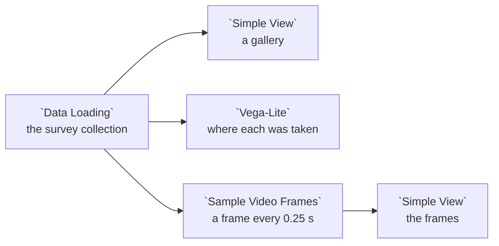

# Example: Storage: photos and videos

A street survey's camera folder, by year, with photos and a short video:

```
survey/
  2024/  IMG_0001.jpg  IMG_0002.jpg
  2025/  IMG_0003.jpg  clip_01.mp4
```

The example storage source declares it as one `media` resource, which takes
images and videos together, at any depth under each year:

```jsonc
{ "id": "survey", "name": "Street survey", "kind": "media",
  "path": "survey/{year:int}/**/*" }
```

This example reads the committed copy of that collection, **Example street
survey**. Adding **Street survey** from the **Example storage** source gives
you the same thing.

## Pipeline overview



## Load the collection

```python
collection = curio_collection("data.curio.storage-survey")

return collection
```

Each photo's row carries its EXIF time as `taken_at` and its GPS position as
`gps_lat` and `gps_lon`. The video's row carries its `duration_s`, `fps` and
`codec`.

## A gallery

**Simple View** shows a card per file. A photo's card shows the photo; the
video's card shows a frame from it and a **Play** button that plays it in the
card.

## Where each was taken

```json
{
  "$schema": "https://vega.github.io/schema/vega-lite/v6.json",
  "description": "Where each photo and video was taken.",
  "mark": {
    "type": "circle",
    "size": 80
  },
  "encoding": {
    "longitude": {
      "field": "gps_lon",
      "type": "quantitative"
    },
    "latitude": {
      "field": "gps_lat",
      "type": "quantitative"
    },
    "color": {
      "field": "kind",
      "type": "nominal",
      "title": "File"
    },
    "tooltip": [
      {
        "field": "name",
        "type": "nominal"
      },
      {
        "field": "taken_at",
        "type": "temporal"
      }
    ]
  }
}
```

## Frames from the video

**Sample Video Frames**, from the `curio.media` package, turns every video row
into a row per sampled frame, and leaves photos out. Here its
`EVERY_SECONDS` setting is `0.25`, so the one-second clip gives five frames,
from 0 to 1 second.
Each frame row has the columns an image row has, so the next **Simple View**
shows the frames the way it shows photos.
