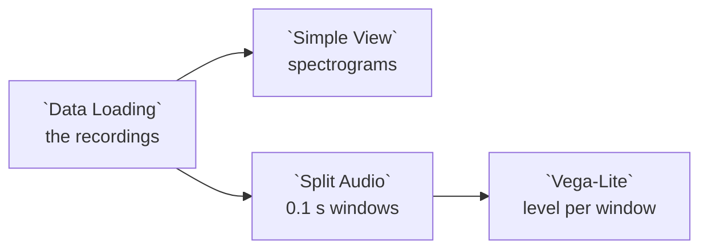

# Example: Storage: audio recordings

Noise sensors that each write one WAV file per recording, named by when it
started:

```
noise/
  sensor_01/  20240501_060000.wav  20240501_070000.wav
  sensor_02/  20240501_060000.wav
```

The example storage source declares them as one `audio` resource. The file
name is a time, read with the format it is written in, and `time` makes it each
recording's `recorded_at`:

```jsonc
{ "id": "noise", "name": "Noise recordings", "kind": "audio",
  "path": "noise/{sensor}/{recorded:%Y%m%d_%H%M%S}.wav", "time": "recorded" }
```

This example reads the committed copy of that collection, **Example noise
recordings**. Adding **Noise recordings** from the **Example storage** source
gives you the same thing.

## Pipeline overview



## Load the collection

```python
collection = curio_collection("data.curio.storage-noise")

return collection
```

One row per recording, with `sensor` and `recorded_at` from the path, and
`duration_s`, `sample_rate`, `channels` and `codec` from the file.

## Spectrograms

**Simple View** shows each recording as a spectrogram card with a **Play**
button.

## Levels per window

**Split Audio**, from the `curio.media` package, cuts each recording into
windows of `WINDOW_SECONDS`, here `0.1`, and measures each one: `level_dbfs`
is its RMS level and `peak_dbfs` its peak, both relative to full scale. Each
window's `recorded_at` is its recording's time plus its offset.

```json
{
  "$schema": "https://vega.github.io/schema/vega-lite/v6.json",
  "description": "Each window's level, per sensor, over the recording time.",
  "mark": {
    "type": "line",
    "point": true
  },
  "encoding": {
    "x": {
      "field": "recorded_at",
      "type": "temporal",
      "title": "Time",
      "scale": {
        "type": "utc"
      }
    },
    "y": {
      "field": "level_dbfs",
      "type": "quantitative",
      "title": "Level (dBFS)"
    },
    "color": {
      "field": "sensor",
      "type": "nominal",
      "title": "Sensor"
    }
  }
}
```
