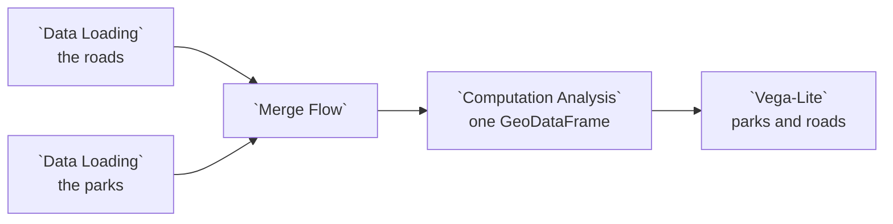

# Example: Storage: a folder of different files

A folder that holds unrelated files, as a project folder often does:

```
city/
  roads.shp  roads.dbf  roads.shx  roads.prj  roads.cpg
  parks.geojson
```

The example storage source declares each file as its own resource, the way a
portal lists its datasets:

```jsonc
[
  { "id": "roads", "name": "Roads", "kind": "table", "format": "shp", "path": "city/roads.shp" },
  { "id": "parks", "name": "Parks", "kind": "table", "format": "geojson", "path": "city/parks.geojson" }
]
```

Adding **Roads** brings the shapefile's sibling files with it and stores it as
GeoParquet; adding **Parks** copies the GeoJSON file as it is. This example
reads the committed copies, **Example roads** and **Example parks**.

## Pipeline overview



## Load the two files

```python
import pandas as pd
import geopandas as gpd

dataset_path = curio_dataset_path("data.curio.storage-roads")
try:
    df = gpd.read_parquet(dataset_path)
except Exception:
    df = pd.read_parquet(dataset_path)

return df
```

```python
import geopandas as gpd

dataset_path = curio_dataset_path("data.curio.storage-parks")
gdf = gpd.read_file(dataset_path)

return gdf
```

## One map

**Merge Flow** hands both layers to the next node, roads first:

```python
import geopandas as gpd
import pandas as pd

roads, parks = arg[0], arg[1]
roads = roads.assign(layer="road")
parks = parks.assign(layer="park")

return gpd.GeoDataFrame(pd.concat([parks, roads], ignore_index=True), crs=roads.crs)
```

```json
{
  "$schema": "https://vega.github.io/schema/vega-lite/v6.json",
  "description": "Parks and roads on one map.",
  "mark": {
    "type": "geoshape",
    "strokeWidth": 3,
    "fillOpacity": 0.4
  },
  "encoding": {
    "color": {
      "field": "layer",
      "type": "nominal",
      "title": "Layer"
    },
    "stroke": {
      "field": "layer",
      "type": "nominal",
      "legend": null
    },
    "tooltip": [
      {
        "field": "name",
        "type": "nominal"
      }
    ]
  }
}
```
