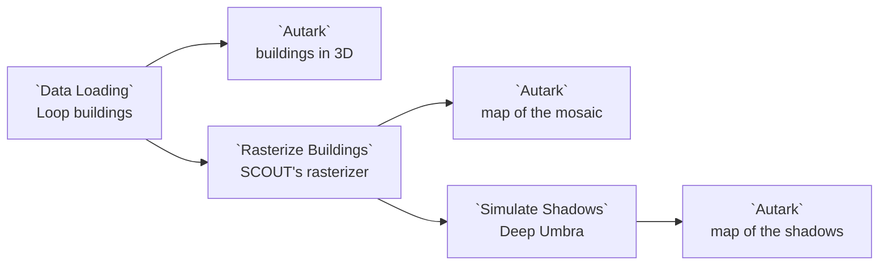

# Example: SCOUT building rasters

SCOUT's Deep Umbra shadow model does not read buildings: it reads map tiles in
which each pixel's gray level is the height of the building under it. This
example takes the buildings of the Chicago Loop, draws them in 3D, and turns
them into those tiles with the **Rasterize Buildings** node of the
`scout.raster-conversion@1` package, SCOUT's own rasterizer ported to Curio.
It then draws the tiles joined into one map. Last, the **Simulate Shadows** node of the `scout.shadow-simulation@1` package
runs Deep Umbra, from the Model Catalog, on those tiles, and a map shows how
many minutes of a summer day each spot is in shadow.

## Pipeline overview



## Data

**Chicago Loop Buildings** (`data.osm.chicago-loop-buildings`) holds the 1,365
building footprints between Union Station and Michigan Avenue, from Congress
Parkway to the river, with a height in metres for each. They are cut from
SCOUT's OpenStreetMap extract of Chicago by
[`scripts/build_example_loop_buildings.py`](../../scripts/build_example_loop_buildings.py).
A height is OpenStreetMap's where a mapper set one, otherwise SCOUT's estimate
from the number of levels or a default: 81% of these buildings carry the
default 7 m, so the low blocks all look alike.
© OpenStreetMap contributors, ODbL.

The packages' libraries (`datashader`, `spatialpandas`, `dask`, `rasterio`,
and `onnxruntime` for Deep Umbra) are installed with them. Curio installs both
packages for you when it starts with `--with-examples`, because this dataflow
declares them. Deep Umbra itself, `model.scout.deep-umbra`, ships with Curio
in the [Model Catalog](../MODEL-CATALOG.md).

## Load the buildings

```python
# The Chicago Loop's buildings, with SCOUT's heights in metres.
df = curio_load_data("data.osm.chicago-loop-buildings")

# The area to rasterize and shade, as SCOUT's data layer sets its roi: the
# buildings that reach into the box, in degrees of longitude and latitude.
# The Widgets tab sets the box; its defaults hold the whole Loop.
west, south, east, north = [!! west !!], [!! south !!], [!! east !!], [!! north !!]
if not (west < east and south < north):
    raise ValueError("The bounding box needs west less than east and south less than north.")
df = df.cx[west:east, south:north]
if df.empty:
    raise ValueError("No building reaches into the bounding box; widen it in the Widgets tab.")

# Mark the frame as buildings, so an Autark map extrudes each footprint
# to its height.
df.metadata = {"layerType": "buildings"}
return df
```

The four **Widgets** of the node are the bounding box the shadows are
simulated for, as SCOUT's data layer sets its `roi`: the node keeps every
building that reaches into the box (`.cx`), so the 3D map, the rasterizer and
Deep Umbra all see the same area.

| Widget | Default | What it sets |
|---|---|---|
| West | `-87.642`° | The box's western longitude |
| South | `41.872`° | The box's southern latitude |
| East | `-87.618`° | The box's eastern longitude |
| North | `41.891`° | The box's northern latitude |

The defaults hold the whole Loop. SCOUT's own shadow example uses
`-87.635, 41.882, -87.63, 41.887`, a few blocks of the central Loop: 123
buildings in 4 tiles, which Simulate Shadows shades in summer to
SCOUT's own numbers, a mean of 128.6 and a median of 3.3 minutes.

The `layerType` in the frame's metadata tells an Autark map these are
buildings, so it raises each footprint to its `height`:

```json
{
  "map": {
    "layerRefs": [
      {
        "dataRef": "[!! input 0 !!]",
        "getFnv": "height",
        "getFnvType": "quantitative",
        "colorMapInterpolator": "interpolateViridis"
      }
    ]
  }
}
```

## Rasterize them

Rasterize Buildings is a package node: its code calls the converter module the
package ships beside it, and its **Widgets** tab holds the three settings.

```python
"""Rasterize Buildings: SCOUT's building rasterizer, "OSM vector to raster".

Input: a buildings layer, a GeoDataFrame of polygons with a CRS and a column
of heights in metres.
Output: (mosaic, tiles).
- mosaic: one raster in EPSG:3395, each cell a height in metres. An Autark map
  draws it as input_0, band band_1.
- tiles: one row per map tile, with zoom, x, y and png, the 8-bit grayscale
  PNG (base64) SCOUT's Deep Umbra shadow model reads, where 255 is the
  maximum height.
The Widgets tab sets the height column, the zoom level and the maximum height.
Ported from SCOUT, https://github.com/urban-toolkit/scout.
"""
from scout_raster_conversion.node_outputs import rasterize_buildings

return rasterize_buildings(
    arg,
    attribute=[!! attribute !!],
    zoom=int([!! zoom !!]),
    max_height=float([!! max_height !!]),
    output_file=curio_output_file,
)
```

| Widget | Default | What it sets |
|---|---|---|
| Height column | `height` | The column the heights are read from |
| Zoom level | `16` | The zoom level of the tiles; Deep Umbra reads zoom 16 |
| Maximum height | `550` m | The height drawn as gray level 255; Deep Umbra expects 550 |

The node returns two things, `(mosaic, tiles)`:

- **mosaic**, a raster: every tile placed side by side in EPSG:3395, one band
  of heights in metres. Here that is 24 tiles in 1,280 by 1,536 cells.
- **tiles**, a table: one row per 256 by 256 tile, with its `zoom`, `x`, `y`
  and its PNG in base64, the file SCOUT names `<zoom>_<x>_<y>.png`.

A tile is written only where a building is near it, so the corners of the
mosaic with no tile are 0, the ground.

## Draw the mosaic

An Autark map reads the first part of the node's output, the raster, as
`input_0`, and colours each cell by its band:

```json
{
  "map": {
    "layerRefs": [
      {
        "dataRef": "[!! input 0 !!]",
        "getFnv": "band_1",
        "colorMapInterpolator": "interpolateViridis",
        "isColorMap": false
      }
    ]
  }
}
```

`"isColorMap": false` leaves this map without a legend: the 3D map's legend
reads for both, as a cell holds its building's height rounded to SCOUT's
steps of 550/255 = 2.16 m. A cell of 0, the ground, is left clear.

Compare it with the 3D map: the tallest towers are the brightest cells, the
brightest of all Willis Tower on Wacker Drive, on the Loop's west side.

## Simulate the shadows

Simulate Shadows takes Rasterize Buildings' whole output, `(mosaic, tiles)`,
and runs Deep Umbra on every tile. Its code names the model, so dragging
another model from the Model Catalog onto the node would swap it:

```python
"""Simulate Shadows: SCOUT's accumulated shadow simulation, with Deep Umbra.

Input: Rasterize Buildings' output, (mosaic, tiles), made at zoom 16 with a
maximum height of 550 m, the tiles Deep Umbra was trained on.
Output: (mosaic, tiles, summary).
- mosaic: one raster on the buildings mosaic's grid, each cell the minutes
  of the day it is in shadow. An Autark map draws it as input_0, band band_1.
- tiles: one row per map tile, with zoom, x, y, png, the 8-bit grayscale
  PNG (base64) of its shadow, where 255 is shadow all day, and
  mean_shadow_min, the mean over the ground around its buildings.
- summary: one row, SCOUT's metrics: Mean Acc shadow and Median Acc shadow
  over the ground, in minutes.
The Widgets tab sets the season. To use another model, drag it from the
Model Catalog onto this node.
Ported from SCOUT, https://github.com/urban-toolkit/scout.
"""
from scout_shadow_simulation.node_outputs import simulate_shadows

model = curio_load_model("model.scout.deep-umbra")

return simulate_shadows(
    arg,
    model,
    season=[!! season !!],
    output_file=curio_output_file,
)
```

| Widget | Default | What it sets |
|---|---|---|
| Season | `summer` | `spring`, `summer` or `winter`, as SCOUT offers them |

For each tile, as SCOUT does, Deep Umbra reads a 512 by 512 window: the tile
and half of each neighbour, so a tower's shadow falls across the tile edge,
with planes for the tile's latitude and the season. It answers with the share
of the day each pixel is in shadow, which the node turns into minutes of a
720-minute summer day (540 in spring, 360 in winter).

The node returns three things, `(mosaic, tiles, summary)`:

- **mosaic**, a raster on the height mosaic's grid: one band, the minutes of
  the day each cell is in shadow.
- **tiles**, a table: each tile's shadow as SCOUT writes it (8-bit gray, 255
  is shadow all day) and `mean_shadow_min`, the mean over its ground, the
  pixels with no building.
- **summary**, one row of SCOUT's metrics: over the ground of every tile, the
  Loop's streets and plazas are in shadow 155 minutes of a summer day on
  average, with a median of 15 minutes. Many open cells see almost no shadow,
  while the canyons between towers see hours of it.

## Draw the shadows

A third Autark map reads the shadow mosaic as `input_0`:

```json
{
  "map": {
    "layerRefs": [
      {
        "dataRef": "[!! input 0 !!]",
        "getFnv": "band_1",
        "colorMapInterpolator": "interpolateReds"
      }
    ]
  }
}
```

The brightest cells are the street canyons of the central Loop, between the
towers the height mosaic shows; the river and the open plazas stay dark.

## Good to know

- **A smaller box runs faster.** Deep Umbra shades each tile in about a third
  of a second, so the box sets how long Simulate Shadows takes.
- **Changing a widget re-runs the rasterizer.** A lower maximum height makes
  every tile brighter; Deep Umbra's own tiles keep 550 m, and Simulate Shadows
  stops with a message saying so when the tiles were made otherwise.
- **A taller box takes longer.** The Loop's 24 tiles take about five seconds;
  the whole city is tens of thousands of tiles.
- **Deep Umbra takes about a third of a second per tile.** The Loop's 24
  tiles take about eight seconds per season on a CPU.
- **Switch the season to compare.** In winter the day is shorter but the sun
  is lower: the mean drops to 122 minutes, and the median rises to 46, since
  long low shadows reach the open cells too.
- **Deep Umbra is an estimate.** It is a generative model trained on
  simulated shadows, and the heights are partly SCOUT's defaults (above), so
  read the map as where shadow gathers, not as a survey.
