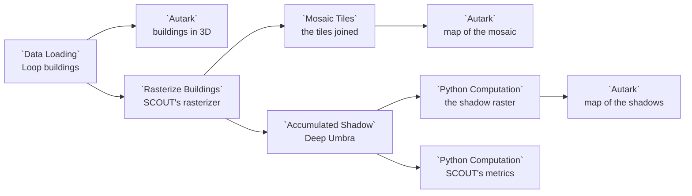

# Example: SCOUT building rasters

SCOUT's Deep Umbra shadow model does not read buildings: it reads map tiles in
which each pixel's gray level is the height of the building under it. This
example takes the buildings of SCOUT's own shadow example in the Chicago Loop,
draws them in 3D, and turns them into those tiles with the **Rasterize
Buildings** node of the `scout.raster-conversion@1` package, SCOUT's own
rasterizer ported to Curio, which keeps the tiles in the dataflow; **Mosaic
Tiles** joins them into one raster, drawn on a map. Then the
**Accumulated Shadow** node of the `scout.shadow@1` package runs SCOUT's
Deep Umbra code, with the model from the Model Catalog, on the saved tiles: a
map shows how many minutes of a summer day each spot is in shadow, and the node
also hands on SCOUT's own metrics, the mean and median over the ground.

## Pipeline overview



## Data

**SCOUT Chicago Loop Buildings** (`data.scout.loop-buildings`) holds the 123
buildings of SCOUT's high-rise shadow example, a few blocks of the central
Loop, with a height in metres for each: SCOUT's own buildings file, used with
the permission of SCOUT's authors.

The packages' libraries (`datashader`, `spatialpandas`, `dask`, `rasterio`,
`geopandas`, `numpy`, `pandas`, `pyarrow`, `pyproj`, `shapely`, `matplotlib`,
`opencv-python`, and `onnxruntime` for Deep Umbra) are installed with
them. Curio installs both packages for you when it starts with
`--with-examples`, because this dataflow declares them. Deep Umbra itself,
`model.scout.deep-umbra`, ships with Curio in the
[Model Catalog](../MODEL-CATALOG.md).

## Load the buildings

```python
# SCOUT's Chicago Loop buildings, with their heights in metres.
gdf = curio_load_data("data.scout.loop-buildings")

# Mark the frame as buildings, so an Autark map extrudes each footprint
# to its height.
gdf.metadata = {"layerType": "buildings"}
return gdf
```

The `layerType` in the frame's metadata tells an Autark map these are
buildings, so it raises each footprint to its `height`:

```json
{
  "map": {
    "layerRefs": [
      {
        "dataRef": "[!! input_0 !!]",
        "getFnv": "height",
        "getFnvType": "quantitative",
        "colorMapInterpolator": "interpolateViridis",
        "legendTitle": "Building height (m)"
      }
    ]
  }
}
```

`legendTitle` is Curio's own key, not the grammar's: it titles the legend,
which would otherwise read `input_0`, the table the input became.

## Rasterize them

Rasterize Buildings is a package node. It hands its input, the buildings
GeoDataFrame, to SCOUT's own `convert_raster`, which writes SCOUT's tiles,
`<zoom>_<x>_<y>.png`, into a folder. The folder comes from
`curio_save_folder`, so the tiles are kept as one of this dataflow's computed
datasets, under the name the **Save tiles as** widget gives (see
[Files a node saves from its code](../DATA-CATALOG.md#files-a-node-saves-from-its-code)). The node
returns a table of the tiles. Its **Widgets** tab holds the four settings.

```python
"""Rasterize Buildings: SCOUT's building rasterizer, "OSM vector to raster".

Input: a buildings layer, a GeoDataFrame of polygons with a CRS and a column
of heights in metres.
Output: the 256 by 256 tiles SCOUT writes, 8-bit gray where 255 is the maximum
height, in EPSG:3395, saved as one of this dataflow's computed datasets, under
the name the "Save tiles as" widget gives ("tiles"); and a table of them, one
row per tile: zoom, x, y and the maximum height. Mosaic Tiles, given the same
name, puts the tiles together into one raster.
The Widgets tab sets the height column, the zoom level, the maximum height and
the name.
Ported from SCOUT, https://github.com/urban-toolkit/scout.
"""
from scout_raster_conversion.convert_to_raster import convert_raster
from scout_raster_conversion.mosaic import tile_table

tiles = curio_save_folder([!! tiles !!])
convert_raster(input_0, [!! attribute !!], int([!! zoom !!]), tiles, max_height=float([!! max_height !!]))
return tile_table(tiles, int([!! zoom !!]), float([!! max_height !!]))
```

| Widget | Default | What it sets |
|---|---|---|
| Height column | `height` | The column the heights are read from |
| Zoom level | `16` | The zoom level of the tiles; Deep Umbra reads zoom 16 |
| Maximum height | `550` m | The height drawn as gray level 255; Deep Umbra expects 550 |
| Save tiles as | `tiles` | The name the tiles are kept under in this dataflow |

The table has a row per tile, `zoom`, `x`, `y` and `max_height`: here 4
tiles, 2 by 2. SCOUT's `convert_to_raster.py` runs as SCOUT wrote it, but for
a few marked lines: pygeos calls become shapely 2's, `convert_raster` takes a
GeoDataFrame as well as a file, the maximum height is a parameter, and it no
longer makes or empties its output folder, which `curio_save_folder` gives it
empty. Its
tiles are byte for byte the ones SCOUT's own environment writes.

## Join the tiles

**Mosaic Tiles**, from the same package, reads the tiles back by their name
with `curio_computed_path`, and its input, Rasterize's table, gives the zoom
and the maximum height:

```python
"""Mosaic Tiles: the tiles Rasterize Buildings saved, side by side in one raster.

Input: Rasterize Buildings' table of tiles, whose zoom and maximum height say
how to put them together. The tiles are the computed dataset of this dataflow
that the "Tiles" widget names ("tiles"), the name Rasterize Buildings saved
them under.
Output: one raster in EPSG:3395, each cell a height in metres (a tile's gray
level times the maximum height over 255). A tile with no building near it is
0, the ground. An Autark map draws it as input_0, band band_1; SCOUT's Deep
Umbra shadow model (Accumulated Shadow) reads it.
"""
from scout_raster_conversion.mosaic import mosaic

return mosaic(
    curio_computed_path([!! tiles !!]),
    int(input_0["zoom"].iloc[0]),
    float(input_0["max_height"].iloc[0]),
    curio_output_file,
)
```

It returns one raster, the mosaic: every tile placed side by side in
EPSG:3395, one band of heights in metres (a tile's gray level times the
maximum height over 255), 512 by 512 cells here. Its **Tiles** widget names
the tiles to read, `tiles` like Rasterize's.

## Draw the mosaic

An Autark map reads Mosaic Tiles' raster as `input_0`, and colours each cell by
its band:

```json
{
  "map": {
    "layerRefs": [
      {
        "dataRef": "[!! input_0 !!]",
        "getFnv": "band_1",
        "colorMapInterpolator": "interpolateViridis",
        "isColorMap": false
      }
    ]
  }
}
```

A cell holds its building's height, rounded to SCOUT's steps of
550/255 = 2.16 m, drawn opaque in viridis, from the lowest building (dark
purple) to the tallest (yellow). The mosaic names no nodata, so a cell of 0,
the ground, has no value and is left clear. `"isColorMap": false` leaves the
map without a legend.

## Predict the shadows

Accumulated Shadow runs SCOUT's own `run_shadow_model` on the height tiles
Rasterize Buildings saved, read back by their name. SCOUT's `deep_umbra.py`
runs as SCOUT wrote it, but for marked lines: its TensorFlow calls are numpy's
and OpenCV's, and its generator is the Model Catalog's Deep Umbra, the ONNX
export of SCOUT's, run as it is. SCOUT's shadow tiles are kept in the
dataflow, and the node returns two things: the shadow tiles joined into one
raster, and SCOUT's metrics, which `run_shadow_model` returns where SCOUT saves
them as a CSV:

```python
"""Accumulated Shadow: SCOUT's Deep Umbra shadow model.

Input: Rasterize Buildings' table of tiles (scout.raster-conversion). The
height tiles themselves are this dataflow's computed dataset the "Tiles"
widget names, the name Rasterize Buildings saved them under ("tiles").
Output: (shadow, metrics).
- shadow: the accumulated shadow in minutes, one raster in EPSG:3395 on the
  grid of the tiles' height mosaic (Mosaic Tiles), made from the shadow tiles
  SCOUT's run_shadow_model writes. An Autark map draws it, band band_1.
- metrics: SCOUT's metrics as its run_shadow_model computes them, one row:
  "Mean Acc shadow" and "Median Acc shadow", the minutes of shadow over the
  ground (the cells with no building), for Compare Scenarios.
The shadow tiles are kept as a computed dataset of this dataflow, under the
name the "Save shadows as" widget gives.
The Widgets tab sets the season and the names. The model is the Model
Catalog's Deep Umbra, model.scout.deep-umbra, its ONNX file run as it is.
Ported from SCOUT, https://github.com/urban-toolkit/scout.
"""
from scout_shadow.deep_umbra import run_shadow_model
from scout_shadow.mosaic import mosaic

shadows = curio_save_folder([!! shadows !!])
metrics = run_shadow_model(
    curio_computed_path([!! tiles !!]),
    [!! season !!],
    shadows,
    model_path=curio_load_model("model.scout.deep-umbra").entry,
)
return mosaic(shadows, [!! season !!], curio_output_file), metrics
```

| Widget | Default | What it sets |
|---|---|---|
| Season | `summer` | `spring`, `summer` or `winter`, as SCOUT offers them |
| Tiles | `tiles` | The name the height tiles were saved under, Rasterize Buildings' own |
| Save shadows as | `shadows` | The name SCOUT's shadow tiles are kept under |

For each tile, as SCOUT does, Deep Umbra reads a 512 by 512 window: the tile
and half of each neighbour, read from their files, so a tower's shadow falls
across the tile edge, with planes for the tile's latitude and the season. It
answers with the share of the day each pixel is in shadow, which SCOUT writes
as an 8-bit gray tile, `<zoom>_<x>_<y>.png`. The package's `mosaic` puts the
tiles side by side on the height mosaic's grid, each gray level the minutes of
a 720-minute summer day over 255 (540 in spring, 360 in winter): one band, the
minutes of the day each cell is in shadow, in steps of 2.8 minutes.

SCOUT's metrics, `Mean Acc shadow` and `Median Acc shadow` over the ground,
come from Deep Umbra's output before it is written in 8 bits: in summer,
128.6 and 3.3 minutes, SCOUT's own numbers for its example within a tenth of a
minute.

## Split the two

Two Python Computation nodes take the two apart, as the routes and the
metrics of SCOUT's weather routing are taken apart in its example: one returns
`input_0[0]`, the shadow raster, for the map, and the other `input_0[1]`, the
metrics:

```python
# Accumulated Shadow returns (shadow, metrics): these are SCOUT's metrics, "Mean Acc shadow" and
# "Median Acc shadow" over the ground, as its run_shadow_model computed them.
return input_0[1]
```

In summer the ground of these blocks is in shadow 128.6 minutes on average,
with a median of 3.3 minutes: SCOUT's own numbers. Many open cells see almost
no shadow, while the canyons between towers see hours of it.

## Draw the shadows

A third Autark map reads the shadow raster, from the first of the two nodes, as
`input_0`:

```json
{
  "map": {
    "layerRefs": [
      {
        "dataRef": "[!! input_0 !!]",
        "getFnv": "band_1",
        "colorMapInterpolator": "interpolateReds",
        "legendTitle": "Accumulated shadow (minutes)"
      }
    ]
  }
}
```

Every cell with a value is drawn opaque, from the palest red (the least
shadow) to the darkest (the most), as the legend shows. The darkest cells are
the street canyons between the towers the height mosaic shows.

## Good to know

- **Changing a widget re-runs the rasterizer.** A lower maximum height makes
  every tile brighter. Deep Umbra was trained on zoom-16 tiles where 255 is
  550 m, and, as in SCOUT, nothing stops it reading tiles made otherwise: keep
  the defaults for its shadows.
- **Switch the season to compare.** Each season has its own sun and its own
  day, so the minutes change with both.
- **A tile at the edge sees no buildings beyond it.** Deep Umbra predicts each
  tile from it and its eight neighbours, as in SCOUT.
- **Deep Umbra is an estimate.** It is a generative model trained on simulated
  shadows, so read the map as where shadow gathers, not as a survey.
- **Downloaded on a pip install.** A pip install downloads Deep Umbra from
  GitHub the first time Accumulated Shadow runs
  ([Installation from pip](../USAGE.md#installation-from-pip)).
