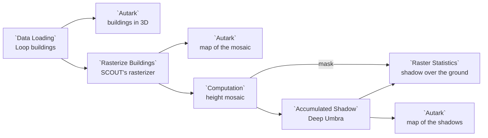

# Example: SCOUT building rasters

SCOUT's Deep Umbra shadow model does not read buildings: it reads map tiles in
which each pixel's gray level is the height of the building under it. This
example takes the buildings of SCOUT's own shadow example in the Chicago Loop,
draws them in 3D, and turns them into those tiles with the **Rasterize
Buildings** node of the `scout.raster-conversion@1` package, SCOUT's own
rasterizer ported to Curio. It draws the tiles joined into one map. Then the
**Accumulated Shadow** node of the `scout.shadow@1` package runs Deep Umbra,
from the Model Catalog, on those heights: a map shows how many minutes of a
summer day each spot is in shadow, and a **Raster Statistics** node gives the
mean and median over the ground, SCOUT's own two numbers.

## Pipeline overview



## Data

**SCOUT Chicago Loop Buildings** (`data.scout.loop-buildings`) holds the 123
buildings of SCOUT's high-rise shadow example, a few blocks of the central
Loop, with a height in metres for each: SCOUT's own buildings file, used with
the permission of SCOUT's authors.

The packages' libraries (`datashader`, `spatialpandas`, `dask`, `rasterio`,
and `onnxruntime` for Deep Umbra) are installed with them. Curio installs both
packages for you when it starts with `--with-examples`, because this dataflow
declares them. Deep Umbra itself, `model.scout.deep-umbra`, ships with Curio
in the [Model Catalog](../MODEL-CATALOG.md).

## Load the buildings

```python
# SCOUT's Chicago Loop buildings, with their heights in metres.
gdf = curio_load_data("data.scout.loop-buildings")

# Mark the frame as buildings, so an Autark map extrudes each footprint
# to its height.
gdf.metadata = {"layerType": "buildings"}
return gdf
```

The `layerType` in the frame's metadata tells an Autark map these are
buildings, so it raises each footprint to its `height`:

```json
{
  "map": {
    "layerRefs": [
      {
        "dataRef": "[!! input 0 !!]",
        "getFnv": "height",
        "getFnvType": "quantitative",
        "colorMapInterpolator": "interpolateViridis"
      }
    ]
  }
}
```

## Rasterize them

Rasterize Buildings is a package node: its code calls the converter module the
package ships beside it, and its **Widgets** tab holds the three settings.

```python
"""Rasterize Buildings: SCOUT's building rasterizer, "OSM vector to raster".

Input: a buildings layer, a GeoDataFrame of polygons with a CRS and a column
of heights in metres.
Output: (mosaic, tiles).
- mosaic: one raster in EPSG:3395, each cell a height in metres. An Autark map
  draws it as input_0, band band_1.
- tiles: one row per map tile, with zoom, x, y and png, the 8-bit grayscale
  PNG (base64) SCOUT's Deep Umbra shadow model reads, where 255 is the
  maximum height.
The Widgets tab sets the height column, the zoom level and the maximum height.
Ported from SCOUT, https://github.com/urban-toolkit/scout.
"""
from scout_raster_conversion.node_outputs import rasterize_buildings

return rasterize_buildings(
    arg,
    attribute=[!! attribute !!],
    zoom=int([!! zoom !!]),
    max_height=float([!! max_height !!]),
    output_file=curio_output_file,
)
```

| Widget | Default | What it sets |
|---|---|---|
| Height column | `height` | The column the heights are read from |
| Zoom level | `16` | The zoom level of the tiles; Deep Umbra reads zoom 16 |
| Maximum height | `550` m | The height drawn as gray level 255; Deep Umbra expects 550 |

The node returns two things, `(mosaic, tiles)`:

- **mosaic**, a raster: every tile placed side by side in EPSG:3395, one band
  of heights in metres. Here that is 4 tiles, 2 by 2, in 512 by 512 cells.
- **tiles**, a table: one row per 256 by 256 tile, with its `zoom`, `x`, `y`
  and its PNG in base64, the file SCOUT names `<zoom>_<x>_<y>.png`.

These are the 4 height tiles SCOUT's example holds, each within one gray level
of SCOUT's own.

## Draw the mosaic

An Autark map reads the first part of the node's output, the raster, as
`input_0`, and colours each cell by its band:

```json
{
  "map": {
    "layerRefs": [
      {
        "dataRef": "[!! input 0 !!]",
        "getFnv": "band_1",
        "colorMapInterpolator": "interpolateViridis",
        "isColorMap": false
      }
    ]
  }
}
```

`"isColorMap": false` leaves this map without a legend: the 3D map's legend
reads for both, as a cell holds its building's height rounded to SCOUT's
steps of 550/255 = 2.16 m. A cell of 0, the ground, is left clear.

## Predict the shadows

A Python node keeps the mosaic of Rasterize Buildings' `(mosaic, tiles)`,
since Raster Statistics reads rasters only:

```python
# Rasterize Buildings returns (mosaic, tiles): the height mosaic.
return arg[0]
```

Accumulated Shadow runs Deep Umbra on every tile of that height raster. Its
code names the model, which the Model Catalog holds:

```python
"""Accumulated Shadow: SCOUT's Deep Umbra shadow model.

Input: the height mosaic of Rasterize Buildings (scout.raster-conversion), or
its (mosaic, tiles) output: building heights in metres in EPSG:3395 on the
zoom-16 tile grid.
Output: the accumulated shadow in minutes, a raster on the input's grid. An
Autark map draws it as input_0, band band_1. A Raster Statistics node gives its
mean and median over the ground: the heights on its input 1 as the mask, with
where=lambda height: height < 1.08.
The Widgets tab sets the season. The model is the Model Catalog's Deep Umbra,
model.scout.deep-umbra.
Ported from SCOUT, https://github.com/urban-toolkit/scout.
"""
from scout_shadow.node_outputs import accumulated_shadow, open_model

model = open_model(lambda: curio_load_model("model.scout.deep-umbra"))
return accumulated_shadow(arg, season=[!! season !!], model=model, output_file=curio_output_file)
```

| Widget | Default | What it sets |
|---|---|---|
| Season | `summer` | `spring`, `summer` or `winter`, as SCOUT offers them |

For each tile, as SCOUT does, Deep Umbra reads a 512 by 512 window: the tile
and half of each neighbour, so a tower's shadow falls across the tile edge,
with planes for the tile's latitude and the season. It answers with the share
of the day each pixel is in shadow, which the node turns into minutes of a
720-minute summer day (540 in spring, 360 in winter). The output is one
raster on the height mosaic's grid: one band, the minutes of the day each cell
is in shadow.

## Sum it up over the ground

Raster Statistics reads the shadow on its input 0 and the heights on its
input 1, as the mask: SCOUT's metrics count the ground, the cells Deep Umbra
reads as gray level 0, a height under 1.08 m.

```python
# Raster Statistics: the mean, median, minimum, maximum and count of a
# raster's cells, nodata left out, as a table of one row.
# Input 0 is the accumulated shadow in minutes, input 1 the heights it was
# predicted from, as the mask: SCOUT's metrics count the ground, the cells
# Deep Umbra reads as gray level 0, a height under 1.08 m.
return curio_raster_statistics(arg, where=lambda height: height < 1.08)
```

In summer the ground of these blocks is in shadow 128.6 minutes on average,
with a median of 3.3 minutes: SCOUT's own numbers for its example, within a
tenth of a minute. Many open cells see almost no shadow, while the canyons
between towers see hours of it.

## Draw the shadows

A third Autark map reads the shadow raster as `input_0`:

```json
{
  "map": {
    "layerRefs": [
      {
        "dataRef": "[!! input 0 !!]",
        "getFnv": "band_1",
        "colorMapInterpolator": "interpolateReds"
      }
    ]
  }
}
```

The brightest cells are the street canyons between the towers the height
mosaic shows.

## Good to know

- **Changing a widget re-runs the rasterizer.** A lower maximum height makes
  every tile brighter; Deep Umbra's own tiles keep 550 m, and Accumulated
  Shadow stops with a message saying so when the tiles were made otherwise.
- **Switch the season to compare.** Each season has its own sun and its own
  day, so the minutes change with both.
- **A tile at the edge sees no buildings beyond it.** Deep Umbra predicts each
  tile from it and its eight neighbours, as in SCOUT.
- **Deep Umbra is an estimate.** It is a generative model trained on simulated
  shadows, so read the map as where shadow gathers, not as a survey.
- **Not in the pip package.** Deep Umbra ships in the Curio repository; on a
  pip install, Accumulated Shadow says how to add it
  ([Model Catalog](../MODEL-CATALOG.md#operator-notes)).
