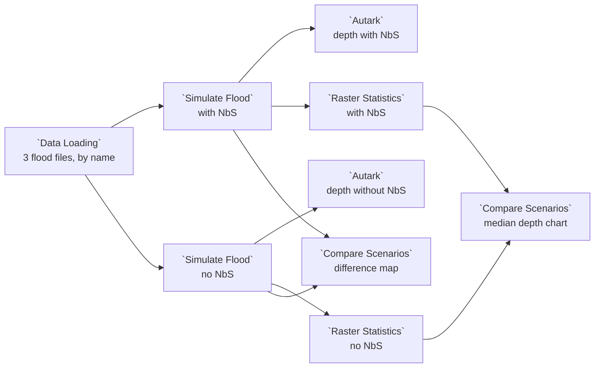

# Example: SCOUT flood scenarios

SCOUT's "Planning nature-based flood mitigation" use case asks how much
nature-based solutions (NbS) would lower a flood: bioswales, permeable
pavements, retention ponds, infiltration trenches and constructed wetlands.
This example compares two scenarios over the Quad Cities on the Mississippi:
every solution in place, and none. The **Simulate Flood** node of the
`scout.flood-simulation@1` package, SCOUT's flood model ported to Curio,
projects each scenario's flood depth. Two maps draw them, Raster Statistics
measures their median depth, and two Compare Scenarios nodes map their
difference and chart their medians.

## Pipeline overview



The two Simulate Flood nodes and their Raster Statistics are the dataflow's
two scenarios, **With NbS** and **No NbS**: SCOUT's scenario 1 and scenario 2.
The Data Loading node is their fixed context, the area and the period both
read, as SCOUT's shared timeline and region widgets are.

## Data

**Quad Cities Flood Projections** (`data.scout.quad-cities-flood`) is the data
SCOUT's flooding use case reads: one dataset of seven GeoTIFFs on one grid
(EPSG:4326, cells of about 11 m, 2592 by 2064 of them), side by side in its
`data/` folder under the names SCOUT gives them:

| File | What it holds |
|---|---|
| `NBS_others_5m.tif` | The NbS class of each cell: 21, 31, 43, 52, 71, 81, 90 or 95, and 0 for none |
| `2020_2040_NbS.tif`, `2020_2040_noNbS.tif` | The projected flood depth in metres for 2020 to 2040, with NbS and without |
| `2050_2080_NbS.tif`, `2050_2080_noNbS.tif` | The same for 2050 to 2080 |
| `2080_2100_NbS.tif`, `2080_2100_noNbS.tif` | The same for 2080 to 2100 |

Its manifest's `dataFile` is `data/bundle.json`, which lists the seven files,
and a node reads one by its name:
`curio_load_data("data.scout.quad-cities-flood", part="2020_2040_NbS.tif")`.
A depth is NaN where a projection gives none, about three cells in four.
[`scripts/build_example_quad_cities_flood.py`](../../scripts/build_example_quad_cities_flood.py)
copies SCOUT's files into it, the depths as float32, every depth within
float32 rounding of SCOUT's float64.

The package's library, `rasterio`, is installed with it. Curio installs the
package for you when it starts with `--with-examples`, because this dataflow
declares it.

## Load the area and the period

```python
# SCOUT's Quad Cities flood projections: one dataset of seven files on one
# grid, read here by name. NBS_others_5m.tif holds each cell's nature-based
# solution (NbS) class; <period>_NbS.tif and <period>_noNbS.tif a period's
# flood depth with NbS and without.
# The area to project, in degrees, as SCOUT's top-left and bottom-right
# corners set it. The Widgets tab sets the box; its defaults hold the west of
# the Quad Cities, where most NbS lie, and fit an Autark map (2048 by 2048
# cells at most). The whole area, west -90.6879323, south 41.4150156,
# east -90.4252158, north 41.6242105, is SCOUT's default and too large to draw.
west, south, east, north = [!! west !!], [!! south !!], [!! east !!], [!! north !!]
box = (west, south, east, north)

# The period both scenarios project, SCOUT's timeline: "2020 - 2040" names
# the files 2020_2040_NbS.tif and 2020_2040_noNbS.tif.
period = [!! timeline !!].replace(" - ", "_")
classes = curio_load_data("data.scout.quad-cities-flood", part="NBS_others_5m.tif", bounds=box)
nbs = curio_load_data("data.scout.quad-cities-flood", part=f"{period}_NbS.tif", bounds=box)
no_nbs = curio_load_data("data.scout.quad-cities-flood", part=f"{period}_noNbS.tif", bounds=box)
return classes, nbs, no_nbs
```

| Widget | Default | What it sets |
|---|---|---|
| Projection timeline | `2020 - 2040` | The period: `2020 - 2040`, `2050 - 2080` or `2080 - 2100` |
| West, South, East, North | -90.687, 41.416, -90.488, 41.624 | The area, in degrees |

The node reads three of the seven files, by name: the classes, and the
period's depth with NbS and without. `bounds` reads only the cells whose
centres lie inside the box: 1964 by 2053 cells by default, under the 2048 by
2048 an Autark map draws. The default holds the western part of the area,
where three quarters of its NbS cells lie. SCOUT's own default is the whole
area, 2592 by 2064 cells, which Curio computes but an Autark map refuses to
draw.

## Project each scenario

Both Simulate Flood nodes run the package's template unchanged:

```python
"""Simulate Flood: SCOUT's flood projection, with and without nature-based solutions.

Input: (classes, nbs, no_nbs) from the Data Loading node: the nature-based
solution (NbS) classes and one period's flood depth with NbS and without,
three rasters of data.scout.quad-cities-flood read over one area.
Output: one raster on their grid, the projected flood depth in
metres: the depth with nature-based solutions (NbS) where a cell's class is
one of the solutions chosen, the depth without them elsewhere. NaN where the
projection gives no depth. An Autark map draws it as input_0, band band_1.
The Widgets tab chooses the solutions; none chosen is the projection without NbS.
Ported from SCOUT, https://github.com/urban-toolkit/scout.
"""
from scout_flood_simulation.node_outputs import simulate_flood

return simulate_flood(
    arg,
    nbs=[!! nbs !!],
    output_file=curio_output_file,
)
```

Their **Nature-based solutions** widget is the scenario's lever: all six of
SCOUT's solutions in **With NbS**, none in **No NbS**. SCOUT's model takes, for
each cell, the depth with NbS when the cell's class is one of the solutions
chosen, and the depth without them otherwise:

| Solution | Classes |
|---|---|
| Bioswales/Infiltration trenches | 21 |
| Permeable pavements | 31 |
| Retention ponds | 43 |
| Infiltration trench | 52 |
| Bioswales | 71, 81 |
| Constructed wetlands | 90, 95 |

Each node returns one raster, the projected depth in metres. With no solution
chosen, every cell takes the depth without NbS.

## Draw the depths

Each Autark map draws its scenario's raster as `input_0`, in blues as SCOUT
draws it:

```json
{
  "map": {
    "layerRefs": [
      {
        "dataRef": "[!! input 0 !!]",
        "getFnv": "band_1",
        "colorMapInterpolator": "interpolateBlues",
        "legendTitle": "Flood depth with NbS (m)"
      }
    ]
  }
}
```

The other map's legend reads `Flood depth without NbS (m)`.

## Measure the median depth

Each scenario's **Raster Statistics** node keeps the code it is dropped with:

```python
# Raster Statistics: the mean, median, minimum, maximum and count of a
# raster's cells, nodata left out, as a table of one row.
# A condition keeps only some cells: where=lambda value: value < 1.08 tests
# the raster's own values. With a mask raster on input 1, it tests the mask's
# values instead, and mask_values=[0] keeps the cells whose mask value is 0.
return curio_raster_statistics(arg)
```

Its `median` and `mean` are SCOUT's metrics, `median flood depth` and
`mean flood depth`, over the cells with a depth.

## Compare the scenarios

The first **Compare Scenarios** node is in **Difference**: input 0, No NbS, is
the reference, and input 1, With NbS, the comparison, so its map shows how
much the solutions change each cell's depth, negative where they lower it.
Compare Scenarios writes its own code from its inputs:

```python
# Compare Scenarios writes this code from its inputs: input 1 minus input 0,
# each under the id and the name of its scenario. It is written again when
# they change.
return curio_difference_scenarios([
    ("53e6a072-e6f2-5255-853f-ba81e15e3aa9", "No NbS", [!! input 0 !!]),
    ("6014be42-a82d-55d2-bd0a-153e7f1150c5", "With NbS", [!! input 1 !!]),
])
```

The second is in **Chart**: it stacks the two statistics tables, one row per
scenario, and draws the `median` of each as a bar, as SCOUT's comparison node
shows the median flood depth of scenarios A and B:

```python
# Compare Scenarios writes this code from its inputs: each input, under the
# id and the name of its scenario. It is written again when they change.
return curio_stack_scenarios([
    ("53e6a072-e6f2-5255-853f-ba81e15e3aa9", "No NbS", [!! input 0 !!]),
    ("6014be42-a82d-55d2-bd0a-153e7f1150c5", "With NbS", [!! input 1 !!]),
])
```

## What it shows

Over the default area for 2020 to 2040, the median flood depth is 5.07 m with
every solution in place and 7.43 m with none. The solutions lower the depth
in about a quarter of the cells that flood in both scenarios, where they
are placed, and leave the rest unchanged. The later periods narrow the gap:
5.67 m against 7.08 m for 2050 to 2080, and 6.10 m against 6.82 m for 2080
to 2100.

## How it maps onto SCOUT

| SCOUT | Curio |
|---|---|
| Widget nodes: NbS (Scenario-1), NbS (Scenario-2) | The **Nature-based solutions** widget of each Simulate Flood node |
| Widget nodes: Top-left, Bottom-right, Projection timeline | The Data Loading node's widgets |
| Its fixed file paths for a period (`year_dict`) | `curio_load_data(..., part="<period>_NbS.tif")` |
| Computation nodes calling `simulate_flood_projection` | The two Simulate Flood nodes, its port |
| View nodes of A and B | The two Autark maps |
| View node of the difference of A and B | Compare Scenarios in Difference |
| Comparison node of the median flood depth | Raster Statistics, and Compare Scenarios in Chart |

The port keeps SCOUT's classes and its choice of depth for each cell. Its
tests (`test_scout_flood_simulation.py`) check it against SCOUT's own
function, imported unchanged and run on a block of SCOUT's files: the same
cells with no depth, every depth within float32 rounding, and the same median
and mean.
